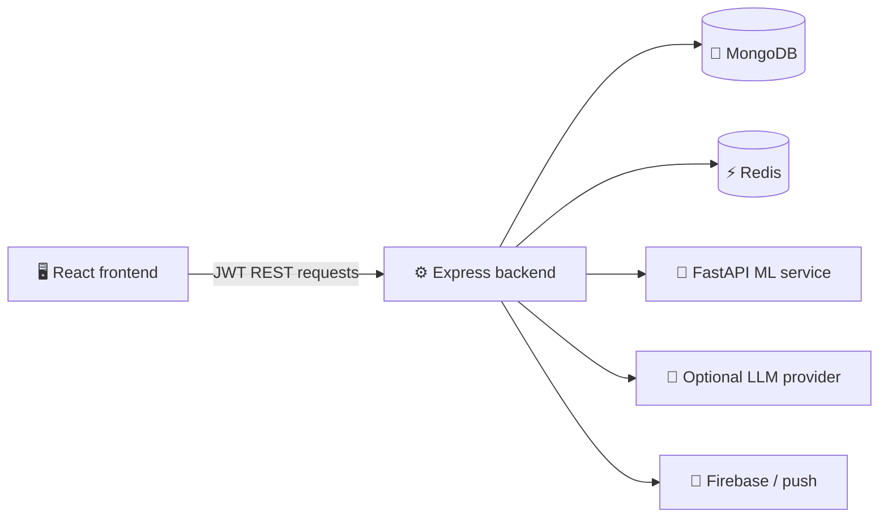

# ✨ BALENISA

> A full-stack personal-finance platform for recording money activity, understanding spending, and asking grounded questions about your own financial data.


## 🌟 What BALENISA does

- Track **expenses, income, recurring expenses, and monthly budgets**
- Scan bills with OCR and suggest categories through the ML service
- Explore financial activity through line, bar, and pie charts
- Generate deterministic insights: spending, habits, anomalies, trends, forecasts, and budget pressure
- Use **SIA**, a read-only personal financial assistant grounded in the authenticated user's data
- Support web/native push registration and scheduled backend notifications

## 🏗️ Architecture



The backend owns authorization, financial writes, deterministic analytics, caching, and all external-service calls. The frontend never calls MongoDB, the ML service, or an LLM directly.

## 🧭 Repository guide

| Directory | Purpose | Documentation |
|---|---|---|
| [`frontend/`](frontend/) | React UI, client caching, responsive experience, SIA panel | [Frontend README](frontend/README.md) |
| [`backend/`](backend/) | Express API, reports, finance logic, SIA, OCR, caching and jobs | [Backend README](backend/README.md) |
| [`ml-service/`](ml-service/) | Category prediction and guarded model lifecycle | [ML service README](ml-service/README.md) |
| [`docs/`](docs/) | API workflow documentation | [Workflow index](docs/api-workflows/README.md) |

## 🚀 Local start

```bash
# 1. Start MongoDB and Redis

# 2. ML service
cd ml-service
pip install -r requirements.txt
uvicorn app:app --host 0.0.0.0 --port 8000

# 3. Backend (new terminal)
cd backend
npm install
npm run dev

# 4. Frontend (new terminal)
cd frontend
npm install
npm start
```

Default local ports: frontend `3000`, backend `8080`, ML service `8000`.

## 🧠 SIA in brief

SIA authenticates and validates each question, maps it to an allowlisted plan, retrieves only the required user-scoped financial facts, and returns either a deterministic answer or a grounded, bounded explanation. It never accepts a client-supplied user ID, mutates finance data, or exposes raw transactions through its semantic tool layer.

## 🧪 Testing

| Service | Command |
|---|---|
| Backend | `cd backend && npm test` |
| Frontend | `cd frontend && npm test -- --watchAll=false` |
| ML service | `cd ml-service && pytest` |

## 🔐 Configuration

Keep `.env` files, database credentials, JWT secrets, provider keys, and Firebase service credentials out of Git. Each service README lists its own configuration.
