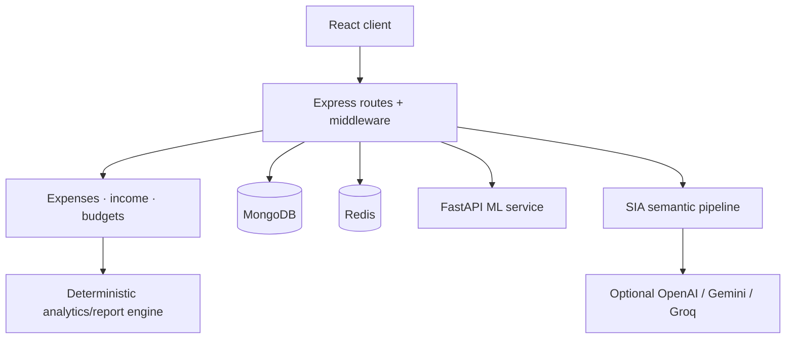

# ⚙️ BALENISA Backend

The Express API and financial core of BALENISA. It owns identity, authorization, persistence, report generation, cache consistency, SIA orchestration, OCR, and communication with the ML service.

## 🧩 Architecture



## ✨ Responsibilities

- 🔐 Auth, OTP/password recovery, and JWT ownership enforcement
- 💸 Expense, income, recurring-expense, bill, and budget operations
- 📊 Charts and deterministic financial reports
- 🔄 Cache invalidation, report refresh, and recovery-safe mutation handling
- 🧾 OCR receipt extraction and ML-category proxy calls
- 🔔 Device registration, push delivery, retries, and scheduled jobs
- 💬 SIA status, sessions, questions, voice transcription, and grounded answers

## 🗂️ Important modules

| Path | Purpose |
|---|---|
| `Routes/` + `Controllers/` | HTTP contracts and request handling |
| `Services/` | Business operations, report lifecycle, synchronization, notifications |
| `analytics/` | Data aggregation and deterministic analyzers |
| `models/` | Mongoose schemas for finance, reports, SIA, and operations |
| `sia/` | Plans, semantic routing, facts, grounding, sessions, voice, providers |
| `cron/` | Recurring expenses, notification retries, and feedback collection |

## 💬 SIA execution path

1. `POST /sia/ask` authenticates and rate-limits the caller.
2. Deterministic intents are handled directly; otherwise a semantic router emits a closed, validated plan.
3. Only allowlisted aggregates scoped to `req.userId` are retrieved.
4. Direct questions return deterministic answers; explanation requests use bounded synthesis over a minimal fact set.
5. Grounding is validated before a response is returned. Sessions and idempotency make history/retries safe.

SIA is read-only: it cannot change budgets, expenses, income, or user data.

## 🔌 API groups

| Prefix | Area |
|---|---|
| `/auth` | Authentication and recovery |
| `/expense`, `/income`, `/bills`, `/api` | Finance operations |
| `/chart`, `/report` | Analytics/report data |
| `/ml` | Backend-proxied ML features |
| `/sia` | Assistant status, sessions, questions, transcription |

## 🚀 Run locally

```bash
npm install
npm run dev
```

## 🔐 Environment essentials

```env
MONGO_CONN=mongodb://...
REDIS_URL=redis://...
JWT_SECRET=replace-with-a-secret
AUTH_AUDIT_HASH_SECRET=replace-with-a-separate-audit-hmac-secret
REFRESH_TOKEN_SECRET=replace-with-a-separate-session-hmac-secret
REFRESH_SESSION_DAYS=30
AUTH_RECOVERY_MIN_RESPONSE_MS=250
OCR_TIMEOUT_MS=30000
ML_ROUTE=http://localhost:8000
CORS_ALLOWED_ORIGINS=http://localhost:3000
PORT=8080
```

`CORS_ALLOWED_ORIGINS` is a comma-separated list of exact HTTP(S) frontend origins. Production startup fails when it is missing, wildcard origins are rejected, and local development defaults to `http://localhost:3000` plus `http://127.0.0.1:3000`.

### Production deployment settings

Set these Render environment variables before deploying the backend:

```env
NODE_ENV=production
CORS_ALLOWED_ORIGINS=https://balensia.vercel.app
```

The Vercel frontend must be built with `REACT_APP_BACKEND_URL=/backend`. `frontend/vercel.json` proxies that path to Render, keeping the refresh cookie first-party to the Vercel domain. Its report-only CSP and browser headers are defined in `frontend/vercel.json`; this file requires the Vercel project Root Directory to be `frontend`.

The API sends Helmet security headers on every response. The separate frontend hosting platform must also apply equivalent CSP, HSTS, framing, MIME-sniffing, and referrer headers to the React HTML response.

Authentication emails are trimmed and lowercased before lookup. Login creates a server-stored, rotating refresh session and returns only a short-lived access token for browser memory; `/auth/refresh` and `/auth/logout` require the CSRF cookie/header pair, while `/auth/logout-all` revokes every active session for the authenticated user. Password reset also revokes all active sessions. `AUTH_AUDIT_HASH_SECRET` HMAC-pseudonymizes email and IP identifiers in structured authentication audit events. `AUTH_RECOVERY_MIN_RESPONSE_MS` applies a bounded minimum response time to recovery requests.

Receipt OCR accepts only JPEG and PNG images. Files are checked by signature and decoder metadata, stay in memory, are limited to 5 MB/20 million pixels, and run in a worker with the bounded `OCR_TIMEOUT_MS` timeout. PDFs are intentionally unsupported until a resource-bounded PDF renderer is introduced.

For SIA, set `SIA_ENABLED=true`, `SIA_LLM_PROVIDER`, `SIA_LLM_MODEL`, and the matching provider key. Voice input is independently enabled with `SIA_VOICE_ENABLED=true` and its STT settings.

## 🧪 Testing

```bash
npm test
npm run test:integration
```

The Jest suite covers API behavior, recovery/idempotency, analytics, report contracts, SIA safety/grounding, and ML proxy contracts. Provider calls are mocked.

## 🔗 Related docs

[Project overview](../README.md) · [Frontend](../frontend/README.md) · [ML service](../ml-service/README.md) · [API workflows](../docs/api-workflows/README.md)
