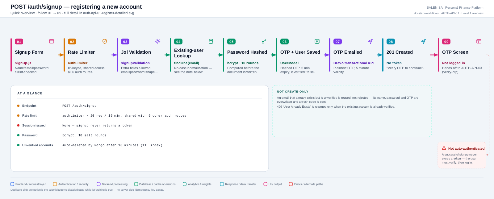
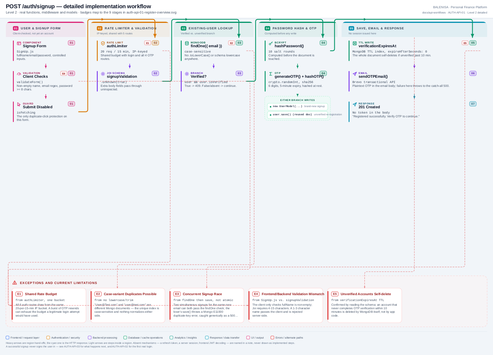

# AUTH-API-01 — Register

`POST /auth/signup`

Two levels of the same workflow. Every statement below is traced to the current
repository implementation.

> **Not create-only.** An email that exists but is unverified is silently reused — its
> name, password and OTP are overwritten and a fresh code is sent. `409` is returned
> only when the existing account is already verified.

---

## 1. Purpose

Creates (or reuses an unverified) user document, hashes the password, issues a 6-digit
OTP, and emails it. Does **not** log the user in — no JWT is issued here.

## 2. Endpoint and method

| | |
|---|---|
| **Method** | `POST` |
| **Path** | `/auth/signup` |
| **Mount** | `app.use("/auth", authRouter)` — `backend/server.js`, no `apiLimiter` |
| **Middleware** | `authLimiter` → `signupValidation` → `signup` |
| **Auth required** | No — this is a public entry point |
| **Body** | `{ fullName: string, email: string, password: string }` |
| **Rate limit** | `authLimiter` — 20 req / 15 min, IP-keyed, **shared with the other 5 `/auth` routes** |

## 3. Level 1 quick workflow

<picture>
  <source srcset="auth-api-01-register-overview.svg" type="image/svg+xml">
  
</picture>

Vector source: [`auth-api-01-register-overview.svg`](auth-api-01-register-overview.svg) ·
raster preview / fallback: [`auth-api-01-register-overview.png`](auth-api-01-register-overview.png)

## 4. Level 2 detailed workflow

<picture>
  <source srcset="auth-api-01-register-detailed.svg" type="image/svg+xml">
  
</picture>

Vector source: [`auth-api-01-register-detailed.svg`](auth-api-01-register-detailed.svg) ·
raster preview / fallback: [`auth-api-01-register-detailed.png`](auth-api-01-register-detailed.png)

## 5. Request fields and validation

| Field | Client check (`SignUp.js`) | Server check (`signupValidation`, Joi) |
|---|---|---|
| `fullName` | non-empty (trimmed check only) | `min(4).max(15).required()` — **stricter than the client** |
| `email` | regex `^[^\s@]+@[^\s@]+\.[^\s@]+$` | `Joi.string().email().required()` |
| `password` | `length >= 8` | `min(8).max(25).required()` |

Both schemas call `.unknown(true)` — extra body fields pass through to the controller
unvalidated (the controller only destructures the three fields above, so extras are
effectively ignored, not a mass-assignment path). Neither schema trims or
case-normalizes `email`.

## 6. Middleware order

`authLimiter` → `signupValidation` → `signup`. No `verifyToken` — this route is
intentionally public. Rate limiting runs **before** validation, so a malformed request
still consumes one unit of the shared 20/15-min budget.

## 7. Controller/service/model behaviour

1. `UserModel.findOne({ email })` — case-sensitive, unindexed for case.
2. If found and `isVerified` — `409 "User Already Exists"`.
3. `generateOTP()` (crypto.randomInt, 6 digits), `hashOTP()` (sha256), 5-minute expiry,
   10-minute `verificationExpiresAt`.
4. `hashPassword()` (bcrypt, 10 rounds) — computed **before** any write.
5. If found and unverified: overwrite `fullName`, `password`, `otp`, `otpExpiry`,
   `lastOtpSent`, `verificationExpiresAt` on the existing document, then `save()`.
6. Otherwise: `new UserModel({...}).save()`.
7. `sendOTPEmail(email, otp, "verify")` — Brevo transactional API call, awaited.

## 8. Password/JWT behaviour

Password: bcrypt, cost factor 10, no pepper, no policy beyond Joi's 8-25 length bound
(no complexity requirement). **No JWT is generated or returned by this endpoint.**

## 9. Response schema

```jsonc
// 201
{ "message": "Registered successfully. Verify OTP to continue", "success": true }
```

No `token`, no user object, no password or hash field in the body at any point.

## 10. Frontend caller

`SignUp.js`, via the browser's raw `fetch` — **not** the shared `axios` instance, so no
`Authorization` header logic or response interceptor applies to this call.

## 11. Auth-state update

None. `isLoggedIn` is untouched; the component only calls `setShowOTPForm(true)` to
render `OTPForm` in place of the signup form.

## 12. Redirect/navigation

No route change (this app has no router-level auth flow) — `SignUp.js` conditionally
renders `OTPForm` instead of navigating.

## 13. Loading and error states

`isFetching` state disables the submit button and swaps its label for a spinner
(`FetchingLoader`) while the request is in flight — this is also the app's only
duplicate-click protection on this form. Errors are shown via `signUpErrorToast`; a 429
gets a distinct, friendlier message than other failures.

## 14. Security and privacy behaviour

- Password is hashed before persistence; never logged, never echoed in any response.
- The OTP is emailed in plaintext (expected for a 6-digit, 5-minute code) and stored
  hashed (sha256) at rest.
- No email/username-availability endpoint exists, so an attacker cannot directly probe
  existence without attempting a full signup — though the 409-vs-201 response *is*
  itself a signal for already-verified emails (see Finding 2 below).
- Unverified accounts are deleted automatically by MongoDB's TTL index on
  `verificationExpiresAt` (`expireAfterSeconds: 0`) if not verified within 10 minutes —
  this is enforced by the database, not application code.

## 15. Failure paths

| Tag | Condition | Where | Result |
|---|---|---|---|
| E1 | > 20 req / 15 min (shared bucket) | `authLimiter` | `429` |
| E2 | Name/email/password shape invalid | `signupValidation` | `400`, Joi's first error message |
| E3 | Email already registered and verified | controller | `409 "User Already Exists"` |
| E4 | Any database or email-send failure | controller `catch` | `500 "Internal Server Error"`, logged via `console.error(err)` |

## 16. Files involved

| Layer | File | Function/export | Purpose |
|---|---|---|---|
| Initiator | `frontend/src/components/loginSignUp/SignUp.js` | `SignUp`, `validateForm`, `handleSubmit` | Client validation, raw fetch, hand-off to `OTPForm` |
| Route | `backend/Routes/auth.routes.js` | `router.post('/signup', ...)` | `authLimiter` → `signupValidation` → `signup` |
| Validation | `backend/Middlewares/AuthValidation.js` | `signupValidation` | Joi shape check |
| Controller | `backend/Controllers/AuthControllers/signup.js` | `signup` | Lookup, hash, save, email |
| Password | `backend/Services/AuthServices/password.service.js` | `hashPassword` | bcrypt, 10 rounds |
| OTP | `backend/Services/AuthServices/otp.service.js` | `generateOTP`, `hashOTP`, `getOtpExpiry`, `getVerificationExpiry` | Code + expiry generation |
| Email | `backend/Services/AuthServices/email.service.js` | `sendOTPEmail` | Brevo transactional send |
| Model | `backend/config/Schemas.js` | `userSchema` / `UserModel` | TTL index on `verificationExpiresAt` |

---

## 17. Current implementation observations

**Summary:** Correctness 2 · Security 2 · Reliability 1 · Maintainability 1

### Correctness

1. **Frontend/backend validation mismatch on `fullName`.** The client only checks
   non-empty; Joi requires 4-15 characters. A 1-3 character name passes the client
   silently and is rejected server-side with no field-specific client hint.

2. **Concurrent signup race for a brand-new email.** `findOne` and `save()` are not
   atomic. Two simultaneous signups for the same new address can both pass the
   existence check; the loser's `save()` throws a MongoDB `E11000` duplicate-key error,
   caught by the generic `catch` and turned into an unhelpful `500` rather than a clear
   `409`.

### Security

3. **Case-variant duplicate accounts are possible.** Neither the Joi schema, the
   controller, nor the Mongoose schema lowercases or trims `email`. `"User@Test.com"`
   and `"user@test.com"` are different documents to MongoDB's case-sensitive unique
   index.

4. **The 409-vs-201 distinction partially enumerates verified accounts.** Any caller
   can determine whether a specific email is already registered *and verified* without
   needing a password — a well-known trade-off of returning different statuses for
   "exists" vs. "created", present here rather than mitigated with a uniform response.

### Reliability

5. **The email send is awaited inside the request/response cycle.** If Brevo is slow
   or down, `signup` blocks until it times out or throws — there is no fire-and-forget
   or background queue, so a flaky email provider directly slows or fails this
   endpoint.

### Maintainability

6. **Unverified-user TTL behaviour lives entirely in the schema**, disconnected from
   the controller logic that depends on it (a re-registration inside the 10-minute
   window reuses the same document; MongoDB's own background process, not any
   application code, is what deletes it if that window is missed) — a future reader of
   `signup.js` alone would not discover this without also reading `Schemas.js`.
