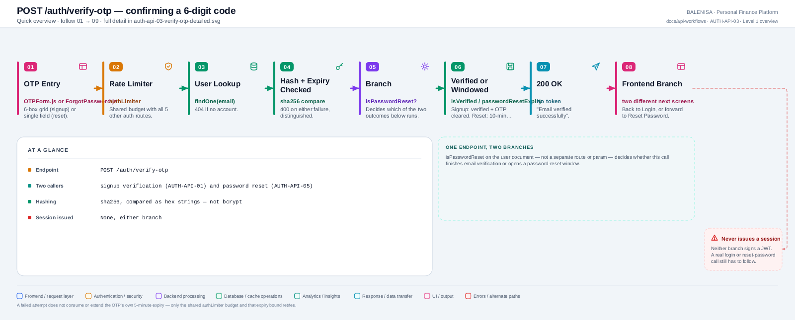
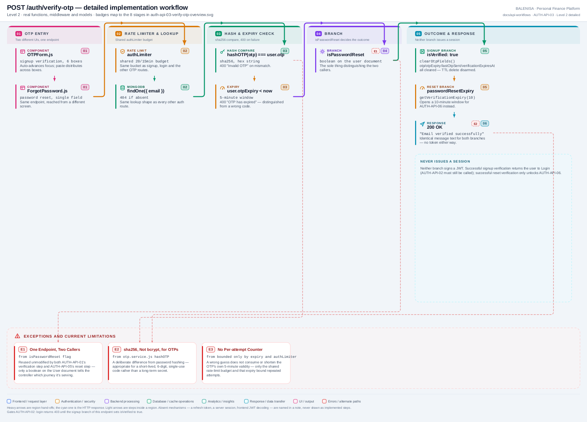

# AUTH-API-03 — Verify OTP

`POST /auth/verify-otp`

Two levels of the same workflow. Every statement below is traced to the current
repository implementation.

> **One endpoint, two callers.** This route serves both the signup-verification
> journey (from `OTPForm.js`) and the password-reset journey (from
> `ForgotPassword.js`). A single boolean on the user document, `isPasswordReset`, is
> the only thing that decides which of the two outcomes applies — there is no separate
> route or request parameter for the distinction.

---

## 1. Purpose

Confirms a 6-digit code against its stored, hashed value and, depending on which
journey called it, either marks the account verified or opens a 10-minute
password-reset authorization window.

## 2. Endpoint and method

| | |
|---|---|
| **Method** | `POST` |
| **Path** | `/auth/verify-otp` |
| **Mount** | `app.use("/auth", authRouter)` — no `apiLimiter` |
| **Middleware** | `authLimiter` → `verifyOTP` |
| **Auth required** | No — public entry point |
| **Body** | `{ email: string, otp: string }` |
| **Rate limit** | `authLimiter` — 20 req / 15 min, IP-keyed, shared with the other 5 `/auth` routes |

## 3. Level 1 quick workflow

<picture>
  <source srcset="auth-api-03-verify-otp-overview.svg" type="image/svg+xml">
  
</picture>

Vector source: [`auth-api-03-verify-otp-overview.svg`](auth-api-03-verify-otp-overview.svg) ·
raster preview / fallback: [`auth-api-03-verify-otp-overview.png`](auth-api-03-verify-otp-overview.png)

## 4. Level 2 detailed workflow

<picture>
  <source srcset="auth-api-03-verify-otp-detailed.svg" type="image/svg+xml">
  
</picture>

Vector source: [`auth-api-03-verify-otp-detailed.svg`](auth-api-03-verify-otp-detailed.svg) ·
raster preview / fallback: [`auth-api-03-verify-otp-detailed.png`](auth-api-03-verify-otp-detailed.png)

## 5. Request fields and validation

| Field | Client check | Server check |
|---|---|---|
| `email` | Carried as a prop (signup) or entered earlier in the same form (reset) — not re-validated at this step | No Joi schema — validated inline via `UserModel.findOne` |
| `otp` | 6 individual digit inputs (`OTPForm.js`) or one text field (`ForgotPassword.js`), joined before sending | Hashed with sha256 and compared to `user.otp`; `user.otpExpiry` checked separately |

No Joi validation middleware exists on this route — both checks are inline in
`verifyOTP.js`.

## 6. Middleware order

`authLimiter` → `verifyOTP`. No `verifyToken` (this route runs pre-session, for both
callers).

## 7. Controller/service/model behaviour

1. `UserModel.findOne({ email })` — `404` if none.
2. If `user.isVerified && !user.isPasswordReset` — `400 "User already verified"` (this
   guard is skipped specifically when `isPasswordReset` is true, which is how the
   reset journey can re-verify an already-verified account).
3. `user.otpExpiry < new Date()` — `400 "OTP has expired..."`.
4. `hashOTP(otp) !== user.otp` — `400 "Invalid OTP"`.
5. Branch on `user.isPasswordReset`:
   - **False** (signup path): `user.isVerified = true`, `clearOtpFields(user)` wipes
     `otp`/`otpExpiry`/`lastOtpSent`/`verificationExpiresAt` — the last of which also
     disarms the TTL auto-delete.
   - **True** (reset path): `user.isPasswordReset` stays `true`,
     `user.passwordResetExpiry = getVerificationExpiry(10)` — a fresh 10-minute
     window for [AUTH-API-06](auth-api-06-reset-password.md).
6. `user.save()`.

## 8. Password/JWT behaviour

No password is touched here. No JWT is generated in either branch — this endpoint
never issues a session.

## 9. Response schema

```jsonc
// 200, identical text for both branches
{ "message": "Email verified successfully", "success": true }
```

## 10. Frontend caller

Two different components call this same endpoint via raw `fetch`: `OTPForm.js`
(signup verification, 6-box UI) and `ForgotPassword.js` (password reset, single-field
UI). Neither goes through the shared `axios` instance.

## 11. Auth-state update

None in either branch — `isLoggedIn` is untouched.

## 12. Redirect/navigation

Signup path: `OTPForm.js`'s `onSuccess` calls `setIsSignUp(false)` in `SignUp.js`,
returning to Login. Reset path: `ForgotPassword.js` sets `isOTPVerified(true)`,
rendering `ResetPassword.js` in place.

## 13. Loading and error states

`isFetching`/`isSpinnerLoad` disables the relevant submit control during the request.
On failure, `OTPForm.js` clears all 6 boxes, refocuses the first, and plays a shake
animation; `ForgotPassword.js` simply shows a toast and leaves the single OTP field as
entered.

## 14. Security and privacy behaviour

- OTP is hashed (sha256) at rest and compared as a hex string — never stored or logged
  in plaintext.
- A wrong guess does not consume or shorten the OTP's own 5-minute expiry — only the
  shared `authLimiter` budget and that expiry bound repeated attempts; there is no
  dedicated per-attempt counter.
- The reset branch's 10-minute authorization window is the sole gate on
  [AUTH-API-06](auth-api-06-reset-password.md) — no password re-entry is required
  there.

## 15. Failure paths

| Tag | Condition | Where | Result |
|---|---|---|---|
| E1 | > 20 req / 15 min (shared bucket) | `authLimiter` | `429` |
| E2 | No account for that email | controller | `404 "User not found"` |
| E3 | Already verified, not a reset attempt | controller | `400 "User already verified"` |
| E4 | OTP expired | controller | `400 "OTP has expired. Please request a new one"` |
| E5 | OTP hash mismatch | controller | `400 "Invalid OTP"` |
| E6 | Any database failure | controller `catch` | `500 "Internal Server Error"` |

## 16. Files involved

| Layer | File | Function/export | Purpose |
|---|---|---|---|
| Initiator (signup) | `frontend/src/components/loginSignUp/OTPForm.js` | `OTPForm`, `handleVerify` | 6-box entry, paste handling |
| Initiator (reset) | `frontend/src/components/loginSignUp/passwordReset/ForgotPassword.js` | `ForgotPassword`, `handleSubmit` | Single-field entry, second step of its own form |
| Route | `backend/Routes/auth.routes.js` | `router.post('/verify-otp', ...)` | `authLimiter` → `verifyOTP` |
| Controller | `backend/Controllers/AuthControllers/verifyOTP.js` | `verifyOTP` | Hash/expiry check, branch, save |
| OTP service | `backend/Services/AuthServices/otp.service.js` | `hashOTP`, `clearOtpFields`, `getVerificationExpiry` | Shared with AUTH-API-01, AUTH-API-04, AUTH-API-05 |
| Model | `backend/config/Schemas.js` | `userSchema` | `otp`, `otpExpiry`, `isVerified`, `isPasswordReset`, `passwordResetExpiry` |

---

## 17. Current implementation observations

**Summary:** Correctness 1 · Security 1 · Reliability 0 · Maintainability 1

### Correctness

1. **The already-verified guard has a narrow, easy-to-miss exception.** `if
   (user.isVerified && !user.isPasswordReset)` means a verified user mid-password-reset
   bypasses what looks like a duplicate-verification block — correct behaviour, but
   the condition reads as a single guard when it is actually gating two different
   scenarios at once.

### Security

2. **One endpoint, two authorization outcomes, distinguished only by server-side
   state.** There is no way for a caller to see, from the request or response alone,
   which branch executed — which is appropriate (the two branches shouldn't leak that
   distinction), but means a bug in the `isPasswordReset` flag's lifecycle (e.g., left
   `true` from an abandoned reset attempt) could silently change this endpoint's
   behaviour for a later signup-adjacent call to the same email.

### Maintainability

3. **Shared field, shared risk.** Because signup verification and password reset both
   write into the same `otp`/`otpExpiry` fields, a change to one journey's OTP timing
   or format has to be checked against the other — there is no structural separation
   preventing accidental cross-impact.
