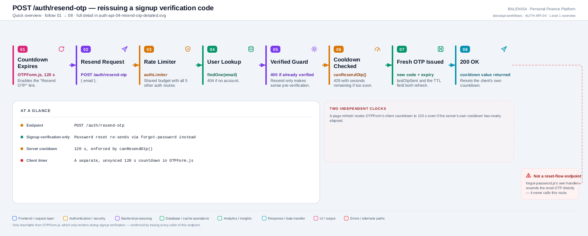
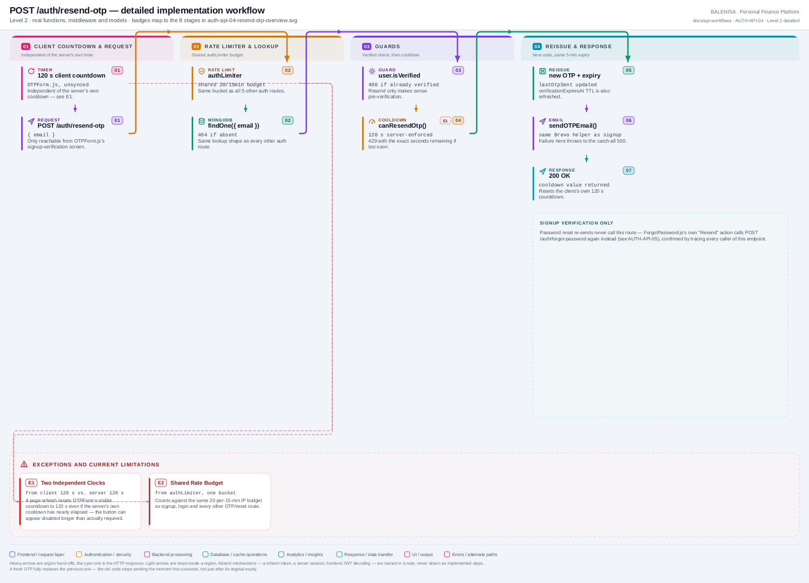

# AUTH-API-04 — Resend OTP

`POST /auth/resend-otp`

Two levels of the same workflow. Every statement below is traced to the current
repository implementation.

> **Signup verification only.** This route is reachable only from `OTPForm.js`, which
> renders exclusively during signup verification. Password-reset resends go through
> [AUTH-API-05](auth-api-05-forgot-password.md) instead — confirmed by tracing every
> caller of this endpoint.

---

## 1. Purpose

Reissues a fresh 6-digit OTP for an unverified account, subject to a server-enforced
cooldown.

## 2. Endpoint and method

| | |
|---|---|
| **Method** | `POST` |
| **Path** | `/auth/resend-otp` |
| **Mount** | `app.use("/auth", authRouter)` — no `apiLimiter` |
| **Middleware** | `authLimiter` → `resendOTP` |
| **Auth required** | No — public entry point |
| **Body** | `{ email: string }` |
| **Rate limit** | `authLimiter` — 20 req / 15 min, IP-keyed, shared with the other 5 `/auth` routes |

## 3. Level 1 quick workflow

<picture>
  <source srcset="auth-api-04-resend-otp-overview.svg" type="image/svg+xml">
  
</picture>

Vector source: [`auth-api-04-resend-otp-overview.svg`](auth-api-04-resend-otp-overview.svg) ·
raster preview / fallback: [`auth-api-04-resend-otp-overview.png`](auth-api-04-resend-otp-overview.png)

## 4. Level 2 detailed workflow

<picture>
  <source srcset="auth-api-04-resend-otp-detailed.svg" type="image/svg+xml">
  
</picture>

Vector source: [`auth-api-04-resend-otp-detailed.svg`](auth-api-04-resend-otp-detailed.svg) ·
raster preview / fallback: [`auth-api-04-resend-otp-detailed.png`](auth-api-04-resend-otp-detailed.png)

## 5. Request fields and validation

| Field | Client check | Server check |
|---|---|---|
| `email` | Carried as a prop from `SignUp.js`, not re-entered | No Joi schema — validated inline via `UserModel.findOne` |

No Joi validation middleware on this route.

## 6. Middleware order

`authLimiter` → `resendOTP`. No `verifyToken`.

## 7. Controller/service/model behaviour

1. `UserModel.findOne({ email })` — `404` if none.
2. `user.isVerified` — `400 "User already verified"` if true.
3. `canResendOtp(user.lastOtpSent, 120000)` — `429` with seconds remaining if the
   120-second cooldown hasn't elapsed.
4. `generateOTP()`, `hashOTP()`, new `otpExpiry` (5 min), `lastOtpSent = now`, and a
   refreshed `verificationExpiresAt` (10 min) — all written via `user.save()`.
5. `sendOTPEmail(email, otp, "verify")`.

## 8. Password/JWT behaviour

Not applicable — no password or JWT involvement.

## 9. Response schema

```jsonc
// 200
{ "message": "OTP resent successfully", "success": true, "cooldown": 120 }
```

## 10. Frontend caller

`OTPForm.js`'s `handleResend`, via raw `fetch` — not the shared `axios` instance.

## 11. Auth-state update

None.

## 12. Redirect/navigation

None — `OTPForm.js` stays on the same screen, clearing the 6 boxes and resetting its
own 120-second countdown from the response's `cooldown` value.

## 13. Loading and error states

`isFetching` disables the resend action while in flight. The client-side countdown
independently gates the button's visibility/enabled state before any request is even
sent — a user cannot trigger this endpoint faster than once per visible countdown
cycle from the UI, though the two timers (client and server) are not the same clock.

## 14. Security and privacy behaviour

- The previous OTP is fully superseded, not merely supplemented — the old code stops
  working the instant this succeeds, not just at its original 5-minute expiry.
- Same cooldown helper (`canResendOtp`) and 120-second window as
  [AUTH-API-05](auth-api-05-forgot-password.md), applied independently per endpoint.

## 15. Failure paths

| Tag | Condition | Where | Result |
|---|---|---|---|
| E1 | > 20 req / 15 min (shared bucket) | `authLimiter` | `429` |
| E2 | No account for that email | controller | `404 "User not found"` |
| E3 | Already verified | controller | `400 "User already verified"` |
| E4 | Cooldown not elapsed | controller | `429`, with `cooldown` seconds remaining |
| E5 | Any database or email-send failure | controller `catch` | `500 "Internal Server Error"` |

## 16. Files involved

| Layer | File | Function/export | Purpose |
|---|---|---|---|
| Initiator | `frontend/src/components/loginSignUp/OTPForm.js` | `OTPForm`, `handleResend` | Countdown UI, raw fetch |
| Route | `backend/Routes/auth.routes.js` | `router.post('/resend-otp', ...)` | `authLimiter` → `resendOTP` |
| Controller | `backend/Controllers/AuthControllers/resendOTP.js` | `resendOTP` | Guards, cooldown, reissue |
| OTP service | `backend/Services/AuthServices/otp.service.js` | `generateOTP`, `hashOTP`, `getOtpExpiry`, `getVerificationExpiry`, `canResendOtp` | Shared with AUTH-API-01, AUTH-API-03, AUTH-API-05 |
| Email | `backend/Services/AuthServices/email.service.js` | `sendOTPEmail` | Same Brevo helper as signup |
| Model | `backend/config/Schemas.js` | `userSchema` | `otp`, `otpExpiry`, `lastOtpSent`, `verificationExpiresAt` |

---

## 17. Current implementation observations

**Summary:** Correctness 1 · Security 0 · Reliability 0 · Maintainability 1

### Correctness

1. **Two independent, unsynced 120-second clocks.** The client's countdown resets to a
   flat 120 seconds on every page load or resend, while the server's cooldown is
   measured from `lastOtpSent`. A page refresh mid-cooldown makes the visible timer
   overstate how long the user actually has to wait.

### Maintainability

2. **No test for whether the resend endpoint is reachable during a password reset.**
   Nothing in the code prevents `resend-otp` from being called with an email that's
   mid-password-reset (`isPasswordReset: true`) — the `isVerified` guard alone decides
   eligibility, so a resend during an active reset window would still succeed and
   would overwrite the pending reset OTP, since both share the same field (see
   [AUTH-API-03 §17, finding 3](auth-api-03-verify-otp.md#17-current-implementation-observations)).
