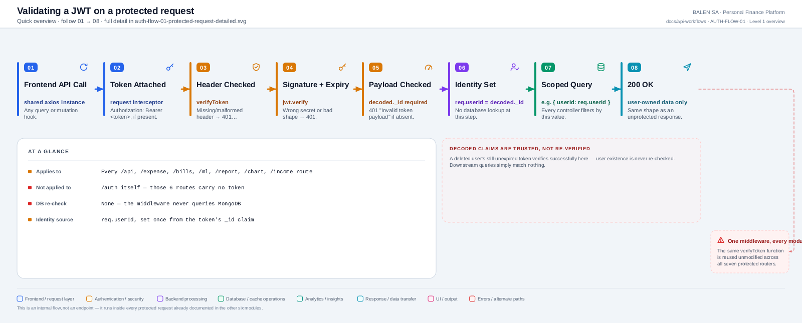
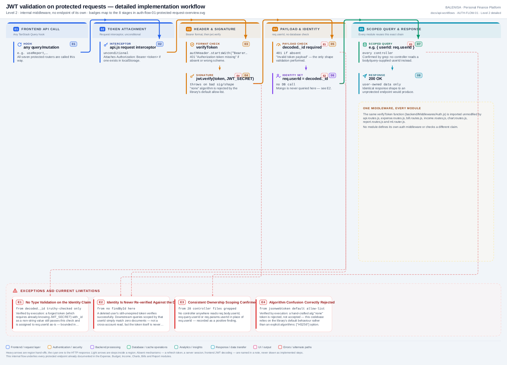

# AUTH-FLOW-01 — JWT validation on protected requests

An internal middleware flow, not an endpoint. Runs inside every request to the seven
protected routers (`/api`, `/expense`, `/bills`, `/ml`, `/report`, `/chart`,
`/income`) already documented in their own modules. Every statement below is traced to
the current repository implementation.

---

## 1. Purpose

Establishes `req.userId` from a bearer token so downstream controllers can scope their
database queries to the right account.

## 2. Level 1 quick workflow

<picture>
  <source srcset="auth-flow-01-protected-request-overview.svg" type="image/svg+xml">
  
</picture>

Vector: [`auth-flow-01-protected-request-overview.svg`](auth-flow-01-protected-request-overview.svg) ·
raster fallback: [`auth-flow-01-protected-request-overview.png`](auth-flow-01-protected-request-overview.png)

## 3. Level 2 detailed workflow

<picture>
  <source srcset="auth-flow-01-protected-request-detailed.svg" type="image/svg+xml">
  
</picture>

Vector: [`auth-flow-01-protected-request-detailed.svg`](auth-flow-01-protected-request-detailed.svg) ·
raster fallback: [`auth-flow-01-protected-request-detailed.png`](auth-flow-01-protected-request-detailed.png)

## 4. Trigger

Any call made through the shared `axios` instance (`frontend/src/api/axios.js`) to any
of the seven protected routers — i.e., every TanStack Query hook in the app except the
six raw-`fetch` `/auth` calls documented in AUTH-API-01 through AUTH-API-06.

## 5. Initial state

A `localStorage`-stored token, if one exists; no server-side session state of any kind
exists to check against.

## 6. Token source

The request interceptor in `api/axios.js` reads `localStorage.getItem("token")` on
every outgoing call and attaches it as `Authorization: Bearer <token>` **if present** —
if absent, the request is sent with no `Authorization` header at all, and
`verifyToken` rejects it the same way it would reject a malformed one.

## 7. Identity decision

`Middlewares/Auth.js`'s `verifyToken`:

1. `authHeader.startsWith("Bearer ")` — else `401 "Authorization token missing"`.
2. Split on the token — empty → `401 "Token missing"`.
3. `jwt.verify(token, process.env.JWT_SECRET)` — throws on bad signature, bad shape,
   or (never actually reachable given AUTH-API-02's tokens) expiry.
4. `decoded._id` truthy check — else `401 "Invalid token payload"`.
5. `req.userId = decoded._id` — **no database query at this or any later step inside
   the middleware itself.**

## 8. Middleware/interceptor behaviour

`verifyToken` is the **first** middleware on every route of all seven protected
routers, confirmed by reading each `Routes/*.js` file directly — no route places
validation or another middleware ahead of it, and no module defines its own variant.
The single `catch` around the whole function collapses every failure type (expired,
malformed, wrong signature) into the same `401 "Invalid or expired token"` — the raw
`jsonwebtoken` error is logged server-side (`console.error("JWT verification failed")`)
but never sent to the client.

## 9. Success path

`req.userId` set → `next()` called exactly once → the route's own validation
middleware (if any) → the controller, which builds its Mongo query around
`{userId: req.userId}` (or `{user: req.userId}` for Report) → response.

## 10. Failure path

Any of the four checks above failing returns `401` before the controller ever runs.
There is no `403` path in this middleware — role/permission concepts don't exist in
this codebase, so there's nothing for a `403` to represent here (individual controllers
do return their own `403`s for unrelated business reasons, e.g. Login's
"not verified").

## 11. State cleanup

None performed by this flow itself. A `401` response is what triggers
[AUTH-FLOW-04](auth-flow-04-expired-token.md)'s cleanup, on the frontend side.

## 12. Navigation

None — this is a pure backend/network-layer flow with no UI of its own.

## 13. Query-cache impact

None directly. A `200` lets the calling query hook populate its cache normally; a `401`
hands off entirely to AUTH-FLOW-04, which does clear the cache.

## 14. Cross-account data-isolation impact

This is the flow that makes isolation possible at all: `req.userId` is the single
source of identity every downstream controller relies on. Re-confirmed for this audit
via `grep -rn "req.body.userId\|req.query.userId\|req.params.userId" Controllers/`
across all 28 controller files — zero matches, meaning no controller anywhere accepts
an identity override from the request itself.

## 15. Files involved

| Layer | File | Function/export | Purpose |
|---|---|---|---|
| Interceptor | `frontend/src/api/axios.js` | request interceptor | Attaches the bearer token if present |
| Middleware | `backend/Middlewares/Auth.js` | `verifyToken` (default export) | The entire identity-decision logic |
| Routers (7) | `backend/Routes/api.routes.js`, `expense.routes.js`, `bill.routes.js`, `income.routes.js`, `chart.routes.js`, `report.routes.js`, `ml.router.js` | route tables | Each imports and applies `verifyToken` first, unmodified |

## 16. Confirmed limitations

- **No re-check of user existence or status.** A deleted, disabled, or otherwise
  invalid user's token still verifies successfully — the middleware only proves the
  *token* is authentic, not that the *account* is still valid. Verified by execution.
- **No type validation on the `_id` claim beyond truthiness.** Verified by execution
  with a forged, non-string `_id` — the middleware passes it through unchanged. This
  is only reachable by someone who already possesses `JWT_SECRET`, since the server's
  own signing code ([AUTH-API-02](auth-api-02-login.md)) always signs a real Mongoose
  `ObjectId`.
- **No `algorithms` allow-list is explicitly configured** — the codebase relies on the
  `jsonwebtoken` library's own default behaviour (which does correctly reject a
  hand-crafted `alg: "none"` token, verified by execution) rather than pinning
  `algorithms: ["HS256"]` itself.
- **Identical to `AUTH-FLOW-04`'s trigger condition** — every `401` this flow can
  produce is what that flow's frontend interceptor reacts to.
