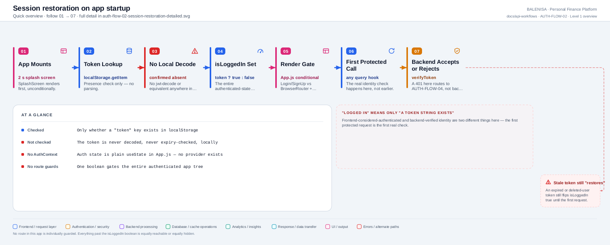
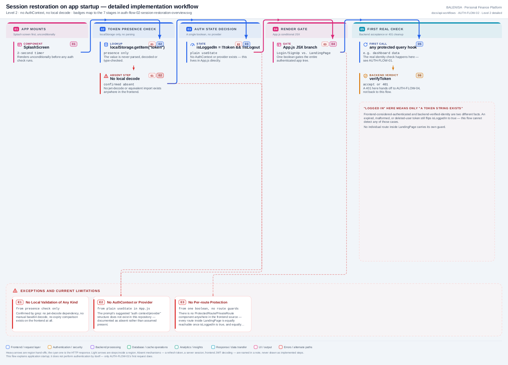

# AUTH-FLOW-02 — Frontend session restoration

A frontend-only flow that materially explains application startup. There is no
backend endpoint here and no AuthContext/provider — both confirmed absent, not merely
undocumented. Every statement below is traced to the current repository
implementation.

---

## 1. Purpose

Decides, on every app load, whether to show the authenticated app tree or the
Login/SignUp screens — based on nothing more than whether a `token` string exists.

## 2. Level 1 quick workflow

<picture>
  <source srcset="auth-flow-02-session-restoration-overview.svg" type="image/svg+xml">
  
</picture>

Vector: [`auth-flow-02-session-restoration-overview.svg`](auth-flow-02-session-restoration-overview.svg) ·
raster fallback: [`auth-flow-02-session-restoration-overview.png`](auth-flow-02-session-restoration-overview.png)

## 3. Level 2 detailed workflow

<picture>
  <source srcset="auth-flow-02-session-restoration-detailed.svg" type="image/svg+xml">
  
</picture>

Vector: [`auth-flow-02-session-restoration-detailed.svg`](auth-flow-02-session-restoration-detailed.svg) ·
raster fallback: [`auth-flow-02-session-restoration-detailed.png`](auth-flow-02-session-restoration-detailed.png)

## 4. Trigger

`App.js` mounting — either a fresh page load, a browser refresh, or the hard reload
that [AUTH-FLOW-04](auth-flow-04-expired-token.md) itself performs.

## 5. Initial state

`isLoading = true` (drives a 2-second `SplashScreen`), `isLoggedIn = false`,
`isLogout = false`. The token-presence effect runs once `isLogout` is available as a
dependency, independent of the splash timer.

## 6. Token source

`localStorage.getItem("token")` — read directly in `App.js`'s `useEffect`, not through
any shared helper.

## 7. Identity decision

```js
if (token && !isLogout) setIsLoggedIn(true);
else setIsLoggedIn(false);
```

That is the entire decision. **The token is never decoded, parsed, or checked for
expiry at this step** — confirmed absent by grep for any decode library or manual
base64 parsing anywhere in the frontend source.

## 8. Middleware/interceptor behaviour

None applies here — this runs before any network request is made. The interceptors in
`api/axios.js` only come into play once the first protected call fires, which is
outside this flow (see [AUTH-FLOW-01](auth-flow-01-protected-request.md)).

## 9. Success path

Token present, `isLogout` false → `isLoggedIn = true` → `App.js` renders
`BrowserRouter` → `ExpenseInsightsProvider` → `ChartInsightsProvider` → `LandingPage`.
The first data-fetching hook inside that tree makes the first real protected request,
which is the actual identity check — see AUTH-FLOW-01.

## 10. Failure path

No token, or `isLogout` true → `isLoggedIn = false` → `Login`/`SignUp` render instead.
There is no distinct "invalid token" failure path at this stage — an invalid, expired,
or deleted-user token is indistinguishable from a valid one at this point, because
nothing here inspects the token's contents.

## 11. State cleanup

None performed by this flow — it only reads state, never clears it. Cleanup is entirely
owned by [AUTH-FLOW-03](auth-flow-03-logout.md) (manual) and
[AUTH-FLOW-04](auth-flow-04-expired-token.md) (forced).

## 12. Navigation

No router navigation exists at this layer — `BrowserRouter` isn't even mounted until
after `isLoggedIn` is already `true`; the whole decision is a top-level conditional
render in `App.js`, not a route guard.

## 13. Query-cache impact

None directly — no query fires until deeper inside the authenticated tree.

## 14. Cross-account data-isolation impact

None at this stage — this flow doesn't touch any user-scoped data, only a boolean flag.
The actual isolation-relevant cache behaviour lives in
[AUTH-FLOW-03](auth-flow-03-logout.md)/[AUTH-FLOW-04](auth-flow-04-expired-token.md)'s
`queryClient.clear()` calls, which run *before* this flow would ever re-run for a
different account.

## 15. Files involved

| Layer | File | Function/export | Purpose |
|---|---|---|---|
| App shell | `frontend/src/App.js` | `App`, startup `useEffect` | Splash timer, token-presence check, conditional render |

That is the complete file list — this flow has no backend component and touches no
other frontend file directly.

## 16. Confirmed limitations

- **No AuthContext or provider exists.** `isLoggedIn` is plain `useState` in `App.js`,
  passed down as props to `Login`, `SignUp`, and `LandingPage` — confirmed absent by
  grep, not assumed present per the prompt's suggested structure.
- **No route-level protection exists.** There is no `ProtectedRoute`/`PrivateRoute`
  component anywhere; the entire authenticated tree is gated by this one boolean, and
  nothing inside `LandingPage` is individually guarded.
- **"Frontend considers user authenticated" and "backend-verified identity" are
  different facts here.** This flow only ever establishes the former. A stale, expired
  (moot, since tokens never expire), malformed, or deleted-user token still restores
  `isLoggedIn = true` — the real check only happens on the first protected request.
- **No loading/unknown auth state exists beyond the splash screen's fixed 2-second
  timer** — `isLoading` is a timer, not a function of whether the auth check has
  actually resolved (it resolves synchronously anyway, since it's just a
  `localStorage` read).
