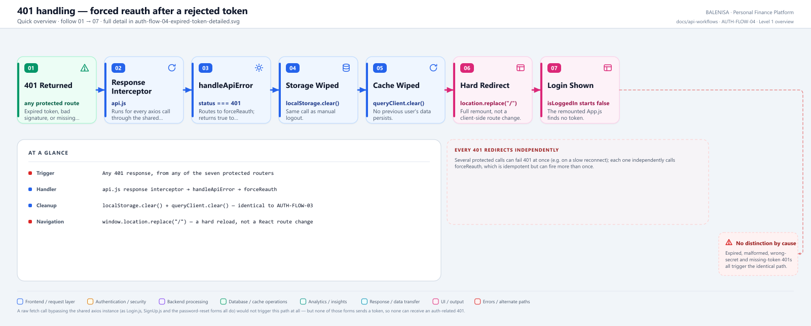
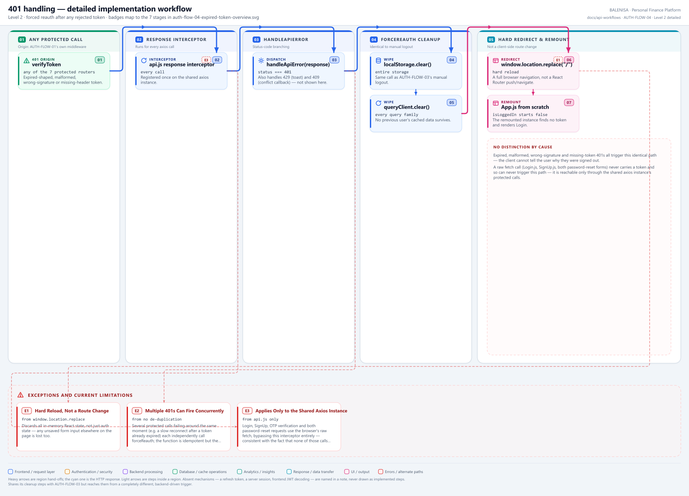

# AUTH-FLOW-04 — Expired / invalid token handling

A frontend-only flow triggered by the backend, not a user action. Every statement below
is traced to the current repository implementation.

---

## 1. Purpose

Reacts to any `401` from any protected endpoint by tearing down the local session and
returning to Login — the closest thing this app has to detecting "my token no longer
works."

## 2. Level 1 quick workflow

<picture>
  <source srcset="auth-flow-04-expired-token-overview.svg" type="image/svg+xml">
  
</picture>

Vector: [`auth-flow-04-expired-token-overview.svg`](auth-flow-04-expired-token-overview.svg) ·
raster fallback: [`auth-flow-04-expired-token-overview.png`](auth-flow-04-expired-token-overview.png)

## 3. Level 2 detailed workflow

<picture>
  <source srcset="auth-flow-04-expired-token-detailed.svg" type="image/svg+xml">
  
</picture>

Vector: [`auth-flow-04-expired-token-detailed.svg`](auth-flow-04-expired-token-detailed.svg) ·
raster fallback: [`auth-flow-04-expired-token-detailed.png`](auth-flow-04-expired-token-detailed.png)

## 4. Trigger

Any `401` response received through the shared `axios` instance — i.e., a rejection
from [AUTH-FLOW-01](../protected-request-flow/auth-flow-01-protected-request.md)'s `verifyToken` middleware on
any of the seven protected routers.

## 5. Initial state

A session the frontend still believes is valid (`isLoggedIn = true`), which the
backend has just rejected — expired-in-spirit (though tokens never truly expire),
malformed, wrong-signature, or missing-header are all indistinguishable from here.

## 6. Token source

Not read in this flow — the flow exists specifically *because* the token already
failed verification server-side; nothing here re-inspects it.

## 7. Identity decision

None — this flow doesn't make an identity decision; it reacts to the backend's `401`
verdict from AUTH-FLOW-01.

## 8. Middleware/interceptor behaviour

`api/axios.js`'s response interceptor runs for every call through the shared instance:

```js
api.interceptors.response.use(
  (response) => response,
  (error) => {
    if (error.response) handleApiError(error.response);
    return Promise.reject(error);
  }
);
```

`handleApiError` branches on status: `401` → `forceReauth()`; `429` → a toast; `409` →
an optional caller-supplied callback or a generic toast. Only the `401` branch is this
flow.

## 9. Success path

There is no "success" outcome distinct from the cleanup itself — reaching this flow
already means the request failed. The flow's own steps always complete (they're all
synchronous local operations):

```js
export const forceReauth = () => {
  localStorage.clear();
  queryClient.clear();
  window.location.replace("/");
};
```

## 10. Failure path

None — identical reasoning to AUTH-FLOW-03: every step is local and synchronous, so
nothing here can itself fail or need a retry.

## 11. State cleanup

Identical calls to AUTH-FLOW-03: full `localStorage.clear()`, full `queryClient.clear()`.

## 12. Navigation

**`window.location.replace("/")`** — a hard browser navigation and full app remount,
**not** a React Router `navigate()` and not the soft re-render AUTH-FLOW-03 uses. All
in-memory React state, not just auth state, is discarded by this reload.

## 13. Query-cache impact

Full `queryClient.clear()`, identical to manual logout — no stale query results survive
into whatever session comes next.

## 14. Cross-account data-isolation impact

Same protective role as AUTH-FLOW-03: guarantees a rejected token can't leave behind
cached data for the next login on the same tab.

## 15. Files involved

| Layer | File | Function/export | Purpose |
|---|---|---|---|
| Interceptor | `frontend/src/api/axios.js` | response interceptor | Routes every non-2xx through `handleApiError` |
| Handler | `frontend/src/api/handleApiError.js` | `handleApiError`, `forceReauth` | Status branching; the actual cleanup + redirect |
| Cache | `frontend/src/query/queryClient.js` | `queryClient` | Cleared here, same instance as AUTH-FLOW-03 |

## 16. Confirmed limitations

- **No distinction by cause.** Expired-in-spirit, malformed, wrong-signature, and
  missing-token `401`s all trigger the identical path — the user is never told *why*
  they were signed out.
- **Multiple concurrent `401`s can each independently call `forceReauth`.** The
  function is idempotent (clearing already-empty storage/cache is harmless, and a
  second `location.replace("/")` is a no-op once already navigating), but there is no
  de-duplication or in-flight guard.
- **Only applies to the shared axios instance.** The six raw-`fetch` `/auth` calls
  (AUTH-API-01 through AUTH-API-06) never carry a token and so can never produce an
  auth-related `401` through this path — consistent, not a gap, since those calls have
  nothing to be rejected.
- **The hard reload discards more than auth state** — any unrelated unsaved UI state
  elsewhere on the page is lost too, since this is a full remount, not a targeted
  cleanup.
