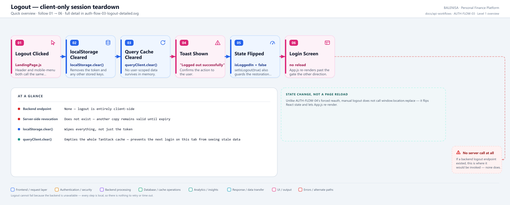
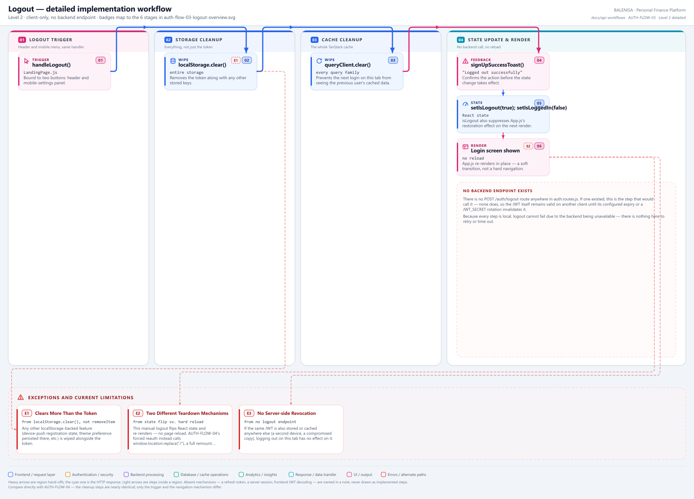

# AUTH-FLOW-03 — Logout

A frontend-only flow. **No backend logout endpoint exists** — confirmed absent from
`auth.routes.js`, not merely undocumented. Every statement below is traced to the
current repository implementation.

---

## 1. Purpose

Ends the local session: clears storage, clears cached server data, and returns the
user to the Login screen — entirely without contacting the backend.

## 2. Level 1 quick workflow

<picture>
  <source srcset="auth-flow-03-logout-overview.svg" type="image/svg+xml">
  
</picture>

Vector: [`auth-flow-03-logout-overview.svg`](auth-flow-03-logout-overview.svg) ·
raster fallback: [`auth-flow-03-logout-overview.png`](auth-flow-03-logout-overview.png)

## 3. Level 2 detailed workflow

<picture>
  <source srcset="auth-flow-03-logout-detailed.svg" type="image/svg+xml">
  
</picture>

Vector: [`auth-flow-03-logout-detailed.svg`](auth-flow-03-logout-detailed.svg) ·
raster fallback: [`auth-flow-03-logout-detailed.png`](auth-flow-03-logout-detailed.png)

## 4. Trigger

A user clicking one of two "Logout" buttons in `LandingPage.js` — one in the main
header, one in the mobile settings panel — both bound to the same `handleLogout`
function.

## 5. Initial state

An authenticated session: `isLoggedIn = true`, a token in `localStorage`, and
potentially a populated TanStack Query cache from whatever the user was viewing.

## 6. Token source

Not read at all in this flow — the token is simply discarded, not inspected.

## 7. Identity decision

None — logout doesn't decide anything about identity; it unconditionally tears down
whatever session state exists.

## 8. Middleware/interceptor behaviour

None applies — this is a synchronous, local-only sequence with no network request
involved anywhere in it.

## 9. Success path

```js
localStorage.clear();      // not removeItem — everything is wiped
queryClient.clear();       // the entire TanStack Query cache, all families
signUpSuccessToast({ message: "Logged out successfully" });
setIsLogout(true);
setIsLoggedIn(false);
```

`App.js` re-renders in place — `isLoggedIn` false swaps the tree back to `Login`. This
is a **soft** transition: no `window.location` call, no full page reload.

## 10. Failure path

**None can occur.** Every step is a synchronous local operation (`localStorage.clear`,
`queryClient.clear`, `setState` calls) — there is no network request to fail, no
backend to be unavailable, and therefore nothing to retry or time out.

## 11. State cleanup

This flow *is* the cleanup: full `localStorage` wipe (not just the token key) and a
full query-cache wipe (not just user-scoped keys) — both broader than strictly
necessary, but simple and unambiguous.

## 12. Navigation

No router navigation — `App.js`'s own conditional render handles the transition, the
same mechanism [AUTH-FLOW-02](../frontend-session-restore-flow/auth-flow-02-session-restoration.md) uses on the way in.

## 13. Query-cache impact

`queryClient.clear()` empties every query family (expenses, budgets, income, charts,
bills, reports) — this is what prevents a subsequent login by a *different* account on
the same browser tab from momentarily rendering the previous user's cached data before
their own first fetch completes.

## 14. Cross-account data-isolation impact

This flow, together with [AUTH-FLOW-04](../expired-token-flow/auth-flow-04-expired-token.md), is the primary
mechanism protecting against stale-data leakage between accounts sharing a browser tab.
Both clear the same two stores (`localStorage`, TanStack Query) via the same two calls.

## 15. Files involved

| Layer | File | Function/export | Purpose |
|---|---|---|---|
| Trigger + logic | `frontend/src/components/landingPage/LandingPage.js` | `handleLogout` | The entire flow lives in one function |
| Consumed prop | `frontend/src/App.js` | `setIsLogout`, `setIsLoggedIn` | Passed down to `LandingPage` |
| Cache | `frontend/src/query/queryClient.js` | `queryClient` | The TanStack Query client instance being cleared |

## 16. Confirmed limitations

- **No backend endpoint exists.** If one did, this is the step where it would be
  called; none is. The JWT itself is never told it's invalid — another copy remains
  usable until its configured expiry or a `JWT_SECRET` rotation.
- **`localStorage.clear()` wipes everything, not just the token** — any other
  browser-persisted state (e.g., push-notification registration flags) is discarded
  too.
- **Two different teardown mechanisms exist for what looks like the same outcome** —
  this flow uses a React state flip and a soft re-render; **AUTH-FLOW-04**'s forced
  reauth instead performs a hard `window.location.replace`. They converge on the same
  visible screen by different means, which is worth knowing when debugging either one.
- **No effect on other tabs or devices.** A token also present in another tab, or on
  another device, is completely unaffected by this flow.
