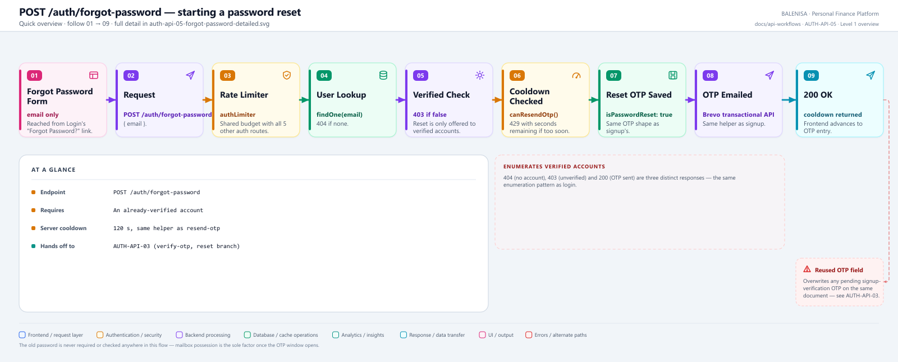
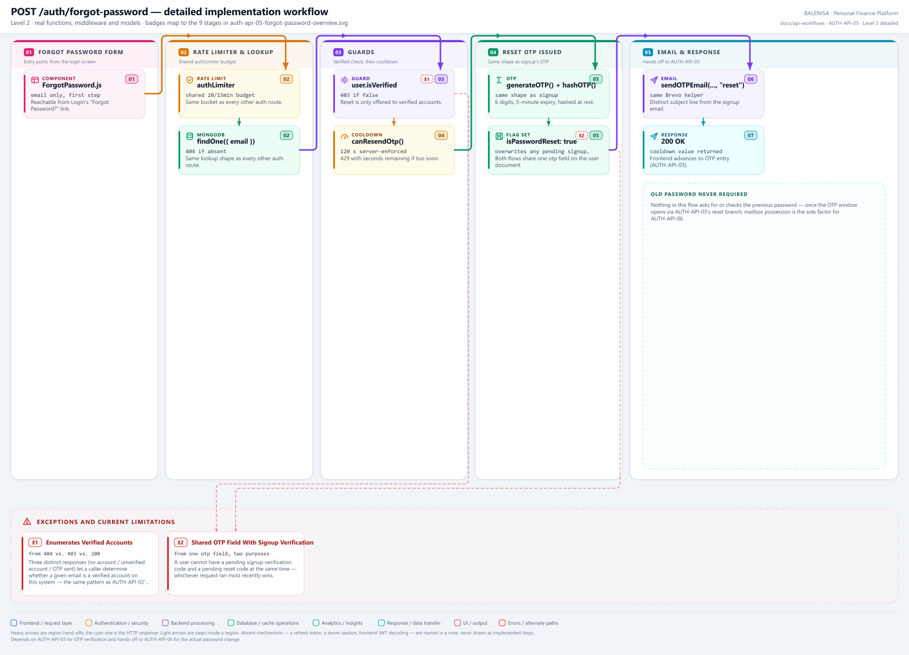

# AUTH-API-05 — Forgot Password

`POST /auth/forgot-password`

Two levels of the same workflow. Every statement below is traced to the current
repository implementation.

> **Starts, but does not complete, the reset journey.** This endpoint only issues an
> OTP. [AUTH-API-03](../verify-otp/auth-api-03-verify-otp.md)'s reset branch authorizes the change;
> [AUTH-API-06](../reset-password/auth-api-06-reset-password.md) performs it.

---

## 1. Purpose

Issues a password-reset OTP to a verified account's email address, subject to a
cooldown.

## 2. Endpoint and method

| | |
|---|---|
| **Method** | `POST` |
| **Path** | `/auth/forgot-password` |
| **Mount** | `app.use("/auth", authRouter)` — no `apiLimiter` |
| **Middleware** | `authLimiter` → `forgotPassword` |
| **Auth required** | No — public entry point |
| **Body** | `{ email: string }` |
| **Rate limit** | `authLimiter` — 20 req / 15 min, IP-keyed, shared with the other 5 `/auth` routes |

## 3. Level 1 quick workflow

<picture>
  <source srcset="auth-api-05-forgot-password-overview.svg" type="image/svg+xml">
  
</picture>

Vector source: [`auth-api-05-forgot-password-overview.svg`](auth-api-05-forgot-password-overview.svg) ·
raster preview / fallback: [`auth-api-05-forgot-password-overview.png`](auth-api-05-forgot-password-overview.png)

## 4. Level 2 detailed workflow

<picture>
  <source srcset="auth-api-05-forgot-password-detailed.svg" type="image/svg+xml">
  
</picture>

Vector source: [`auth-api-05-forgot-password-detailed.svg`](auth-api-05-forgot-password-detailed.svg) ·
raster preview / fallback: [`auth-api-05-forgot-password-detailed.png`](auth-api-05-forgot-password-detailed.png)

## 5. Request fields and validation

| Field | Client check | Server check |
|---|---|---|
| `email` | HTML5 `type="email"`, `required` only | No Joi schema — validated inline via `UserModel.findOne` |

No Joi validation middleware on this route.

## 6. Middleware order

`authLimiter` → `forgotPassword`. No `verifyToken`.

## 7. Controller/service/model behaviour

1. `UserModel.findOne({ email })` — `404` if none.
2. `!user.isVerified` — `403 "Account not verified. Sign Up Again"`.
3. `canResendOtp(user.lastOtpSent, 120000)` — `429` with seconds remaining if too soon.
4. `generateOTP()`, `hashOTP()`, new `otpExpiry` (5 min), `lastOtpSent = now`,
   **`user.isPasswordReset = true`** — the flag that routes
   [AUTH-API-03](../verify-otp/auth-api-03-verify-otp.md) into its reset branch.
5. `sendOTPEmail(email, otp, "reset")` — a different email subject than signup's.

## 8. Password/JWT behaviour

Not applicable — no password or JWT touched by this endpoint itself.

## 9. Response schema

```jsonc
// 200
{ "message": "OTP sent successfully", "success": true, "cooldown": 120 }
```

## 10. Frontend caller

`ForgotPassword.js`, via raw `fetch` — both the initial send and the "Resend" action
call this same endpoint.

## 11. Auth-state update

None.

## 12. Redirect/navigation

None — `ForgotPassword.js` stays on the same component, advancing its own internal
`isOTPSent` state to reveal the OTP-entry field.

## 13. Loading and error states

`isFetching` disables the submit button. A 403 (unverified account) and a 404 (no
account) both surface via `logInErrorToast(data)`, showing the backend's message text
directly.

## 14. Security and privacy behaviour

- Three distinct responses (404/403/200) enumerate whether an email is a registered,
  verified account — the same pattern documented for
  [AUTH-API-02](../login/auth-api-02-login.md).
- Overwrites any OTP a pending signup verification might have had for the same
  account, since both journeys share one `otp` field — see
  [AUTH-API-03 §17, finding 3](../verify-otp/auth-api-03-verify-otp.md#17-current-implementation-observations).
- The old password is never read or required at this or any later step of the reset
  journey.

## 15. Failure paths

| Tag | Condition | Where | Result |
|---|---|---|---|
| E1 | > 20 req / 15 min (shared bucket) | `authLimiter` | `429` |
| E2 | No account for that email | controller | `404 "User not found"` |
| E3 | Account never completed OTP verification | controller | `403 "Account not verified. Sign Up Again"` |
| E4 | Cooldown not elapsed | controller | `429`, with `cooldown` seconds remaining |
| E5 | Any database or email-send failure | controller `catch` | `500 "Internal Server Error"` |

## 16. Files involved

| Layer | File | Function/export | Purpose |
|---|---|---|---|
| Initiator | `frontend/src/components/loginSignUp/passwordReset/ForgotPassword.js` | `ForgotPassword`, `handleSubmit`, `handleResend` | Email entry, initial send and resend |
| Route | `backend/Routes/auth.routes.js` | `router.post('/forgot-password', ...)` | `authLimiter` → `forgotPassword` |
| Controller | `backend/Controllers/AuthControllers/forgotPassword.js` | `forgotPassword` | Guards, cooldown, OTP issue |
| OTP service | `backend/Services/AuthServices/otp.service.js` | `generateOTP`, `hashOTP`, `getOtpExpiry`, `canResendOtp` | Shared with AUTH-API-01, AUTH-API-03, AUTH-API-04 |
| Email | `backend/Services/AuthServices/email.service.js` | `sendOTPEmail` | Same Brevo helper, `"reset"` purpose |
| Model | `backend/config/Schemas.js` | `userSchema` | `otp`, `otpExpiry`, `lastOtpSent`, `isPasswordReset` |

---

## 17. Current implementation observations

**Summary:** Correctness 0 · Security 1 · Reliability 0 · Maintainability 1

### Security

1. **Enumerates verified accounts.** `404` vs. `403` vs. `200` each reveal a different
   fact about the target email — consistent with, and adding to, the same pattern
   already noted for login.

### Maintainability

2. **`isPasswordReset` is set here but cleared in a different controller**
   ([AUTH-API-06](../reset-password/auth-api-06-reset-password.md)) — a reader of this file alone would
   not see where or how the flag it sets gets consumed or reset without also reading
   `resetPassword.js` and `verifyOTP.js`.
