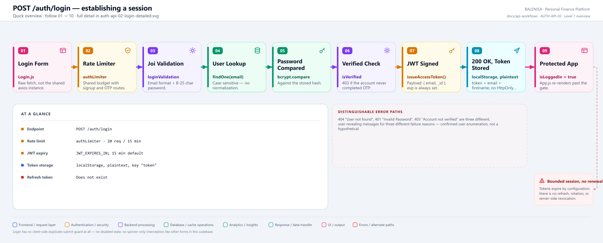
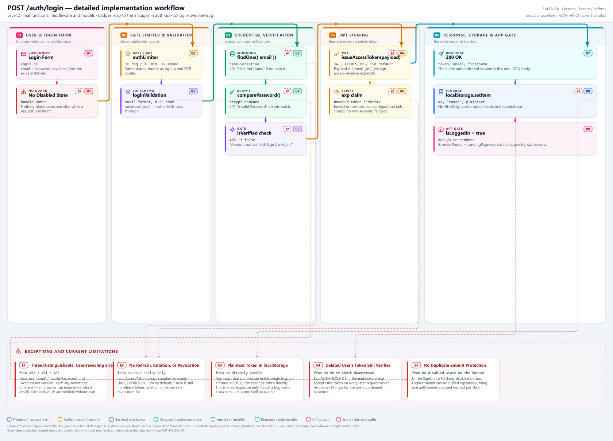

# AUTH-API-02 — Login

`POST /auth/login`

Two levels of the same workflow. Every statement below is traced to the current
repository implementation.

> **This one request issues the entire session.** There is no refresh token, rotation,
> or server-side revocation. `issueAccessToken()` always gives the JWT an `exp` claim:
> `JWT_EXPIRES_IN` when configured, otherwise a 15-minute default.

---

## 1. Purpose

Verifies credentials and, on success, issues the JWT that is the app's only concept of
a session.

## 2. Endpoint and method

| | |
|---|---|
| **Method** | `POST` |
| **Path** | `/auth/login` |
| **Mount** | `app.use("/auth", authRouter)` — no `apiLimiter` |
| **Middleware** | `authLimiter` → `loginValidation` → `login` |
| **Auth required** | No — public entry point |
| **Body** | `{ email: string, password: string }` |
| **Rate limit** | `authLimiter` — 20 req / 15 min, IP-keyed, shared with the other 5 `/auth` routes |

## 3. Level 1 quick workflow

<picture>
  <source srcset="auth-api-02-login-overview.svg" type="image/svg+xml">
  
</picture>

Vector source: [`auth-api-02-login-overview.svg`](auth-api-02-login-overview.svg) ·
raster preview / fallback: [`auth-api-02-login-overview.png`](auth-api-02-login-overview.png)

## 4. Level 2 detailed workflow

<picture>
  <source srcset="auth-api-02-login-detailed.svg" type="image/svg+xml">
  
</picture>

Vector source: [`auth-api-02-login-detailed.svg`](auth-api-02-login-detailed.svg) ·
raster preview / fallback: [`auth-api-02-login-detailed.png`](auth-api-02-login-detailed.png)

## 5. Request fields and validation

| Field | Client check (`Login.js`) | Server check (`loginValidation`, Joi) |
|---|---|---|
| `email` | HTML5 `type="email"`, `required` only | `Joi.string().email().required()` |
| `password` | HTML5 `required` only | `min(8).max(25).required()` |

No client-side format or length validation beyond the browser's own `type="email"` and
`required` attributes. `.unknown(true)` allows extra fields through unvalidated.

## 6. Middleware order

`authLimiter` → `loginValidation` → `login`. No `verifyToken` (this route issues the
credential that `verifyToken` later checks — it cannot itself require one).

## 7. Controller/service/model behaviour

1. `UserModel.findOne({ email })` — case-sensitive.
2. Not found → `404 "User not found"`.
3. `comparePassword(password, user.password)` (bcrypt.compare).
4. Mismatch → `401 "Invalid Password"`.
5. `!user.isVerified` → `403 "Account not verified. Sign Up Again"`.
6. `issueAccessToken({ email: user.email, _id: user._id })`, which calls `jwt.sign`
   with `expiresIn` resolved from `JWT_EXPIRES_IN` (15 minutes when unset).

## 8. Password/JWT behaviour

Password comparison uses bcrypt against the stored hash. JWT payload is
`{email, _id, iat, exp}`; signing uses `jsonwebtoken` defaults (HS256) with a bounded
`expiresIn`. A non-positive numeric or unparseable configured duration fails closed.

## 9. Response schema

```jsonc
// 200
{ "message": "Login Successful", "success": true,
  "token": "<jwt>", "email": "user@example.com", "firstname": "Jane" }
```

No password or password-hash field in the body at any point. No `refreshToken` field —
none exists.

## 10. Frontend caller

`Login.js`, via the browser's raw `fetch` — not the shared `axios` instance, so this
call never carries an `Authorization` header (it wouldn't have one yet) and never
passes through the response interceptor that handles 401s elsewhere.

## 11. Auth-state update

On `response.ok`: `localStorage.setItem("token", data.token)`, then
`setIsLoggedIn(true)` in `App.js` (passed down as a prop). This is the only place in
the app where `isLoggedIn` is set to `true`.

## 12. Redirect/navigation

No router navigation — `App.js`'s conditional render swaps `Login`/`SignUp` for
`BrowserRouter` + `LandingPage` as soon as `isLoggedIn` flips.

## 13. Loading and error states

`setIsSpinnerLoad(true)` shows a global blocking spinner (`<Spinner/>` in `App.js`)
while the request is in flight — but **the submit button itself has no `disabled`
state**, unlike every other auth form in this module. A second click during the spinner
window still fires a second `fetch`. Errors: 429 gets a distinct message; all others go
through `logInErrorToast(data)`, surfacing the backend's own message text directly
(404/401/403 messages are shown verbatim to the user).

## 14. Security and privacy behaviour

- Three different, user-revealing error messages (404/401/403) for three different
  failure reasons — an unauthenticated caller can determine whether an email is
  registered and, separately, whether it is verified, without ever guessing a correct
  password.
- The token is stored in `localStorage` as plaintext with no `HttpOnly` equivalent
  available (it is not a cookie) — readable by any script executing in the page's
  origin. This is a real exposure only in combination with an XSS vulnerability
  elsewhere in the app; none was found in this audit's scope.
- No brute-force protection beyond the shared 20-req/15-min `authLimiter` bucket, which
  also has to cover signup and every OTP route for the same IP.

## 15. Failure paths

| Tag | Condition | Where | Result |
|---|---|---|---|
| E1 | > 20 req / 15 min (shared bucket) | `authLimiter` | `429` |
| E2 | Email/password shape invalid | `loginValidation` | `400` |
| E3 | No account for that email | controller | `404 "User not found"` |
| E4 | Wrong password | controller | `401 "Invalid Password"` |
| E5 | Account never completed OTP verification | controller | `403 "Account not verified. Sign Up Again"` |
| E6 | Any database or bcrypt failure | controller `catch` | `500 "Internal Server Error"` |

## 16. Files involved

| Layer | File | Function/export | Purpose |
|---|---|---|---|
| Initiator | `frontend/src/components/loginSignUp/Login.js` | `Login`, `handleSubmit` | Raw fetch, token storage, auth-state update |
| Route | `backend/Routes/auth.routes.js` | `router.post('/login', ...)` | `authLimiter` → `loginValidation` → `login` |
| Validation | `backend/Middlewares/AuthValidation.js` | `loginValidation` | Joi shape check |
| Controller | `backend/Controllers/AuthControllers/login.js` | `login` | Lookup, compare, verified-gate, issue token |
| Token service | `backend/Services/AuthServices/token.service.js` | `issueAccessToken` | Central bounded-expiry issuance |
| Password | `backend/Services/AuthServices/password.service.js` | `comparePassword` | bcrypt.compare |
| Model | `backend/config/Schemas.js` | `userSchema` / `UserModel` | source of `email`, `password`, `isVerified` |
| App gate | `frontend/src/App.js` | `useState(isLoggedIn)`, startup effect | Conditional render for the whole authenticated tree |

---

## 17. Current implementation observations

**Summary:** Correctness 1 · Security 3 · Reliability 1 · Maintainability 1

### Correctness

1. **No client-side duplicate-submit guard.** `Login.js` disables nothing during its
   request — contrast with `SignUp.js`'s `disabled={isFetching}`. A user double-clicking
   Login fires two full requests, each counted against the shared rate-limit budget.

### Security

2. **No refresh, rotation, or revocation.** Access tokens now expire according to
   `JWT_EXPIRES_IN` (15 minutes by default), but the application cannot renew or
   revoke an otherwise valid token before that expiry.

3. **User enumeration via three distinct error codes.** 404/401/403 each reveal a
   different fact about the target account. A generic "Invalid email or password"
   response regardless of which check failed would close this without materially
   harming the legitimate user's experience.

4. **Plaintext token in `localStorage`.** Not an exploit by itself, but the exposure
   surface is broader than an `HttpOnly` cookie would be, should an XSS vector appear
   anywhere else in the app in the future.

### Reliability

5. **`authLimiter`'s 20-per-15-min budget is shared across signup, login, and all 4 OTP
   routes for the same IP.** A user retrying a forgotten password can exhaust the
   budget a subsequent legitimate login attempt would have needed.

### Maintainability

6. **Token issuance is centralized.** `login.js` uses `issueAccessToken()`, so the
   expiry policy is not duplicated at the controller call site.
