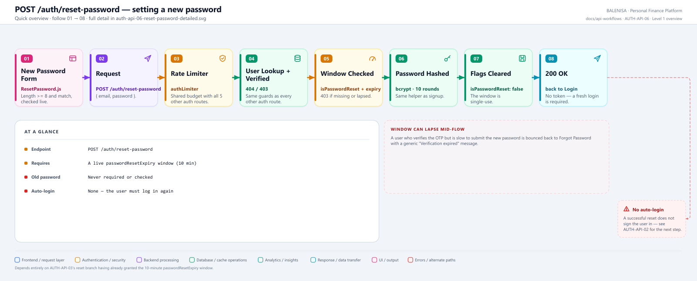
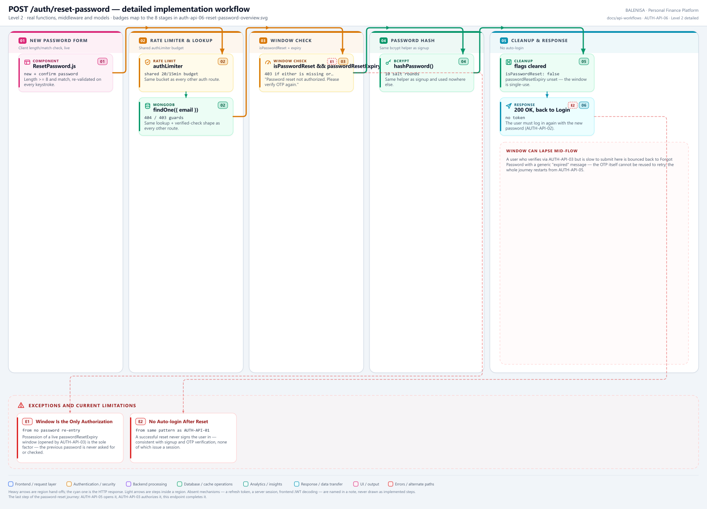

# AUTH-API-06 — Reset Password

`POST /auth/reset-password`

Two levels of the same workflow. Every statement below is traced to the current
repository implementation.

> **The old password is never checked.** Once [AUTH-API-03](../verify-otp/auth-api-03-verify-otp.md)'s
> reset branch has opened the 10-minute window, this endpoint asks only for the new
> password — mailbox possession, proven earlier by OTP, is the sole factor.

---

## 1. Purpose

Completes the password-reset journey: rehashes and stores a new password for an
account that has an open, unexpired reset authorization window.

## 2. Endpoint and method

| | |
|---|---|
| **Method** | `POST` |
| **Path** | `/auth/reset-password` |
| **Mount** | `app.use("/auth", authRouter)` — no `apiLimiter` |
| **Middleware** | `authLimiter` → `resetPassword` |
| **Auth required** | No — public entry point (the OTP-granted window is the authorization) |
| **Body** | `{ email: string, password: string }` |
| **Rate limit** | `authLimiter` — 20 req / 15 min, IP-keyed, shared with the other 5 `/auth` routes |

## 3. Level 1 quick workflow

<picture>
  <source srcset="auth-api-06-reset-password-overview.svg" type="image/svg+xml">
  
</picture>

Vector source: [`auth-api-06-reset-password-overview.svg`](auth-api-06-reset-password-overview.svg) ·
raster preview / fallback: [`auth-api-06-reset-password-overview.png`](auth-api-06-reset-password-overview.png)

## 4. Level 2 detailed workflow

<picture>
  <source srcset="auth-api-06-reset-password-detailed.svg" type="image/svg+xml">
  
</picture>

Vector source: [`auth-api-06-reset-password-detailed.svg`](auth-api-06-reset-password-detailed.svg) ·
raster preview / fallback: [`auth-api-06-reset-password-detailed.png`](auth-api-06-reset-password-detailed.png)

## 5. Request fields and validation

| Field | Client check (`ResetPassword.js`) | Server check |
|---|---|---|
| `email` | Carried as a prop, not re-entered | No Joi schema — validated inline |
| `password` | length >= 8, live-checked, plus a separate "confirm password" match check | `hashPassword` has no policy of its own beyond what's already been typed |

No Joi validation middleware on this route; both length and confirm-match are purely
client-side.

## 6. Middleware order

`authLimiter` → `resetPassword`. No `verifyToken`.

## 7. Controller/service/model behaviour

1. `UserModel.findOne({ email })` — `404` if none.
2. `!user.isVerified` — `403 "Account not verified. Sign Up Again"`.
3. `!user.isPasswordReset || !user.passwordResetExpiry || user.passwordResetExpiry <
   new Date()` — `403 "Password reset not authorized. Please verify OTP again"`.
4. `hashPassword(password)` (bcrypt, 10 rounds — the same helper as
   [AUTH-API-01](../signup/auth-api-01-register.md)).
5. `user.password = hashedPassword`, `user.isPasswordReset = false`,
   `user.passwordResetExpiry = undefined`, then `user.save()`.

## 8. Password/JWT behaviour

Password rehashed via the shared `hashPassword` helper. No JWT is generated — this
endpoint never issues a session.

## 9. Response schema

```jsonc
// 200
{ "message": "Password Changed Successfully", "success": true }
```

No password or hash field in the body at any point.

## 10. Frontend caller

`ResetPassword.js`, via raw `fetch`.

## 11. Auth-state update

None.

## 12. Redirect/navigation

`onBack()` — returns the user to whatever screen rendered `ForgotPassword` originally,
i.e., the Login screen. No auto-login.

## 13. Loading and error states

`isDisabled` (derived from empty fields, length, and mismatch) gates the submit
control before any request is sent; `setIsSpinnerLoad` shows the app's global spinner
while in flight. A `403` here is treated specially by the frontend: it shows a
"Verification expired" toast and calls `onBack()`, the same as a generic failure would
— the user is sent back to restart from [AUTH-API-05](../forgot-password/auth-api-05-forgot-password.md)
rather than being offered a retry in place.

## 14. Security and privacy behaviour

- The previous password is never requested or validated — only the reset window
  (opened by a prior successful OTP verification) authorizes this change.
- The window is single-use: a successful reset immediately clears
  `isPasswordReset`/`passwordResetExpiry`, so replaying the same request cannot
  succeed twice.
- No password is echoed in the response.

## 15. Failure paths

| Tag | Condition | Where | Result |
|---|---|---|---|
| E1 | > 20 req / 15 min (shared bucket) | `authLimiter` | `429` |
| E2 | No account for that email | controller | `404 "User not found"` |
| E3 | Account never completed OTP verification | controller | `403 "Account not verified. Sign Up Again"` |
| E4 | Reset window missing or expired | controller | `403 "Password reset not authorized. Please verify OTP again"` |
| E5 | Any database or bcrypt failure | controller `catch` | `500 "Internal Server Error"` |

## 16. Files involved

| Layer | File | Function/export | Purpose |
|---|---|---|---|
| Initiator | `frontend/src/components/loginSignUp/passwordReset/ResetPassword.js` | `ResetPassword`, `handleSubmit` | New-password entry, client checks |
| Route | `backend/Routes/auth.routes.js` | `router.post('/reset-password', ...)` | `authLimiter` → `resetPassword` |
| Controller | `backend/Controllers/AuthControllers/resetPassword.js` | `resetPassword` | Window check, rehash, flag clear |
| Password | `backend/Services/AuthServices/password.service.js` | `hashPassword` | bcrypt, 10 rounds — same helper as signup |
| Model | `backend/config/Schemas.js` | `userSchema` | `isPasswordReset`, `passwordResetExpiry` |

---

## 17. Current implementation observations

**Summary:** Correctness 1 · Security 0 · Reliability 0 · Maintainability 0

### Correctness

1. **A lapsed window forces a full restart, not a resume.** There is no way to
   re-open the same window without going all the way back to
   [AUTH-API-05](../forgot-password/auth-api-05-forgot-password.md) and completing
   [AUTH-API-03](../verify-otp/auth-api-03-verify-otp.md) again — a deliberate, safe design choice,
   but worth stating precisely since it is the only recovery path available after a
   `403` here.
