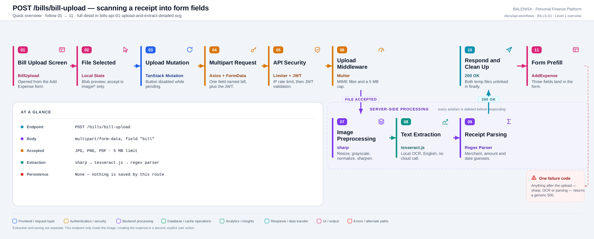
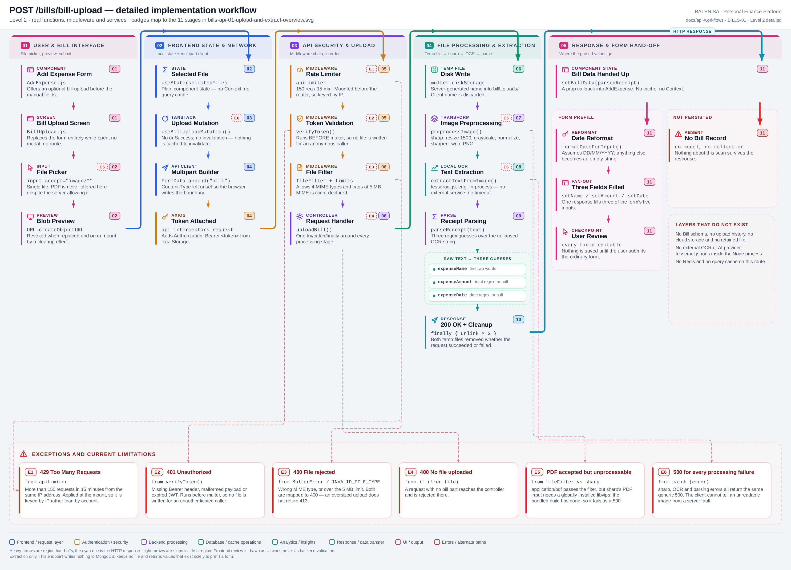

# BILLS-01 — Upload and extract a receipt

`POST /bills/bill-upload`

Every statement below is traced to the current repository implementation.

> **This endpoint stores nothing.** There is no Bill model, no bill collection and no
> retained file. It reads an image, guesses three values from it, deletes everything it
> created and returns the guesses. Creating an expense is a separate, explicit action —
> see [BILLS-FLOW-01](bills-flow-01-scan-to-expense.md).

## 1. Purpose

Turns a photographed receipt into three prefill values for the Add Expense form:
a merchant-ish name, a total amount and a date.

## 2. Endpoint and HTTP method

| | |
|---|---|
| **Method** | `POST` |
| **Path** | `/bills/bill-upload` |
| **Mount** | `app.use("/bills", apiLimiter, billRoutes)` — `backend/server.js` |
| **Middleware order** | `apiLimiter` → `verifyToken` → `handleBillUpload` (multer) → `uploadBill` |
| **Auth** | Required — Bearer JWT, checked **before** any file is written |
| **Rate limiting** | `apiLimiter`, 150 req / 15 min, applied at the mount |
| **Server cache** | None — no Redis on this route |

## 3. Level 1 quick workflow

<picture>
  <source srcset="bills-api-01-upload-and-extract-overview.svg" type="image/svg+xml">
  
</picture>

Vector: [`bills-api-01-upload-and-extract-overview.svg`](bills-api-01-upload-and-extract-overview.svg) ·
raster fallback: [`bills-api-01-upload-and-extract-overview.png`](bills-api-01-upload-and-extract-overview.png)

## 4. Level 2 detailed workflow

<picture>
  <source srcset="bills-api-01-upload-and-extract-detailed.svg" type="image/svg+xml">
  
</picture>

Vector: [`bills-api-01-upload-and-extract-detailed.svg`](bills-api-01-upload-and-extract-detailed.svg) ·
raster fallback: [`bills-api-01-upload-and-extract-detailed.png`](bills-api-01-upload-and-extract-detailed.png)

## 5. Request and multipart structure

```http
POST /bills/bill-upload HTTP/1.1
Authorization: Bearer <jwt>
Content-Type: multipart/form-data; boundary=----WebKitFormBoundary…

------WebKitFormBoundary…
Content-Disposition: form-data; name="bill"; filename="receipt.jpg"
Content-Type: image/jpeg
…binary…
```

| | |
|---|---|
| **Field name** | `bill` — `upload.single("bill")`. Any other field name yields `req.file === undefined` and a `400` |
| **Files accepted** | Exactly one. A second part under the same name is rejected by multer |
| **Other fields** | None are read |
| **Content-Type header** | Deliberately **not** set by `billApi.js`, so the browser generates the boundary |

## 6. File validation behaviour

| Check | Where | Value | On failure |
|---|---|---|---|
| MIME type | `fileFilter` | `image/jpg`, `image/jpeg`, `image/png`, `application/pdf` | `400 "Only JPG, PNG, and PDF files are allowed"` |
| Size | multer `limits` | 5 MB | `400` with the MulterError message — **not** `413` |
| Content sniffing | — | **Absent.** The MIME type is the one the client declared in the part header | — |
| Extension check | — | **Absent.** The extension is *written*, never read |
| Filename handling | `diskStorage.filename` | `${Date.now()}-${crypto.randomUUID()}${ext}` | Client filename is discarded entirely — no path traversal surface |
| Client-side | `BillUpload.js` | `accept="image/*"` only | The picker never offers a PDF |

## 7. Extraction and processing behaviour

Three stages, all in-process. **No external OCR, AI or ML service is called.**

1. **`preprocessImage`** — sharp: resize to width 1500 (no enlargement), grayscale,
   normalize, sharpen, write PNG into `backend/billProcessed/` (created with `mkdirSync`
   if absent).
2. **`extractTextFromImage`** — `Tesseract.recognize(path, "eng")`, then newlines and
   whitespace runs collapsed to single spaces. **`result.data.confidence` is discarded.**
3. **`parseReceipt`** — three regexes over the collapsed string:
   - `expenseName` = the **first two words** of the OCR text
   - `expenseAmount` = `/(grand total|total)[^\d]*([\d,.]+)/gi`, preferring a "grand"
     match, otherwise the **last** match; commas stripped, then `parseFloat`
   - `expenseDate` = the first `DD/MM/YYYY`-ish **or** `1st March 2026`-ish match, returned
     as the **raw matched string**

No currency symbol handling, no locale awareness, no schema validation, no timeout and no
retry anywhere in the chain.

## 8. Response structure

```jsonc
{
  "success": true,
  "message": "Bill uploaded and processed successfully",
  "parsedReceipt": {
    "expenseName": "FRESH MART",
    "expenseAmount": 118,
    "expenseDate": "05/03/2026",
    "extractedText": "FRESH MART GROCERY Item Bread 40 … Total 118.00 …"
  }
}
```

`expenseAmount` and `expenseDate` are `null` when nothing matched. `extractedText` returns
the **entire** OCR transcript of the receipt to the client.

## 9. Persistence behaviour

**None.** Confirmed by inspection: the controller imports only `fs/promises` and the three
bill services. No model is required, no collection is written, and no Redis key is touched.

| Question | Answer |
|---|---|
| Is the original file stored? | No — `fs.unlink` in `finally` |
| Is the preprocessed image stored? | No — also unlinked in `finally` |
| Is a Bill record created? | No — there is no Bill schema in `config/Schemas.js` |
| Are extracted values stored? | No — they are only returned |
| Is an expense created? | No — see BILLS-FLOW-01 |

## 10. Frontend consumption

`BillUpload.js` holds `selectedFile` and `preview` in plain component state. On submit,
`useBillUploadMutation` posts the file; `onSuccess` reformats the date, calls
`setBillData(parsedReceipt)` and closes the screen. The parent `AddExpense` copies three
values into its form fields via a `useEffect` on `billData`.

## 11. TanStack Query and cache behaviour

| Layer | Behaviour |
|---|---|
| Mutation | `useBillUploadMutation` — `mutationFn` only |
| `onSuccess` | **Not defined on the hook.** The component supplies its own callback |
| Invalidation | **None, correctly** — this route changes no server state, so there is nothing to invalidate |
| Query cache | The result never enters the query cache; it is passed by prop callback |
| Retry | Mutations default to `retry: 0`, so a failed upload is never re-sent |
| Cancellation | `uploadBill(file, signal)` accepts a signal, but the hook calls `uploadBill(file)` — **no signal is ever passed** |

## 12. Loading, review, success and error states

| State | Behaviour |
|---|---|
| Idle | Upload button enabled once a file is chosen; `handleUpload` returns early if none |
| Loading | Button shows "Uploading..." and is `disabled` — duplicate clicks are prevented |
| Success | Screen closes and the form appears prefilled. No success toast |
| Review | Every prefilled field remains editable; nothing auto-saves |
| Error | `401/429/409` are skipped (the axios interceptor handles them); anything else toasts "Failed to upload bill. Please try again." |
| Empty extraction | A `200` with `null` amount and date is treated as success — the form simply prefills blanks |

## 13. File and temporary-data lifecycle

```
browser File → FormData → multer diskStorage → backend/billUploads/<ts>-<uuid>.<ext>
                                             → sharp → backend/billProcessed/processed-<ts>.png
                                             → tesseract reads the processed file
finally: unlink(original), unlink(processed)   ← runs on success AND on failure
```

Both unlinks tolerate `ENOENT` and log anything else. `billProcessed/` is created on demand;
**`billUploads/` is not created by any code** and is listed in `backend/.gitignore`.

## 14. Security and operational behaviour

| Concern | Finding |
|---|---|
| Auth before file write | **Correct** — `verifyToken` precedes multer in the route chain |
| Rate limiting | Present but IP-keyed (see finding 4) |
| Filename handling | **Safe** — server-generated UUID name; client filename never used |
| Path traversal | Not reachable — the destination is a fixed `path.join` and the name is generated |
| Memory exhaustion | Low risk — disk storage, not memory storage, capped at 5 MB |
| Files left behind | Cleanup runs in `finally` on both paths |
| Public file access | No `express.static` serves `billUploads/` or `billProcessed/` |
| API keys to frontend | None — no external provider exists |
| Cross-user access | Not reachable — no file or record persists to be addressed |
| Stack traces in responses | No — errors are logged server-side, the body is generic |
| Prompt injection | Not applicable — no LLM is involved |

## 15. Files involved

| Layer | File | Function/Export | Purpose |
|---|---|---|---|
| Entry | `frontend/src/components/expensesHandling/AddExpense.js` | `AddExpense` | Offers the upload, owns `billData` |
| Screen | `frontend/src/components/billScanner/BillUpload.js` | `BillUpload`, `handleUpload`, `formatDateForInput` | Picker, preview, submit, date reshape |
| Mutation | `frontend/src/hooks/mutations/useBillUploadMutation.js` | `useBillUploadMutation` | No invalidation by design |
| API client | `frontend/src/api/billApi.js` | `uploadBill` | Builds the FormData |
| Interceptors | `frontend/src/api/axios.js` | `api` | Bearer token; 401/429/409 handling |
| Server mount | `backend/server.js` | `app.use("/bills", apiLimiter, billRoutes)` | Rate limiter ahead of the router |
| Route | `backend/Routes/bill.routes.js` | `handleBillUpload` | Maps multer errors to 400 |
| Auth | `backend/Middlewares/Auth.js` | `verifyToken` | Runs before multer |
| Upload | `backend/Middlewares/upload.js` | `upload` | diskStorage, fileFilter, 5 MB limit |
| Controller | `backend/Controllers/BillControllers/billController.js` | `uploadBill` | Orchestration and cleanup |
| Preprocess | `backend/Services/BillServices/imageProcessor.js` | `preprocessImage` | sharp pipeline |
| OCR | `backend/Services/BillServices/ocrService.js` | `extractTextFromImage` | tesseract.js, English |
| Parser | `backend/Services/BillServices/receiptParser.js` | `parseReceipt` | Three regex guesses |

## 16. Current implementation observations

**Summary:** Correctness 4 · Security / operational 3 · Reliability 3 · Maintainability 2

### Correctness

1. **A subtotal can be reported as the total — verified by execution.** The regex
   `/(grand total|total)…/gi` also matches the word "total" inside "Subtotal". When no
   "grand total" is present the **last** match wins, so a receipt printed as
   `Total 118.00 … Subtotal 100` returns **100**. The common ordering
   (`Subtotal 100 … Total 118.00`) happens to return 118, so this only bites on receipts
   that print the subtotal last.

2. **Malformed amounts parse silently — verified by execution.** The capture class is
   `[\d,.]+`, so OCR noise like `12.34.56` reaches `parseFloat` and yields **12.34** with
   no error. There is no sanity check on the result — no upper bound, no rejection of zero.

3. **The merchant name is the first two words of the transcript — verified by execution.**
   For a receipt whose OCR begins `*** WELCOME TO FRESH MART`, `expenseName` is
   `"*** WELCOME"`. There is no attempt to locate a merchant line.

4. **OCR confidence is discarded.** `ocrService` returns only `result.data.text`;
   `result.data.confidence` is never read, so a barely-legible scan and a perfect one are
   presented to the user identically.

### Security / operational

5. **The MIME type is trusted as declared.** `fileFilter` reads `file.mimetype`, which
   multer takes from the multipart part header — i.e. from the client. No magic-byte or
   content check is performed. A non-image sent with `Content-Type: image/png` passes the
   filter and is written to disk before sharp rejects it. Impact is bounded: the file is
   never executed, never served, and is unlinked in `finally`.

6. **PDF is accepted by the filter but cannot be processed.** `application/pdf` is in the
   allow-list, yet sharp's own API documentation states PDF input *"Requires the use of a
   globally-installed libvips compiled with support for PDFium, Poppler, ImageMagick or
   GraphicsMagick"*. This project uses the prebuilt `@img/sharp-*` binaries, which bundle
   their own libvips. A PDF therefore reaches `preprocessImage` and fails as a `500`. The
   UI never offers PDF (`accept="image/*"`), so this is only reachable by a direct caller.

7. **`apiLimiter` runs before `verifyToken`**, so `req.userId` is undefined at
   `keyGenerator` time and the limit falls back to IP. `trust proxy` is also unset. Both
   are module-wide patterns, not specific to Bills.

### Reliability

8. **No timeout on OCR.** `Tesseract.recognize` is awaited with no time bound and no
   `AbortSignal`. A pathological image holds a request — and a worker — for as long as it
   takes. There is no retry either, which is the safer half of the trade.

9. **`billUploads/` is never created by code.** `imageProcessor` creates `billProcessed/`
   with `mkdirSync`, but nothing creates the multer destination. The directory is listed in
   `backend/.gitignore`, so on a fresh clone the first upload fails at the storage engine
   until it is created manually.

10. **No cancellation on unmount.** `billApi.uploadBill` accepts a `signal`, but
    `useBillUploadMutation` calls it without one. Navigating away mid-upload leaves the
    request — and the server-side OCR — running to completion.

### Maintainability

11. **Every processing failure is one generic `500`.** sharp, Tesseract and the parser all
    land in the same `catch`. The client cannot distinguish "this image is unreadable" from
    "the server is broken", and the UI toasts the same message for both.

12. **`extractedText` returns the full receipt transcript** to the client on every call.
    Nothing consumes it — `AddExpense` reads only name, amount and date — so it is
    response weight and incidental data exposure with no current purpose.
