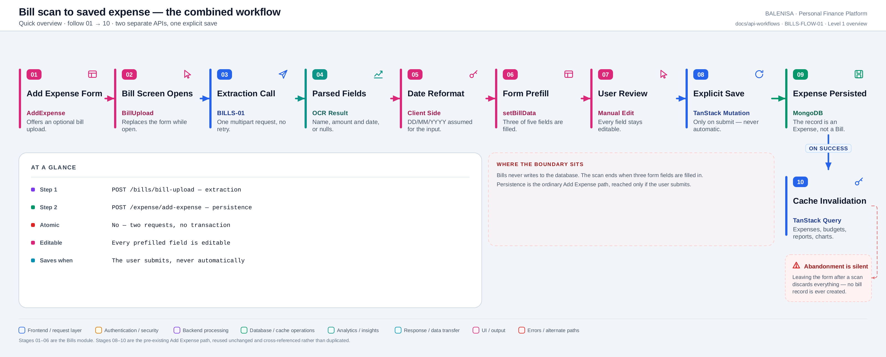
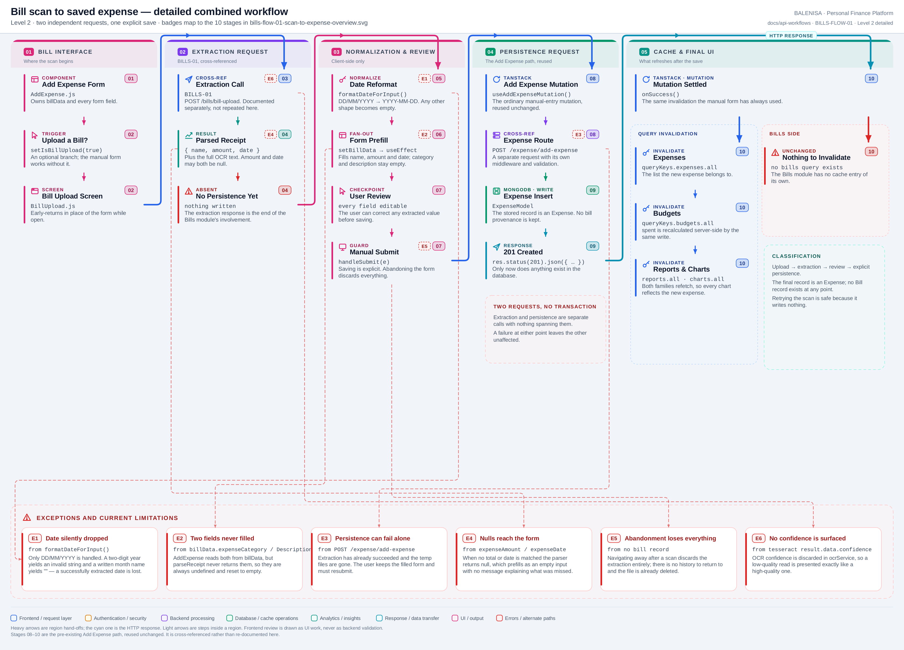

# BILLS-FLOW-01 — Bill scan to saved expense

A combined Bills → Expense workflow. **Two independent requests, no transaction, one
explicit user action in between.**

Every statement below is traced to the current repository implementation.

## 1. Purpose

Describes what happens between scanning a receipt and having an expense in the database —
the part no single endpoint owns.

## 2. Classification

Using the classification list: **type 2 + type 4 + type 8** —
*upload → extraction → frontend review → explicit persistence*, spanning the Bills and
Expense modules.

| Question | Answer |
|---|---|
| Is the original bill file stored? | **No** — deleted in `finally` before the response |
| Are only extracted values stored? | Not even those — they live in component state until the user saves |
| Does a dedicated Bill record exist? | **No** — there is no Bill schema |
| Is the final record an Expense? | **Yes**, with no bill provenance attached |
| Can users correct extracted fields? | **Yes** — every field stays editable |
| Is saving automatic or explicit? | **Explicit** — only on form submit |
| Are extraction and persistence atomic? | **No** — two separate HTTP requests |
| Is retrying the upload safe? | **Yes** — extraction writes nothing |

## 3. Level 1 quick workflow

<picture>
  <source srcset="bills-flow-01-scan-to-expense-overview.svg" type="image/svg+xml">
  
</picture>

Vector: [`bills-flow-01-scan-to-expense-overview.svg`](bills-flow-01-scan-to-expense-overview.svg) ·
raster fallback: [`bills-flow-01-scan-to-expense-overview.png`](bills-flow-01-scan-to-expense-overview.png)

## 4. Level 2 detailed workflow

<picture>
  <source srcset="bills-flow-01-scan-to-expense-detailed.svg" type="image/svg+xml">
  
</picture>

Vector: [`bills-flow-01-scan-to-expense-detailed.svg`](bills-flow-01-scan-to-expense-detailed.svg) ·
raster fallback: [`bills-flow-01-scan-to-expense-detailed.png`](bills-flow-01-scan-to-expense-detailed.png)

## 5. Trigger and input state

Triggered from `AddExpense.js` by "Do you want to upload a bill?", which sets
`isBillUpload` and early-returns `<BillUpload/>` in place of the form. Input state is a
single `File` in `BillUpload`'s local state.

## 6. Upstream and downstream API dependencies

| Step | API | Documented in |
|---|---|---|
| Extraction | `POST /bills/bill-upload` | [BILLS-01](bills-api-01-upload-and-extract.md) |
| Persistence | `POST /expense/add-expense` | [API-05](../expense/api-05-create-expense.md) — see the note below |

**On `POST /expense/add-expense`:** it is an expense-mutation endpoint, and Bills is **not**
its primary consumer — `AddExpense.js` is, and it serves all manual expense creation whether
or not a bill was scanned. It is therefore cross-referenced here rather than adopted under a
Bills API ID. It is now documented in the expense set as
[API-05 — create an expense](../expense/api-05-create-expense.md), whose consumption map
lists the bill-prefilled path as one of its three callers.

## 7. Data transformations

| Stage | Input | Output | Where |
|---|---|---|---|
| Extraction | image file | `{ expenseName, expenseAmount, expenseDate, extractedText }` | backend, BILLS-01 |
| Date reshape | `"05/03/2026"` | `"2026-03-05"` | `formatDateForInput` in `BillUpload` |
| Prefill | `parsedReceipt` | three form fields | `useEffect` on `billData` in `AddExpense` |
| Sanitise | user-edited fields | trimmed name, normalised category | `handleSubmit` in `AddExpense` |

**Fan-out:** one extraction response fills three of the form's five inputs.
**Fan-in:** none — nothing merges two responses.

## 8. Review and edit behaviour

The form is the review surface. All five fields are ordinary controlled inputs, so the
user can correct any extracted value, fill the two the parser never provides, or clear
everything. A programmatic-name guard (`programmaticNameRef`) suppresses the ML category
prediction for the bill-supplied name until the user actually types.

## 9. Persistence boundary

Persistence begins only at form submit. Everything before it is browser state — the temp
files are already gone and no record exists anywhere. Abandoning the page discards the
scan entirely.

## 10. Failure and recovery behaviour

| Failure | Effect | Recovery |
|---|---|---|
| Extraction fails | Toast; the bill screen stays open | Re-pick and re-upload; nothing was written |
| Extraction returns nulls | Treated as success; blanks prefill | Type the values manually |
| Persistence fails | Toast; the filled form is retained | Resubmit — the extraction is not repeated |
| User navigates away | Everything is lost | Re-scan from the beginning |
| Double submit | Prevented by the button's pending state | — |

There is no partial-success case in which a bill exists without an expense, because a bill
never exists at all.

## 11. Cache behaviour after saving

`useAddExpenseMutation.onSuccess` invalidates `expenses.all`, `budgets.all`, `reports.all`
and `charts.all` — the same set as manual entry. A bill-created expense therefore refreshes
the expense list, the budget bar, the report and every chart. Nothing bills-specific is
invalidated because Bills owns no cache entry.

## 12. Files involved

| Layer | File | Function/Export | Purpose |
|---|---|---|---|
| Host form | `frontend/src/components/expensesHandling/AddExpense.js` | `AddExpense`, `handleSubmit` | Owns `billData`, prefill effect, submit |
| Scan screen | `frontend/src/components/billScanner/BillUpload.js` | `BillUpload`, `formatDateForInput` | Extraction call and date reshape |
| Extraction | *(see [BILLS-01](bills-api-01-upload-and-extract.md))* | `uploadBill` | Returns parsed values |
| Persistence | `frontend/src/hooks/mutations/useAddExpenseMutation.js` | `useAddExpenseMutation` | Invalidates four query families |
| Persistence | `frontend/src/api/expenseApi.js` | `addExpense` | `POST /expense/add-expense` |
| Model | `backend/config/Schemas.js` | `ExpenseModel` | The record that is finally written |

## 13. Current implementation observations

**Summary:** Correctness 3 · Security / operational 0 · Reliability 2 · Maintainability 2

### Correctness

1. **Successfully extracted dates are silently dropped — verified by execution.**
   `formatDateForInput` handles only strings containing `/`, and assumes **DD/MM/YYYY**.
   The parser's date regex also matches `5th March 2026`, for which the formatter returns
   `""` — the extraction worked and the value is thrown away. A two-digit year such as
   `3/5/26` becomes `"26-5-3"`, which `<input type="date">` rejects, leaving the field
   blank.

2. **DD/MM versus MM/DD is assumed, not detected.** `05/03/2026` is read as 5 March. A
   receipt printed in US format silently yields the wrong date, and nothing surfaces the
   ambiguity to the user.

3. **The form reads two fields the parser never sends.** `AddExpense` copies
   `billData.expenseCategory` and `billData.expenseDescription`, but `parseReceipt` returns
   neither, so both are `undefined` and reset to `''`. Harmless today, but the two sides
   disagree about the payload shape.

### Reliability

4. **Extraction and persistence are independent requests.** A persistence failure after a
   successful extraction leaves the user with a filled form and no record; the temp files
   are already deleted, so the scan cannot be repeated from the server side. Resubmitting
   the form is the only path.

5. **Nothing records that an expense came from a bill.** No flag, no reference, no stored
   transcript. A duplicate scan-and-save produces two indistinguishable expenses, and there
   is no way to detect that afterwards.

### Maintainability

6. **The date reshape lives in the upload component**, not next to the parser that produced
   the format. The two are coupled across the network boundary with no shared contract.

7. **`extractedText` is returned but never used.** `AddExpense` reads three fields; the
   full transcript is discarded on arrival.
