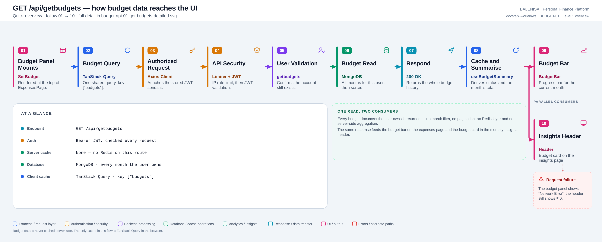
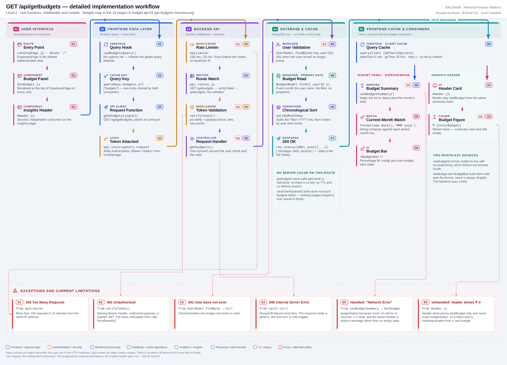

# BUDGET-01 — Budget history read

`GET /api/getbudgets`

Two levels of the same workflow. Every statement below is traced to the current
repository implementation.

> **Absences worth stating.** This route has **no Redis layer** — no `getCache`, no
> `setCache`, no key, no TTL. It also has **no request validation middleware** and takes
> **no parameters**. Those are drawn as explicit absences on the diagrams rather than
> omitted.

---

## 1. Purpose

Returns every budget document the authenticated user owns, ordered oldest to newest. One
request feeds two independent parts of the UI: the budget progress bar on the expenses
page, and the budget figure in the monthly-insights header.

## 2. Route and method

| | |
|---|---|
| **Method** | `GET` |
| **Path** | `/api/getbudgets` |
| **Mount** | `app.use("/api", apiLimiter, apiRouter)` — `backend/server.js` |
| **Middleware** | `apiLimiter` → `verifyToken` → `getbudgets` |
| **Auth** | Required — Bearer JWT |
| **Request** | No path params, no query params, no body |
| **Server cache** | None |

## 3. Level 1 — Quick workflow overview

<picture>
  <source srcset="budget-api-01-get-budgets-overview.svg" type="image/svg+xml">
  
</picture>

Vector source: [`budget-api-01-get-budgets-overview.svg`](budget-api-01-get-budgets-overview.svg) ·
raster preview / fallback: [`budget-api-01-get-budgets-overview.png`](budget-api-01-get-budgets-overview.png)

## 4. Level 2 — Detailed implementation workflow

<picture>
  <source srcset="budget-api-01-get-budgets-detailed.svg" type="image/svg+xml">
  
</picture>

Vector source: [`budget-api-01-get-budgets-detailed.svg`](budget-api-01-get-budgets-detailed.svg) ·
raster preview / fallback: [`budget-api-01-get-budgets-detailed.png`](budget-api-01-get-budgets-detailed.png)

> Zoomable engineering reference. Use the Level 1 overview for the shape of the flow.

## 5. Execution sequence

1. `SetBudget` mounts inside `ExpensesPage`; `Header` mounts inside `MonthlyInsightPage`.
   Both call `useBudgetSummary`, which wraps a single `useBudgetsQuery`.
2. TanStack Query resolves key `["budgets"]`. The hook sets no options, so it inherits
   the global defaults (staleTime 5 min, gcTime 30 min, retry 1, no refetch on focus).
3. `getBudgets(signal)` issues `GET /api/getbudgets`; the axios request interceptor
   attaches `Authorization: Bearer <token>` from `localStorage`.
4. `apiLimiter` runs, then the router matches, then `verifyToken` sets `req.userId`.
   There is no validation middleware on this route.
5. `getbudgets` calls `UserModel.findById(req.userId)` — `401` if the account is gone.
6. `BudgetModel.find({ userId: user._id }).lean()` returns **every** budget document for
   the user. No month filter, no projection, no pagination.
7. `sortByMonthKey` splits each `"Mon YYYY"` string, compares the year numerically and
   the month by its index in `MONTH_ORDER`.
8. `200` with the full history.
9. The response lands in the TanStack cache; `useBudgetSummary` derives `monthlyBudgets`,
   `budgetStatus` and `totalBudget` from it.
10. Two consumers read that derivation independently — `BudgetBar` and `Header`.

## 6. Cache behaviour

**Server:** none. Nothing budget-shaped is written to or read from Redis on this route,
and `clearUserExpenseCache` (which drains `cachekeys:<userId>`) never touches budgets.

**Client:** one TanStack entry under `["budgets"]`, shared by both consumers, so the two
mount points cause a single network request. It is invalidated by
`useCreateBudgetMutation`, `useUpdateBudgetMutation`, and by every expense mutation
(`useAddExpenseMutation`, `useUpdateExpenseMutation`, `useDeleteExpenseMutation`), each of
which calls `invalidateQueries({ queryKey: queryKeys.budgets.all })`.

## 7. Database operations

One read: `BudgetModel.find({ userId })`, served by the `{ userId: 1, month: 1 }` unique
index as a prefix scan. Sorting happens in Node, not in MongoDB.

## 8. Success response

```jsonc
{
  "message": "Success",
  "data": [
    { "_id": "...", "userId": "...", "month": "Jun 2026", "budget": 40000, "spent": 31250, "__v": 0 },
    { "_id": "...", "userId": "...", "month": "Jul 2026", "budget": 45000, "spent": 12400, "__v": 0 }
  ],
  "success": true
}
```

`.lean()` is called without a projection, so `_id`, `userId` and `__v` are returned
alongside the three fields the UI actually uses. The sibling helper `fetchBudgets`
(used by the analytics module) *does* project down to `{ month, budget, spent }`.

## 9. Error behaviour

| Tag | Condition | Where | Result |
|---|---|---|---|
| E1 | > 150 req / 15 min | `apiLimiter` | `429` |
| E2 | Missing/malformed/expired JWT | `verifyToken` | `401` — interceptor calls `forceReauth()` |
| E3 | User record missing | `UserModel.findById → null` | `401 "User does not exist"` |
| E4 | MongoDB read failure | controller `catch` | `500 "Internal Server Error"` |
| E5 | Any of the above, client side | `useBudgetSummary` → `SetBudget` | **Handled** — panel renders "Network Error" |
| E6 | Any of the above, client side | `Header` | **Unhandled** — renders `₹ 0` |
| — | No budgets yet | — | `200` with `data: []`; `SetBudget` shows the "Set Your Monthly Budget!" prompt |

`useBudgetSummary` sets `budgetStatus` to `"error"` on either `isError` **or**
`data.success === false`, so a `200`-with-`success:false` body is treated as a failure
too. This is a genuine improvement over the Expense module, which has no error branch at
all — but only `SetBudget` consumes it.

## 10. Cross-module effects

- **Expenses → Budget.** `spent` is not computed on read. It is a stored field, refreshed
  by `recalculateBudget` whenever an expense is added, edited, deleted, or created by the
  recurring cron. `recalculateBudget` runs **without** `upsert`, so an expense in a month
  that has no budget document changes nothing.
- **Analytics.** `analytics/dataProvider.js → getAllBudgets` calls the sibling helper
  `fetchBudgets`, not this endpoint. The report pipeline therefore reads budgets directly
  from MongoDB and never goes through `/api/getbudgets`.
- **Charts.** `chart.service.js → getBudgetComparison` also queries `BudgetModel`
  directly, for both the yearly and single-month pie modes.
- **This endpoint is not consumed by anything else.** Only `useBudgetsQuery` calls it.

## 11. File map

| Layer | File | Function / export | Purpose |
|---|---|---|---|
| Route mount | `frontend/src/components/landingPage/LandingPage.js` | `<Route path="/">` | Renders `ExpensesPage`, which renders `SetBudget` |
| Consumer A | `frontend/src/components/expensesHandling/budget/SetBudget.js` | `SetBudget` | Prompt, form, and the loading/error states |
| Consumer A | `frontend/src/components/expensesHandling/budget/BudgetBar.js` | `BudgetBar` | Progress bar, tooltip, over-budget alert |
| Consumer B | `frontend/src/components/monthlyInsights/Header.js` | `Header` | Budget figure on the insights page |
| Derivation | `frontend/src/hooks/queries/useBudgetSummary.js` | `useBudgetSummary` | `monthlyBudgets`, `budgetStatus`, `totalBudget` |
| Query hook | `frontend/src/hooks/queries/useBudgetsQuery.js` | `useBudgetsQuery` | Single shared query |
| Cache key | `frontend/src/query/queryKeys.js` | `queryKeys.budgets.all` | `["budgets"]` |
| API client | `frontend/src/api/budgetApi.js` | `getBudgets` | `GET /api/getbudgets` |
| Interceptors | `frontend/src/api/axios.js` | `api` | Bearer token; 401/429/409 handling |
| Server mount | `backend/server.js` | `app.use("/api", apiLimiter, apiRouter)` | Rate limiter ahead of the router |
| Route | `backend/Routes/api.routes.js` | `router.get('/getbudgets', …)` | `verifyToken` → `getbudgets` |
| Auth | `backend/Middlewares/Auth.js` | `verifyToken` | Verifies JWT, sets `req.userId` |
| Controller | `backend/Controllers/BudgetControllers/getbudgets.js` | `getbudgets`, `sortByMonthKey` | User check, read, chronological sort |
| Constants | `backend/Services/ChartServices/chartConstants.js` | `MONTH_ORDER` | English 3-letter month names |
| Model | `backend/config/Schemas.js` | `BudgetModel` | `{userId, month, budget, spent}` + unique `{userId, month}` |
| Sibling helper | `backend/Controllers/BudgetControllers/fetchBudgets.js` | `fetchBudgets` | Same read, but projected — used by analytics only |

---

## 12. Findings

**Summary:** Correctness 3 · Security / operational 2 · Reliability 1 · Maintainability 3

### Correctness

1. **Three different sources build the same month key.** The backend uses
   `Date.prototype.toLocaleString('default', …)` (Node's locale), `useBudgetSummary` uses
   `toLocaleString("default", …)` (the *browser's* locale), and `SetBudget`/`BudgetBar`
   use date-fns `format(new Date(), 'MMM yyyy')` (always English). On an English browser
   and an English server all three agree. On a French browser, `useBudgetSummary` produces
   `"juil. 2026"` and finds no match, so `Header` shows `₹ 0`, while `SetBudget` — using
   date-fns — still finds the budget and renders the bar correctly. **Consequence:** the
   same page can simultaneously show a budget bar and a zero budget.

2. **`sortByMonthKey` silently mis-sorts unknown month names.** It resolves the month via
   `MONTH_ORDER.indexOf(aMonth)`, which returns `-1` for anything not in the English
   list. If a document was ever written by a non-English-locale server, it sorts before
   January of the same year rather than raising. **Consequence:** a wrong ordering rather
   than a visible failure.

3. **`Math.min` is called with a single argument.** In `BudgetBar`,
   `Math.round(Math.min((monthlyTotal / budgetAmount) * 100))` — `Math.min(x)` returns
   `x`, so the intended clamp at 100 never happens. **Consequence:** limited. The
   `.progress-container` rule sets `overflow: hidden`, so a >100 % width is clipped, and
   the `percentage <= 100` checks that drive the alert icon still work. The clamp is dead
   code rather than a visible defect.

### Security / operational

4. **`apiLimiter` runs before `verifyToken`.** Mounted as
   `app.use("/api", apiLimiter, apiRouter)`, so `req.userId` is `undefined` when
   `keyGenerator` runs and it always falls through to `ipKeyGenerator(req.ip)`.
   **Consequence:** the limit is per IP, not per user — shared-NAT users compete for one
   150-request budget.

5. **`trust proxy` is not set in `backend/server.js`.** **Consequence:** behind a reverse
   proxy every request appears to come from the proxy, so all users share a single bucket.

### Reliability

6. **No pagination and no projection.** The endpoint returns every budget document the
   user has ever had, including `_id`, `userId` and `__v`. **Consequence:** small today —
   growth is 12 documents a year — but the payload grows without bound and the response
   carries fields no consumer reads. The sibling `fetchBudgets` already projects; this
   controller does not.

### Maintainability

7. **`sortByMonthKey` is duplicated verbatim.** The identical function exists in both
   `getbudgets.js` and `fetchBudgets.js`. **Consequence:** a fix to one will not reach the
   other.

8. **Two near-identical read paths.** `getbudgets` (HTTP) and `fetchBudgets` (analytics)
   perform the same query with different projections and different callers.
   **Consequence:** a schema change must be applied in two places.

9. **`Header` initialises its input from an async value.**
   `useState(totalBudget || "")` captures `totalBudget` on first render, when the query
   has not resolved and the value is `0`. **Consequence:** the edit modal's "New Budget"
   field always opens empty rather than pre-filled with the current budget, even after the
   query settles. See [BUDGET-03](budget-api-03-update-budget.md) for the write path.
