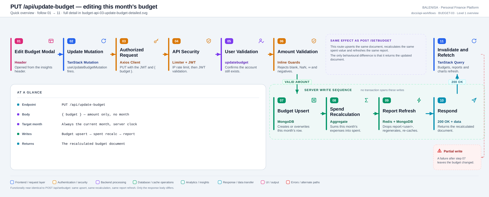
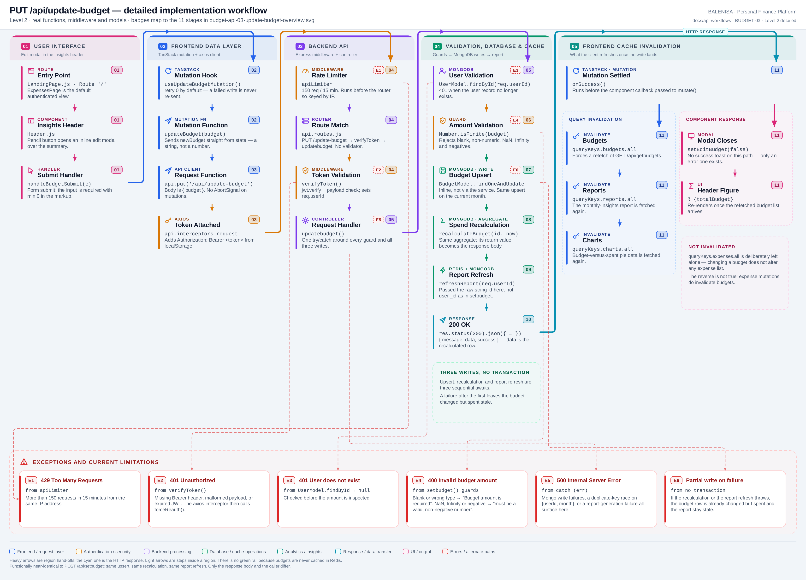

# BUDGET-03 — Update this month's budget

`PUT /api/update-budget`

Two levels of the same workflow. Every statement below is traced to the current
repository implementation.

> **Not an update-only route.** Like [BUDGET-02](budget-api-02-set-budget.md), this endpoint
> upserts — it will happily create the current month's document if none exists. The two
> routes are separate controllers with near-identical behaviour; the differences are
> tabulated in §5.

---

## 1. Purpose

Changes the budget amount for **the current month** from the monthly-insights header,
recalculates `spent`, refreshes the cached financial report, and returns the updated
budget document.

## 2. Route and method

| | |
|---|---|
| **Method** | `PUT` |
| **Path** | `/api/update-budget` |
| **Mount** | `app.use("/api", apiLimiter, apiRouter)` — `backend/server.js` |
| **Middleware** | `apiLimiter` → `verifyToken` → `updatebudget` |
| **Auth** | Required — Bearer JWT |
| **Body** | `{ "budget": <number \| numeric string> }` |
| **Target month** | Always the current month, from the **server** clock |
| **Server cache** | No budget cache; the report cache is invalidated and repopulated |

## 3. Level 1 — Quick workflow overview

<picture>
  <source srcset="budget-api-03-update-budget-overview.svg" type="image/svg+xml">
  
</picture>

Vector source: [`budget-api-03-update-budget-overview.svg`](budget-api-03-update-budget-overview.svg) ·
raster preview / fallback: [`budget-api-03-update-budget-overview.png`](budget-api-03-update-budget-overview.png)

## 4. Level 2 — Detailed implementation workflow

<picture>
  <source srcset="budget-api-03-update-budget-detailed.svg" type="image/svg+xml">
  
</picture>

Vector source: [`budget-api-03-update-budget-detailed.svg`](budget-api-03-update-budget-detailed.svg) ·
raster preview / fallback: [`budget-api-03-update-budget-detailed.png`](budget-api-03-update-budget-detailed.png)

> Zoomable engineering reference. Use the Level 1 overview for the shape of the flow.

## 5. What actually differs from BUDGET-02

These are separate controllers, so they are documented separately rather than merged. The
behavioural surface is almost identical; every real difference is listed here.

| | `POST /api/setbudget` | `PUT /api/update-budget` |
|---|---|---|
| Controller | `setbudget.js` | `updatebudget.js` |
| Initiator | `SetBudget.js` on the expenses page | `Header.js` edit modal on the insights page |
| Mutation hook | `useCreateBudgetMutation` | `useUpdateBudgetMutation` |
| Upsert | delegated to `setBudgetForCurrentMonth` | inlined `BudgetModel.findOneAndUpdate` |
| Update operator | `{ $set: { budget } }` | `{ budget: budgetAmount }` (implicit `$set`) |
| Extra options | — | `new: true` (the returned doc is discarded) |
| `spent` recalculation | inside the service | called directly by the controller |
| Report refresh arg | `refreshReport(user._id)` — ObjectId | `refreshReport(req.userId)` — raw string |
| Response | `{ message, success }` | `{ message, data, success }` — `data` is the recalculated document |
| Client feedback | success toast | modal closes; **no success toast** |

Everything else — middleware order, guards, guard messages, the aggregate, the unique
index, the invalidation set — is the same.

## 6. Frontend initiator and consumer

**Initiator.** `Header.js` on `MonthlyInsightPage`. A pencil button opens an inline modal
containing a `type="number"` input with `min="0"` and `required`. `handleBudgetSubmit`
sends `newBudget` **straight from component state** — a string, because the input's
`onChange` stores `e.target.value` without coercion. The backend accepts numeric strings,
so this works.

**Consumer.** The returned `data` is not read anywhere. `onSuccess` clears the input and
closes the modal; the visible figure updates through the invalidate-and-refetch cycle on
`GET /api/getbudgets`.

## 7. Execution sequence

1. `apiLimiter` → `verifyToken` → `updatebudget`. No validation middleware.
2. `UserModel.findById(req.userId)` — `401` if the account is gone.
3. The same two amount guards as BUDGET-02, with identical messages.
4. `currentMonthYear = now.toLocaleString("default", { month: "short", year: "numeric" })`.
5. `BudgetModel.findOneAndUpdate({ userId, month: currentMonthYear }, { budget: budgetAmount }, { new: true, upsert: true, runValidators: true })`.
6. `recalculateBudget(user._id, now)` — aggregates `ExpenseModel` over the month range and
   `$set`s `spent`, returning the updated document.
7. `refreshReport(req.userId)`.
8. `200 { message: 'Success', data: updatedBudget, success: true }`.

## 8. Cache behaviour

Identical to [BUDGET-02 §7](budget-api-02-set-budget.md#7-cache-behaviour): no budget cache in
Redis; `report:<userId>` invalidated and repopulated with a 1 h TTL; TanStack invalidation
of `budgets.all`, `reports.all` and `charts.all`, with `expenses.all` deliberately left
alone.

## 9. Database operations

Three, in sequence and not in a transaction — the same shape as BUDGET-02, with the
upsert inlined in the controller instead of the service.

## 10. Success response

```jsonc
{
  "message": "Success",
  "data": { "_id": "...", "userId": "...", "month": "Jul 2026", "budget": 45000, "spent": 12400, "__v": 0 },
  "success": true
}
```

## 11. Error behaviour

| Tag | Condition | Where | Result |
|---|---|---|---|
| E1 | > 150 req / 15 min | `apiLimiter` | `429` |
| E2 | Missing/malformed/expired JWT | `verifyToken` | `401` |
| E3 | User record missing | `UserModel.findById → null` | `401 "User does not exist"` |
| E4 | Blank or wrong type | first guard | `400 "Budget amount is required"` |
| E4 | `NaN`, `Infinity`, negative | second guard | `400 "…must be a valid, non-negative number"` |
| E5 | Any write or report failure | controller `catch` | `500 "Internal Server Error"` |
| E6 | Failure **after** step 5 | no transaction | `500`, budget already changed |

`Header.handleBudgetSubmit` toasts `"Failed to update budget."` on both a
`success: false` body and a network error, skipping `401`/`429`/`409` because the axios
interceptor handles those.

## 12. Cross-module effects

Same as BUDGET-02: reports regenerate synchronously; chart and analytics consumers read
`BudgetModel` directly and pick the change up on their next fetch; expenses are unaffected
in this direction.

## 13. File map

| Layer | File | Function / export | Purpose |
|---|---|---|---|
| Initiator | `frontend/src/components/monthlyInsights/Header.js` | `Header`, `handleBudgetSubmit` | Edit modal, submit, error toast |
| Page | `frontend/src/components/monthlyInsights/MonthlyInsightPage.js` | `<Header summary={…}/>` | Mounts the header |
| Derivation | `frontend/src/hooks/queries/useBudgetSummary.js` | `useBudgetSummary` | Supplies `totalBudget` to the header |
| Mutation | `frontend/src/hooks/mutations/useUpdateBudgetMutation.js` | `useUpdateBudgetMutation` | Invalidates budgets, reports, charts |
| API client | `frontend/src/api/budgetApi.js` | `updateBudget` | `PUT /api/update-budget` with `{ budget }` |
| Route | `backend/Routes/api.routes.js` | `router.put('/update-budget', …)` | `verifyToken` → `updatebudget` |
| Controller | `backend/Controllers/BudgetControllers/updatebudget.js` | `updatebudget` | User check, guards, inline upsert, recalc, report |
| Service | `backend/Services/BudgetServices/budget.service.js` | `recalculateBudget` | Aggregate then `$set spent` |
| Report | `backend/Services/reportService.js` | `refreshReport` | Redis invalidate → regenerate → Redis set |
| Models | `backend/config/Schemas.js` | `BudgetModel`, `ExpenseModel` | Unique `{userId, month}` |

---

## 14. Findings

**Summary:** Correctness 2 · Security / operational 2 · Reliability 2 · Maintainability 3

Findings shared with BUDGET-02 — locale-dependent month key, the `spent`-less upsert
window, IP-keyed rate limiting, unset `trust proxy`, no route validator, three writes
without a transaction, and synchronous report regeneration — apply here unchanged and are
not restated in full. See
[BUDGET-02 §13](budget-api-02-set-budget.md#13-findings).

### Correctness

1. **The edit modal never pre-fills.** `Header` does
   `const [newBudget, setNewBudget] = useState(totalBudget || "")`. `useState` reads its
   initial value once, on first render — at which point `useBudgetsQuery` has not
   resolved, so `totalBudget` is `0` and the state initialises to `""`. There is no
   `useEffect` syncing it afterwards. **Consequence:** opening the modal always shows an
   empty field rather than the current budget, so a user editing "45000 → 46000" must
   retype the whole number. Because the input is `required`, submitting the untouched
   form is blocked rather than sending an empty value — so this is a usability defect, not
   a data-loss one.

2. **`new: true` on the upsert is redundant.** The returned document is discarded; the
   response body comes from the subsequent `recalculateBudget` call instead.
   **Consequence:** none functionally — but it reads as though the upsert result matters.

### Security / operational

3. **`apiLimiter` runs before `verifyToken`** → IP-keyed, not user-keyed.
4. **`trust proxy` is not set** → shared bucket behind a proxy.

### Reliability

5. **Three writes with no transaction**, identical to BUDGET-02: a failure after step 5
   returns `500` with the budget already committed.

6. **`refreshReport(req.userId)` is passed a string where the sibling passes an
   ObjectId.** Mongoose casts the string for the `FinancialReport.user` path, and
   `reportCache` interpolates it into `report:${userId}` — which stringifies an ObjectId
   to the same hex, so the key matches either way. **Consequence:** none observed today.
   It is an inconsistency between two routes that must agree, and it would matter if the
   id were ever used somewhere that does not cast — for example an aggregation `$match`,
   which is exactly how `recalculateBudget` uses it (correctly, via `user._id`).

### Maintainability

7. **Two controllers implement one behaviour.** See
   [BUDGET-02 finding 8](budget-api-02-set-budget.md#13-findings). The `PUT`/`POST` split
   carries no behavioural meaning.

8. **The upsert is written twice with different operator styles** — `{ $set: { budget } }`
   in the service, `{ budget: budgetAmount }` here. Equivalent in Mongoose, but a reader
   must confirm that.

9. **No success feedback on this path.** BUDGET-02 toasts on success; this route only
   toasts on failure. **Consequence:** a successful update is signalled solely by the
   modal closing and the figure changing after the refetch.
