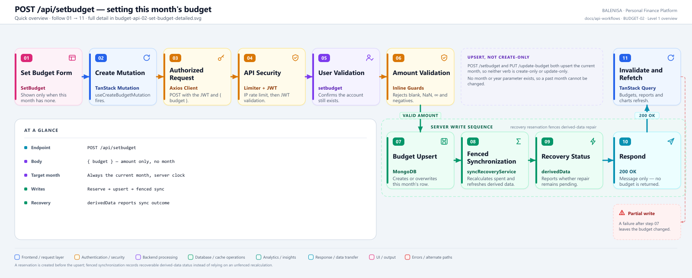
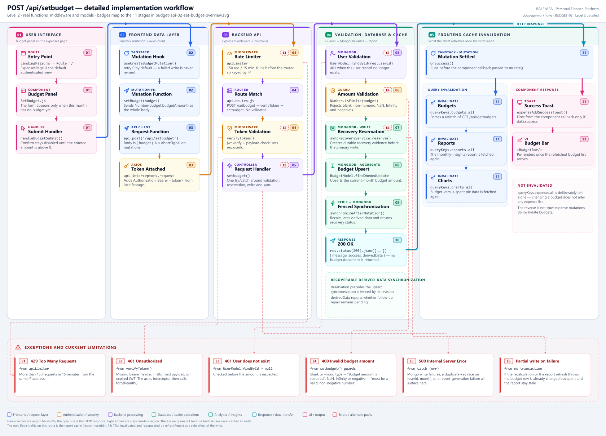

# BUDGET-02 — Set this month's budget

`POST /api/setbudget`

Two levels of the same workflow. Every statement below is traced to the current
repository implementation.

> **Not a create-only route.** Despite the `POST` verb, this endpoint upserts. It writes
> the current month's document whether or not one already exists, which makes it
> behaviourally near-identical to [BUDGET-03](../update-budget/budget-api-03-update-budget.md).

---

## 1. Purpose

Sets the budget amount for **the current month**, then brings the derived data back into
line: `spent` is recalculated from live expenses and the cached financial report is
regenerated.

## 2. Route and method

| | |
|---|---|
| **Method** | `POST` |
| **Path** | `/api/setbudget` |
| **Mount** | `app.use("/api", apiLimiter, apiRouter)` — `backend/server.js` |
| **Middleware** | `apiLimiter` → `verifyToken` → `setbudget` |
| **Auth** | Required — Bearer JWT |
| **Body** | `{ "budget": <number \| numeric string> }` |
| **Target month** | Always the current month, from the **server** clock |
| **Server cache** | No budget cache; the report cache is invalidated and repopulated |

There is **no month or year parameter**. A past or future month cannot be written through
this API.

## 3. Level 1 — Quick workflow overview

<picture>
  <source srcset="budget-api-02-set-budget-overview.svg" type="image/svg+xml">
  
</picture>

Vector source: [`budget-api-02-set-budget-overview.svg`](budget-api-02-set-budget-overview.svg) ·
raster preview / fallback: [`budget-api-02-set-budget-overview.png`](budget-api-02-set-budget-overview.png)

## 4. Level 2 — Detailed implementation workflow

<picture>
  <source srcset="budget-api-02-set-budget-detailed.svg" type="image/svg+xml">
  
</picture>

Vector source: [`budget-api-02-set-budget-detailed.svg`](budget-api-02-set-budget-detailed.svg) ·
raster preview / fallback: [`budget-api-02-set-budget-detailed.png`](budget-api-02-set-budget-detailed.png)

> Zoomable engineering reference. Use the Level 1 overview for the shape of the flow.

## 5. Frontend initiator and consumer

**Initiator.** `SetBudget.js`. The form is rendered only when `isCurrentMonthSet()`
returns false — i.e. no document matches `format(new Date(), 'MMM yyyy')`. The Confirm
button is disabled until the entered amount is greater than 0, and
`handleBudgetSubmit` sends `Number(budget.budgetAmount)`.

**Consumer.** Nothing consumes a returned budget — the response carries no `data`. The UI
updates purely through invalidation: `useCreateBudgetMutation.onSuccess` invalidates
budgets, reports and charts, and the refetched `GET /api/getbudgets` drives `BudgetBar`.

## 6. Execution sequence

1. `apiLimiter` → `verifyToken` → `setbudget`. No validation middleware on the route.
2. `UserModel.findById(req.userId)` — `401` if the account is gone.
3. Amount guards, in order: reject `undefined`, `null`, `""`, and any type that is
   neither `number` nor `string`; then `Number(budget)` and reject anything that is not
   finite or is negative. `0` is explicitly allowed.
4. `setBudgetForCurrentMonth(user._id, budgetAmount)`:
   `BudgetModel.findOneAndUpdate({ userId, month }, { $set: { budget } }, { upsert: true, runValidators: true })`
   where `month` comes from `getMonthRange(new Date()).monthStart.toLocaleString(…)`.
5. Immediately after, the same service calls `recalculateBudget(userId, new Date())`,
   which aggregates `ExpenseModel` over `{ $gte: monthStart, $lt: monthEnd }` and
   `$set`s the result on `spent`.
6. `refreshReport(user._id)` — deletes `report:<userId>` from Redis, regenerates the
   report, upserts it into `FinancialReport`, and writes it back to Redis with a 1 h TTL.
7. `200 { message: 'Budget set successfully', success: true }`.

## 7. Cache behaviour

| Cache | Behaviour on this route |
|---|---|
| Redis — budgets | **Does not exist.** No budget key is ever written or read. |
| Redis — report (`report:<userId>`, TTL 3600 s) | Invalidated by `refreshReport`, then repopulated with the regenerated report. |
| Redis — expense keys (`cachekeys:<userId>`) | **Untouched.** `clearUserExpenseCache` is not called, which is correct: budget changes do not alter expense lists. |
| TanStack Query | `budgets.all`, `reports.all` and `charts.all` are invalidated in `onSuccess`. `expenses.all` is deliberately not. |

## 8. Database operations

Three, in sequence and **not** in a transaction:

1. `BudgetModel.findOneAndUpdate(… upsert: true)` — the budget amount.
2. `ExpenseModel.aggregate([$match, $group])` — this month's spend.
3. `BudgetModel.findOneAndUpdate({ $set: { spent } })` — no upsert.

Plus whatever `generateReport` reads and the `FinancialReport` upsert inside
`refreshReport`.

The `{ userId: 1, month: 1 }` unique index guarantees at most one document per user per
month, so the upsert cannot create a duplicate.

## 9. Success response

```jsonc
{ "message": "Budget set successfully", "success": true }
```

No `data`. The client has nothing to seed its cache with and depends entirely on the
invalidate-and-refetch cycle.

## 10. Error behaviour

| Tag | Condition | Where | Result |
|---|---|---|---|
| E1 | > 150 req / 15 min | `apiLimiter` | `429` |
| E2 | Missing/malformed/expired JWT | `verifyToken` | `401` |
| E3 | User record missing | `UserModel.findById → null` | `401 "User does not exist"` |
| E4 | Blank or wrong type | first guard | `400 "Budget amount is required"` |
| E4 | `NaN`, `Infinity`, negative | second guard | `400 "…must be a valid, non-negative number"` |
| E5 | Any write or report failure | controller `catch` | `500 "Internal Server Error"` |
| E6 | Failure **after** step 4 | no transaction | `500`, but the budget amount is already changed |

Client side, `SetBudget.handleBudgetSubmit` checks `data.success` inside `onSuccess` and
toasts an error if the server returned a `200`-shaped failure. In `onError` it
deliberately skips `401`, `429` and `409` because the shared axios interceptor already
surfaces those.

## 11. Cross-module effects

- **Reports.** `refreshReport` regenerates the whole financial report synchronously,
  inside the request. A slow `generateReport` directly slows this endpoint.
- **Charts.** `chart.service.getBudgetComparison` reads `BudgetModel` directly, so the
  budget-vs-spent pie reflects the new amount as soon as its own query refetches — which
  `charts.all` invalidation triggers.
- **Analytics.** `analytics/dataProvider.getAllBudgets` reads via `fetchBudgets`, picking
  up the change on the next report generation.
- **Expenses.** No effect in this direction. The reverse is true: adding, editing or
  deleting an expense calls `recalculateBudget`, which rewrites `spent`.

## 12. File map

| Layer | File | Function / export | Purpose |
|---|---|---|---|
| Initiator | `frontend/src/components/expensesHandling/budget/SetBudget.js` | `SetBudget`, `handleBudgetSubmit` | Form, disabled state, success/error handling |
| Mutation | `frontend/src/hooks/mutations/useCreateBudgetMutation.js` | `useCreateBudgetMutation` | Invalidates budgets, reports, charts |
| API client | `frontend/src/api/budgetApi.js` | `setBudget` | `POST /api/setbudget` with `{ budget }` |
| Interceptors | `frontend/src/api/axios.js` | `api` | Bearer token; 401/429/409 handling |
| Route | `backend/Routes/api.routes.js` | `router.post('/setbudget', …)` | `verifyToken` → `setbudget` |
| Controller | `backend/Controllers/BudgetControllers/setbudget.js` | `setbudget` | User check, amount guards, orchestration |
| Service | `backend/Services/BudgetServices/budget.service.js` | `setBudgetForCurrentMonth`, `recalculateBudget` | Upsert then recalculate `spent` |
| Date helper | `backend/Services/HelperServices/datecal.service.js` | `getMonthRange` | `monthStart` / `monthEnd` for the aggregate |
| Report | `backend/Services/reportService.js` | `refreshReport` | Redis invalidate → regenerate → Redis set |
| Report cache | `backend/cache/reportCache.js` | `get`, `set`, `invalidate` | `report:<userId>`, TTL 3600 s |
| Models | `backend/config/Schemas.js` | `BudgetModel`, `ExpenseModel` | Unique `{userId, month}` |

---

## 13. Findings

**Summary:** Correctness 2 · Security / operational 3 · Reliability 2 · Maintainability 3

### Correctness

1. **The upsert inserts a document that does not satisfy its own schema.** `spent` is
   declared `required: true` with no default, but the upsert only `$set`s `budget`.
   Mongoose 9's update validators (`lib/helpers/updateValidators.js`) iterate solely over
   paths present in the update, so `required` is not enforced and MongoDB accepts the
   insert. **Consequence:** between the two awaits in `setBudgetForCurrentMonth` the
   document exists with no `spent` field. The very next line fixes it, so the window is
   sub-millisecond in the happy path — but see finding 4.

2. **The month key depends on the server's locale.** `toLocaleString('default', …)`
   resolves to the host's default locale. A server running under a non-English locale
   would write `"juil. 2026"`, which `sortByMonthKey` cannot order and the English-only
   frontend comparisons cannot match. **Consequence:** correct today on an English host;
   the behaviour is environment-dependent rather than pinned.

### Security / operational

3. **`apiLimiter` runs before `verifyToken`,** so it always falls back to
   `ipKeyGenerator(req.ip)`. **Consequence:** write throttling is per IP, not per account.

4. **`trust proxy` is not set,** so behind a proxy all users share one bucket.

5. **No request-validation middleware on the route.** Every other write surface in this
   codebase that has one (`expenseValidation` on `/expense/add-expense`) validates before
   the controller runs. Here the guards live inline. **Consequence:** the guards are
   correct and cover blank, wrong-type, `NaN`, `Infinity` and negative values — but the
   inconsistency means a reviewer must read the controller to know what is enforced.

### Reliability

6. **Three writes with no transaction.** If `recalculateBudget` or `refreshReport`
   throws, the request returns `500` **after** the budget amount has already been
   committed. **Consequence:** the user sees an error, the budget is silently changed, and
   `spent` — or the report — is stale until the next expense mutation triggers another
   `recalculateBudget`. Combined with finding 1, a failure in exactly the wrong place can
   leave a document with no `spent` field at all, which `getbudgets` will happily return
   (`.lean()` skips validation) and `BudgetBar` will render as `NaN%`.

7. **`refreshReport` runs synchronously in the request path.** `generateReport` reads
   current and previous month expenses, current and previous year expenses, and all
   budgets. **Consequence:** setting a budget costs a full report regeneration; latency
   grows with the user's history.

### Maintainability

8. **`POST` and `PUT` do the same thing.** `/api/setbudget` and `/api/update-budget` both
   upsert the current month, both recalculate `spent`, both refresh the report. Neither
   verb is create-only or update-only. **Consequence:** a caller cannot rely on `POST`
   failing when a budget already exists, or on `PUT` failing when one does not.

9. **The same upsert is written twice.** `setbudget` delegates to
   `setBudgetForCurrentMonth`; `updatebudget` inlines an equivalent `findOneAndUpdate`.
   **Consequence:** two places to change, with a subtle difference already present —
   `$set: { budget }` versus `{ budget: … }`.

10. **The response carries no `data`.** The sibling `PUT` returns the updated document.
    **Consequence:** the two mutation hooks cannot share a cache-seeding strategy; this
    one must rely on invalidation alone.
