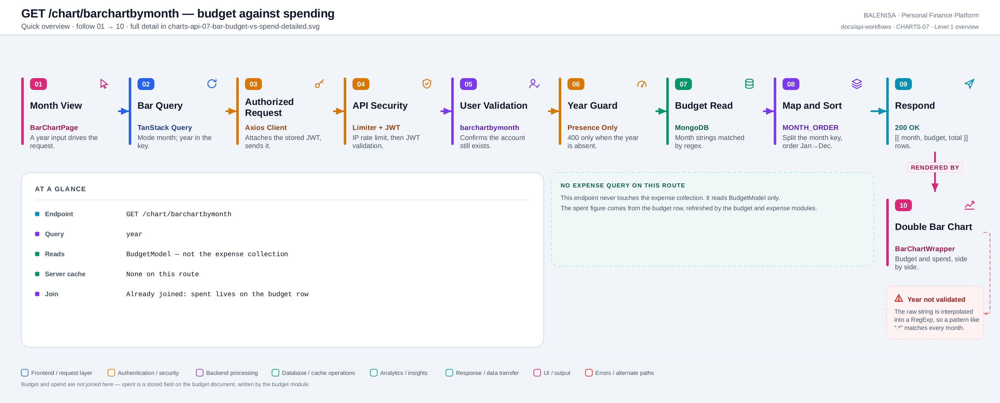
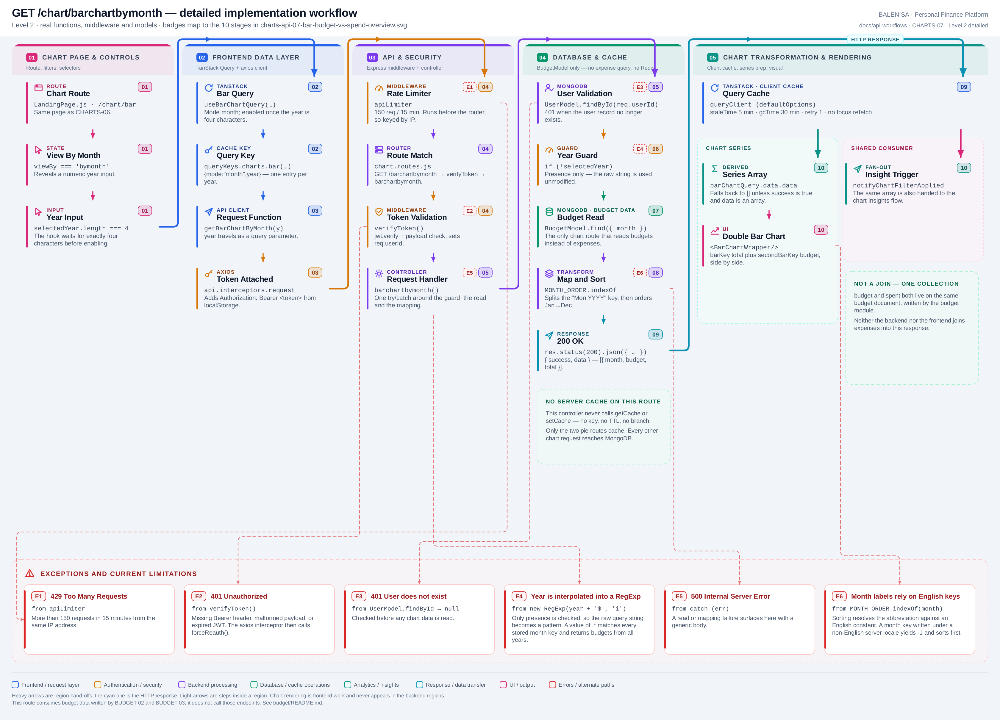

# CHARTS-07 — Budget against spending

`GET /chart/barchartbymonth`

Every statement below is traced to the current repository implementation.

## 1. Purpose

Returns each month's budget alongside the amount spent, for the double-bar budget-versus-spending view.

## 2. Endpoint and HTTP method

| | |
|---|---|
| **Method** | `GET` |
| **Path** | `/chart/barchartbymonth` |
| **Mount** | `app.use("/chart", apiLimiter, chartRouter)` — `backend/server.js` |
| **Middleware** | `apiLimiter` → `verifyToken` → `barchartbymonth` |
| **Auth** | Required — Bearer JWT |
| **Parameters** | `year` (query) |
| **Server cache** | None |
| **Aggregation runs in** | **MongoDB read, mapped in backend JavaScript** — no expense query at all |

## 3. Level 1 quick workflow

<picture>
  <source srcset="charts-api-07-bar-budget-vs-spend-overview.svg" type="image/svg+xml">
  
</picture>

Vector: [`charts-api-07-bar-budget-vs-spend-overview.svg`](charts-api-07-bar-budget-vs-spend-overview.svg) ·
raster fallback: [`charts-api-07-bar-budget-vs-spend-overview.png`](charts-api-07-bar-budget-vs-spend-overview.png)

## 4. Level 2 detailed workflow

<picture>
  <source srcset="charts-api-07-bar-budget-vs-spend-detailed.svg" type="image/svg+xml">
  
</picture>

Vector: [`charts-api-07-bar-budget-vs-spend-detailed.svg`](charts-api-07-bar-budget-vs-spend-detailed.svg) ·
raster fallback: [`charts-api-07-bar-budget-vs-spend-detailed.png`](charts-api-07-bar-budget-vs-spend-detailed.png)

## 5. Request structure

```http
GET /chart/barchartbymonth?year=2026 HTTP/1.1
Authorization: Bearer <jwt>
```

## 6. Response structure

```jsonc
{ "success": true, "data": [ { "month": "Jan", "budget": 45000, "total": 41200 },
                                  { "month": "Feb", "budget": 45000, "total": 38900 } ] }
```

## 7. Period and date-range behaviour

There is **no date range**. Months are selected by matching the stored `"Mon YYYY"` string against `new RegExp(year + '$', 'i')`, then ordered with `MONTH_ORDER.indexOf`. A month key written under a non-English server locale yields `-1` and sorts before January.

## 8. Frontend consumption

A numeric year input; the hook enables the query once the value is four characters. `BarChartWrapper` renders `barKey='total'` plus `secondBarKey='budget'` side by side.

## 9. Chart-data transformation

`getBudgetComparison({ mode: 'year' })` returns `{ month, budget, spent }` per budget document. The controller renames `spent` to `total`, splits `"Jul 2026"` to keep `"Jul"`, and sorts by `MONTH_ORDER`. **No join happens** — `spent` is a stored field on the budget document.

## 10. Query cache and state behaviour

| Layer | Behaviour |
|---|---|
| Redis | Absent |
| TanStack Query | Key `["charts","bar",{mode:"month",year}]` — one entry per year |
| Invalidation | Budget mutations invalidate `["charts"]`, so this chart *does* refresh after a budget change |
| Local state | `viewBy` and `selectedYear` in `BarChartPage` |

## 11. Loading, empty and error behaviour

| State | Behaviour |
|---|---|
| Loading | `shouldRenderChart` is false, so no chart element mounts |
| Success | The chart renders |
| Empty | `data` is `[]` → no chart and no empty-state message |
| Error | `data` falls back to `[]` → identical to empty. No toast on any chart page |

## 12. Files involved

| Layer | File | Function/Export | Purpose |
|---|---|---|---|
| Page | `frontend/src/components/charts/barchart/BarChartPage.js` | `BarChartPage` | Year input, double-bar toggle |
| Chart | `frontend/src/components/charts/barchart/BarChartWrapper.js` | `BarChartWrapper` | Two bar series |
| Query hook | `frontend/src/hooks/queries/useBarChartQuery.js` | `resolveBarChartMode` | Mode `month` |
| Controller | `backend/Controllers/BarChartControllers/barchartbymonth.js` | `barchartbymonth` | Map + sort |
| Service | `backend/Services/ChartServices/chart.service.js` | `getBudgetComparison` | Year mode, regex match |
| Constants | `backend/Services/ChartServices/chartConstants.js` | `MONTH_ORDER` | English abbreviations |
| Budget data | `backend/config/Schemas.js` | `BudgetModel` | `spent` maintained by the budget module |
| Interceptors | `frontend/src/api/axios.js` | `api` | Bearer token; 401/429/409 handling |
| Server mount | `backend/server.js` | `app.use("/chart", apiLimiter, chartRouter)` | Rate limiter ahead of the router |
| Route table | `backend/Routes/chart.routes.js` | `router.get(…)` | All nine chart routes |
| Auth | `backend/Middlewares/Auth.js` | `verifyToken` | Verifies JWT, sets `req.userId` |
| API client | `frontend/src/api/chartApi.js` | thin axios wrappers | One function per chart route |

## 13. Current implementation observations

**Summary:** Correctness 1 · Security / operational 3 · Reliability 1 · Maintainability 1

**This route reads budget data written by [BUDGET-02](../budget/budget-api-02-set-budget.md)
and [BUDGET-03](../budget/budget-api-03-update-budget.md). It does not call those
endpoints, and it never queries the expense collection.**

### Correctness

1. **Month sorting depends on English month keys.** `MONTH_ORDER.indexOf(a.month)` returns
   `-1` for any abbreviation not in the English constant. The budget module writes its keys
   with the server's default locale, so on a non-English host every month sorts to the same
   position and the bar order becomes arbitrary.

### Security / operational

- **`apiLimiter` runs before `verifyToken`**, so the limit is keyed by IP rather than by
  account. *(shared by all nine chart routes)*
- **`trust proxy` is not set**, so behind a reverse proxy every user shares one bucket.
  *(shared by all nine chart routes)*
- **`year` is interpolated into a `RegExp` without validation — verified by execution.**
  The controller checks presence only, then `getBudgetComparison` builds
  `new RegExp(year + '$', 'i')`. Passing `?year=.*` produces `/.*$/i`, which matches
  `"Jan 2024"` and `"Dec 2031"` alike — returning every budget the user owns rather than
  one year's. It is scoped to the caller's own `userId`, so this is not a data-disclosure
  path across accounts, but it is unvalidated user input reaching a regex constructor.

### Reliability

2. **No server cache**, though the underlying read is a small, highly cacheable
   twelve-document query.

### Maintainability

3. **`spent` is renamed to `total` in the controller** purely to match the chart's
   `barKey`. The same field is called `spent` in the budget module, the pie comparison route
   and the database — three names for one value.
