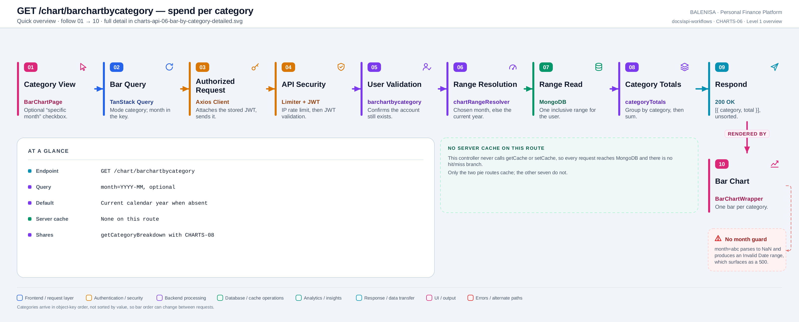
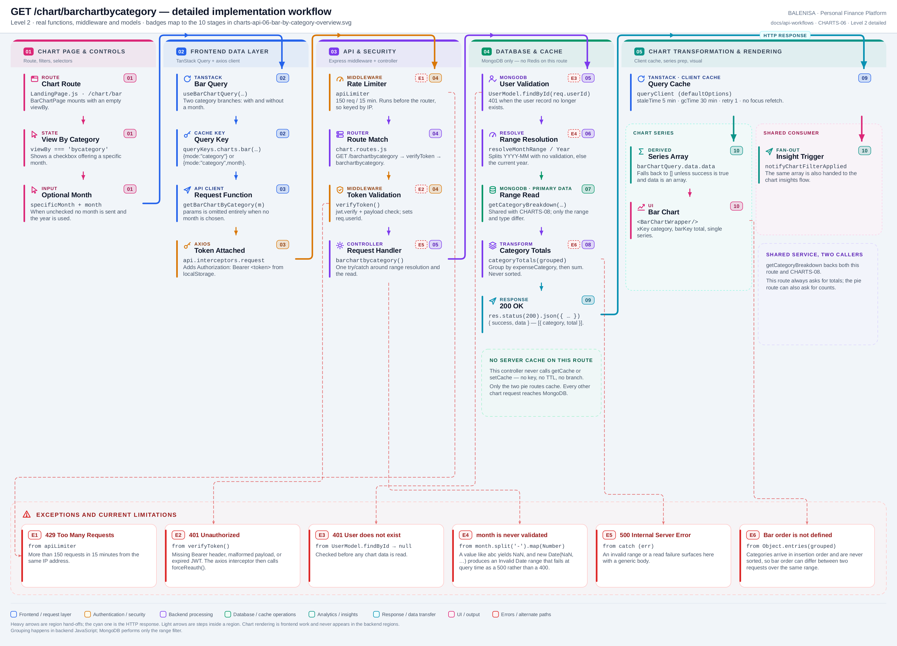

# CHARTS-06 — Spend per category

`GET /chart/barchartbycategory`

Every statement below is traced to the current repository implementation.

## 1. Purpose

Totals spending per category, either for one chosen month or for the current calendar year, for the category view of the bar chart.

## 2. Endpoint and HTTP method

| | |
|---|---|
| **Method** | `GET` |
| **Path** | `/chart/barchartbycategory` |
| **Mount** | `app.use("/chart", apiLimiter, chartRouter)` — `backend/server.js` |
| **Middleware** | `apiLimiter` → `verifyToken` → `barchartbycategory` |
| **Auth** | Required — Bearer JWT |
| **Parameters** | `month=YYYY-MM` (query, optional) |
| **Server cache** | None |
| **Aggregation runs in** | **Backend JavaScript** over fetched documents |

## 3. Level 1 quick workflow

<picture>
  <source srcset="charts-api-06-bar-by-category-overview.svg" type="image/svg+xml">
  
</picture>

Vector: [`charts-api-06-bar-by-category-overview.svg`](charts-api-06-bar-by-category-overview.svg) ·
raster fallback: [`charts-api-06-bar-by-category-overview.png`](charts-api-06-bar-by-category-overview.png)

## 4. Level 2 detailed workflow

<picture>
  <source srcset="charts-api-06-bar-by-category-detailed.svg" type="image/svg+xml">
  
</picture>

Vector: [`charts-api-06-bar-by-category-detailed.svg`](charts-api-06-bar-by-category-detailed.svg) ·
raster fallback: [`charts-api-06-bar-by-category-detailed.png`](charts-api-06-bar-by-category-detailed.png)

## 5. Request structure

```http
GET /chart/barchartbycategory?month=2026-07 HTTP/1.1
Authorization: Bearer <jwt>
```

With no `month`, `params` is omitted entirely and the current year is used.

## 6. Response structure

```jsonc
{ "success": true, "data": [ { "category": "Food", "total": 18200 },
                                  { "category": "Transport", "total": 6400 } ] }
```

## 7. Period and date-range behaviour

With `month`, `resolveMonthRange` gives an **inclusive** calendar month. Without it, `resolveCurrentYearRange` gives the **current** calendar year — so the default silently changes on 1 January. Both are built in server local time.

## 8. Frontend consumption

A checkbox reveals a `month` input. `useBarChartQuery` has two category branches — with and without a month — which produce different cache keys. `BarChartWrapper` renders a single series with `xKey='category'`.

## 9. Chart-data transformation

`getCategoryBreakdown` fetches the range, groups with `groupByCategoryHelper` (defaulting an absent category to `"Others"`), then `categoryTotals` sums each group. **The result is never sorted.**

## 10. Query cache and state behaviour

| Layer | Behaviour |
|---|---|
| Redis | Absent — note the sibling pie route caches the same service call |
| TanStack Query | Key `["charts","bar",{mode:"category"}]` or `…,{mode:"category",month}` |
| Invalidation | Expense and budget mutations invalidate the `["charts"]` prefix |
| Local state | `viewBy`, `specificMonth` and `month` in `BarChartPage` |

## 11. Loading, empty and error behaviour

| State | Behaviour |
|---|---|
| Loading | `shouldRenderChart` is false, so no chart element mounts |
| Success | The chart renders |
| Empty | `data` is `[]` → no chart and no empty-state message |
| Error | `data` falls back to `[]` → identical to empty. No toast on any chart page |

## 12. Files involved

| Layer | File | Function/Export | Purpose |
|---|---|---|---|
| Page | `frontend/src/components/charts/barchart/BarChartPage.js` | `BarChartPage` | Filters, insight trigger |
| Chart | `frontend/src/components/charts/barchart/BarChartWrapper.js` | `BarChartWrapper` | Recharts bar chart |
| Query hook | `frontend/src/hooks/queries/useBarChartQuery.js` | `resolveBarChartMode` | Two category branches |
| Controller | `backend/Controllers/BarChartControllers/barchartbycategory.js` | `barchartbycategory` | Range choice |
| Service | `backend/Services/ChartServices/chart.service.js` | `getCategoryBreakdown`, `categoryTotals` | Shared with CHARTS-08 |
| Grouping | `backend/Services/HelperServices/getexpense.service.js` | `groupByCategoryHelper` | Defaults to "Others" |
| Interceptors | `frontend/src/api/axios.js` | `api` | Bearer token; 401/429/409 handling |
| Server mount | `backend/server.js` | `app.use("/chart", apiLimiter, chartRouter)` | Rate limiter ahead of the router |
| Route table | `backend/Routes/chart.routes.js` | `router.get(…)` | All nine chart routes |
| Auth | `backend/Middlewares/Auth.js` | `verifyToken` | Verifies JWT, sets `req.userId` |
| API client | `frontend/src/api/chartApi.js` | thin axios wrappers | One function per chart route |

## 13. Current implementation observations

**Summary:** Correctness 2 · Security / operational 2 · Reliability 1 · Maintainability 1

### Correctness

1. **`month` is never validated — verified by execution.** `month.split('-').map(Number)`
   on the value `abc` yields `[NaN, undefined]`, and `new Date(NaN, NaN-1, 1)` is an
   `Invalid Date`. The invalid range reaches the query and surfaces as a `500`, not the
   `400` a malformed parameter should produce.

2. **Bar order is undefined.** `categoryTotals` maps `Object.entries(grouped)`, so
   categories appear in first-seen insertion order and are never sorted by value or name.
   Two requests over the same range can order the bars differently if the underlying
   documents are returned in a different order.

### Security / operational

- **`apiLimiter` runs before `verifyToken`**, so the limit is keyed by IP rather than by
  account. *(shared by all nine chart routes)*
- **`trust proxy` is not set**, so behind a reverse proxy every user shares one bucket.
  *(shared by all nine chart routes)*

### Reliability

3. **The identical service call is cached on the pie route but not here.** CHARTS-08 wraps
   `getCategoryBreakdown` in a 300 s Redis entry; this route calls it uncached. The same
   computation is therefore cheap on one page and full-cost on another.
