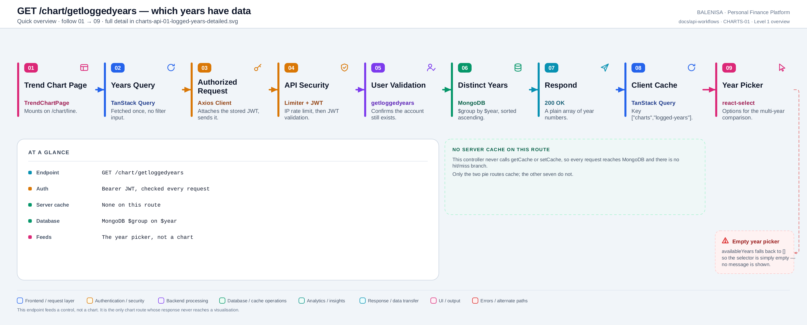
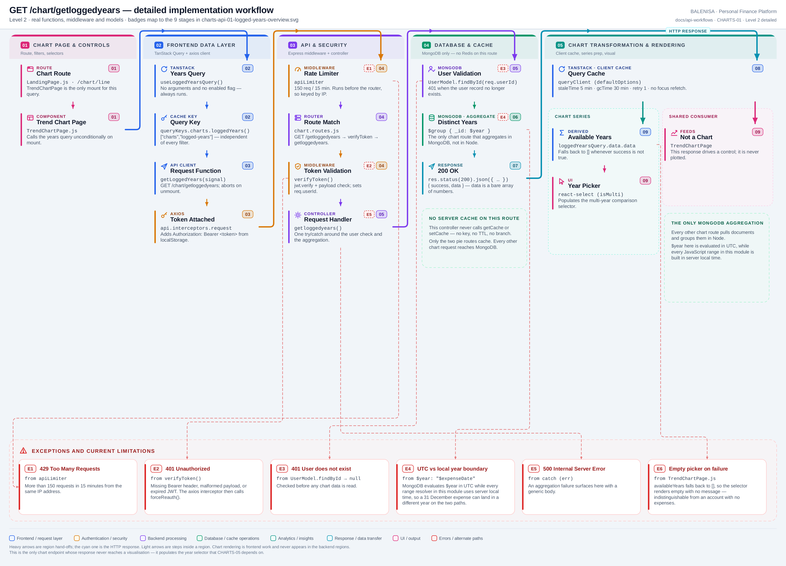

# CHARTS-01 — Years with logged data

`GET /chart/getloggedyears`

Every statement below is traced to the current repository implementation.

## 1. Purpose

Returns the distinct calendar years in which the user has any expense. It populates the multi-year selector on the trend page; its response is never plotted.

## 2. Endpoint and HTTP method

| | |
|---|---|
| **Method** | `GET` |
| **Path** | `/chart/getloggedyears` |
| **Mount** | `app.use("/chart", apiLimiter, chartRouter)` — `backend/server.js` |
| **Middleware** | `apiLimiter` → `verifyToken` → `getloggedyears` |
| **Auth** | Required — Bearer JWT |
| **Parameters** | None |
| **Server cache** | None |
| **Aggregation runs in** | **MongoDB** — the only chart route that does |

## 3. Level 1 quick workflow

<picture>
  <source srcset="charts-api-01-logged-years-overview.svg" type="image/svg+xml">
  
</picture>

Vector: [`charts-api-01-logged-years-overview.svg`](charts-api-01-logged-years-overview.svg) ·
raster fallback: [`charts-api-01-logged-years-overview.png`](charts-api-01-logged-years-overview.png)

## 4. Level 2 detailed workflow

<picture>
  <source srcset="charts-api-01-logged-years-detailed.svg" type="image/svg+xml">
  
</picture>

Vector: [`charts-api-01-logged-years-detailed.svg`](charts-api-01-logged-years-detailed.svg) ·
raster fallback: [`charts-api-01-logged-years-detailed.png`](charts-api-01-logged-years-detailed.png)

## 5. Request structure

```http
GET /chart/getloggedyears HTTP/1.1
Authorization: Bearer <jwt>
```

## 6. Response structure

```jsonc
{ "success": true, "data": [2024, 2025, 2026] }
```

A bare array of numbers. Note there is no `message` field, unlike most routes in the codebase.

## 7. Period and date-range behaviour

`$group: { _id: { $year: "$expenseDate" } }` with no `timezone` argument, so MongoDB evaluates the year in **UTC**. Every JavaScript range resolver in this module builds its bounds in **server local time**. The two therefore disagree for expenses recorded near a New Year boundary.

## 8. Frontend consumption

`useLoggedYearsQuery()` is called unconditionally by `TrendChartPage`. `availableYears` feeds a `react-select` multi-select whose chosen values become the `years` parameter of CHARTS-05.

## 9. Chart-data transformation

None. `formattedYears = years.map(y => y._id)` on the backend is the only reshaping; the frontend passes the array straight into the selector.

## 10. Query cache and state behaviour

| Layer | Behaviour |
|---|---|
| Redis | Absent |
| TanStack Query | Key `["charts","logged-years"]` — no filter inputs, so one entry |
| Invalidation | Expense and budget mutations invalidate `["charts"]`, which is a prefix |
| Local state | None; the selection lives in `TrendChartPage` |

## 11. Loading, empty and error behaviour

| State | Behaviour |
|---|---|
| Loading | The selector renders with no options |
| Success | One option per year |
| Empty | Identical to loading — an empty selector |
| Error | `availableYears` falls back to `[]`. No toast, no message |

## 12. Files involved

| Layer | File | Function/Export | Purpose |
|---|---|---|---|
| Page | `frontend/src/components/charts/linechart/TrendChartPage.js` | `TrendChartPage` | Mounts the query and the selector |
| Query hook | `frontend/src/hooks/queries/useLoggedYearsQuery.js` | `useLoggedYearsQuery` | Unconditional, no arguments |
| Cache key | `frontend/src/query/queryKeys.js` | `queryKeys.charts.loggedYears` | `["charts","logged-years"]` |
| Controller | `backend/Controllers/LineChartControllers/getloggedyears.js` | `getloggedyears` | `$group` on `$year` |
| Interceptors | `frontend/src/api/axios.js` | `api` | Bearer token; 401/429/409 handling |
| Server mount | `backend/server.js` | `app.use("/chart", apiLimiter, chartRouter)` | Rate limiter ahead of the router |
| Route table | `backend/Routes/chart.routes.js` | `router.get(…)` | All nine chart routes |
| Auth | `backend/Middlewares/Auth.js` | `verifyToken` | Verifies JWT, sets `req.userId` |
| API client | `frontend/src/api/chartApi.js` | thin axios wrappers | One function per chart route |

## 13. Current implementation observations

**Summary:** Correctness 1 · Security / operational 2 · Reliability 0 · Maintainability 2

### Correctness

1. **`$year` is evaluated in UTC while the rest of the module uses server local time.**
   `chartRangeResolver` builds every other range with `new Date(year, …)`, which is local.
   An expense stored at 2026-01-01T02:00Z from a UTC+5:30 user was created on 31 December
   locally: this endpoint reports 2026, while `resolveYearRange(2025)` would include it in
   2025. The selector can therefore offer a year for which the year-scoped charts show
   nothing, and vice versa.

### Security / operational

- **`apiLimiter` runs before `verifyToken`**, so the limit is keyed by IP rather than by
  account. *(shared by all nine chart routes)*
- **`trust proxy` is not set**, so behind a reverse proxy every user shares one bucket.
  *(shared by all nine chart routes)*

### Maintainability

2. **The response omits `message`.** Every other chart route returns `{ success, data }`
   too, but the expense, budget and income modules all include a `message`. Nothing
   consumes it here, but the shape is inconsistent across the codebase.

3. **This is the only chart endpoint whose response is not plotted.** It is grouped with
   the line-chart controllers by file location, which obscures that it drives a control
   rather than a visualisation.
