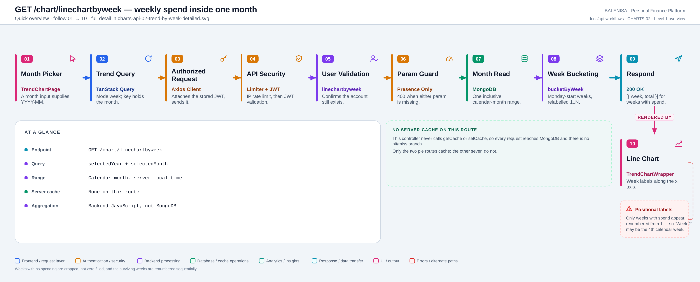
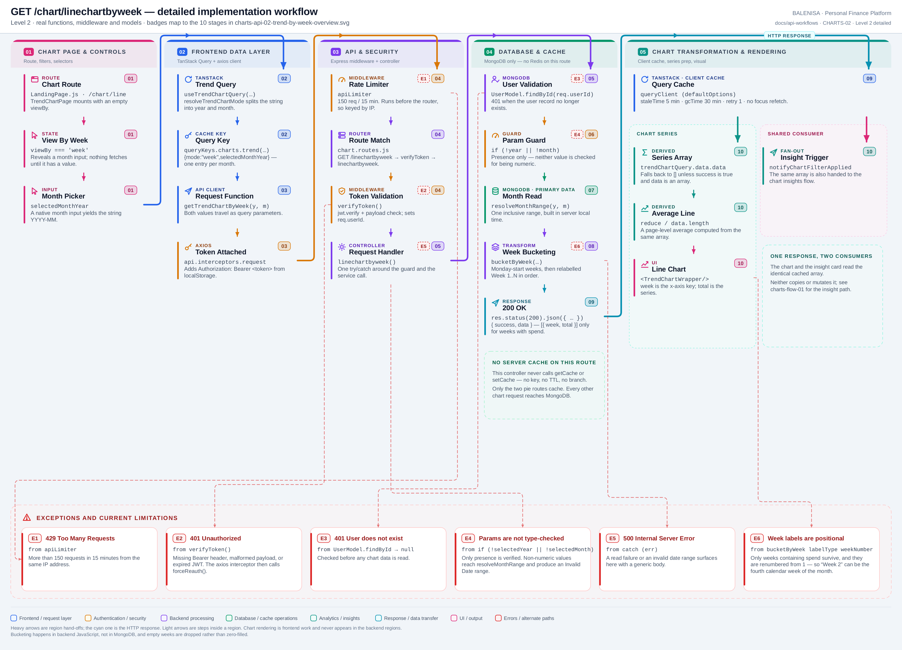

# CHARTS-02 — Weekly spend inside one month

`GET /chart/linechartbyweek`

Every statement below is traced to the current repository implementation.

## 1. Purpose

Buckets one calendar month's expenses into weeks for the week view of the trend chart.

## 2. Endpoint and HTTP method

| | |
|---|---|
| **Method** | `GET` |
| **Path** | `/chart/linechartbyweek` |
| **Mount** | `app.use("/chart", apiLimiter, chartRouter)` — `backend/server.js` |
| **Middleware** | `apiLimiter` → `verifyToken` → `linechartbyweek` |
| **Auth** | Required — Bearer JWT |
| **Parameters** | `selectedYear`, `selectedMonth` (query) |
| **Server cache** | None |
| **Aggregation runs in** | **Backend JavaScript** over fetched documents |

## 3. Level 1 quick workflow

<picture>
  <source srcset="charts-api-02-trend-by-week-overview.svg" type="image/svg+xml">
  
</picture>

Vector: [`charts-api-02-trend-by-week-overview.svg`](charts-api-02-trend-by-week-overview.svg) ·
raster fallback: [`charts-api-02-trend-by-week-overview.png`](charts-api-02-trend-by-week-overview.png)

## 4. Level 2 detailed workflow

<picture>
  <source srcset="charts-api-02-trend-by-week-detailed.svg" type="image/svg+xml">
  
</picture>

Vector: [`charts-api-02-trend-by-week-detailed.svg`](charts-api-02-trend-by-week-detailed.svg) ·
raster fallback: [`charts-api-02-trend-by-week-detailed.png`](charts-api-02-trend-by-week-detailed.png)

## 5. Request structure

```http
GET /chart/linechartbyweek?selectedYear=2026&selectedMonth=07 HTTP/1.1
Authorization: Bearer <jwt>
```

## 6. Response structure

```jsonc
{ "success": true, "data": [ { "week": "Week 1", "total": 4200 },
                                  { "week": "Week 2", "total": 8100 } ] }
```

## 7. Period and date-range behaviour

`resolveMonthRange(year, month)` builds `new Date(year, month-1, 1)` to `new Date(year, month, 0, 23:59:59.999)` — an **inclusive** calendar month in **server local time**. Inside `bucketByWeek`, weeks start on **Monday** and are normalised to local midnight, so the first bucket of a month can begin in the previous month.

## 8. Frontend consumption

A native `month` input gives `YYYY-MM`; `resolveTrendChartMode` splits it and passes the halves as two query parameters. `TrendChartWrapper` plots `week` against `total`.

## 9. Chart-data transformation

`bucketByWeek(expenses, { labelType: 'weekNumber' })` keys each expense by its Monday week-start, sums per key, sorts by date, then **renumbers the surviving buckets `Week 1..N`**. Weeks with no spending never produce a key, so they are absent rather than zero — and the renumbering means the label does not identify the calendar week.

## 10. Query cache and state behaviour

| Layer | Behaviour |
|---|---|
| Redis | Absent |
| TanStack Query | Key `["charts","trend",{mode:"week",selectedMonthYear}]` — one entry per month |
| Invalidation | Expense and budget mutations invalidate the `["charts"]` prefix |
| Local state | `viewBy` and `selectedMonthYear` in `TrendChartPage` |

## 11. Loading, empty and error behaviour

| State | Behaviour |
|---|---|
| Loading | `shouldRenderChart` is false, so no chart element mounts |
| Success | The chart renders |
| Empty | `data` is `[]` → no chart and no empty-state message |
| Error | `data` falls back to `[]` → identical to empty. No toast on any chart page |

## 12. Files involved

| Layer | File | Function/Export | Purpose |
|---|---|---|---|
| Page | `frontend/src/components/charts/linechart/TrendChartPage.js` | `TrendChartPage` | Month picker, average line |
| Chart | `frontend/src/components/charts/linechart/TrendChartWrapper.js` | `TrendChartWrapper` | Recharts line chart |
| Query hook | `frontend/src/hooks/queries/useTrendChartQuery.js` | `resolveTrendChartMode` | Mode `week` |
| Controller | `backend/Controllers/LineChartControllers/linechartbyweek.js` | `linechartbyweek` | Presence guard, service call |
| Service | `backend/Services/ChartServices/chart.service.js` | `getWeeklyLineChart` | Range + bucketing |
| Range | `backend/Services/ChartServices/chartRangeResolver.js` | `resolveMonthRange` | Inclusive month bounds |
| Bucketing | `backend/Services/HelperServices/getexpense.service.js` | `bucketByWeek` | Monday-start weeks, relabelled |
| Interceptors | `frontend/src/api/axios.js` | `api` | Bearer token; 401/429/409 handling |
| Server mount | `backend/server.js` | `app.use("/chart", apiLimiter, chartRouter)` | Rate limiter ahead of the router |
| Route table | `backend/Routes/chart.routes.js` | `router.get(…)` | All nine chart routes |
| Auth | `backend/Middlewares/Auth.js` | `verifyToken` | Verifies JWT, sets `req.userId` |
| API client | `frontend/src/api/chartApi.js` | thin axios wrappers | One function per chart route |

## 13. Current implementation observations

**Summary:** Correctness 2 · Security / operational 2 · Reliability 1 · Maintainability 1

### Correctness

1. **Week labels are positional, not calendar weeks — verified by execution.** Running
   `bucketByWeek` over two expenses dated 8 July and 22 July 2026 (calendar weeks 2 and 4)
   returns `Week 1` and `Week 2`. A user reading "Week 2" on the chart is looking at the
   fourth week of the month. Weeks with no spending are simply absent.

2. **Parameters are checked for presence only.** `if (!selectedYear || !selectedMonth)`
   returns `400`, but neither value is verified as numeric. A non-numeric value reaches
   `resolveMonthRange`, produces an `Invalid Date` range and fails at query time as a `500`
   rather than a `400`. CHARTS-03 does validate its year; this route does not.

### Security / operational

- **`apiLimiter` runs before `verifyToken`**, so the limit is keyed by IP rather than by
  account. *(shared by all nine chart routes)*
- **`trust proxy` is not set**, so behind a reverse proxy every user shares one bucket.
  *(shared by all nine chart routes)*

### Reliability

3. **No server cache.** Every request re-reads the month and re-buckets it in Node.

### Maintainability

4. **`bucketByWeek` is shared with the expense module** (API-01 uses it with the default
   `labelType: 'date'`). The `weekNumber` variant exists only for this route, so a change to
   the shared helper affects both consumers differently.
