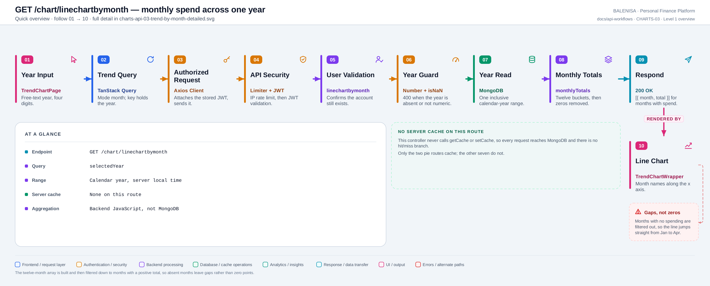
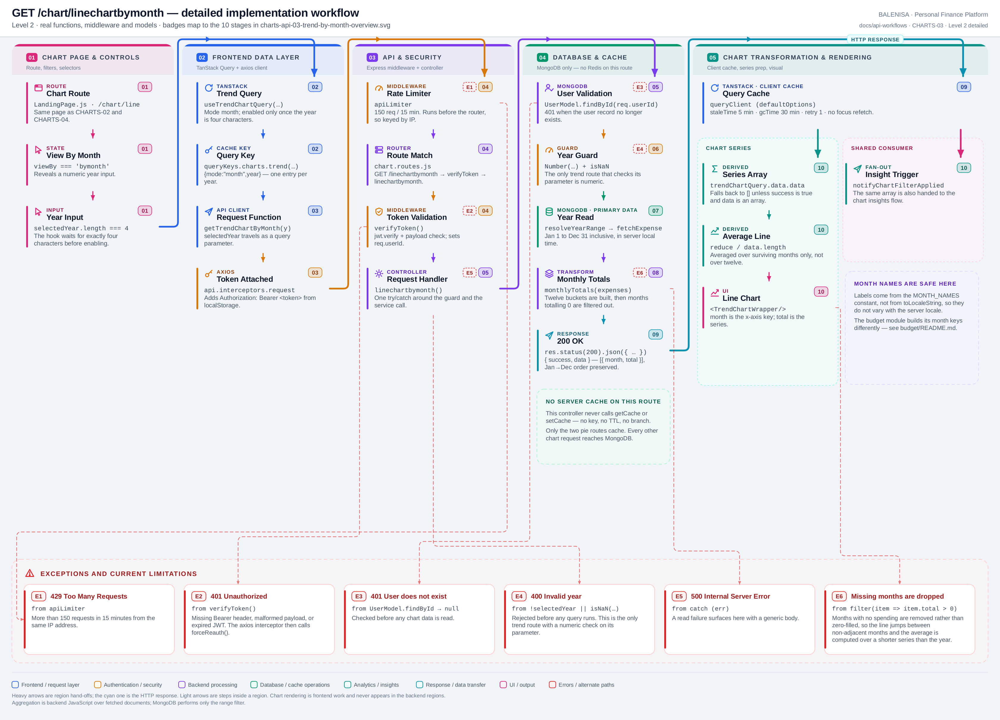

# CHARTS-03 — Monthly spend across one year

`GET /chart/linechartbymonth`

Every statement below is traced to the current repository implementation.

## 1. Purpose

Returns one total per month for a chosen calendar year, for the month view of the trend chart.

## 2. Endpoint and HTTP method

| | |
|---|---|
| **Method** | `GET` |
| **Path** | `/chart/linechartbymonth` |
| **Mount** | `app.use("/chart", apiLimiter, chartRouter)` — `backend/server.js` |
| **Middleware** | `apiLimiter` → `verifyToken` → `linechartbymonth` |
| **Auth** | Required — Bearer JWT |
| **Parameters** | `selectedYear` (query) |
| **Server cache** | None |
| **Aggregation runs in** | **Backend JavaScript** over fetched documents |

## 3. Level 1 quick workflow

<picture>
  <source srcset="charts-api-03-trend-by-month-overview.svg" type="image/svg+xml">
  
</picture>

Vector: [`charts-api-03-trend-by-month-overview.svg`](charts-api-03-trend-by-month-overview.svg) ·
raster fallback: [`charts-api-03-trend-by-month-overview.png`](charts-api-03-trend-by-month-overview.png)

## 4. Level 2 detailed workflow

<picture>
  <source srcset="charts-api-03-trend-by-month-detailed.svg" type="image/svg+xml">
  
</picture>

Vector: [`charts-api-03-trend-by-month-detailed.svg`](charts-api-03-trend-by-month-detailed.svg) ·
raster fallback: [`charts-api-03-trend-by-month-detailed.png`](charts-api-03-trend-by-month-detailed.png)

## 5. Request structure

```http
GET /chart/linechartbymonth?selectedYear=2026 HTTP/1.1
Authorization: Bearer <jwt>
```

## 6. Response structure

```jsonc
{ "success": true, "data": [ { "month": "Jan", "total": 41000 },
                                  { "month": "Apr", "total": 30000 } ] }
```

Note the gap: February and March are **absent**, not zero.

## 7. Period and date-range behaviour

`resolveYearRange(year)` gives `new Date(year, 0, 1)` to `new Date(year+1, 0, 0, 23:59:59.999)` — an **inclusive** calendar year in **server local time**. Month labels come from the `MONTH_NAMES` constant, so they are always English and do not vary with the server locale.

## 8. Frontend consumption

A numeric year input; the hook enables the query only once the value is exactly four characters. `TrendChartWrapper` plots `month` against `total`.

## 9. Chart-data transformation

`monthlyTotals` builds a twelve-slot array, sums each expense into its month index, maps to `{ month, total }` — then applies `.filter(item => item.total > 0)`. **Months with no spending are removed rather than zero-filled.**

## 10. Query cache and state behaviour

| Layer | Behaviour |
|---|---|
| Redis | Absent |
| TanStack Query | Key `["charts","trend",{mode:"month",year}]` — one entry per year |
| Invalidation | Expense and budget mutations invalidate the `["charts"]` prefix |
| Local state | `viewBy` and `selectedYear` in `TrendChartPage` |

## 11. Loading, empty and error behaviour

| State | Behaviour |
|---|---|
| Loading | `shouldRenderChart` is false, so no chart element mounts |
| Success | The chart renders |
| Empty | `data` is `[]` → no chart and no empty-state message |
| Error | `data` falls back to `[]` → identical to empty. No toast on any chart page |

## 12. Files involved

| Layer | File | Function/Export | Purpose |
|---|---|---|---|
| Page | `frontend/src/components/charts/linechart/TrendChartPage.js` | `TrendChartPage` | Year input, average line |
| Chart | `frontend/src/components/charts/linechart/TrendChartWrapper.js` | `TrendChartWrapper` | Recharts line chart |
| Query hook | `frontend/src/hooks/queries/useTrendChartQuery.js` | `resolveTrendChartMode` | Mode `month` |
| Controller | `backend/Controllers/LineChartControllers/linechartbymonth.js` | `linechartbymonth` | Numeric year guard |
| Service | `backend/Services/ChartServices/chart.service.js` | `getMonthlyLineChart`, `monthlyTotals` | Range + monthly sums |
| Constants | `backend/Services/ChartServices/chartConstants.js` | `MONTH_NAMES` | English abbreviations |
| Interceptors | `frontend/src/api/axios.js` | `api` | Bearer token; 401/429/409 handling |
| Server mount | `backend/server.js` | `app.use("/chart", apiLimiter, chartRouter)` | Rate limiter ahead of the router |
| Route table | `backend/Routes/chart.routes.js` | `router.get(…)` | All nine chart routes |
| Auth | `backend/Middlewares/Auth.js` | `verifyToken` | Verifies JWT, sets `req.userId` |
| API client | `frontend/src/api/chartApi.js` | thin axios wrappers | One function per chart route |

## 13. Current implementation observations

**Summary:** Correctness 2 · Security / operational 2 · Reliability 1 · Maintainability 0

### Correctness

1. **Missing months are dropped, not zero-filled — verified by execution.** Running
   `monthlyTotals` over expenses in January, April and July returns three entries out of
   twelve. The line chart therefore joins January straight to April as if they were
   adjacent, visually compressing a three-month gap into one segment.

2. **The page average is computed over surviving months only.** `TrendChartPage` does
   `data.reduce(…) / data.length`. With three months present out of twelve, the average is
   the mean of those three, not the monthly average for the year — and the label does not
   say so.

### Security / operational

- **`apiLimiter` runs before `verifyToken`**, so the limit is keyed by IP rather than by
  account. *(shared by all nine chart routes)*
- **`trust proxy` is not set**, so behind a reverse proxy every user shares one bucket.
  *(shared by all nine chart routes)*

### Reliability

3. **No server cache.** Each request re-reads a full year of expenses and re-aggregates in
   Node.
