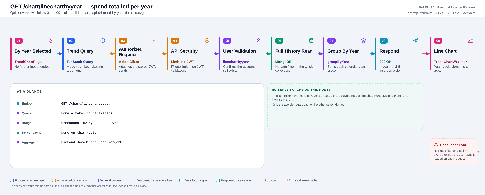
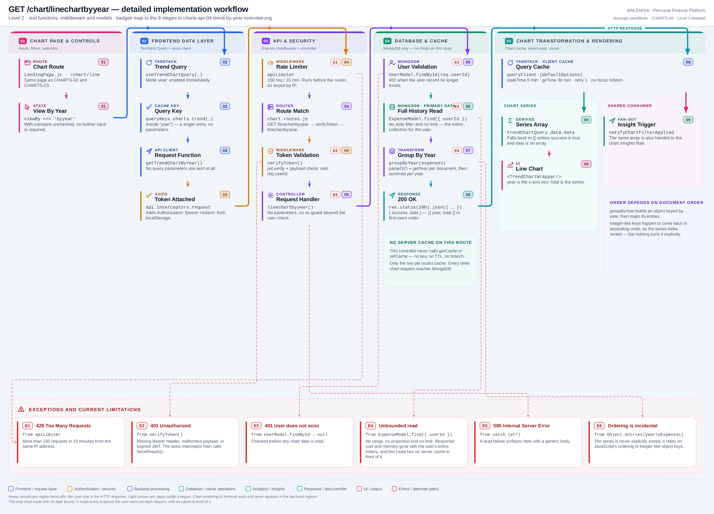

# CHARTS-04 — Spend totalled per year

`GET /chart/linechartbyyear`

Every statement below is traced to the current repository implementation.

## 1. Purpose

Returns one total per calendar year across the user's entire expense history, for the year view of the trend chart.

## 2. Endpoint and HTTP method

| | |
|---|---|
| **Method** | `GET` |
| **Path** | `/chart/linechartbyyear` |
| **Mount** | `app.use("/chart", apiLimiter, chartRouter)` — `backend/server.js` |
| **Middleware** | `apiLimiter` → `verifyToken` → `linechartbyyear` |
| **Auth** | Required — Bearer JWT |
| **Parameters** | None |
| **Server cache** | None |
| **Aggregation runs in** | **Backend JavaScript** over fetched documents |

## 3. Level 1 quick workflow

<picture>
  <source srcset="charts-api-04-trend-by-year-overview.svg" type="image/svg+xml">
  
</picture>

Vector: [`charts-api-04-trend-by-year-overview.svg`](charts-api-04-trend-by-year-overview.svg) ·
raster fallback: [`charts-api-04-trend-by-year-overview.png`](charts-api-04-trend-by-year-overview.png)

## 4. Level 2 detailed workflow

<picture>
  <source srcset="charts-api-04-trend-by-year-detailed.svg" type="image/svg+xml">
  
</picture>

Vector: [`charts-api-04-trend-by-year-detailed.svg`](charts-api-04-trend-by-year-detailed.svg) ·
raster fallback: [`charts-api-04-trend-by-year-detailed.png`](charts-api-04-trend-by-year-detailed.png)

## 5. Request structure

```http
GET /chart/linechartbyyear HTTP/1.1
Authorization: Bearer <jwt>
```

## 6. Response structure

```jsonc
{ "success": true, "data": [ { "year": 2025, "total": 412000 },
                                  { "year": 2026, "total": 180500 } ] }
```

## 7. Period and date-range behaviour

**None.** `ExpenseModel.find({ userId })` carries no date filter at all — this is the only chart route with an unbounded range. Years are derived per document with date-fns `getYear`, which uses the **server's local timezone**, so the boundary convention differs from CHARTS-01's UTC `$year`.

## 8. Frontend consumption

`useTrendChartQuery` resolves mode `year` when `viewBy === 'byyear'` and compare-by-year is off. `TrendChartWrapper` plots `year` against `total`.

## 9. Chart-data transformation

`groupByYear` builds an object keyed by year, sums `expenseAmount` per key, then maps the entries to `{ year, total }`. **Nothing sorts the result** — the ascending order observed in practice comes from JavaScript's ordering of integer-like object keys, not from the code.

## 10. Query cache and state behaviour

| Layer | Behaviour |
|---|---|
| Redis | Absent |
| TanStack Query | Key `["charts","trend",{mode:"year"}]` — one entry, no parameters |
| Invalidation | Expense and budget mutations invalidate the `["charts"]` prefix |
| Local state | `viewBy` and `compareByYear` in `TrendChartPage` |

## 11. Loading, empty and error behaviour

| State | Behaviour |
|---|---|
| Loading | `shouldRenderChart` is false, so no chart element mounts |
| Success | A line with one point per year |
| Empty | `data` is `[]` → no chart, and no empty-state message |
| Error | `data` falls back to `[]` → identical to empty. No toast |

## 12. Files involved

| Layer | File | Function/Export | Purpose |
|---|---|---|---|
| Page | `frontend/src/components/charts/linechart/TrendChartPage.js` | `TrendChartPage` | Filter state and the average line |
| Chart | `frontend/src/components/charts/linechart/TrendChartWrapper.js` | `TrendChartWrapper` | Recharts line chart |
| Query hook | `frontend/src/hooks/queries/useTrendChartQuery.js` | `resolveTrendChartMode` | Mode `year` |
| Controller | `backend/Controllers/LineChartControllers/linechartbyyear.js` | `linechartbyyear` | User check, service call |
| Service | `backend/Services/ChartServices/chart.service.js` | `getYearlyLineChart`, `groupByYear` | Unbounded read, group by year |
| Interceptors | `frontend/src/api/axios.js` | `api` | Bearer token; 401/429/409 handling |
| Server mount | `backend/server.js` | `app.use("/chart", apiLimiter, chartRouter)` | Rate limiter ahead of the router |
| Route table | `backend/Routes/chart.routes.js` | `router.get(…)` | All nine chart routes |
| Auth | `backend/Middlewares/Auth.js` | `verifyToken` | Verifies JWT, sets `req.userId` |
| API client | `frontend/src/api/chartApi.js` | thin axios wrappers | One function per chart route |

## 13. Current implementation observations

**Summary:** Correctness 1 · Security / operational 2 · Reliability 2 · Maintainability 1

### Correctness

1. **The series is never explicitly sorted.** `groupByYear` returns
   `Object.entries(yearlyExpenses).map(…)`. Integer-like keys are enumerated in ascending
   numeric order by the JavaScript engine, so the chart looks correct — but the ordering is
   a language guarantee about key enumeration, not an intentional sort, and it would break
   the moment a non-integer key entered the object.

### Security / operational

- **`apiLimiter` runs before `verifyToken`**, so the limit is keyed by IP rather than by
  account. *(shared by all nine chart routes)*
- **`trust proxy` is not set**, so behind a reverse proxy every user shares one bucket.
  *(shared by all nine chart routes)*

### Reliability

2. **Unbounded read with no cache in front of it.** No date range, no projection, no
   limit. Cost grows linearly with the user's entire expense history, on every request, and
   this route is not one of the two with a Redis layer.

3. **No empty state.** `shouldRenderChart` gates the chart on `data.length > 0`, so an
   empty result renders nothing at all — no message distinguishes "no expenses yet" from a
   failed request.

### Maintainability

4. **`getYearlyLineChart` bypasses the shared `fetchExpense` helper** that every other
   chart service function uses, calling `ExpenseModel.find` directly. That is why it is the
   only one without a range.
