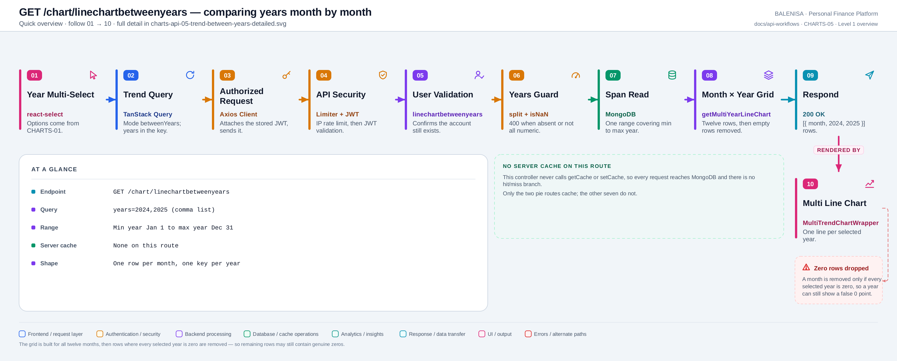
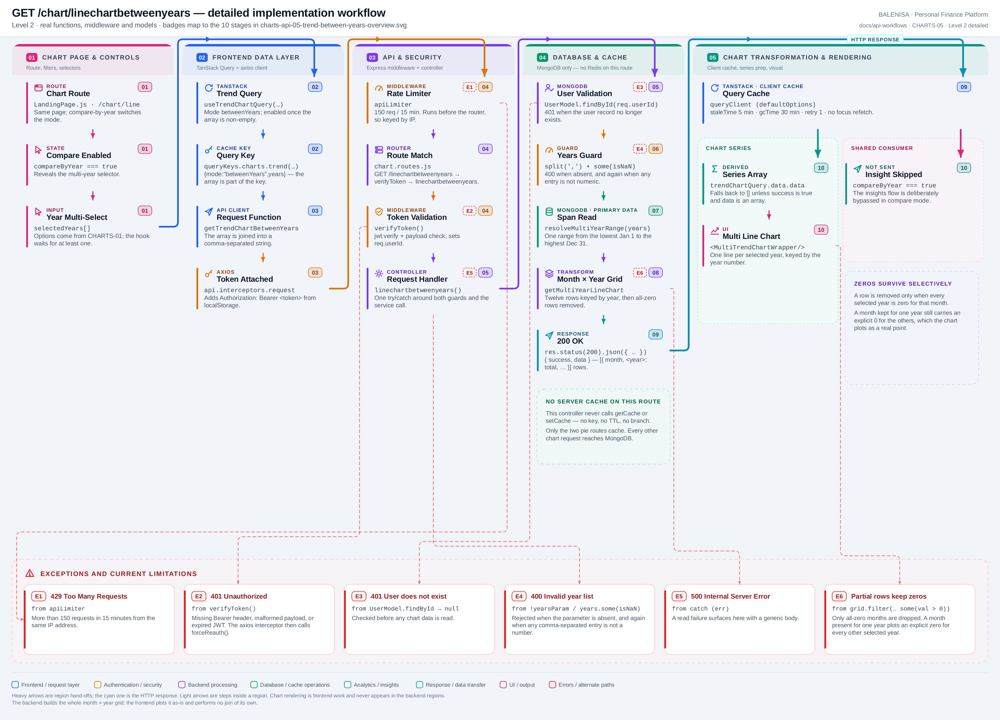

# CHARTS-05 — Comparing years month by month

`GET /chart/linechartbetweenyears`

Every statement below is traced to the current repository implementation.

## 1. Purpose

Builds a month × year grid so several years can be compared on one chart, one line per year.

## 2. Endpoint and HTTP method

| | |
|---|---|
| **Method** | `GET` |
| **Path** | `/chart/linechartbetweenyears` |
| **Mount** | `app.use("/chart", apiLimiter, chartRouter)` — `backend/server.js` |
| **Middleware** | `apiLimiter` → `verifyToken` → `linechartbetweenyears` |
| **Auth** | Required — Bearer JWT |
| **Parameters** | `years` — a comma-separated list (query) |
| **Server cache** | None |
| **Aggregation runs in** | **Backend JavaScript** over fetched documents |

## 3. Level 1 quick workflow

<picture>
  <source srcset="charts-api-05-trend-between-years-overview.svg" type="image/svg+xml">
  
</picture>

Vector: [`charts-api-05-trend-between-years-overview.svg`](charts-api-05-trend-between-years-overview.svg) ·
raster fallback: [`charts-api-05-trend-between-years-overview.png`](charts-api-05-trend-between-years-overview.png)

## 4. Level 2 detailed workflow

<picture>
  <source srcset="charts-api-05-trend-between-years-detailed.svg" type="image/svg+xml">
  
</picture>

Vector: [`charts-api-05-trend-between-years-detailed.svg`](charts-api-05-trend-between-years-detailed.svg) ·
raster fallback: [`charts-api-05-trend-between-years-detailed.png`](charts-api-05-trend-between-years-detailed.png)

## 5. Request structure

```http
GET /chart/linechartbetweenyears?years=2024,2025 HTTP/1.1
Authorization: Bearer <jwt>
```

## 6. Response structure

```jsonc
{ "success": true,
  "data": [ { "month": "Jan", "2024": 30000, "2025": 41000 },
            { "month": "Feb", "2024": 0,     "2025": 28000 } ] }
```

## 7. Period and date-range behaviour

`resolveMultiYearRange` spans `new Date(min(years), 0, 1)` to `new Date(max(years), 11, 31, 23:59:59.999)` — one **inclusive** range covering every requested year and **everything between them**, in server local time. Requesting 2020 and 2026 reads seven years of documents even if only two are plotted. Month labels come from `MONTH_NAMES`, so they are always English.

## 8. Frontend consumption

`react-select` multi-select, populated by CHARTS-01. The hook joins the array with commas and keys the cache on the array itself. `MultiTrendChartWrapper` renders one line per year.

## 9. Chart-data transformation

A twelve-row grid is built with a zero for every requested year, expenses are added into `grid[monthIndex][year]`, then `grid.filter(m => Object.values(m).some(val => typeof val === 'number' && val > 0))` removes rows where **every** year is zero. Rows kept for one year still carry explicit zeros for the others.

## 10. Query cache and state behaviour

| Layer | Behaviour |
|---|---|
| Redis | Absent |
| TanStack Query | Key `["charts","trend",{mode:"betweenYears",years}]` — the array is part of the key |
| Invalidation | Expense and budget mutations invalidate the `["charts"]` prefix |
| Local state | `compareByYear` and `selectedYears` in `TrendChartPage` |

## 11. Loading, empty and error behaviour

| State | Behaviour |
|---|---|
| Loading | `shouldRenderChart` is false, so no chart element mounts |
| Success | The chart renders |
| Empty | `data` is `[]` → no chart and no empty-state message |
| Error | `data` falls back to `[]` → identical to empty. No toast on any chart page |

The chart-insights flow is **deliberately skipped** in compare mode, so no insight card appears and nothing explains its absence.

## 12. Files involved

| Layer | File | Function/Export | Purpose |
|---|---|---|---|
| Page | `frontend/src/components/charts/linechart/TrendChartPage.js` | `TrendChartPage` | Multi-select, compare toggle |
| Chart | `frontend/src/components/charts/linechart/MultiTrendChartWrapper.js` | `MultiTrendChartWrapper`, `getColors` | One line per year |
| Query hook | `frontend/src/hooks/queries/useTrendChartQuery.js` | `resolveTrendChartMode` | Mode `betweenYears` |
| Controller | `backend/Controllers/LineChartControllers/linechartbetweenyears.js` | `linechartbetweenyears` | Two guards, service call |
| Service | `backend/Services/ChartServices/chart.service.js` | `getMultiYearLineChart` | Grid build + filter |
| Range | `backend/Services/ChartServices/chartRangeResolver.js` | `resolveMultiYearRange` | Min-to-max span |
| Interceptors | `frontend/src/api/axios.js` | `api` | Bearer token; 401/429/409 handling |
| Server mount | `backend/server.js` | `app.use("/chart", apiLimiter, chartRouter)` | Rate limiter ahead of the router |
| Route table | `backend/Routes/chart.routes.js` | `router.get(…)` | All nine chart routes |
| Auth | `backend/Middlewares/Auth.js` | `verifyToken` | Verifies JWT, sets `req.userId` |
| API client | `frontend/src/api/chartApi.js` | thin axios wrappers | One function per chart route |

## 13. Current implementation observations

**Summary:** Correctness 1 · Security / operational 2 · Reliability 2 · Maintainability 1

### Correctness

1. **Surviving rows carry explicit zeros.** A month is removed only when *every* selected
   year is zero. If 2025 has spending in February and 2024 does not, the February row is
   kept and 2024 plots a real `0` point — visually identical to a genuine zero-spend month,
   and distinct from CHARTS-03 where the month would simply be absent. The two trend views
   therefore treat missing data differently.

### Security / operational

- **`apiLimiter` runs before `verifyToken`**, so the limit is keyed by IP rather than by
  account. *(shared by all nine chart routes)*
- **`trust proxy` is not set**, so behind a reverse proxy every user shares one bucket.
  *(shared by all nine chart routes)*

### Reliability

2. **The range spans the gap between selected years.** `resolveMultiYearRange` takes the
   min and max, so selecting 2020 and 2026 reads all seven years of documents to plot two
   lines.

3. **No server cache**, and the whole span is materialised in Node before the grid is
   built.

### Maintainability

4. **Year keys are numbers used as object keys**, so the response mixes a string key
   (`month`) with numeric-like keys (`2024`). The filter guards with
   `typeof val === 'number'` specifically to skip the `month` string — a fragile coupling
   between the shape and the filter.
