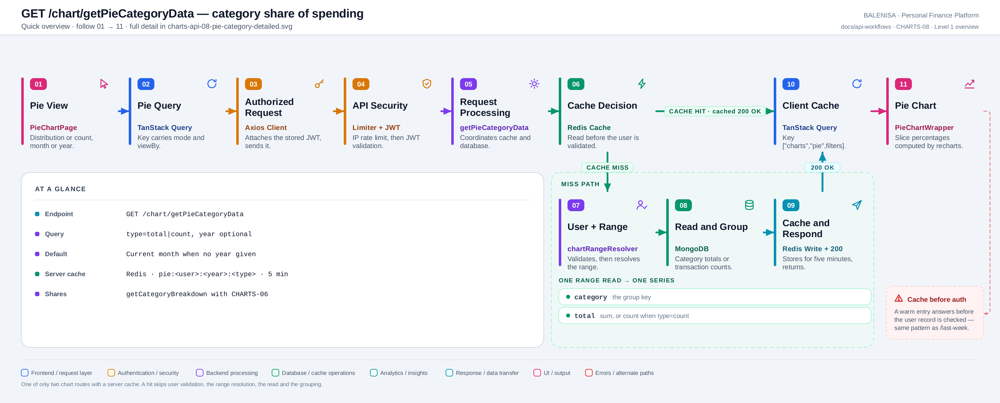
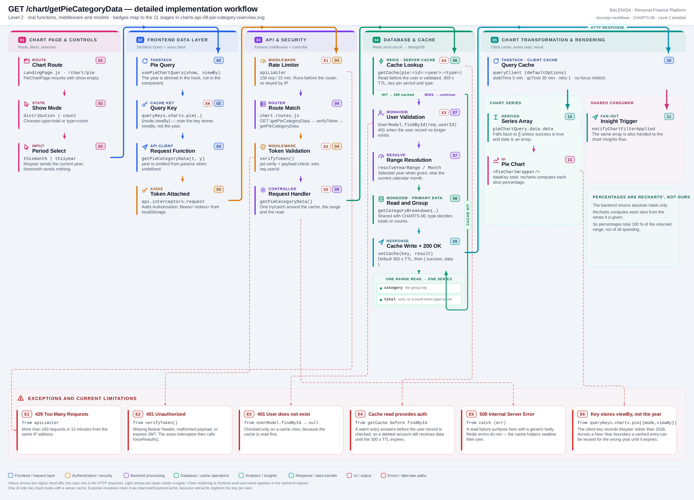

# CHARTS-08 — Category share of spending

`GET /chart/getPieCategoryData`

Every statement below is traced to the current repository implementation.

## 1. Purpose

Returns per-category totals — or per-category transaction counts — for the pie chart's distribution and count modes.

## 2. Endpoint and HTTP method

| | |
|---|---|
| **Method** | `GET` |
| **Path** | `/chart/getPieCategoryData` |
| **Mount** | `app.use("/chart", apiLimiter, chartRouter)` — `backend/server.js` |
| **Middleware** | `apiLimiter` → `verifyToken` → `getPieCategoryData` |
| **Auth** | Required — Bearer JWT |
| **Parameters** | `type=total|count`, `year` (query, both optional) |
| **Server cache** | **Redis** · `pie:<userId>:<year|month>:<type>` · 300 s |
| **Aggregation runs in** | **Backend JavaScript** over fetched documents |

## 3. Level 1 quick workflow

<picture>
  <source srcset="charts-api-08-pie-category-overview.svg" type="image/svg+xml">
  
</picture>

Vector: [`charts-api-08-pie-category-overview.svg`](charts-api-08-pie-category-overview.svg) ·
raster fallback: [`charts-api-08-pie-category-overview.png`](charts-api-08-pie-category-overview.png)

## 4. Level 2 detailed workflow

<picture>
  <source srcset="charts-api-08-pie-category-detailed.svg" type="image/svg+xml">
  
</picture>

Vector: [`charts-api-08-pie-category-detailed.svg`](charts-api-08-pie-category-detailed.svg) ·
raster fallback: [`charts-api-08-pie-category-detailed.png`](charts-api-08-pie-category-detailed.png)

## 5. Request structure

```http
GET /chart/getPieCategoryData?type=total&year=2026 HTTP/1.1
Authorization: Bearer <jwt>
```

With no `year`, the current calendar month is used.

## 6. Response structure

```jsonc
{ "success": true, "data": [ { "category": "Food", "total": 18200 } ] }
```

On a cache hit the body also carries `"message": "Success (cached)"`. With `type=count`, `total` holds a **count**, not an amount — the field name does not change.

## 7. Period and date-range behaviour

`year` present → `resolveYearRange(Number(year))`; absent → `resolveCurrentMonthRange()`. Both are **inclusive** and built in server local time. The frontend derives the year from `new Date().getFullYear()` when `viewBy` is `thisyear`.

## 8. Frontend consumption

`usePieChartQuery(show, viewBy)` maps `distribution → type=total` and `count → type=count`. `PieChartWrapper` uses `dataKey='total'` and lets recharts compute each slice percentage.

## 9. Chart-data transformation

Identical to CHARTS-06 up to the grouping — `getCategoryBreakdown` is the same function. The only difference is that `type=count` selects `categoryCounts` instead of `categoryTotals`. Percentages are **not** computed server-side.

## 10. Query cache and state behaviour

| Layer | Behaviour |
|---|---|
| Redis | `pie:<userId>:<year\|month>:<type>`, default 300 s TTL. Read **before** user validation |
| Redis invalidation | `setCache` registers the key in `cachekeys:<userId>`, so `clearUserExpenseCache` clears it on any expense mutation |
| TanStack Query | Key `["charts","pie",{mode,viewBy}]` — stores `viewBy`, **not** the resolved year |
| Local state | `show` and `viewBy` in `PieChartPage` |

## 11. Loading, empty and error behaviour

| State | Behaviour |
|---|---|
| Loading | `shouldRenderChart` is false, so no chart element mounts |
| Success | The chart renders |
| Empty | `data` is `[]` → no chart and no empty-state message |
| Error | `data` falls back to `[]` → identical to empty. No toast on any chart page |

## 12. Files involved

| Layer | File | Function/Export | Purpose |
|---|---|---|---|
| Page | `frontend/src/components/charts/piechart/PieChartPage.js` | `PieChartPage` | Mode and period selects |
| Chart | `frontend/src/components/charts/piechart/PieChartWrapper.js` | `PieChartWrapper` | Recharts pie, percentage labels |
| Query hook | `frontend/src/hooks/queries/usePieChartQuery.js` | `resolvePieChartMode` | Derives type and year |
| Controller | `backend/Controllers/PieChartControllers/getPieCategoryData.js` | `getPieCategoryData` | Cache, range, read |
| Service | `backend/Services/ChartServices/chart.service.js` | `getCategoryBreakdown`, `categoryCounts` | Shared with CHARTS-06 |
| Cache | `backend/utils/expenseCache.js` | `getCache`, `setCache` | Per-user key registration |
| Interceptors | `frontend/src/api/axios.js` | `api` | Bearer token; 401/429/409 handling |
| Server mount | `backend/server.js` | `app.use("/chart", apiLimiter, chartRouter)` | Rate limiter ahead of the router |
| Route table | `backend/Routes/chart.routes.js` | `router.get(…)` | All nine chart routes |
| Auth | `backend/Middlewares/Auth.js` | `verifyToken` | Verifies JWT, sets `req.userId` |
| API client | `frontend/src/api/chartApi.js` | thin axios wrappers | One function per chart route |

## 13. Current implementation observations

**Summary:** Correctness 2 · Security / operational 2 · Reliability 1 · Maintainability 2

### Correctness

1. **The client cache key stores `viewBy`, not the resolved year.** The hook computes
   `year = new Date().getFullYear()` but keys the query on
   `{ mode, viewBy: 'thisyear' }`. An entry cached on 31 December is still considered fresh
   on 1 January for its 5-minute `staleTime`, and would be served for the wrong year.

2. **The cache is read before the user is validated.** `getCache` runs first; `findById`
   only on a miss. A deleted account still receives data until the 300 s TTL expires — the
   same pattern as `/expense/last-week`, and the opposite of `/expense/by-category`.

### Security / operational

- **`apiLimiter` runs before `verifyToken`**, so the limit is keyed by IP rather than by
  account. *(shared by all nine chart routes)*
- **`trust proxy` is not set**, so behind a reverse proxy every user shares one bucket.
  *(shared by all nine chart routes)*

### Reliability

3. **Redis failures are swallowed** by `getCache`/`setCache`, so an outage degrades this
   route to permanent cache-miss behaviour with no signal.

### Maintainability

4. **`total` holds a count when `type=count`.** The response field name never changes, so a
   consumer cannot tell amounts from counts without knowing the request.

5. **`setCache(cacheKey, result)` omits the TTL argument**, relying on the helper's 300 s
   default. Every other caller in the codebase passes it explicitly.
