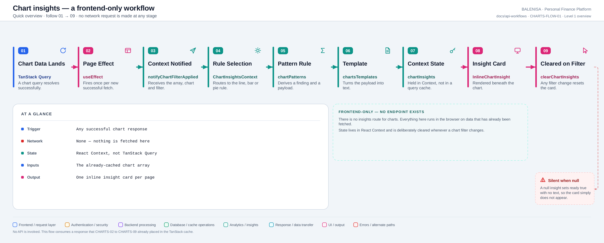
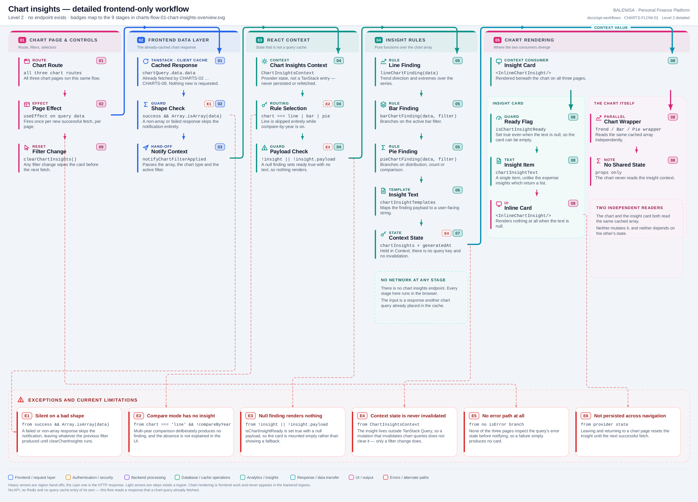

# CHARTS-FLOW-01 — Chart insights (frontend-only)

No endpoint. No network request. No query-cache entry of its own.

Every statement below is traced to the current repository implementation.

## 1. Purpose

Derives a one-line written insight from a chart response that a chart query has **already**
fetched, and renders it beneath the chart. This is documented as a flow rather than an API
because there is no chart-insights route anywhere in the backend — `chart.routes.js` mounts
nine routes and none of them is an insights endpoint.

## 2. Trigger and inputs

| | |
|---|---|
| **Trigger** | A successful response from CHARTS-02 … CHARTS-09 |
| **Input** | The cached array `chartQuery.data.data` |
| **Network** | None at any stage |
| **State store** | React Context (`ChartInsightsContext`) — **not** TanStack Query |
| **Output** | One `<InlineChartInsight/>` per chart page |

## 3. Level 1 quick workflow

<picture>
  <source srcset="charts-flow-01-chart-insights-overview.svg" type="image/svg+xml">
  
</picture>

Vector: [`charts-flow-01-chart-insights-overview.svg`](charts-flow-01-chart-insights-overview.svg) ·
raster fallback: [`charts-flow-01-chart-insights-overview.png`](charts-flow-01-chart-insights-overview.png)

## 4. Level 2 detailed workflow

<picture>
  <source srcset="charts-flow-01-chart-insights-detailed.svg" type="image/svg+xml">
  
</picture>

Vector: [`charts-flow-01-chart-insights-detailed.svg`](charts-flow-01-chart-insights-detailed.svg) ·
raster fallback: [`charts-flow-01-chart-insights-detailed.png`](charts-flow-01-chart-insights-detailed.png)

## 5. Execution sequence

1. A chart query resolves. Each of the three chart pages runs a `useEffect` keyed on
   `query.data`.
2. The effect guards on `data?.success && Array.isArray(data.data)` — a failed or
   wrongly-shaped response is skipped silently.
3. `notifyChartFilterApplied(array, chartType, filter, compareByYear)` is called on the
   context.
4. The context routes to one of three pure rules:
   - `lineChartFinding(data)` — **only when `compareByYear` is false**
   - `barChartFinding(data, filter)`
   - `pieChartFinding(data, filter)`
5. If the rule returns nothing, or a result with no `payload`, the context sets
   `chartInsights` to `null` and `isChartInsightReady` to `true`.
6. Otherwise `chartInsightTemplates[type](payload)` produces the text.
7. `InlineChartInsight` renders — or renders nothing when the text is null.
8. Any filter change calls `clearChartInsights()`, which resets both pieces of state.

## 6. Where each consumer gets its data

The chart and the insight card are **two independent readers of the same cached array**.
Neither copies it, neither mutates it, and the chart never reads the insight context.

| Chart page | Feeds the chart | Feeds the insight |
|---|---|---|
| `TrendChartPage` | `TrendChartWrapper` / `MultiTrendChartWrapper` | `lineChartFinding` (skipped in compare mode) |
| `BarChartPage` | `BarChartWrapper` | `barChartFinding(data, viewBy)` |
| `PieChartPage` | `PieChartWrapper` | `pieChartFinding(data, show)` |

## 7. Cache and state behaviour

| Layer | Behaviour |
|---|---|
| Redis | Absent — nothing server-side is involved |
| TanStack Query | Reads an existing entry; creates none |
| React Context | Holds `chartInsights` and `isChartInsightReady` |
| Invalidation | **None.** A mutation that invalidates `["charts"]` refetches the chart but does not clear the insight; only a filter change does |
| Persistence | Provider state — lost on navigation away from the chart pages |

## 8. Loading, empty and error behaviour

| State | Behaviour |
|---|---|
| Loading | `isChartInsightReady` is false → no card |
| Success with a finding | One insight item rendered |
| Success with no finding | `isChartInsightReady` true, text `null` → card renders nothing |
| Compare-by-year mode | Deliberately skipped; nothing explains the absence |
| Query error | The effect's guard fails, so nothing is notified. No error path exists |

## 9. Files involved

| Layer | File | Function/Export | Purpose |
|---|---|---|---|
| Trigger | `frontend/src/components/charts/linechart/TrendChartPage.js` | `useEffect` | Notifies on each successful trend fetch |
| Trigger | `frontend/src/components/charts/barchart/BarChartPage.js` | `useEffect` | Notifies on each successful bar fetch |
| Trigger | `frontend/src/components/charts/piechart/PieChartPage.js` | `useEffect` | Notifies on each successful pie fetch |
| Context | `frontend/src/components/contexts/ai-contexts/ChartInsightsContext.js` | `notifyChartFilterApplied`, `clearChartInsights` | Rule routing and state |
| Rules | `frontend/src/insights-engine/rules/chartPatterns.js` | `lineChartFinding`, `barChartFinding`, `pieChartFinding` | Pure findings over the array |
| Templates | `frontend/src/insights-engine/templates/chartsTemplates.js` | `chartInsightTemplates` | Payload → text |
| UI | `frontend/src/components/insights/InlineChartInsight.js` | `InlineChartInsight` | The rendered card |

## 10. Current implementation observations

**Summary:** Correctness 2 · Security / operational 0 · Reliability 1 · Maintainability 3

### Correctness

1. **A null finding still reports "ready".** The context sets `isChartInsightReady = true`
   alongside `chartInsights = null`, so `{isChartInsightReady && <InlineChartInsight …/>}`
   mounts a component that renders nothing. The user cannot distinguish "no pattern worth
   reporting" from "still loading".

2. **Compare-by-year silently produces no insight.** `lineChartFinding` is called only when
   `compareByYear` is false. Turning the comparison on removes the insight card with no
   explanation, which reads as a bug rather than a deliberate limitation.

### Reliability

3. **No error path.** None of the three pages inspect `query.isError` before notifying. A
   failed chart fetch leaves whatever the previous filter produced until a filter change
   clears it — the one case where a genuinely stale insight can remain on screen.

### Maintainability

4. **Insight state lives outside the query cache.** Chart data is invalidated by expense and
   budget mutations; the derived insight is not, because Context has no invalidation
   concept. The two can therefore disagree until the next filter change.

5. **The chart insight returns a single item** while the expense insights engine returns a
   list of `{ severity, text }`. Two adjacent features in the same `insights-engine`
   directory use different output contracts.

6. **`clearChartInsights` is called from a mount effect on every chart page**, so navigating
   between chart types always discards the previous insight even when the underlying query
   result is still cached and valid.
