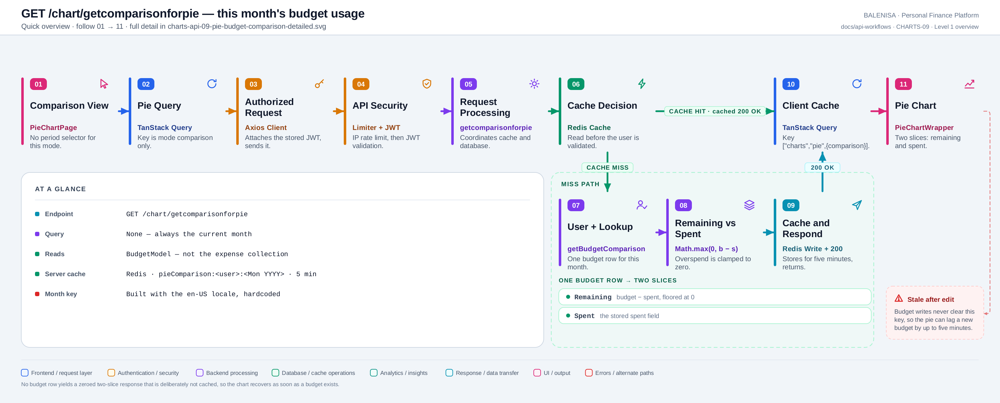
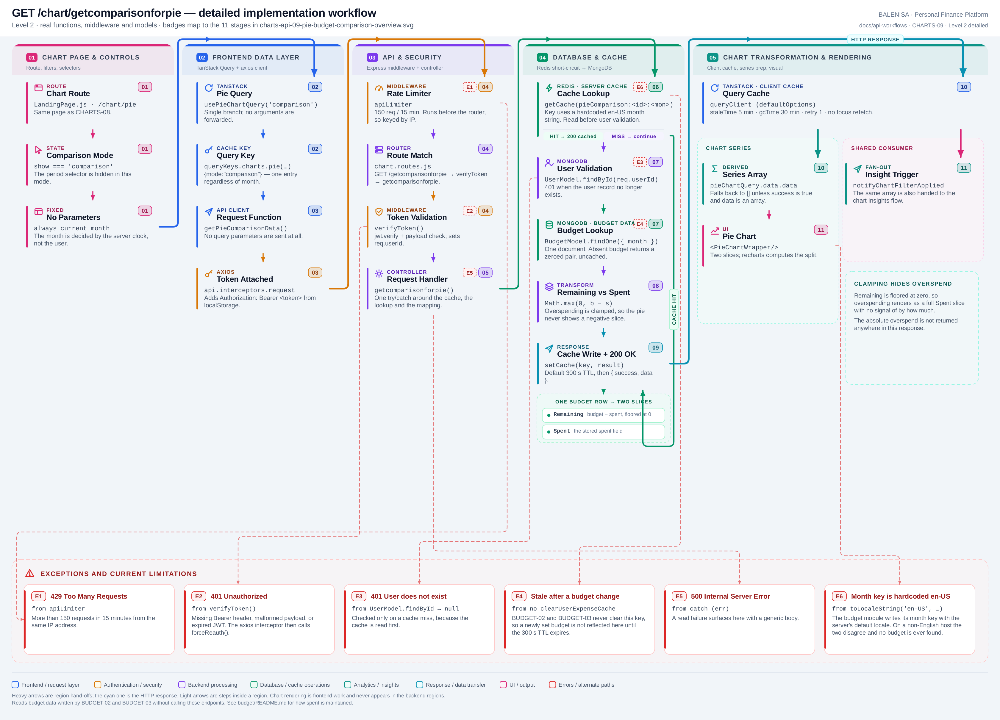

# CHARTS-09 — This month's budget usage

`GET /chart/getcomparisonforpie`

Every statement below is traced to the current repository implementation.

## 1. Purpose

Returns the current month's remaining budget and amount spent as two slices, for the pie chart's comparison mode.

## 2. Endpoint and HTTP method

| | |
|---|---|
| **Method** | `GET` |
| **Path** | `/chart/getcomparisonforpie` |
| **Mount** | `app.use("/chart", apiLimiter, chartRouter)` — `backend/server.js` |
| **Middleware** | `apiLimiter` → `verifyToken` → `getcomparisonforpie` |
| **Auth** | Required — Bearer JWT |
| **Parameters** | None |
| **Server cache** | **Redis** · `pieComparison:<userId>:<Mon YYYY>` · 300 s |
| **Aggregation runs in** | **MongoDB read, mapped in backend JavaScript** — no expense query at all |

## 3. Level 1 quick workflow

<picture>
  <source srcset="charts-api-09-pie-budget-comparison-overview.svg" type="image/svg+xml">
  
</picture>

Vector: [`charts-api-09-pie-budget-comparison-overview.svg`](charts-api-09-pie-budget-comparison-overview.svg) ·
raster fallback: [`charts-api-09-pie-budget-comparison-overview.png`](charts-api-09-pie-budget-comparison-overview.png)

## 4. Level 2 detailed workflow

<picture>
  <source srcset="charts-api-09-pie-budget-comparison-detailed.svg" type="image/svg+xml">
  
</picture>

Vector: [`charts-api-09-pie-budget-comparison-detailed.svg`](charts-api-09-pie-budget-comparison-detailed.svg) ·
raster fallback: [`charts-api-09-pie-budget-comparison-detailed.png`](charts-api-09-pie-budget-comparison-detailed.png)

## 5. Request structure

```http
GET /chart/getcomparisonforpie HTTP/1.1
Authorization: Bearer <jwt>
```

## 6. Response structure

```jsonc
{ "success": true, "data": [ { "category": "Remaining", "total": 3800 },
                                  { "category": "Spent", "total": 41200 } ] }
```

With **no budget document** the response is `[{Budget: 0}, {Spent: 0}]` — note the first label is `Budget`, not `Remaining` — and this response is deliberately **not cached**.

## 7. Period and date-range behaviour

The month key is built with `toLocaleString('en-US', { month:'short', year:'numeric' })` — a **hardcoded** locale, unlike the budget module which uses the server's default. There is no user-selectable period.

## 8. Frontend consumption

`usePieChartQuery('comparison')` takes no arguments. `PieChartWrapper` renders the two slices and lets recharts compute the split.

## 9. Chart-data transformation

`getBudgetComparison({ mode: 'month' })` reads one budget document and returns `{ remaining: Math.max(0, budget - spent), spent }`. The controller maps that to two `{ category, total }` entries. **Overspending is clamped to zero.**

## 10. Query cache and state behaviour

| Layer | Behaviour |
|---|---|
| Redis | `pieComparison:<userId>:<Mon YYYY>`, default 300 s TTL. Read **before** user validation |
| Redis invalidation | Registered in `cachekeys:<userId>`, so expense mutations clear it — but **budget mutations do not** |
| TanStack Query | Key `["charts","pie",{mode:"comparison"}]` — one entry, no month in the key |
| Local state | `show` in `PieChartPage` |

## 11. Loading, empty and error behaviour

| State | Behaviour |
|---|---|
| Loading | `shouldRenderChart` is false, so no chart element mounts |
| Success | The chart renders |
| Empty | `data` is `[]` → no chart and no empty-state message |
| Error | `data` falls back to `[]` → identical to empty. No toast on any chart page |

## 12. Files involved

| Layer | File | Function/Export | Purpose |
|---|---|---|---|
| Page | `frontend/src/components/charts/piechart/PieChartPage.js` | `PieChartPage` | Comparison mode |
| Chart | `frontend/src/components/charts/piechart/PieChartWrapper.js` | `PieChartWrapper` | Two-slice pie |
| Query hook | `frontend/src/hooks/queries/usePieChartQuery.js` | `resolvePieChartMode` | Comparison branch |
| Controller | `backend/Controllers/PieChartControllers/getcomparisonforpie.js` | `getcomparisonforpie` | Cache, lookup, clamp |
| Service | `backend/Services/ChartServices/chart.service.js` | `getBudgetComparison` | Month mode |
| Cache | `backend/utils/expenseCache.js` | `getCache`, `setCache` | Per-user key registration |
| Budget data | `backend/config/Schemas.js` | `BudgetModel` | `spent` maintained by the budget module |
| Interceptors | `frontend/src/api/axios.js` | `api` | Bearer token; 401/429/409 handling |
| Server mount | `backend/server.js` | `app.use("/chart", apiLimiter, chartRouter)` | Rate limiter ahead of the router |
| Route table | `backend/Routes/chart.routes.js` | `router.get(…)` | All nine chart routes |
| Auth | `backend/Middlewares/Auth.js` | `verifyToken` | Verifies JWT, sets `req.userId` |
| API client | `frontend/src/api/chartApi.js` | thin axios wrappers | One function per chart route |

## 13. Current implementation observations

**Summary:** Correctness 2 · Security / operational 2 · Reliability 2 · Maintainability 1

**This route reads budget data written by [BUDGET-02](../../../budget/set-budget/budget-api-02-set-budget.md)
and [BUDGET-03](../../../budget/update-budget/budget-api-03-update-budget.md) without calling them.**

### Correctness

1. **The month key locale disagrees with the budget module.** This controller hardcodes
   `'en-US'`; `setBudgetForCurrentMonth` and `updatebudget` both use `'default'`, which
   resolves to the **server's** locale. On an English host the two agree. On any other host
   the budget is written as e.g. `"juil. 2026"` while this route looks up `"Jul 2026"`,
   finds nothing, and permanently renders a zeroed pie.

2. **Overspending is invisible.** `Math.max(0, budget - spent)` clamps the remaining slice
   at zero, so a month 40 % over budget looks identical to one exactly on budget: a single
   full `Spent` slice. The overspend amount is not returned anywhere in the response.

### Security / operational

- **`apiLimiter` runs before `verifyToken`**, so the limit is keyed by IP rather than by
  account. *(shared by all nine chart routes)*
- **`trust proxy` is not set**, so behind a reverse proxy every user shares one bucket.
  *(shared by all nine chart routes)*

### Reliability

3. **Budget mutations do not clear this cache.** `setbudget` and `updatebudget` call
   `refreshReport` but never `clearUserExpenseCache`, and this key is only registered in the
   per-user set that the latter drains. Setting or changing a budget therefore leaves this
   pie showing the old figures for up to 300 s. Expense mutations *do* clear it, so the
   staleness only appears on the budget path.

4. **The cache is read before the user is validated**, so a deleted account still receives
   data until the TTL expires.

### Maintainability

5. **The zero-budget fallback uses a different label.** It returns `Budget` where the
   normal path returns `Remaining`, so the legend text changes depending on whether a budget
   exists.
