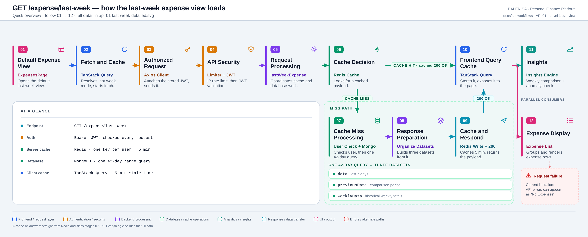
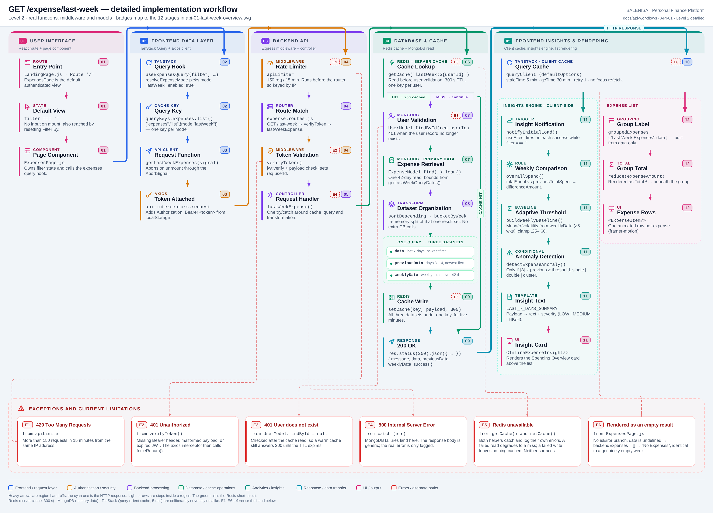

# API-01 — Last-week expense view

`GET /expense/last-week`

Two levels of the same workflow. Start with the overview; drop into the detailed view
when you need real function names. Every statement below is traced to the current
repository implementation.

---

## Level 1 — Quick workflow overview

<picture>
  <source srcset="api-01-last-week-overview.svg" type="image/svg+xml">
  
</picture>

Vector source: [`api-01-last-week-overview.svg`](api-01-last-week-overview.svg) ·
raster preview / fallback: [`api-01-last-week-overview.png`](api-01-last-week-overview.png)

Follow the badges `01 → 12`. The empty column in the top row carries the cache-hit
short-circuit, so the whole flow reads left to right with no backward connectors.

| | |
|---|---|
| **Endpoint** | `GET /expense/last-week` |
| **Auth** | Bearer JWT, validated on every request |
| **Server cache** | Redis · one key per user · 5 min TTL |
| **Database** | MongoDB · one 42-day range query |
| **Client cache** | TanStack Query · 5 min stale time |
| **Returns** | `data`, `previousData`, `weeklyData` — all from that one query |

**Cache hit** answers straight from Redis and skips stages 07–09 entirely: no user
validation, no MongoDB read, no transformation, no cache write.
**Cache miss** runs the full path and writes the result back for five minutes.

After the client cache, two consumers run **in parallel** — the insights engine and the
expense list. The list is built from `data` alone and never waits on insights.

---

## Level 2 — Detailed implementation workflow

<picture>
  <source srcset="api-01-last-week-detailed.svg" type="image/svg+xml">
  
</picture>

Vector source: [`api-01-last-week-detailed.svg`](api-01-last-week-detailed.svg) ·
raster preview / fallback: [`api-01-last-week-detailed.png`](api-01-last-week-detailed.png)

> This is a zoomable engineering reference, not a slide. It is sized to be read at full
> resolution or zoomed; use the Level 1 overview when you need the shape of the flow at a
> glance.

Card badges carry the Level 1 stage numbers, so the two diagrams cross-reference. Heavy
arrows are region hand-offs, the cyan one is the HTTP response, light arrows are steps
inside a region, and the green rail is the Redis short-circuit. `E1`–`E6` tags point at
the exceptions band along the bottom.

### Happy path

The page mounts with `filter === ''`, which `resolveExpenseMode` maps to mode
`"lastWeek"`. `useExpensesQuery` issues the request under the key
`["expenses","list",{mode:"lastWeek"}]`; the shared axios instance attaches the bearer
token from `localStorage`.

Server side, `apiLimiter` runs first, then the router matches, then `verifyToken` sets
`req.userId`. The controller reads Redis; on a miss it validates the user, computes four
date bounds, and performs **one** 42-day `find().lean()` against the
`{ userId, expenseDate }` index. That single result set is sliced in memory into three
datasets, written back to Redis, and returned as one JSON body.

### Cache-hit and cache-miss behaviour

The Redis lookup is a real branch point, and it sits **before** user validation.

**Hit** — returns immediately with `message: "Success (cached)"` and the three datasets
spread from the cached payload. User validation, the MongoDB read, the transformation
and the cache write are all skipped. The response is otherwise identical, so the client
cannot tell a hit from a miss except via `message`.

**Miss** — user validation → `getLastWeekQueryDates()` → single MongoDB read → in-memory
split → `setCache(key, payload, 300)` → `message: "Success"`.

Cache writes also register the key in a per-user set (`cachekeys:<userId>`), which
`clearUserExpenseCache` uses to invalidate everything for that user after an add, edit,
delete, or recurring-expense cron run.

### Request and response

```http
GET /expense/last-week HTTP/1.1
Authorization: Bearer <jwt>
```

```jsonc
{
  "message": "Success",              // "Success (cached)" on a Redis hit
  "data":          [ /* Expense[] — last 7 days, newest first */ ],
  "previousData":  [ /* Expense[] — days 8–14, newest first  */ ],
  "weeklyData":    [ { "week": "2026-07-20", "total": 4820 } ],
  "success": true
}
```

`Expense` documents are lean Mongo objects: `_id`, `userId`, `id`, `expenseName`,
`expenseCategory`, `expenseAmount`, `expenseDate`, `expenseDescription`, `isRecurring`.
`data` and `previousData` are `filter` + `sort` slices; `weeklyData` is `bucketByWeek`
over the whole 42-day window (Monday week starts, ISO date labels).

### Frontend consumption

**Insights path.** A `useEffect` in `ExpensesPage` calls `notifyInitialLoad(data,
previousData, weeklyData)` on each successful fetch while `filter === ''`.
`overallSpend` totals both windows, `buildWeeklyBaseline` derives mean/σ/volatility from
`weeklyData` (needs ≥ 5 buckets, else `null`), and the change threshold is
`clamp(volatility, 0.25, 0.60)` — or a flat `0.30` with no baseline. Only when
`|Δ| ÷ previousTotal ≥ threshold` does `detectExpenseAnomaly` run, classifying the week
as `single`, `double`, or `cluster` dominance. The result renders through
`expenseInsightTemplates.LAST_7_DAYS_SUMMARY` into `<InlineExpenseInsight/>`.

**List path.** `data` alone is grouped as `{ 'Last Week Expenses': data }`, totalled with
a `reduce`, and rendered as one `<ExpenseItem/>` per expense.

### Exceptions, empty and loading states

| Tag | Condition | Where | Result |
|---|---|---|---|
| E1 | > 150 req / 15 min | `apiLimiter` | `429` `{ success:false, message:"Too many requests…" }` |
| E2 | Missing/malformed/expired JWT | `verifyToken` | `401` — client interceptor calls `forceReauth()` |
| E3 | User record missing | `UserModel.findById → null` | `401 "User does not exist"` — **skipped on a cache hit** |
| E4 | MongoDB read failure | controller `catch` | `500 "Internal Server Error"` |
| E5 | Redis failure — read **or** write | `getCache()` and `setCache()` | Both swallow their own errors. A failed read degrades to a miss; a failed write leaves nothing cached. Neither surfaces. |
| E6 | Query error | `ExpensesPage` | Renders "No Expenses" — no error branch exists |
| — | No expenses in window | — | `200` with `data: []` |
| — | Fetch in flight | `expensesQuery.isLoading` | Animated loading dots |

Empty state: `data: []` → `groupedExpenses` stays `{}` → the page renders "No Expenses".
`overallSpend` returns `null` for an empty array, so no insight card is rendered.

---

## Files involved

| Layer | File | Function / export | Purpose |
|---|---|---|---|
| Route mount | `frontend/src/components/landingPage/LandingPage.js` | `<Route path="/">` | Renders `ExpensesPage` as the default authenticated view |
| Page | `frontend/src/components/expensesHandling/ExpensesPage.js` | `ExpensesPage` | Owns filter state, triggers insights, renders list and states |
| Query hook | `frontend/src/hooks/queries/useExpensesQuery.js` | `useExpensesQuery`, `resolveExpenseMode` | Maps filter mode → key + query fn |
| Cache key | `frontend/src/query/queryKeys.js` | `queryKeys.expenses.list` | `["expenses","list",{mode:"lastWeek"}]` |
| Client cache | `frontend/src/query/queryClient.js` | `queryClient` | staleTime 5 min, gcTime 30 min, retry 1 |
| API client | `frontend/src/api/expenseApi.js` | `getLastWeekExpenses` | `GET /expense/last-week` with abort signal |
| Interceptors | `frontend/src/api/axios.js` | `api` | Attaches bearer token; routes errors to `handleApiError` |
| Error handling | `frontend/src/api/handleApiError.js` | `handleApiError`, `forceReauth` | Global 401 / 429 / 409 handling |
| Server mount | `backend/server.js` | `app.use("/expense", …)` | Applies `apiLimiter` ahead of the router |
| Rate limit | `backend/utils/rateLimiter.js` | `apiLimiter` | 150 req / 15 min |
| Route | `backend/Routes/expense.routes.js` | `router.get('/last-week', …)` | `verifyToken` → `lastWeekExpense` |
| Auth | `backend/Middlewares/Auth.js` | `verifyToken` | Verifies JWT, sets `req.userId` |
| Controller | `backend/Controllers/GetExpenseControllers/lastweekexpense.js` | `lastWeekExpense` | Orchestrates cache, query, transform, response |
| Data access | `backend/Controllers/GetExpenseControllers/fetchExpenses.js` | `fetchExpense` | Shared inclusive date-range read |
| Date helper | `backend/Services/HelperServices/datecal.service.js` | `getLastWeekQueryDates` | `now`, −7 d, −14 d, −42 d |
| Transform | `backend/Services/HelperServices/getexpense.service.js` | `sortDescending`, `sortAscending`, `bucketByWeek` | Ordering and weekly bucketing |
| Cache | `backend/utils/expenseCache.js` | `getCache`, `setCache`, `clearUserExpenseCache` | Redis read/write + per-user invalidation set |
| Redis | `backend/config/redis.js` | `redisClient` | Best-effort client; errors logged, not thrown |
| Models | `backend/config/Schemas.js` | `ExpenseModel`, `UserModel` | `expenseSchema.index({ userId: 1, expenseDate: 1 })` |
| Insights ctx | `frontend/src/components/contexts/ai-contexts/ExpenseInsightsContext.js` | `notifyInitialLoad` | Entry point into the insights engine |
| Insights rule | `frontend/src/insights-engine/rules/overallSpend.js` | `overallSpend` | Week-over-week comparison + threshold |
| Baseline | `frontend/src/insights-engine/learning/thresholdAdapter/buildWeeklyBaseline.js` | `buildWeeklyBaseline` | Mean / σ / volatility from `weeklyData` |
| Statistics | `frontend/src/insights-engine/statistics/statsCalculation.js` | `findMean`, `findVariance` | Shared statistical helpers |
| Anomaly | `frontend/src/insights-engine/knowledge/anomalyDetection.js` | `detectExpenseAnomaly` | single / double / cluster dominance |
| Template | `frontend/src/insights-engine/templates/expenseTemplates.js` | `expenseInsightTemplates.LAST_7_DAYS_SUMMARY` | Payload → text + severity |
| Insight UI | `frontend/src/components/insights/InlineExpenseInsight.js` | `InlineExpenseInsight` | Spending Overview card |
| List UI | `frontend/src/components/expensesHandling/ExpenseItem.js` | `ExpenseItem` | One row per expense |

---

## Current implementation observations

Recorded as found. Nothing here is changed by this document.

**Summary:** Correctness 5 · Security / operational 2 · Reliability 1 · Maintainability 2
— plus the two lower-impact maintainability notes listed after the table.

| # | Observation | Classification |
|---|---|---|
| 1 | **The rate limiter executes before `verifyToken`.** `app.use("/expense", apiLimiter, expenseRouter)` puts `apiLimiter` ahead of the router, so it runs before any auth middleware. | Correctness |
| 2 | **The limiter therefore always falls back to IP keys.** `keyGenerator: (req) => req.userId \|\| ipKeyGenerator(req.ip)` — `req.userId` is still `undefined` at that point, so the user branch is never taken. The comment in `server.js` states the opposite. Applies to every group mounted this way: `/api`, `/expense`, `/bills`, `/ml`, `/report`, `/chart`, `/income`. | Security / operational |
| 3 | **`trust proxy` is not set.** Behind a reverse proxy or load balancer, `req.ip` resolves to the proxy, so every user shares a single 150-request bucket. | Security / operational |
| 4 | **Redis failures are swallowed on both read and write.** `getCache` catches and returns `null`; `setCache` catches and logs. A failed read degrades the endpoint to cache-miss behaviour; a failed write silently leaves nothing cached, so the next request pays full cost again. Good for availability, but the degradation is invisible — no metric, no alert. | Reliability |
| 5 | **The cache lookup precedes user-existence validation.** `getByCategory` and `getByCustom` both validate first. Here a warm cache returns `200` for a user whose record no longer exists, until the 300 s TTL expires. | Correctness |
| 6 | **The frontend has no distinct API error state.** `ExpensesPage` reads `isLoading` but never `isError`. On failure `data` is `undefined`, `backendExpenses` falls back to `[]`, and the page renders "No Expenses" — indistinguishable from a genuinely empty week. 401 is the one exception, intercepted globally by `handleApiError` → `forceReauth()`. | Correctness |
| 7 | **`scope: "LAST_7_DAYS"` is passed but unused.** `ExpenseInsightsContext` sends it into `overallSpend`, which never reads it; the returned `type` is hardcoded to `"LAST_7_DAYS_SUMMARY"`. | Maintainability |
| 8 | **`weeklyData` default types disagree.** `notifyInitialLoad` defaults it to `{}` (object) while `overallSpend` and `buildWeeklyBaseline` default to `[]`. The `Array.isArray` guard makes this safe today, but the contract is ambiguous. | Maintainability |
| 9 | **The current partial week feeds the volatility baseline.** A 42-day window yields 6–7 `bucketByWeek` buckets, of which the newest and oldest are almost always partial. Those partial totals set the mean and σ behind the adaptive threshold, biasing it low. | Correctness |
| 10 | **Date windows are rolling, not calendar-aligned.** `getLastWeekQueryDates` derives bounds from `new Date()` without normalising time-of-day, so "last 7 days" is a rolling 168-hour window. `bucketByWeek` normalises to Monday 00:00 — the two groupings do not share boundaries. | Correctness |

Also noted, lower impact:

- `sortAscending(allExpenses)` before `bucketByWeek` is redundant — `bucketByWeek` builds a
  keyed object and sorts its own output. The call mutates `allExpenses` in place; harmless
  today only because nothing reads it afterwards. *(Maintainability)*
- Cached and fresh responses differ only in `message` (`"Success (cached)"` vs `"Success"`).
  No client code branches on this. *(Maintainability)*

---

**Next in this set (awaiting approval of both API-01 diagrams):**
`GET /expense/by-category?period=thismonth`, `GET /expense/by-category` (default year),
`GET /expense/search?startDate&endDate`.
