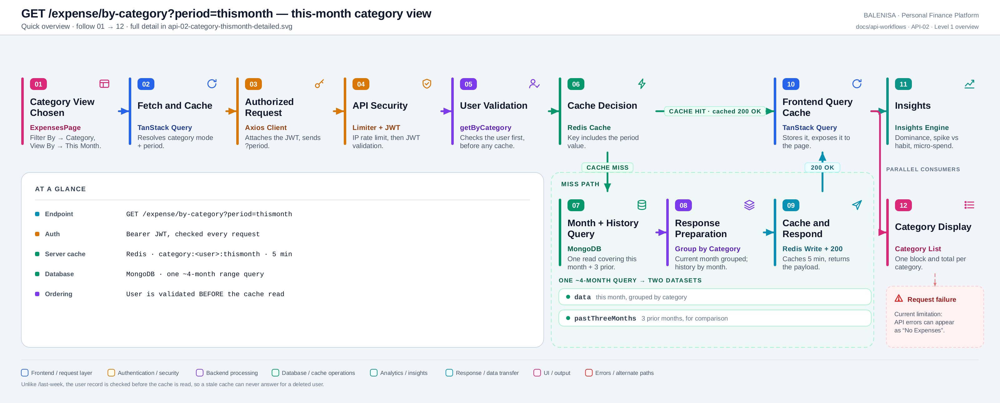
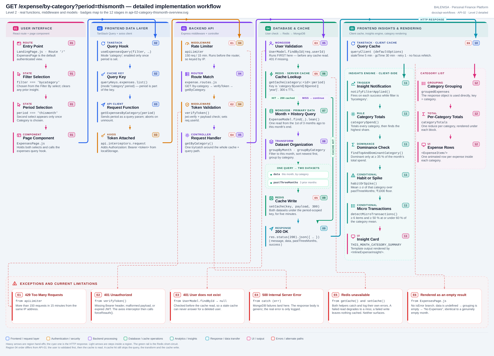

# API-02 — This-month category view

`GET /expense/by-category?period=thismonth`

Two levels of the same workflow. Every statement below is traced to the current
repository implementation.

> **This is the route's one API document.** `/expense/by-category` has exactly one
> controller, `getByCategory`, and — under this corpus's coverage rules — exactly one API
> workflow document: this one. This document covers the `period === 'thismonth'` branch;
> the else branch is documented separately as a **non-API branch document**,
> [BRANCH-01](api-03-category-thisyear.md) — not a second API workflow for this route.
> Everything up to the branch point is identical between the two.

---

## Level 1 — Quick workflow overview

<picture>
  <source srcset="api-02-category-thismonth-overview.svg" type="image/svg+xml">
  
</picture>

Vector source: [`api-02-category-thismonth-overview.svg`](api-02-category-thismonth-overview.svg) ·
raster preview / fallback: [`api-02-category-thismonth-overview.png`](api-02-category-thismonth-overview.png)

| | |
|---|---|
| **Endpoint** | `GET /expense/by-category?period=thismonth` |
| **Auth** | Bearer JWT, validated on every request |
| **Server cache** | Redis · `category:<userId>:thismonth` · 5 min TTL |
| **Database** | MongoDB · one ~4-month range query |
| **Client cache** | TanStack Query · 5 min stale time |
| **Returns** | `data` (this month by category), `pastThreeMonths` (3 prior months) |

**The one structural difference from API-01:** this controller calls
`UserModel.findById` **before** it reads the cache. On `/last-week` the order is
reversed. That is why stage 05 here is User Validation and stage 06 is the Cache
Decision.

---

## Level 2 — Detailed implementation workflow

<picture>
  <source srcset="api-02-category-thismonth-detailed.svg" type="image/svg+xml">
  
</picture>

Vector source: [`api-02-category-thismonth-detailed.svg`](api-02-category-thismonth-detailed.svg) ·
raster preview / fallback: [`api-02-category-thismonth-detailed.png`](api-02-category-thismonth-detailed.png)

> Zoomable engineering reference. Use the Level 1 overview for the shape of the flow.

### Happy path

Choosing **Filter By → Category** sets `filter === 'bycategory'` and reveals a second
select; choosing **This Month** sets `period === 'thismonth'`. Only then does
`resolveExpenseMode` return `enabled: true`, so nothing is fetched while the period is
still blank. The query key is `["expenses","list",{mode:"category",period}]` — the
period is part of the key, so switching to This Year is a separate cache entry.

Server side the middleware chain is identical to API-01. Inside `getByCategory` the
user is validated first, then `getCache` is called with
`` `category:${req.userId}:${req.query.period || 'year'}` ``. On a miss the controller
computes the current month's bounds plus a `threeMonthsAgo` anchor, and issues **one**
`find().lean()` covering the whole span. `groupByMonth` builds the three-month history
from that same result set, the current month is filtered out of it, sorted newest first,
and grouped by category.

### Cache-hit and cache-miss behaviour

**Hit** — returns immediately with `message: "Success (cached)"`, spreading `data` and
`pastThreeMonths` from the cached payload. The query, the transform and the cache write
are skipped. The user has already been validated at this point, so a stale cache can
never answer for a deleted account — unlike API-01.

**Miss** — month bounds → one ~4-month `find()` → `groupByMonth` → filter → sort → group
by category → `setCache(key, payload, 300)` → `message: "Success"`.

Cache keys are registered in the per-user set `cachekeys:<userId>`, so
`clearUserExpenseCache` invalidates this entry alongside every other expense cache after
an add, edit, delete or recurring-expense cron run.

### Request and response

```http
GET /expense/by-category?period=thismonth HTTP/1.1
Authorization: Bearer <jwt>
```

```jsonc
{
  "message": "Success",              // "Success (cached)" on a Redis hit
  "data": {                          // object, NOT an array
    "Food":      [ /* Expense[] */ ],
    "Transport": [ /* Expense[] */ ]
  },
  "pastThreeMonths": [
    { "month": "2026-6", "categories": { "Food": [ /* Expense[] */ ] } },
    { "month": "2026-5", "categories": { } },
    { "month": "2026-4", "categories": { } }
  ],
  "success": true
}
```

`data` is a plain object keyed by `expenseCategory`, defaulting to `"Others"` when a
document has no category. `pastThreeMonths` always holds exactly three entries, newest
first, even when a month has no expenses.

### Frontend consumption

**Insights path.** `notifyFilterApplied(data, pastThreeMonths, period)` runs on each
successful fetch while `filter === 'bycategory'`. `categorySpend` totals every category
and `findTopAndDominantCategory` picks the highest; for this branch a category is
*dominant* only at **≥ 35 %** of the month's total. When one is dominant,
`habitOrSpike` compares it against the mean ± σ of the same category across
`pastThreeMonths` (with a ₹1000 floor below which everything is reported as neutral),
and `detectMicroTransactions` flags the busiest category when it has ≥ 6 items and ≥ 50 %
of them sit at or under 60 % of that category's mean. Output renders through
`THIS_MONTH_CATEGORY_SUMMARY`.

**List path.** The response object is used directly as `groupedExpenses`; one `reduce`
per category produces `categoryTotals`, and each category renders as its own block with
its own total. This path never touches `pastThreeMonths`.

### Exceptions, empty and loading states

| Tag | Condition | Where | Result |
|---|---|---|---|
| E1 | > 150 req / 15 min | `apiLimiter` | `429` |
| E2 | Missing/malformed/expired JWT | `verifyToken` | `401` — interceptor calls `forceReauth()` |
| E3 | User record missing | `UserModel.findById → null` | `401` — checked **before** the cache read |
| E4 | MongoDB read failure | controller `catch` | `500` |
| E5 | Redis failure — read **or** write | `getCache()` / `setCache()` | Swallowed; degrades to a permanent miss |
| E6 | Query error | `ExpensesPage` | Renders "No Expenses" — no error branch |
| — | No expenses this month | — | `200` with `data: {}` |
| — | Period not yet chosen | `resolveExpenseMode` | Query stays disabled; nothing is fetched |
| — | Fetch in flight | `expensesQuery.isLoading` | Animated loading dots |

Empty state: `data: {}` → `Object.keys(...).length === 0` → the page renders "No
Expenses". `categorySpend` returns `null` for an empty object, so no insight card
appears.

---

## Files involved

Identical to API-01 except for the rows below; see
[api-01-last-week.md](api-01-last-week.md#files-involved) for the shared middleware,
axios, query-client and model layers.

| Layer | File | Function / export | Purpose |
|---|---|---|---|
| Page | `frontend/src/components/expensesHandling/ExpensesPage.js` | `ExpensesPage` | Owns both selects; renders one block per category |
| Query hook | `frontend/src/hooks/queries/useExpensesQuery.js` | `resolveExpenseMode` | Mode `'category'`, enabled only once `period` is set |
| API client | `frontend/src/api/expenseApi.js` | `getExpensesByCategory` | `GET /expense/by-category?period=…` |
| Route | `backend/Routes/expense.routes.js` | `router.get('/by-category', …)` | `verifyToken` → `getByCategory` |
| Controller | `backend/Controllers/GetExpenseControllers/getbycategory.js` | `getByCategory` | User check → cache → month + history query → group |
| Transform | `backend/Services/HelperServices/getexpense.service.js` | `groupByMonth`, `groupByCategoryHelper`, `sortDescending` | History by month, current month by category |
| Insights ctx | `frontend/src/components/contexts/ai-contexts/ExpenseInsightsContext.js` | `notifyFilterApplied` | Entry point for the category insight |
| Insights rule | `frontend/src/insights-engine/rules/categoryPatterns.js` | `categorySpend`, `findTopAndDominantCategory`, `habitOrSpike`, `detectMicroTransactions` | Dominance, spike-vs-habit, micro-spend |
| Template | `frontend/src/insights-engine/templates/expenseTemplates.js` | `expenseInsightTemplates.THIS_MONTH_CATEGORY_SUMMARY` | Payload → text + severity |

---

## Current implementation observations

**Summary:** Correctness 3 · Security / operational 2 · Reliability 1 · Maintainability 2

Observations 1–3 (rate limiter ordering, IP-key fallback, `trust proxy`) and the Redis and
frontend-error-state findings are shared with API-01 and are not repeated in full here —
see [api-01-last-week.md](api-01-last-week.md#current-implementation-observations).

| # | Observation | Classification |
|---|---|---|
| 1 | **`habitOrSpike` can return `null` but its result is destructured unconditionally.** `const { isConsistent, … } = habitOrSpike(dominant, pastThreeMonths)` throws a `TypeError` if `pastThreeMonths` has fewer than 3 entries. Safe today only because the backend always emits exactly three, including on a cache hit — but nothing enforces that contract. | Correctness |
| 2 | **The ₹1000 floor is absolute, not relative.** Any dominant category under ₹1000 is reported as neither consistent nor a spike, regardless of how far it deviates from its own history. Low-spend users therefore never see the second insight line. | Correctness |
| 3 | **`groupByMonth` recomputes its own window.** It derives months −1…−3 from `new Date()` rather than from the range it was handed, so it silently depends on the caller having fetched at least that far back. The two are consistent today only by coincidence of both reading `now`. | Correctness |
| 4 | **Rate limiter runs before `verifyToken`**, so it always falls back to IP keys. | Security / operational |
| 5 | **`trust proxy` is unset**, so behind a proxy every user shares one bucket. | Security / operational |
| 6 | **Redis failures are swallowed on both read and write**, degrading silently to a permanent cache miss. | Reliability |
| 7 | **The frontend has no distinct API error state** — a failed query renders as "No Expenses". | Maintainability |
| 8 | **The period value is trusted as a cache-key component.** `req.query.period` goes straight into `` `category:${userId}:${period || 'year'}` `` with no allow-list. Only `thismonth` changes behaviour, so any other string produces a distinct cache entry holding identical yearly data — unbounded key growth per user, bounded only by the 5-minute TTL. | Maintainability |
