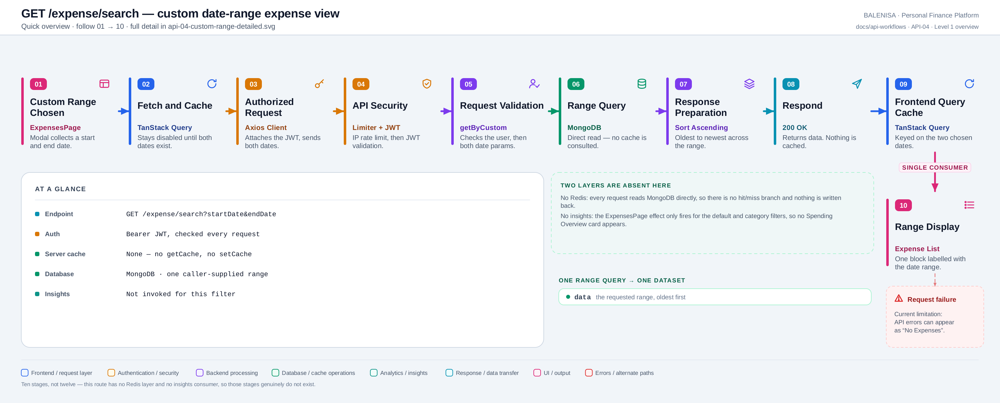
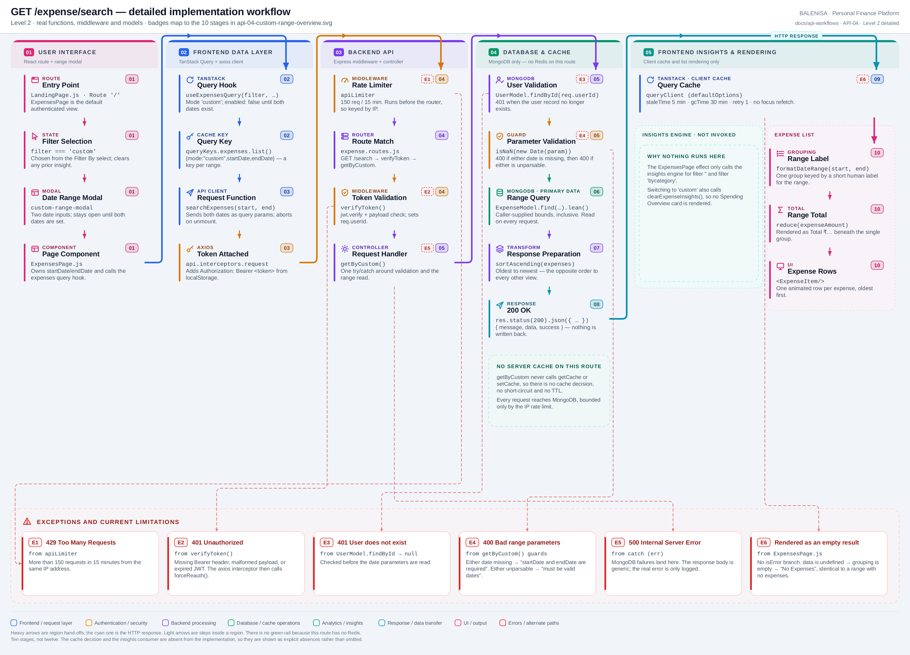

# API-04 — Custom date-range view

`GET /expense/search?startDate&endDate`

Two levels of the same workflow. Every statement below is traced to the current
repository implementation.

> **Two layers are genuinely absent.** `getByCustom` never calls `getCache` or
> `setCache`, and `ExpensesPage` never notifies the insights engine for this filter. The
> diagrams draw both as explicit absences rather than omitting them, so the difference
> from API-01/02/03 is visible rather than inferred. That is also why this workflow has
> **ten stages, not twelve**.

---

## Level 1 — Quick workflow overview

<picture>
  <source srcset="api-04-custom-range-overview.svg" type="image/svg+xml">
  
</picture>

Vector source: [`api-04-custom-range-overview.svg`](api-04-custom-range-overview.svg) ·
raster preview / fallback: [`api-04-custom-range-overview.png`](api-04-custom-range-overview.png)

| | |
|---|---|
| **Endpoint** | `GET /expense/search?startDate&endDate` |
| **Auth** | Bearer JWT, validated on every request |
| **Server cache** | **None** — no `getCache`, no `setCache` |
| **Database** | MongoDB · one caller-supplied range, read on every request |
| **Client cache** | TanStack Query · 5 min stale time, keyed on both dates |
| **Insights** | Not invoked for this filter |
| **Returns** | `data` — the range, **oldest first** |

---

## Level 2 — Detailed implementation workflow

<picture>
  <source srcset="api-04-custom-range-detailed.svg" type="image/svg+xml">
  
</picture>

Vector source: [`api-04-custom-range-detailed.svg`](api-04-custom-range-detailed.svg) ·
raster preview / fallback: [`api-04-custom-range-detailed.png`](api-04-custom-range-detailed.png)

> Zoomable engineering reference. Use the Level 1 overview for the shape of the flow.

### Happy path

Choosing **Filter By → Custom** sets `filter === 'custom'` and opens a modal holding two
`<input type="date">` fields. The modal stays open while either date is blank, and
`resolveExpenseMode` keeps the query `enabled: false` until both exist — so no request is
made against a half-filled range. The key is
`["expenses","list",{mode:"custom",startDate,endDate}]`, one entry per range.

Server side the middleware chain is identical to the other three routes. Inside
`getByCustom` the user is validated, then both parameters are checked twice — first for
presence, then for parsability — before a single `find().lean()` over the caller's
bounds. The result is sorted **ascending** and returned. Nothing is cached at any point.

### Request and response

```http
GET /expense/search?startDate=2026-07-01&endDate=2026-07-31 HTTP/1.1
Authorization: Bearer <jwt>
```

```jsonc
{
  "message": "Success",
  "data": [ /* Expense[] — the range, oldest first */ ],
  "success": true
}
```

There is no `message: "Success (cached)"` variant on this route, because there is no
cache to hit.

### Frontend consumption

A single consumer. `data` is wrapped in one group whose key is
`formatDateRange(startDate, endDate)` — a short human label that collapses a shared month
or year (`"Jul 1–31, 2026"`). One `reduce` produces the group total, and each expense
renders as an `<ExpenseItem/>`, oldest first.

No insight card appears. The `useEffect` in `ExpensesPage` branches only on
`filter === ""` and `filter === "bycategory"`; switching to `custom` also calls
`clearExpenseInsights()`, which sets `isInsightReady` back to `false`.

### Exceptions, empty and loading states

| Tag | Condition | Where | Result |
|---|---|---|---|
| E1 | > 150 req / 15 min | `apiLimiter` | `429` |
| E2 | Missing/malformed/expired JWT | `verifyToken` | `401` — interceptor calls `forceReauth()` |
| E3 | User record missing | `UserModel.findById → null` | `401`, checked before the date params |
| E4 | Either date missing | `getByCustom` guard | `400 "startDate and endDate are required"` |
| E4 | Either date unparsable | `isNaN(new Date(…))` | `400 "startDate and endDate must be valid dates"` |
| E5 | MongoDB read failure | controller `catch` | `500` |
| E6 | Query error | `ExpensesPage` | Renders "No Expenses" — no error branch |
| — | No expenses in range | — | `200` with `data: []` |
| — | Only one date chosen | `resolveExpenseMode` | Query stays disabled; the modal stays open |
| — | Fetch in flight | `expensesQuery.isLoading` | Animated loading dots |

Note that neither `400` can normally be reached through the UI: the query is disabled
until both dates exist, and a native date input cannot emit an unparsable value. They
guard direct API callers.

---

## Files involved

| Layer | File | Function / export | Purpose |
|---|---|---|---|
| Page | `frontend/src/components/expensesHandling/ExpensesPage.js` | `ExpensesPage` | Owns `startDate`/`endDate`, renders the modal and the single group |
| Range label | `frontend/src/components/imports/expensesImport.js` | `formatDateRange` | Collapses a shared month or year into one short label |
| Query hook | `frontend/src/hooks/queries/useExpensesQuery.js` | `resolveExpenseMode` | Mode `'custom'`, enabled only once both dates exist |
| Cache key | `frontend/src/query/queryKeys.js` | `queryKeys.expenses.list` | One entry per `{startDate,endDate}` pair |
| API client | `frontend/src/api/expenseApi.js` | `searchExpenses` | `GET /expense/search?startDate&endDate` |
| Interceptors | `frontend/src/api/axios.js` | `api` | Attaches bearer token; routes errors to `handleApiError` |
| Server mount | `backend/server.js` | `app.use("/expense", …)` | Applies `apiLimiter` ahead of the router |
| Route | `backend/Routes/expense.routes.js` | `router.get('/search', …)` | `verifyToken` → `getByCustom` |
| Auth | `backend/Middlewares/Auth.js` | `verifyToken` | Verifies JWT, sets `req.userId` |
| Controller | `backend/Controllers/GetExpenseControllers/getbycustom.js` | `getByCustom` | User check, date guards, range read, ascending sort |
| Data access | `backend/Controllers/GetExpenseControllers/fetchExpenses.js` | `fetchExpense` | Shared inclusive date-range read |
| Transform | `backend/Services/HelperServices/getexpense.service.js` | `sortAscending` | Oldest to newest |
| Models | `backend/config/Schemas.js` | `ExpenseModel`, `UserModel` | `expenseSchema.index({ userId: 1, expenseDate: 1 })` |
| List UI | `frontend/src/components/expensesHandling/ExpenseItem.js` | `ExpenseItem` | One row per expense |

---

## Current implementation observations

**Summary:** Correctness 3 · Security / operational 3 · Reliability 1 · Maintainability 2

| # | Observation | Classification |
|---|---|---|
| 1 | **The end date is parsed as UTC midnight, so the last day is effectively excluded.** `new Date("2026-07-31")` yields `2026-07-31T00:00:00Z`. Any expense stored later that day falls outside `$lte` and is silently missing from the range. A user selecting 1–31 July does not see 31 July's spending. | Correctness |
| 2 | **A reversed range is not rejected.** `startDate > endDate` passes both guards, produces an empty `$gte`/`$lte` window, and returns `200` with `data: []` — indistinguishable from a range that genuinely has no expenses. | Correctness |
| 3 | **Sort order is inverted relative to every other expense view.** This route returns oldest-first (`sortAscending`); `/last-week` and `/by-category` both return newest-first. The same `<ExpenseItem/>` list therefore reads in the opposite direction depending on the active filter, with nothing in the UI signalling the change. | Correctness |
| 4 | **No upper bound on the requested range.** A caller can ask for ten years in one request. The `{ userId, expenseDate }` index keeps the query efficient, but the response size and the JSON serialisation cost are unbounded — and, uniquely on this route, unmitigated by any cache. | Security / operational |
| 5 | **Rate limiter runs before `verifyToken`**, so it always falls back to IP keys. This matters more here than elsewhere: this is the only expense-viewing route with no cache in front of MongoDB. | Security / operational |
| 6 | **`trust proxy` is unset**, so behind a proxy every user shares one bucket. | Security / operational |
| 7 | **Every request reaches MongoDB.** No Redis layer exists on this route, so repeated identical range queries are served entirely from the database. The 5-minute TanStack cache absorbs repeats within one browser session only. | Reliability |
| 8 | **The two `400` guards are unreachable through the UI**, since the query is disabled until both dates exist and a native date input cannot emit an unparsable value. They are correct, but untested by any real user path. | Maintainability |
| 9 | **The frontend has no distinct API error state** — a failed query renders as "No Expenses", identical to an empty range. | Maintainability |
