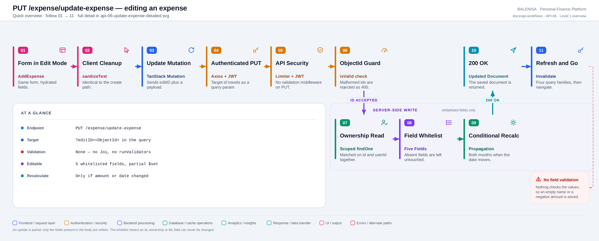
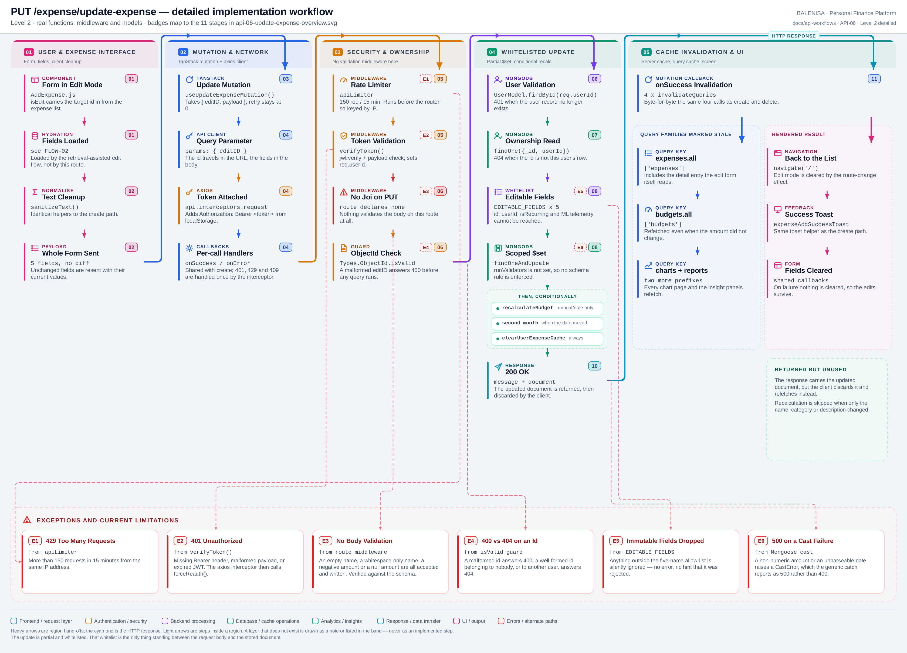

# API-06 — Update an expense

## 1. Purpose

Edits an existing expense in place. It is a **partial** update over a five-field
allow-list, reached only from the edit mode of the same form that creates expenses. The
hydration read that fills that form is documented separately in
[FLOW-02](flow-02-retrieval-assisted-edit.md).

## 2. Endpoint and HTTP method

| | |
|---|---|
| Method and path | `PUT /expense/update-expense?editID=<ObjectId>` |
| Mount | `app.use("/expense", apiLimiter, expenseRouter)` |
| Route | `router.put('/update-expense', verifyToken, editexpense)` |
| Middleware order | `apiLimiter` → `verifyToken` → `editexpense` |
| Success status | `200 OK` |

Note what is **absent** from that chain: there is no validation middleware.

---

## 3. Level 1 — Quick workflow overview

<picture>
  <source srcset="api-06-update-expense-overview.svg" type="image/svg+xml">
  
</picture>

Vector source: [`api-06-update-expense-overview.svg`](api-06-update-expense-overview.svg) ·
raster preview / fallback: [`api-06-update-expense-overview.png`](api-06-update-expense-overview.png)

Follow the badges `01 → 11`.

---

## 4. Level 2 — Detailed implementation workflow

<picture>
  <source srcset="api-06-update-expense-detailed.svg" type="image/svg+xml">
  
</picture>

Vector source: [`api-06-update-expense-detailed.svg`](api-06-update-expense-detailed.svg) ·
raster preview / fallback: [`api-06-update-expense-detailed.png`](api-06-update-expense-detailed.png)

---

## 5. Request structure

```jsonc
PUT /expense/update-expense?editID=66f1a2b3c4d5e6f7a8b9c0d1
Authorization: Bearer <jwt>
Content-Type: application/json

{
  "expenseName":        "Coffee",
  "expenseCategory":    "Food",
  "expenseAmount":      140,
  "expenseDate":        "2026-07-30",
  "expenseDescription": "Morning flat white"
}
```

The target id travels in the **query string**, not the body or the path. The client sends
the whole form, never a diff — but the server treats the body as partial regardless.

| Field | Modifiable | Notes |
|---|---|---|
| `expenseName` | yes | |
| `expenseCategory` | yes | |
| `expenseAmount` | yes | Triggers a budget recalculation |
| `expenseDate` | yes | Triggers one or two budget recalculations |
| `expenseDescription` | yes | |
| `id`, `userId`, `isRecurring`, `mlPredictedCategory`, `mlConfidence`, `wasMlCorrected`, `_id` | **no** | Outside the allow-list; silently dropped |

```js
const EDITABLE_FIELDS = [
    'expenseName', 'expenseCategory', 'expenseAmount',
    'expenseDate', 'expenseDescription'
];
const updates = {};
for (const field of EDITABLE_FIELDS) {
    if (Object.prototype.hasOwnProperty.call(req.body, field)) {
        updates[field] = req.body[field];
    }
}
```

**Absent fields are preserved, not cleared** — only keys actually present in the body enter
`$set`. The allow-list is also what makes the route immune to prototype pollution: it
iterates a fixed array of names, so `__proto__` and `constructor` can never be reached.

## 6. Validation behaviour

There is none, in either layer:

- **No Joi.** The route declares no validation middleware.
- **No Mongoose validators.** `findOneAndUpdate` is called without `runValidators`, so the
  schema's `required` rules never execute on an update.

What survives is Mongoose's **casting**, and that is all. Verified by running
`castUpdate` against the real schema:

| `$set` value | Result |
|---|---|
| `expenseName: ""` | **accepted and stored** |
| `expenseName: "   "` | **accepted and stored** |
| `expenseAmount: -500` | **accepted and stored** |
| `expenseAmount: 0` | **accepted and stored** |
| `expenseAmount: null` | **accepted** — a required Number becomes null |
| `expenseAmount: "750"` | cast to `750` |
| `expenseAmount: "abc"` / `NaN` | `CastError` → **500** |
| `expenseDate: "garbage"` | `CastError` → **500** |
| `expenseDate: "2026-02-31"` | cast to `2026-03-03` |
| `expenseName: { "$ne": null }` | `CastError` → **500** |
| 5 000-character description | **accepted and stored** |

This is the sharpest asymmetry in the module: **create rejects a zero or negative amount;
update accepts it.**

## 7. Authentication and ownership

`verifyToken` sets `req.userId`; the controller re-reads the user and answers 401 if it has
gone. Ownership is enforced twice, both times inside the query filter:

```js
const originalExpense = await ExpenseModel.findOne({ _id: expenseId, userId: req.userId });
// ...
const updatedExpense  = await ExpenseModel.findOneAndUpdate(
    { _id: expenseId, userId: req.userId }, { $set: updates }, { new: true }
);
```

A well-formed id belonging to another account simply matches nothing and answers **404** —
there is no cross-account write path. A malformed id is rejected earlier:

```js
if (!mongoose.Types.ObjectId.isValid(expenseId)) {
    return res.status(400).json({ message: 'Invalid expense ID', success: false });
}
```

`apiLimiter` is IP-keyed here for the same reason as every other route — it runs before
`verifyToken`.

## 8. Database mutation

1. `findOne({_id, userId})` — the original, kept so the *old* month can be recalculated.
2. `findOneAndUpdate({_id, userId}, { $set: updates }, { new: true })`.
3. Budget work, but **only when the amount or the date changed**:

```js
const amountOrDateChanged =
    Object.prototype.hasOwnProperty.call(updates, 'expenseAmount') ||
    Object.prototype.hasOwnProperty.call(updates, 'expenseDate');
```

   When it did, `recalculateBudget` runs for the original month, and again for the new
   month if the month or year moved.
4. `clearUserExpenseCache(user._id)` — always, in the same `Promise.all`.
5. `refreshReport(user._id)` — always.

Because the client always sends all five fields, `amountOrDateChanged` is effectively
always true from the UI; the condition only bites for a partial API caller.

## 9. Response structure

```jsonc
// 200
{ "message": "Expense updated successfully!", "data": { /* updated document */ }, "success": true }
```

| Status | Body | Raised by |
|---|---|---|
| `200` | message + updated document | success |
| `400` | `Invalid expense ID` | ObjectId guard |
| `401` | token errors, `User does not exist` | `verifyToken`, controller |
| `404` | `Expense not found` | either scoped lookup returning null |
| `429` | `Too many requests…` | `apiLimiter` |
| `500` | `Internal Server Error` | any throw, including every `CastError` |

## 10. Frontend consumption

| Layer | File | Function/Export | Purpose |
|---|---|---|---|
| UI | `components/expensesHandling/AddExpense.js` | `AddExpense` | Same form, edit mode |
| UI | `components/expensesHandling/ExpenseItem.js` | `handleEdit` | Sets the id, then navigates to `/add` |
| Shell | `components/landingPage/LandingPage.js` | `isEdit` state | Holds the target id; cleared on route change |
| Hook | `hooks/mutations/useUpdateExpenseMutation.js` | `useUpdateExpenseMutation` | Mutation + invalidation |
| API | `api/expenseApi.js` | `updateExpense(editID, payload)` | `api.put(..., payload, { params: { editID } })` |
| Client | `api/axios.js` | `api` | Token in, 401/429/409 out |

## 11. TanStack Query mutation lifecycle

```js
mutationFn: ({ editID, payload }) => updateExpense(editID, payload),
onSuccess: () => {           // four prefix invalidations, identical to create and delete
  queryClient.invalidateQueries({ queryKey: queryKeys.expenses.all });
  queryClient.invalidateQueries({ queryKey: queryKeys.budgets.all });
  queryClient.invalidateQueries({ queryKey: queryKeys.reports.all });
  queryClient.invalidateQueries({ queryKey: queryKeys.charts.all });
}
```

| Callback | Where | What it does |
|---|---|---|
| `onMutate` | — | **Not implemented.** Pessimistic update |
| `onSuccess` (hook) | `useUpdateExpenseMutation` | The four invalidations |
| `onSuccess` (per call) | `AddExpense.handleSubmit` | Clears the form, exits edit mode, navigates, toasts |
| `onError` / `onSettled` | `AddExpense.handleSubmit` | Shared with the create path |

No `mutationKey`. `retry` is the client default for mutations, **`0`**.

The updated document in the response is **discarded** — nothing calls `setQueryData`, so
the client pays for a refetch it already had the answer to.

## 12. Redis and frontend cache invalidation

Identical to [API-05 §12](api-05-create-expense.md#12-redis-and-frontend-cache-invalidation):
`clearUserExpenseCache` flushes `lastWeek:`, `category:`, `pie:` and `pieComparison:` via
the `cachekeys:<userId>` set; `refreshReport` handles `report:<userId>`; the client
invalidates four query prefixes, which includes the `expenses.detail(id)` entry that
hydrated the form.

## 13. Loading, success and error states

| State | Signal |
|---|---|
| Hydrating | Full-screen spinner while the edit data loads — see [FLOW-02](flow-02-retrieval-assisted-edit.md) |
| Submitting | Same `z-index: 9999` overlay as create |
| Success | Toast, form cleared, edit mode exited, `navigate('/')` |
| Failure | Toast; **edits are preserved** so the user can correct and resubmit |
| 404 | Reaches the generic error toast — no dedicated "this expense is gone" message |

## 14. Retry and duplicate-submission behaviour

- **Automatic retry:** none (`retry: 0`).
- **Duplicate submission:** blocked by the spinner overlay.
- **Idempotent:** yes. Re-sending the same payload produces the same document, so a manual
  retry is safe. The only side effect of a duplicate is a second budget recalculation and
  report regeneration.

## 15. Downstream effects

| Consumer | Effect |
|---|---|
| Expense list / search / category views | Redis cleared, `["expenses"]` invalidated |
| Edit-detail cache | `expenses.detail(id)` is nested under `["expenses"]`, so it is invalidated too |
| Budget | Recalculated for the old month, and the new one if the date moved |
| Reports | Invalidated and regenerated in-request |
| Charts | Pie caches cleared; `["charts"]` invalidated |
| Recurring schedule | **Not updated.** A `RecurringExpense` row keeps the name, category and amount captured when it was created |
| Income | Untouched |

## 16. Files involved

| Layer | File | Function/Export | Purpose |
|---|---|---|---|
| Route | `backend/Routes/expense.routes.js` | — | Declares the route; no validation middleware |
| Middleware | `backend/utils/rateLimiter.js` | `apiLimiter` | 150 req / 15 min, IP-keyed in practice |
| Middleware | `backend/Middlewares/Auth.js` | `verifyToken` | JWT check, sets `req.userId` |
| Controller | `backend/Controllers/ExpenseControllers/editExpense.js` | `editexpense` | Guard, whitelist, update, propagate |
| Model | `backend/config/Schemas.js` | `ExpenseModel`, `UserModel` | Schemas and indexes |
| Service | `backend/Services/BudgetServices/budget.service.js` | `recalculateBudget` | Month total → budget doc |
| Service | `backend/Services/reportService.js` | `refreshReport` | Invalidate + regenerate + cache |
| Cache | `backend/utils/expenseCache.js` | `clearUserExpenseCache` | Per-user key-set flush |

## 17. Current implementation observations

**Correctness**

1. **No validation at all.** Verified against the real schema: an empty name, a
   whitespace-only name, a zero, a negative and a `null` amount are each accepted and
   written. `runValidators` is not set, so the schema's `required` rules do not run on an
   update.
2. **Create and update disagree.** Joi rejects a non-positive amount on create; nothing
   rejects it on update. The same expense can therefore be created legally and then edited
   into an illegal state.
3. **Cast failures surface as 500, not 400.** `expenseAmount: "abc"`, an unparseable date
   and an operator object all raise `CastError`, which the generic catch converts into
   `Internal Server Error`.
4. **Impossible dates roll silently**, exactly as on create — `2026-02-31` becomes
   `2026-03-03`.
5. **The same timezone shift applies.** Recalculation resolves the month with
   `getMonthRange`, in server local time, against a UTC-midnight date — see
   [API-05 §17.5](api-05-create-expense.md#17-current-implementation-observations).
6. **A conditional recalculation that is never conditional in practice.** The form always
   sends all five fields, so the amount/date check only helps a partial API caller.

**Security / operational**

7. **Ownership is enforced in the filter itself**, twice, so a foreign id cannot be
   written. This is correct behaviour worth recording.
8. **Mass assignment is closed off by the allow-list**, which also removes any
   prototype-pollution surface.
9. **Immutable fields are dropped silently.** Sending `userId` or `isRecurring` produces no
   error and no hint that the value was ignored.
10. **No stack traces or database messages leak.**

**Reliability**

11. **The returned document is thrown away.** The client refetches instead of writing the
    response into the cache — a redundant round trip on every edit.
12. **404 has no dedicated UI.** An expense deleted in another tab produces the generic
    error toast.
13. **The recurring schedule drifts.** Editing an expense's amount or name leaves any
    `RecurringExpense` row pointing at the old values, so future auto-logged copies use the
    stale figures.

**Maintainability**

14. **Create and update validate through different mechanisms** — Joi for one, nothing for
    the other — so the two field contracts have to be reconciled by reading both files.

---

**Related:** [FLOW-02 — retrieval-assisted edit](flow-02-retrieval-assisted-edit.md) ·
[API-05 — create](api-05-create-expense.md) ·
[API-07 — delete](api-07-delete-expense.md) ·
[consumption map](expense-consumption-map.md)
