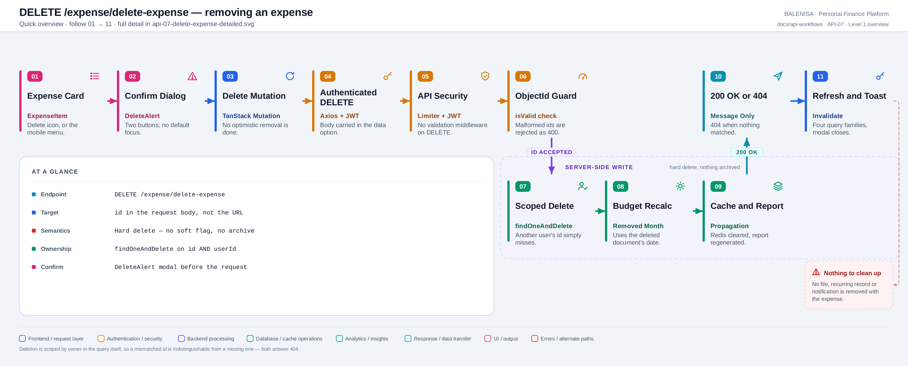
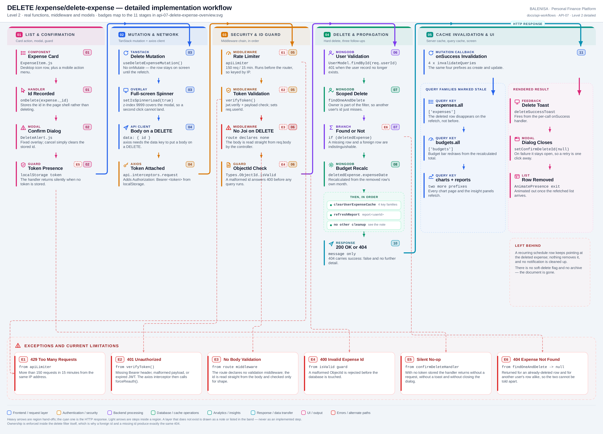

# API-07 — Delete an expense

## 1. Purpose

Removes one expense permanently. It is a **hard delete**: there is no soft-delete flag, no
archive collection and no restore route anywhere in the repository.

## 2. Endpoint and HTTP method

| | |
|---|---|
| Method and path | `DELETE /expense/delete-expense` |
| Mount | `app.use("/expense", apiLimiter, expenseRouter)` |
| Route | `router.delete('/delete-expense', verifyToken, deleteExpense)` |
| Middleware order | `apiLimiter` → `verifyToken` → `deleteExpense` |
| Success status | `200 OK` |

The target id is read from `req.body.id`, so the client has to use axios's `data` config
key to attach a body to a DELETE.

---

## 3. Level 1 — Quick workflow overview

<picture>
  <source srcset="api-07-delete-expense-overview.svg" type="image/svg+xml">
  
</picture>

Vector source: [`api-07-delete-expense-overview.svg`](api-07-delete-expense-overview.svg) ·
raster preview / fallback: [`api-07-delete-expense-overview.png`](api-07-delete-expense-overview.png)

Follow the badges `01 → 11`.

---

## 4. Level 2 — Detailed implementation workflow

<picture>
  <source srcset="api-07-delete-expense-detailed.svg" type="image/svg+xml">
  
</picture>

Vector source: [`api-07-delete-expense-detailed.svg`](api-07-delete-expense-detailed.svg) ·
raster preview / fallback: [`api-07-delete-expense-detailed.png`](api-07-delete-expense-detailed.png)

---

## 5. Request structure

```jsonc
DELETE /expense/delete-expense
Authorization: Bearer <jwt>
Content-Type: application/json

{ "id": "66f1a2b3c4d5e6f7a8b9c0d1" }
```

One field. `id` here is the Mongo `_id`, not the client-minted `id` string that
[API-05](api-05-create-expense.md) writes — `ExpenseItem` passes `expense._id`.

## 6. Validation behaviour

No validation middleware. The controller performs one shape check:

```js
if (!mongoose.Types.ObjectId.isValid(expenseId)) {
    return res.status(400).json({ message: 'Invalid expense ID', success: false });
}
```

That guard also closes the operator-injection surface — `{ "$ne": null }` is not a valid
ObjectId, so it never reaches the query.

## 7. Authentication and ownership

`verifyToken` sets `req.userId`; the controller re-reads the user and answers 401 if it is
gone. Ownership is part of the delete filter itself:

```js
const deletedExpense = await ExpenseModel.findOneAndDelete({
    _id: expenseId,
    userId: req.userId
});
```

A foreign id matches nothing, so a cross-account delete is impossible. It also means a
foreign row and a missing row are **indistinguishable** — both answer 404, which is a
reasonable disclosure posture.

## 8. Database mutation

1. `findOneAndDelete({_id, userId})` — one hard delete.
2. Only when a document came back:
   - `recalculateBudget(user._id, deletedExpense.expenseDate)` — the removed row's own
     month, read from the returned document.
   - `clearUserExpenseCache(user._id)` — in the same `Promise.all`.
   - `refreshReport(user._id)`.

Nothing else is touched. No `RecurringExpense` row, no `Notification`, no `mlFeedback`
document and no file is removed alongside the expense.

## 9. Response structure

```jsonc
// 200
{ "message": "Expense deleted successfully", "success": true }
// 404
{ "message": "Expense not found", "success": false }
```

| Status | Body | Raised by |
|---|---|---|
| `200` | message + success | a document was deleted |
| `400` | `Invalid expense ID` | ObjectId guard |
| `401` | token errors, `User does not exist` | `verifyToken`, controller |
| `404` | `Expense not found` | filter matched nothing |
| `429` | `Too many requests…` | `apiLimiter` |
| `500` | `Internal Server Error` | any throw |

## 10. Frontend consumption

| Layer | File | Function/Export | Purpose |
|---|---|---|---|
| UI | `components/expensesHandling/ExpenseItem.js` | delete button, mobile menu | Calls `onDelete(expense._id)` |
| UI | `components/expensesHandling/ExpensesPage.js` | `ExpensesPage` | Passes `onDelete` down to each row |
| UI | `components/alertsEffects/DeleteAlert.js` | `DeleteAlert` | The confirmation modal |
| Shell | `components/landingPage/LandingPage.js` | `onDelete`, `confirmDeleteHandler`, `cancelDeleteHandler` | Owns `confirmDeleteId` and runs the mutation |
| Hook | `hooks/mutations/useDeleteExpenseMutation.js` | `useDeleteExpenseMutation` | Mutation + invalidation |
| API | `api/expenseApi.js` | `deleteExpense(id)` | `api.delete(..., { data: { id } })` |

The delete button does not delete. It records an id:

```js
const onDelete = (id) => { setConfirmDeleteId(id); };
```

`DeleteAlert` renders while `confirmDeleteId` is set, and only `confirmDeleteHandler`
issues the request.

## 11. TanStack Query mutation lifecycle

```js
mutationFn: deleteExpense,
onSuccess: () => { /* the same four prefix invalidations as create and update */ }
```

| Callback | Where | What it does |
|---|---|---|
| `onMutate` | — | **Not implemented.** No optimistic removal, so the row stays visible until the refetch lands |
| `onSuccess` (hook) | `useDeleteExpenseMutation` | Four invalidations |
| `onSuccess` (per call) | `confirmDeleteHandler` | `deleteSuccessToast()`, then `setConfirmDeleteId(null)` |
| `onError` (per call) | `confirmDeleteHandler` | Skips 401/429/409; otherwise an error toast. **The modal stays open** |
| `onSettled` (per call) | `confirmDeleteHandler` | Clears the app-level spinner |

No `mutationKey`. `retry: 0`.

## 12. Redis and frontend cache invalidation

Identical to [API-05 §12](api-05-create-expense.md#12-redis-and-frontend-cache-invalidation).
The deleted row also disappears from `expenses.detail(id)`, because that key is nested
under the invalidated `["expenses"]` prefix — so re-opening the edit form for a deleted
expense refetches and receives a 404 rather than a cached copy.

## 13. Loading, success and error states

| State | Signal |
|---|---|
| Confirming | `DeleteAlert` modal, `z-index: 999`, with the app shell blurred behind it |
| Deleting | App-level `Spinner`, `z-index: 9999` — **above** the modal |
| Success | Toast, modal closes, row animates out once the refetched list arrives |
| Failure | Toast, modal stays open so the user can retry |
| No token | `confirmDeleteHandler` returns **silently** — no request, no toast, no modal close |

## 14. Retry and duplicate-submission behaviour

- **Automatic retry:** none (`retry: 0`).
- **Duplicate submission:** the spinner's `z-index: 9999` sits above the modal's `999`, so
  the "Yes, Delete" button cannot be clicked twice. Protection is incidental — the button
  itself carries no `disabled` attribute.
- **If a duplicate did land:** the second request answers 404 and shows an error toast for
  a delete that actually succeeded.
- **Idempotency:** not idempotent in its status code. The first call answers 200, every
  subsequent call answers 404.

## 15. Downstream effects

| Consumer | Effect |
|---|---|
| Expense list / search / category views | Redis cleared, `["expenses"]` invalidated |
| Budget | `spent` recalculated for the deleted row's month |
| Reports | Invalidated and regenerated in-request |
| Charts | Pie caches cleared; `["charts"]` invalidated |
| Recurring schedule | **Orphaned.** The `RecurringExpense` row still references the deleted `expenseId` |
| Notifications | Any `relatedId` notification still points at the deleted document |
| ML feedback | The `mlFeedback` row survives — deliberate, since it is training signal |
| Income | Untouched |

## 16. Files involved

| Layer | File | Function/Export | Purpose |
|---|---|---|---|
| Route | `backend/Routes/expense.routes.js` | — | Declares the route; no validation middleware |
| Middleware | `backend/utils/rateLimiter.js` | `apiLimiter` | 150 req / 15 min, IP-keyed in practice |
| Middleware | `backend/Middlewares/Auth.js` | `verifyToken` | JWT check, sets `req.userId` |
| Controller | `backend/Controllers/ExpenseControllers/deleteExpense.js` | `deleteExpense` | Guard, scoped delete, propagate |
| Model | `backend/config/Schemas.js` | `ExpenseModel`, `UserModel` | Schemas and indexes |
| Service | `backend/Services/BudgetServices/budget.service.js` | `recalculateBudget` | Month total → budget doc |
| Service | `backend/Services/reportService.js` | `refreshReport` | Invalidate + regenerate + cache |
| Cache | `backend/utils/expenseCache.js` | `clearUserExpenseCache` | Per-user key-set flush |
| Model | `backend/models/RecurringExpense.js` | `RecurringExpenseModel` | Not cleaned up here — see §17 |

## 17. Current implementation observations

**Correctness**

1. **Hard delete, no recovery.** Nothing archives the document, and there is no restore
   endpoint. A misclick is unrecoverable.
2. **Related records survive.** A `RecurringExpense` row keeps pointing at the deleted
   `expenseId`; the nightly cron continues to create new expenses from it. Any
   `Notification` with `relatedId` set to the deleted document is likewise orphaned.
3. **A duplicate delete reports failure for a success.** The second call answers 404 and
   toasts an error, even though the intent was satisfied.

**Security / operational**

4. **Ownership is inside the delete filter**, so a foreign id cannot be removed. Recorded
   as a positive.
5. **The ObjectId guard closes the injection surface.** `{ "$ne": null }` fails
   `isValid()`, so it never reaches Mongo — worth contrasting with
   [API-08](api-08-toggle-recurring.md), which has no such guard.
6. **404 conflates two cases**, which is the right disclosure choice: a caller cannot probe
   for the existence of another user's expenses.
7. **No stack traces leak.**

**Reliability**

8. **A missing token fails silently.** `confirmDeleteHandler` returns before doing anything
   when `localStorage.getItem('token')` is null — no request, no message, and the modal
   stays open with no explanation.
9. **Duplicate-click protection is incidental.** It depends on one component's spinner
   having a higher `z-index` than another component's modal. Nothing in the code states
   that dependency, and the button has no `disabled` state.
10. **No optimistic removal.** The row remains on screen until the invalidated list
    refetches, so a slow network shows a deleted row for a noticeable moment.
11. **A failed propagation still reports success.** `recalculateBudget`,
    `clearUserExpenseCache` and `refreshReport` all run *after* the delete; if one throws,
    the row is already gone but the client receives a 500.

**Maintainability**

12. **Two different `id` meanings.** The body's `id` is the Mongo `_id`, while the expense
    document also carries a client-minted `id` string. Only the field name is shared.

---

**Related:** [API-05 — create](api-05-create-expense.md) ·
[API-06 — update](api-06-update-expense.md) ·
[API-08 — toggle recurring](api-08-toggle-recurring.md) ·
[consumption map](expense-consumption-map.md)
