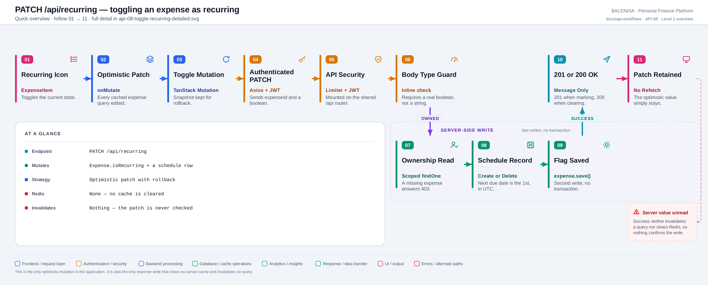
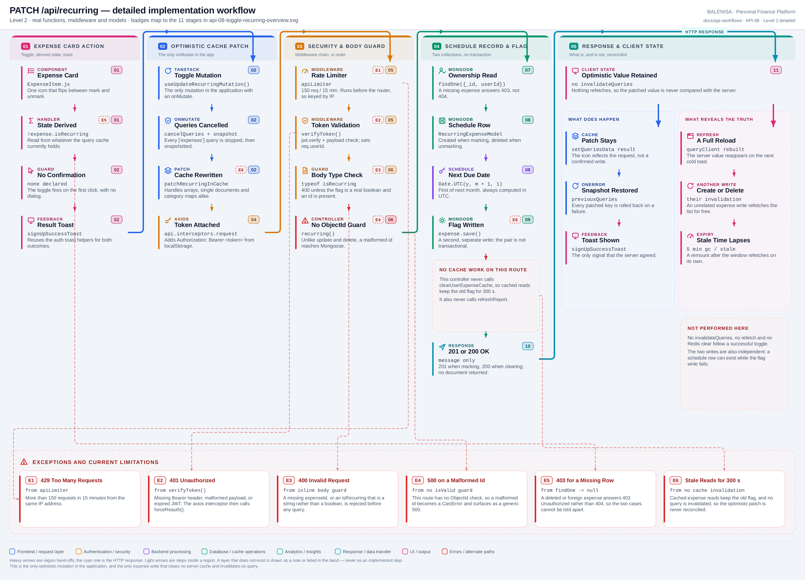

# API-08 — Toggle an expense as recurring

## 1. Purpose

Flips `isRecurring` on one expense and creates or removes the schedule row that the nightly
cron reads. It is an expense mutation even though it lives on the shared `/api` router
alongside the budget routes, and it is the **only optimistic mutation in the application**.

It was not covered by the Budget batch, which documented only the three budget routes on
that router.

## 2. Endpoint and HTTP method

| | |
|---|---|
| Method and path | `PATCH /api/recurring` |
| Mount | `app.use("/api", apiLimiter, apiRouter)` |
| Route | `router.patch('/recurring', verifyToken, recurring)` |
| Middleware order | `apiLimiter` → `verifyToken` → `recurring` |
| Success status | `201 Created` when marking, `200 OK` when clearing |

---

## 3. Level 1 — Quick workflow overview

<picture>
  <source srcset="api-08-toggle-recurring-overview.svg" type="image/svg+xml">
  
</picture>

Vector source: [`api-08-toggle-recurring-overview.svg`](api-08-toggle-recurring-overview.svg) ·
raster preview / fallback: [`api-08-toggle-recurring-overview.png`](api-08-toggle-recurring-overview.png)

Follow the badges `01 → 11`. Stage 11 is drawn honestly: nothing is invalidated and nothing
refetches, so the optimistic value simply stays.

---

## 4. Level 2 — Detailed implementation workflow

<picture>
  <source srcset="api-08-toggle-recurring-detailed.svg" type="image/svg+xml">
  
</picture>

Vector source: [`api-08-toggle-recurring-detailed.svg`](api-08-toggle-recurring-detailed.svg) ·
raster preview / fallback: [`api-08-toggle-recurring-detailed.png`](api-08-toggle-recurring-detailed.png)

---

## 5. Request structure

```jsonc
PATCH /api/recurring
Authorization: Bearer <jwt>
Content-Type: application/json

{ "expenseId": "66f1a2b3c4d5e6f7a8b9c0d1", "isRecurring": true }
```

## 6. Validation behaviour

No Joi. One inline guard, run before the try block:

```js
if (!expenseId || typeof isRecurring !== "boolean") {
   return res.status(400).json({ message: "Invalid request", success: false });
}
```

That rejects a missing id and a string `"true"`, but it is **not** an ObjectId check.
Unlike [API-06](api-06-update-expense.md) and [API-07](api-07-delete-expense.md), this
route has no `Types.ObjectId.isValid` guard, so a malformed id reaches Mongoose, raises a
`CastError` and surfaces as a generic **500**.

## 7. Authentication and ownership

`verifyToken` sets `req.userId`. The controller scopes the lookup and then re-checks:

```js
const expense = await ExpenseModel.findOne({ _id: expenseId, userId: req.userId });
if (!expense || expense.userId.toString() !== req.userId.toString()) {
   return res.status(403).json({ message: "Unauthorized", success: false });
}
```

The second condition is unreachable — the filter already guaranteed it. The practical
effect is that a **missing** expense answers `403 Unauthorized` rather than `404 Not
Found`, so a deleted row and a foreign row look the same. Safe from a disclosure point of
view, misleading from a debugging one.

## 8. Database mutation

Two collections, two independent writes, no transaction.

**Marking (`isRecurring: true`)**

1. `RecurringExpenseModel.create({...})` with a snapshot of the name, category and amount,
   `lastLoggedDate` from the expense's own date, and
   `nextDueDate = Date.UTC(year, month + 1, 1)`.
2. `expense.isRecurring = true; await expense.save();`
3. `201 Created`.

**Clearing (`isRecurring: false`)**

1. `RecurringExpenseModel.findOneAndDelete({ userId, expenseId })`.
2. `expense.isRecurring = false; await expense.save();`
3. `200 OK`.

A unique index `{ userId: 1, expenseId: 1 }` prevents a second schedule row; the duplicate
key is caught and reported as `400 Already marked as recurring`.

**No cache work of any kind.** This controller never calls `clearUserExpenseCache` and
never calls `refreshReport` — the only expense write in the codebase that does neither.

## 9. Response structure

```jsonc
// 201
{ "message": "Marked recurring successfully", "success": true }
// 200
{ "message": "Unmarked recurring successfully", "success": true }
```

| Status | Body | Raised by |
|---|---|---|
| `201` / `200` | message + success | mark / unmark |
| `400` | `Invalid request` | body guard |
| `400` | `Already marked as recurring` | duplicate key (`E11000`) |
| `401` | token errors | `verifyToken` |
| `403` | `Unauthorized` | expense missing **or** foreign |
| `429` | `Too many requests…` | `apiLimiter` |
| `500` | `Internal Server Error` | any throw, including a malformed id |

## 10. Frontend consumption

| Layer | File | Function/Export | Purpose |
|---|---|---|---|
| UI | `components/expensesHandling/ExpenseItem.js` | recurring button, mobile menu | Calls `handleRecurring` |
| UI | same | `handleRecurring` | Derives `!isRecurring` and fires the mutation |
| Hook | `hooks/mutations/useUpdateRecurringMutation.js` | `useUpdateRecurringMutation` | Optimistic patch + rollback |
| Hook | same | `patchRecurringInCache` | Rewrites one expense inside any cached shape |
| API | `api/expenseApi.js` | `updateRecurringStatus(expenseId, isRecurring)` | `api.patch("/api/recurring", …)` |

`updateRecurringStatus` lives in `expenseApi.js` even though it targets `/api`, because
`ExpenseItem.js` is its only caller — a deliberate choice noted in the file's own comment.

## 11. TanStack Query mutation lifecycle

This is the only mutation in the codebase with an `onMutate`.

```js
onMutate: async ({ expenseId, isRecurring }) => {
  await queryClient.cancelQueries({ queryKey: queryKeys.expenses.all });
  const previousQueries = queryClient.getQueriesData({ queryKey: queryKeys.expenses.all });
  queryClient.setQueriesData({ queryKey: queryKeys.expenses.all }, (old) =>
    patchRecurringInCache(old, expenseId, isRecurring));
  return { previousQueries };
},
onError: (err, variables, context) => {
  context?.previousQueries?.forEach(([key, data]) => queryClient.setQueryData(key, data));
},
```

`patchRecurringInCache` handles all three shapes the expense queries return — a flat array
(last week, custom range), a single document (edit detail) and a category map — matching on
either `_id` or `id`.

| Callback | Where | What it does |
|---|---|---|
| `onMutate` | hook | Cancels in-flight `["expenses"]` queries, snapshots them, patches every one |
| `onError` | hook | Restores every snapshotted key |
| `onSuccess` | hook | **Not implemented** — no invalidation, no refetch |
| `onSettled` | hook | **Not implemented** |
| `onSuccess` / `onError` (per call) | `ExpenseItem.handleRecurring` | Success and error toasts |

## 12. Redis and frontend cache invalidation

| Layer | What happens |
|---|---|
| Redis | **Nothing.** No `clearUserExpenseCache`, no `refreshReport` |
| TanStack Query | **No invalidation.** Only the optimistic `setQueriesData` patch, plus rollback on failure |

The consequence is drawn in the diagram's limitations band rather than as an implemented
step: the cached server reads keep the previous flag for up to their 300 s TTL, and the
client's patched value is never compared with what was actually stored.

Reconciliation happens only incidentally — on a full reload, when an unrelated expense
write invalidates `["expenses"]`, or when the 5-minute stale window lapses and a remount
refetches.

## 13. Loading, success and error states

| State | Signal |
|---|---|
| Pending | **None.** No spinner, no disabled button, no pending style |
| Optimistic | The icon flips immediately, before the server has answered |
| Success | Toast via `signUpSuccessToast` |
| Failure | Cache rolled back, icon flips back, error toast (except 401/429/409) |
| Confirmation | **None.** The toggle fires on the first click |

## 14. Retry and duplicate-submission behaviour

- **Automatic retry:** none (`retry: 0`).
- **Duplicate submission:** nothing prevents it. The button is never disabled and no
  overlay covers it.
- **What a double-click does:** the second click reads the already-patched cache, so it
  derives the *opposite* intent and sends the inverse request. Two rapid clicks therefore
  mark then unmark, ending where they started — with two writes and two toasts.
- **Idempotency:** marking twice answers `400 Already marked as recurring`; unmarking twice
  succeeds both times, since `findOneAndDelete` on nothing is harmless.

## 15. Downstream effects

| Consumer | Effect |
|---|---|
| Expense list | Patched optimistically in the client; the server-side cached read is **not** cleared |
| Recurring cron | A new schedule row becomes eligible from the 1st of next month |
| Budget | Untouched — the amount did not change |
| Reports / charts / analytics | Untouched, and correctly so: no aggregate reads `isRecurring` |
| Redis | Untouched — see §17 |

## 16. Files involved

| Layer | File | Function/Export | Purpose |
|---|---|---|---|
| Route | `backend/Routes/api.routes.js` | — | Declares the route on the shared `/api` router |
| Middleware | `backend/utils/rateLimiter.js` | `apiLimiter` | 150 req / 15 min, IP-keyed in practice |
| Middleware | `backend/Middlewares/Auth.js` | `verifyToken` | JWT check, sets `req.userId` |
| Controller | `backend/Controllers/RecurringExpenses/recurring.js` | `recurring` | Guard, ownership, two writes |
| Model | `backend/models/RecurringExpense.js` | `RecurringExpenseModel` | Schedule row + unique index |
| Model | `backend/config/Schemas.js` | `ExpenseModel` | Carries `isRecurring` |
| Cron | `backend/cron/recurringJob.js` | scheduled at `30 20 * * *` | Consumes the schedule rows |

## 17. Current implementation observations

**Correctness**

1. **The optimistic patch is never reconciled.** No `onSuccess`, no `onSettled`, no
   invalidation. The UI shows what was *requested*, and only a reload, an unrelated
   expense write or a lapsed stale window ever shows what was *stored*.
2. **Redis keeps the old flag for up to 300 s.** `clearUserExpenseCache` is not called, so
   `lastWeek:<userId>` and `category:<userId>:<period>` continue to serve documents with
   the previous `isRecurring`. A refetch inside that window can therefore *revert* the
   icon.
3. **A missing expense answers 403, not 404.** The `!expense` branch shares its response
   with the ownership branch.
4. **A double-click inverts itself.** The second click reads the patched cache and sends
   the opposite value.
5. **The schedule row is a snapshot.** Editing the expense afterwards does not update the
   stored name, category or amount, so the cron logs the original figures.

**Security / operational**

6. **No ObjectId guard.** This is the only expense-mutating route without one, so a
   malformed id becomes a `CastError` and a generic 500 instead of a 400.
7. **Ownership is enforced in the filter**, and the redundant second check is harmless.
8. **The rate limiter is IP-keyed**, as everywhere else.
9. **No stack traces leak.**

**Reliability**

10. **Two non-transactional writes.** The schedule row is created first; if
    `expense.save()` then fails, a schedule row exists for an expense whose `isRecurring`
    is still `false`. The next toggle attempt answers `400 Already marked as recurring`.
11. **No pending state at all.** Nothing tells the user a request is in flight.
12. **No confirmation** before creating a recurring commitment that will generate expenses
    every month.

**Maintainability**

13. **An expense mutation on the budget router.** `PATCH /api/recurring` sits in
    `api.routes.js` next to the three budget routes, while every other expense write is in
    `expense.routes.js`. Its client function is in `expenseApi.js`, so the ownership split
    is inconsistent between the two sides.
14. **The `patchRecurringInCache` shape-guessing** duplicates knowledge of what each
    expense query returns. A change to any read response shape has to be mirrored here.

---

**Related:** [API-05 — create](api-05-create-expense.md) ·
[API-06 — update](api-06-update-expense.md) ·
[API-07 — delete](api-07-delete-expense.md) ·
[consumption map](expense-consumption-map.md)
