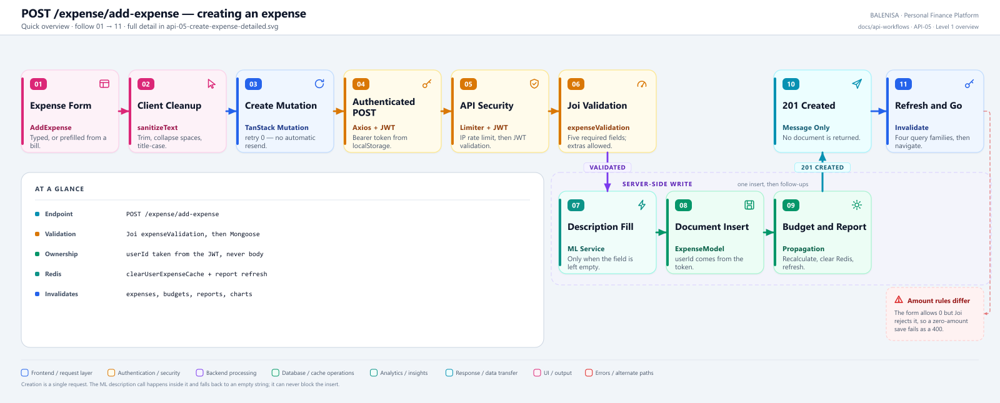
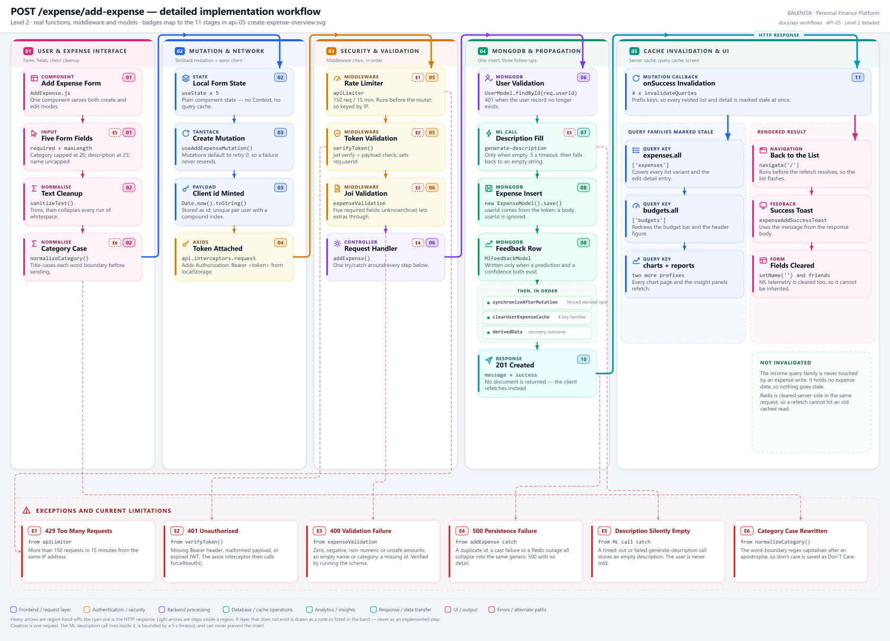

# API-05 — Create an expense

## 1. Purpose

The single write that brings an expense into existence. Every creation path in the
application ends here: manual entry, ML-assisted entry ([FLOW-01](../flow/ml-assisted-entry/flow-01-ml-assisted-entry.md))
and the bill-scan flow ([BILLS-FLOW-01](../../bills/flow/bills-flow-01-scan-to-expense.md)) all
call this one endpoint. There is no second create route.

## 2. Endpoint and HTTP method

| | |
|---|---|
| Method and path | `POST /expense/add-expense` |
| Mount | `app.use("/expense", apiLimiter, expenseRouter)` |
| Route | `router.post('/add-expense', verifyToken, expenseValidation, addExpense)` |
| Middleware order | `apiLimiter` → `verifyToken` → `expenseValidation` → `addExpense` |
| Success status | `201 Created` |

---

## 3. Level 1 — Quick workflow overview

<picture>
  <source srcset="api-05-create-expense-overview.svg" type="image/svg+xml">
  
</picture>

Vector source: [`api-05-create-expense-overview.svg`](api-05-create-expense-overview.svg) ·
raster preview / fallback: [`api-05-create-expense-overview.png`](api-05-create-expense-overview.png)

Follow the badges `01 → 11`. Stages `07 → 09` drop into the server-side lane, and the
`201 CREATED` response rises back into the top row, so the flow never doubles back.

---

## 4. Level 2 — Detailed implementation workflow

<picture>
  <source srcset="api-05-create-expense-detailed.svg" type="image/svg+xml">
  
</picture>

Vector source: [`api-05-create-expense-detailed.svg`](api-05-create-expense-detailed.svg) ·
raster preview / fallback: [`api-05-create-expense-detailed.png`](api-05-create-expense-detailed.png)

> A zoomable engineering reference, not a slide. Card badges reuse the Level 1 stage
> numbers; `E1`–`E6` tags point into the exceptions band at the bottom.

---

## 5. Request structure

```jsonc
POST /expense/add-expense
Authorization: Bearer <jwt>
Content-Type: application/json

{
  "id":                  "1753900000000",   // client-minted, Date.now().toString()
  "expenseName":         "Coffee",
  "expenseCategory":     "Food",
  "expenseAmount":       120,
  "expenseDate":         "2026-07-30",
  "expenseDescription":  "",                 // optional
  "mlPredictedCategory": "Food",             // optional ML telemetry
  "mlConfidence":        87,
  "wasMlCorrected":      false
}
```

| Field | Required | Where it comes from | Notes |
|---|---|---|---|
| `id` | yes | Client — `Date.now().toString()` | Unique per user via `{ userId, id }` |
| `expenseName` | yes | Typed, bill-prefilled or edit-loaded | No length cap server-side |
| `expenseCategory` | yes | Typed or ML-predicted | Free text; no enum, no cap server-side |
| `expenseAmount` | yes | `+expenseAmount` from a number input | Must be a positive, safe number |
| `expenseDate` | yes | Native date input, `YYYY-MM-DD` | Coerced by Joi to a `Date` |
| `expenseDescription` | no | Typed | Empty triggers the ML description call |
| `mlPredictedCategory`, `mlConfidence`, `wasMlCorrected` | no | Prediction state | Stored as sent — see §17 |

**Server-generated:** `userId` (from `req.userId`), `_id`, `isRecurring` (default `false`),
and `expenseDescription` when the ML fallback supplies it. A client-supplied `userId` in
the body is accepted by Joi's `unknown(true)` but **ignored** — the controller always
writes `userId: user._id`.

## 6. Validation behaviour

Two layers, in order: `expenseValidation` (Joi) then the Mongoose schema.

```js
const schema = Joi.object({
    id: Joi.string().required(),
    expenseName: Joi.string().required(),
    expenseCategory: Joi.string().required(),
    expenseAmount: Joi.number().positive().required(),
    expenseDate: Joi.date().required(),
    expenseDescription: Joi.string().allow('').optional(),
}).unknown(true);
```

Verified by running the schema against the cases below:

| Input | Result |
|---|---|
| `expenseAmount: 0` | **400** — must be a positive number |
| `expenseAmount: -5` | **400** |
| `expenseAmount: "abc"` / `NaN` | **400** — must be a number |
| `expenseAmount: Infinity` | **400** — cannot be infinity |
| `expenseAmount: 1e21` | **400** — must be a safe number |
| `expenseAmount: "12.5"` | **accepted**, coerced to `12.5` |
| `expenseName: ""` | **400** — not allowed to be empty |
| `expenseName: "   "` | **accepted** — whitespace-only names pass |
| `expenseName` / `expenseDescription` of 5 000 chars | **accepted** — no server cap |
| `expenseDate: "garbage"` | **400** |
| `expenseDate: "2026-02-31"` | **accepted**, silently rolled to `2026-03-03` |
| `expenseDate: "2099-01-01"` | **accepted** — future dates are allowed |
| `expenseCategory: { "$ne": null }` | **400** — must be a string |
| unknown fields (`userId`, `isRecurring`, …) | **accepted and ignored** |

`abortEarly: true`, so only the first failure is reported.

## 7. Authentication and ownership

`verifyToken` requires `Authorization: Bearer <jwt>`, verifies it, checks the payload
carries `_id`, and sets `req.userId`. The controller then re-reads the user with
`UserModel.findById(req.userId)` and answers **401** if the record has gone.

Ownership is never negotiable: `userId: user._id` is written from the token. There is no
code path by which a caller can create an expense for another account.

`apiLimiter` is mounted **before** the router, so `req.userId` is still `undefined` when
its `keyGenerator` runs and it falls back to `ipKeyGenerator(req.ip)` — the limit is
**per IP**, not per user, despite the comment in `server.js`.

## 8. Database mutation

1. `new ExpenseModel({...}).save()` — one insert. Schema `required` rules apply.
2. `new MlFeedbackModel({...}).save()` — **only** when `deriveMlCorrection` reports a real
   prediction *and* `mlConfidence !== undefined`.
3. `Promise.all([recalculateBudget(user._id, expenseDate), clearUserExpenseCache(user._id)])`
4. `await refreshReport(user._id)`

`recalculateBudget` aggregates the month's total and writes it to the budget document with
`findOneAndUpdate` — **no upsert**, so if the user never set a budget for that month
nothing is written and the call is a no-op.

The two saves are not transactional. The feedback row is written **before** the expense, so
a failed expense insert can leave an orphan feedback document.

## 9. Response structure

```jsonc
// 201
{ "message": "Expense Created Successfully", "success": true }
```

No document, no id. The client refetches rather than reading anything back.

| Status | Body | Raised by |
|---|---|---|
| `201` | message + success | success |
| `400` | Joi message | `expenseValidation` |
| `401` | `Authorization token missing` / `Invalid or expired token` / `User does not exist` | `verifyToken`, controller |
| `429` | `Too many requests…` | `apiLimiter` |
| `500` | `Internal Server Error` | any throw in the controller |

## 10. Frontend consumption

| Layer | File | Function/Export | Purpose |
|---|---|---|---|
| UI | `components/expensesHandling/AddExpense.js` | `AddExpense` | The form; create and edit modes share it |
| UI | `components/expensesHandling/Add.js` | `Add` | Toggles between Add Expense and Add Income |
| Helper | `AddExpense.js` | `sanitizeText`, `normalizeCategory` | Trim, collapse whitespace, title-case |
| Hook | `hooks/mutations/useAddExpenseMutation.js` | `useAddExpenseMutation` | Mutation + invalidation |
| API | `api/expenseApi.js` | `addExpense(payload)` | `api.post("/expense/add-expense", payload)` |
| Client | `api/axios.js` | `api` | Bearer token in, 401/429/409 handled out |
| Keys | `query/queryKeys.js` | `queryKeys` | Prefixes used for invalidation |

## 11. TanStack Query mutation lifecycle

```js
export const useAddExpenseMutation = () => {
  const queryClient = useQueryClient();
  return useMutation({
    mutationFn: addExpense,
    onSuccess: () => {
      queryClient.invalidateQueries({ queryKey: queryKeys.expenses.all });
      queryClient.invalidateQueries({ queryKey: queryKeys.budgets.all });
      queryClient.invalidateQueries({ queryKey: queryKeys.reports.all });
      queryClient.invalidateQueries({ queryKey: queryKeys.charts.all });
    },
  });
};
```

| Callback | Where | What it does |
|---|---|---|
| `onMutate` | — | **Not implemented.** No optimistic insert |
| `onSuccess` (hook) | `useAddExpenseMutation` | The four invalidations above |
| `onSuccess` (per call) | `AddExpense.handleSubmit` | Clears the form and ML telemetry, exits edit mode, `navigate('/')`, success toast |
| `onError` (per call) | `AddExpense.handleSubmit` | Skips 401/429/409 (already handled by the interceptor), otherwise an error toast |
| `onSettled` (per call) | `AddExpense.handleSubmit` | Clears the spinner |

No `mutationKey` is set. `retry` comes from the client default for mutations, **`0`**.

## 12. Redis and frontend cache invalidation

**Server (Redis).** `clearUserExpenseCache(user._id)` reads the per-user key set
`cachekeys:<userId>` and deletes every key in it. Four key families register themselves
there, and all four carry the userId in segment `[1]`, so all four are cleared:

| Key | Written by | Cleared |
|---|---|---|
| `lastWeek:<userId>` | [API-01](../read/last-week/api-01-last-week.md) | yes |
| `category:<userId>:<period>` | [API-02](../read/category-thismonth/api-02-category-thismonth.md) (its else branch is [BRANCH-01](../read/category-this-year/api-03-category-thisyear.md)) | yes |
| `pie:<userId>:<year>:<type>` | [CHARTS-08](../../charts/pie/pie-category/charts-api-08-pie-category.md) | yes |
| `pieComparison:<userId>:<month>` | [CHARTS-09](../../charts/pie/pie-budget-comparison/charts-api-09-pie-budget-comparison.md) | yes |

`report:<userId>` is not in that set; `refreshReport` invalidates and repopulates it
directly.

**Client (TanStack Query).** Four prefix invalidations. Because the keys are hierarchical,
`["expenses"]` also covers `expenses.lists()`, every `expenses.list(filters)` variant and
`expenses.detail(id)`.

Not invalidated: `queryKeys.income.*`. Correct — no income query reads expense data.

## 13. Loading, success and error states

| State | Signal |
|---|---|
| Submitting | `setIsSpinnerLoading(true)` renders a `position: fixed`, `z-index: 9999` overlay |
| Duplicate click | Blocked by that overlay, not by a `disabled` attribute on the button |
| Success | Toast, fields cleared, ML telemetry cleared, `navigate('/')` |
| Failure | Toast (except 401/429/409); **the form keeps every value** so the user can retry |
| 401 anywhere | Interceptor calls `forceReauth()` — clears storage and the query cache |

## 14. Retry and duplicate-submission behaviour

- **Automatic retry:** none. `mutations: { retry: 0 }`.
- **Duplicate submission:** the full-screen spinner covers the submit button for the
  request's lifetime.
- **If a duplicate did land:** the payload carries the same `id`, and
  `{ userId: 1, id: 1 }` is a unique index, so the second insert raises `E11000` and the
  generic catch reports it as **500** rather than a conflict.
- **Idempotency:** the endpoint is not idempotent by design, only by that index.

## 15. Downstream effects

| Consumer | Effect |
|---|---|
| Expense list (API-01/02/03/04) | Redis cleared, queries invalidated — next read is fresh |
| Budget | `spent` recalculated for the expense's month, `["budgets"]` invalidated |
| Reports | `report:<userId>` invalidated **and** regenerated inside the request |
| Charts | Pie caches cleared; the other seven chart routes have no cache to clear |
| Analytics / insights | Refetched with the invalidated report and chart queries |
| Income | Untouched |

## 16. Files involved

| Layer | File | Function/Export | Purpose |
|---|---|---|---|
| Route | `backend/Routes/expense.routes.js` | — | Declares the route and its middleware |
| Middleware | `backend/utils/rateLimiter.js` | `apiLimiter` | 150 req / 15 min, IP-keyed in practice |
| Middleware | `backend/Middlewares/Auth.js` | `verifyToken` | JWT check, sets `req.userId` |
| Middleware | `backend/Middlewares/AuthValidation.js` | `expenseValidation` | Joi body schema |
| Controller | `backend/Controllers/ExpenseControllers/addexpense.js` | `addExpense` | The whole write |
| Helper | same file | `normalizeForComparison`, `deriveMlCorrection` | Server-side correction verdict |
| Model | `backend/config/Schemas.js` | `ExpenseModel`, `MlFeedbackModel`, `UserModel` | Schemas and indexes |
| Service | `backend/Services/BudgetServices/budget.service.js` | `recalculateBudget` | Month total → budget doc |
| Service | `backend/Services/HelperServices/datecal.service.js` | `getMonthRange` | Local-time month bounds |
| Service | `backend/Services/reportService.js` | `refreshReport` | Invalidate + regenerate + cache |
| Cache | `backend/utils/expenseCache.js` | `clearUserExpenseCache` | Per-user key-set flush |
| Cache | `backend/cache/reportCache.js` | `invalidate`, `set` | `report:<userId>`, TTL 3 600 s |
| External | ML service | `POST /generate-description` | Optional description fallback |

## 17. Current implementation observations

**Correctness**

1. **Zero is allowed by the form and rejected by the server.** The amount input carries
   `min={0}`, but Joi requires a *positive* number, so a `0` submission fails as a 400
   the user did not anticipate.
2. **Whitespace-only names reach the database from a direct caller.** The form sanitises
   first, so the UI cannot produce one — but `expenseName: "   "` passes Joi unchanged.
3. **Impossible dates roll silently.** `2026-02-31` is accepted and stored as
   `2026-03-03`. Verified by running the schema.
4. **`normalizeCategory` capitalises after an apostrophe.** `don't care` is saved as
   `Don'T Care`, because the `\b\w` word-boundary regex treats `'` as a boundary.
   Verified by running the helper.
5. **Month attribution shifts west of UTC.** `<input type="date">` yields `YYYY-MM-DD`,
   which becomes UTC midnight, while `getMonthRange` reads `getFullYear()`/`getMonth()` in
   **server local time**. Verified by execution: with `TZ=America/New_York`, an expense
   dated `2026-07-01` recalculates the **`Jun 2026`** budget, and one dated `2026-08-01`
   recalculates `Jul 2026`. Every first-of-month expense lands in the previous month.
6. **The budget month key follows the server locale.** `toLocaleString('default', …)`
   produces `Jul 2026` on an English host but `Juli 2026` on a German one — the same
   locale coupling already recorded for
   [CHARTS-09](../../charts/pie/pie-budget-comparison/charts-api-09-pie-budget-comparison.md).
7. **No length limits server-side.** The UI caps category at 20 and description at 25
   characters; the API accepts thousands.
8. **Future dates are accepted** with no warning.

**Security / operational**

9. **Client ML telemetry is stored verbatim.** `mlPredictedCategory`, `mlConfidence` and
   `wasMlCorrected` are written to the expense straight from the body — a caller can post
   `mlConfidence: 99999`. Verified against the schema. Note the mitigation: the *feedback
   row's* `corrected`/`status` are re-derived server-side by `deriveMlCorrection`, so the
   training signal itself is not client-controlled.
10. **The rate limiter is IP-keyed, not user-keyed.** `apiLimiter` runs before
    `verifyToken`, so its `req.userId ||` branch can never be taken.
11. **Mass assignment is bounded.** The controller destructures nine named fields, so no
    other body key can reach the document, and `userId` is overwritten from the token.
12. **No stack traces leak.** Every failure answers a fixed `Internal Server Error`.

**Reliability**

13. **One 500 covers everything.** A duplicate `id`, a Mongoose cast failure, a Redis
    outage and a report-generation error are indistinguishable to the client.
14. **A silent description fallback.** When `generate-description` times out the comment
    says it falls back to `"Others"`, but the code assigns `""`. The user is never told
    the description was dropped.
15. **The feedback row is written before the expense.** A failed insert therefore leaves an
    orphan `mlFeedback` document that no cleanup removes.
16. **`navigate('/')` fires before the refetch resolves**, so the list can render its
    previous contents for one frame.

**Maintainability**

17. **The comment in `server.js` contradicts the code** — it states `apiLimiter` is keyed
    on `req.userId`.
18. **The client's `wasMlCorrected` is now vestigial** for the feedback verdict but is
    still persisted on the expense, so two sources of the same fact exist.

---

**Related:** [FLOW-01 — ML-assisted expense entry](../flow/ml-assisted-entry/flow-01-ml-assisted-entry.md) ·
[BILLS-FLOW-01 — scan to saved expense](../../bills/flow/bills-flow-01-scan-to-expense.md) ·
[API-06 — update](../update/api-06-update-expense.md) ·
consumption map
