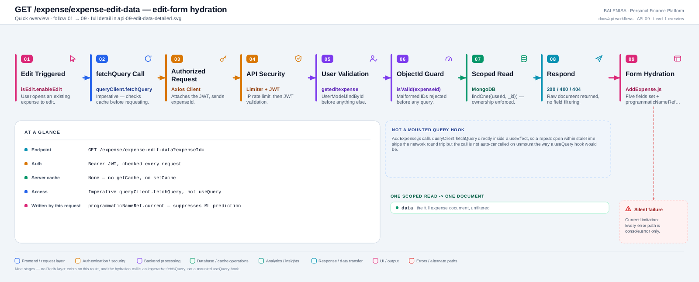
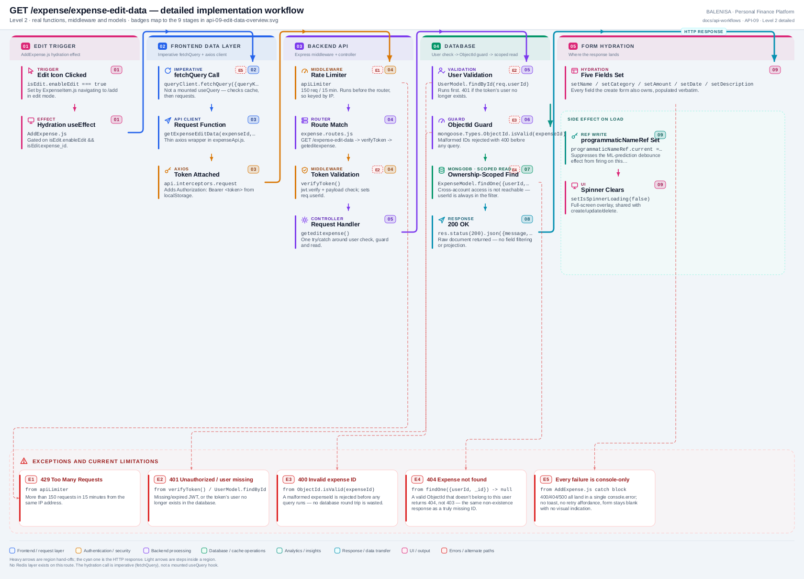

# API-09 — Edit-form hydration

`GET /expense/expense-edit-data`

> **Created during the repository-wide API coverage gate.** Previously this endpoint was
> cross-linked only from [FLOW-02](../flow/retrieval-assisted-edit/flow-02-retrieval-assisted-edit.md), which is not a
> substitute for its own API document under this corpus's coverage rules. This is now
> that document. FLOW-02 continues to describe the combined retrieval-then-edit user
> journey and cross-links this document rather than duplicating it.

Two levels of the same workflow. Every statement below is traced to the current
repository implementation.

## 1. Purpose

Fetches one expense by ID so the Add/Edit form can pre-fill its five fields when a user
opens an existing expense for editing.

## 2. Endpoint and HTTP method

| | |
|---|---|
| **Method** | `GET` |
| **Path** | `/expense/expense-edit-data` |
| **Mount** | `app.use("/expense", apiLimiter, expenseRouter)` → `router.get('/expense-edit-data', verifyToken, geteditexpense)` |
| **Middleware order** | `apiLimiter` → `verifyToken` → `geteditexpense` |
| **Auth** | Required — Bearer JWT |
| **Rate limiting** | `apiLimiter`, shared with every other `/expense` route |
| **Server cache** | None — confirmed no Redis read/write in `geteditexpense.js` |

## 3. Level 1 quick workflow

<picture>
  <source srcset="api-09-edit-data-overview.svg" type="image/svg+xml">
  
</picture>

Vector: [`api-09-edit-data-overview.svg`](api-09-edit-data-overview.svg) ·
raster fallback: [`api-09-edit-data-overview.png`](api-09-edit-data-overview.png)

## 4. Level 2 detailed workflow

<picture>
  <source srcset="api-09-edit-data-detailed.svg" type="image/svg+xml">
  
</picture>

Vector: [`api-09-edit-data-detailed.svg`](api-09-edit-data-detailed.svg) ·
raster fallback: [`api-09-edit-data-detailed.png`](api-09-edit-data-detailed.png)

## 5. Request structure

```http
GET /expense/expense-edit-data?expenseId=<id> HTTP/1.1
Authorization: Bearer <jwt>
```

`expenseId` is a required query parameter — `req.query.expenseId`. No request body.

## 6. Request validation behaviour

| Check | Where | On failure |
|---|---|---|
| JWT valid, user exists | `verifyToken`, then `UserModel.findById` | `401` |
| `expenseId` is a valid Mongo ObjectId | `mongoose.Types.ObjectId.isValid(expenseId)` | `400 "Invalid expense ID"` |
| Expense exists and belongs to this user | `ExpenseModel.findOne({ userId, _id })` | `404 "Expense not found"` |

No Joi schema — validation is inline in the controller, matching `geteditexpense.js`
exactly.

## 7. Processing behaviour

A single scoped `findOne`: `ExpenseModel.findOne({ userId: user._id, _id: expenseId })`.
No aggregation, no population, no transformation of the returned document.

## 8. Response structure

```jsonc
{
  "message": "Expense Retrieved Successfully",
  "data": { "_id": "...", "expenseName": "...", "expenseCategory": "...",
            "expenseAmount": 42, "expenseDate": "2026-07-01T00:00:00.000Z",
            "expenseDescription": "..." },
  "success": true
}
```
`200` on success. `400`/`404`/`401` bodies all include `"success": false` and a
`message`. `500` on an unexpected error, generic message, error logged server-side only.

## 9. Persistence behaviour

None — read-only. No write, no cache population.

## 10. Frontend consumption

`frontend/src/components/expensesHandling/AddExpense.js`, inside a `useEffect` gated by
`isEdit.enableEdit && isEdit.expense_id`. Calls `getExpenseEditData` (in
`frontend/src/api/expenseApi.js`) through `queryClient.fetchQuery`, **not** a
`useQuery` hook — a direct imperative fetch routed through the TanStack Query cache so a
repeat edit-open within `staleTime` skips the network round trip. On success, five form
fields are populated (`expenseName`, `expenseCategory`, `expenseAmount`, `expenseDate`,
`expenseDescription`) and `programmaticNameRef.current` is set to the loaded name so the
ML-prediction effect doesn't immediately overwrite the loaded category.

## 11. TanStack Query and cache behaviour

| | |
|---|---|
| Access pattern | `queryClient.fetchQuery({ queryKey: queryKeys.expenses.detail(id), queryFn })` — imperative, not `useQuery` |
| Cache key | `queryKeys.expenses.detail(isEdit.expense_id)` |
| Stale time | Whatever `expenses.detail` inherits from the global default — a repeat open within that window resolves from cache with no request |
| Invalidation | This key is included in every mutation's `["expenses"]` prefix invalidation (API-05/06/07), so a fresh edit after a save always refetches |
| Cancellation | `signal` is threaded through to `axios`, but `fetchQuery` (unlike a mounted `useQuery`) is not automatically aborted on unmount |

## 12. Loading, success and error states

| State | Behaviour |
|---|---|
| Loading | `isSpinnerLoading` — a full-screen spinner overlay, same component used for create/update/delete |
| Success | Five fields populated; spinner clears |
| Error (400/404) | `console.error("Fetch failed:", data.message)` or `err.response?.data?.message` — **no toast, no UI error state**, form stays blank |
| Error (401/429/409) | Explicitly skipped by the component's own catch — the shared axios interceptor already surfaces these |
| Malformed `expenseId` in the URL/state | Returns `400`, handled the same as any other error — console only |

## 13. Runtime/in-memory effects

`programmaticNameRef.current` is set to the loaded `expenseName` — a client-side ref used
to suppress the ML-prediction debounce effect from firing on the programmatically-loaded
name, so a fetch that resolves after the user has already started typing a new name would
overwrite it. Documented as a shared writer in the ML prediction dependency inventory
(consumption map §D).

## 14. Security and operational behaviour

| Concern | Finding |
|---|---|
| Auth | Required, correct — `verifyToken` before the controller |
| Cross-account access | Not possible — `userId` is always part of the query filter |
| ObjectId injection | Guarded — malformed IDs rejected with `400` before any query runs |
| Rate limiting | `apiLimiter`, shared with the rest of `/expense` |
| Information disclosure | The full expense document is returned verbatim, including internal `_id` — no field filtering, but nothing sensitive beyond what the user already owns |

## 15. Files involved

| Layer | File | Function/Export | Purpose |
|---|---|---|---|
| Frontend | `frontend/src/components/expensesHandling/AddExpense.js` | edit-hydration `useEffect` | Trigger, field population, ref write |
| API client | `frontend/src/api/expenseApi.js` | `getExpenseEditData` | Thin axios wrapper |
| Interceptors | `frontend/src/api/axios.js` | `api` | Bearer token; 401/429/409 handling |
| Server mount | `backend/server.js` | `app.use("/expense", apiLimiter, expenseRouter)` | Rate limiter ahead of the router |
| Route | `backend/Routes/expense.routes.js` | `router.get('/expense-edit-data', verifyToken, geteditexpense)` | Route wiring |
| Auth | `backend/Middlewares/Auth.js` | `verifyToken` | JWT check |
| Controller | `backend/Controllers/ExpenseControllers/geteditexpense.js` | `geteditexpense` | Validation, scoped read |
| Model | `backend/config/Schemas.js` | `ExpenseModel` | Read target |

## 16. Current implementation observations

**Summary:** Correctness 1 · Security / operational 1 · Reliability 2 · Maintainability 2

### Correctness

1. **The response returns the raw document, including `_id` and every field**, rather
   than the five fields the form actually consumes — confirmed by comparing the
   controller's `res.json({ data: expense })` against the five `setX(...)` calls in
   `AddExpense.js`. Harmless today, but any future schema field is exposed to the client
   automatically with no allow-list.

### Security / operational

2. **No length or shape validation on the returned data** beyond what the schema already
   enforces at write time — this route trusts the stored document completely, which is
   correct given ownership is checked, but means a previously-written bad value (e.g. from
   `PUT /expense/update-expense`'s lack of `runValidators`, documented in API-06) is
   returned and re-displayed without correction.

### Reliability

3. **`fetchQuery` is not cancelled on unmount**, unlike the mounted `useQuery` hooks used
   elsewhere in this module (`useExpensesQuery`). Navigating away from the edit form mid-
   request lets the fetch resolve into a `queryClient` cache entry for a component that no
   longer reads it — harmless (no state update on an unmounted component, since the
   `.then` lives inside the `try` and only sets state that the unmounted component no
   longer renders) but inconsistent with the rest of the module's cancellation discipline.

4. **Failure is silent to the user.** Every error path — malformed ID, not found, or a
   500 — results only in a `console.error`; the form remains blank with no toast, no retry
   affordance, and no visual indication that anything went wrong.

### Maintainability

5. **Accessed imperatively rather than via a dedicated hook.** Every other read in this
   module (`useExpensesQuery`) is a proper TanStack `useQuery` hook; this one is a direct
   `queryClient.fetchQuery` call inside a `useEffect` in `AddExpense.js` itself, which is
   why it had no natural "hook name" and was easy to overlook during earlier module passes.
