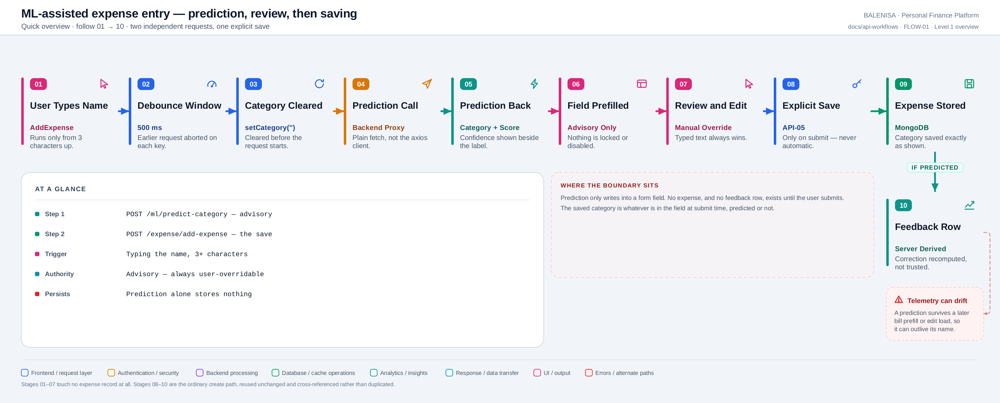
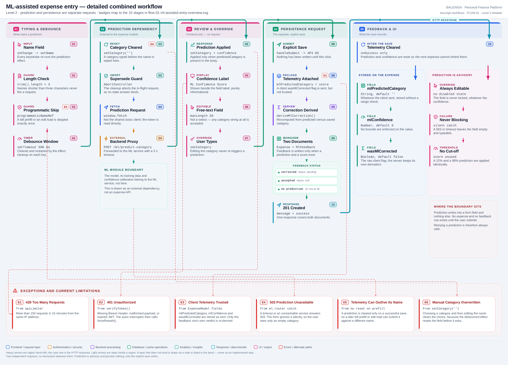

# FLOW-01 — ML-assisted expense entry

A combined workflow, not an endpoint. It spans **two independent requests**: an advisory
category prediction, and — only if the user submits — the ordinary create call
([API-05](api-05-create-expense.md)). Nothing is written between them.

## 1. Trigger

Typing in the **Name of the Expense** field. The effect is keyed on `expenseName`, so every
keystroke re-runs it, and three conditions must hold before a request is made:

```js
if (programmaticNameRef.current === expenseName) return;   // 1. not a programmatic fill
programmaticNameRef.current = null;
if (expenseName.trim().length < 3) return;                 // 2. at least three characters
// 3. survive the 500 ms debounce without another keystroke
```

Nothing else triggers prediction. Editing the category, the amount, the date or the
description never does, and prediction does **not** run on the update path — an edit-loaded
name is suppressed by the same ref (see [FLOW-02](flow-02-retrieval-assisted-edit.md)).

---

## 2. Level 1 — Quick workflow overview

<picture>
  <source srcset="flow-01-ml-assisted-entry-overview.svg" type="image/svg+xml">
  
</picture>

Vector source: [`flow-01-ml-assisted-entry-overview.svg`](flow-01-ml-assisted-entry-overview.svg) ·
raster preview / fallback: [`flow-01-ml-assisted-entry-overview.png`](flow-01-ml-assisted-entry-overview.png)

---

## 3. Level 2 — Detailed implementation workflow

<picture>
  <source srcset="flow-01-ml-assisted-entry-detailed.svg" type="image/svg+xml">
  
</picture>

Vector source: [`flow-01-ml-assisted-entry-detailed.svg`](flow-01-ml-assisted-entry-detailed.svg) ·
raster preview / fallback: [`flow-01-ml-assisted-entry-detailed.png`](flow-01-ml-assisted-entry-detailed.png)

---

## 4. Input and form state

| State | Owner | Set by |
|---|---|---|
| `expenseName` | `AddExpense` | Typing, bill prefill, or edit hydration |
| `expenseCategory` | `AddExpense` | Typing **or** a prediction |
| `mlPredictedCategory` | `AddExpense` | A prediction only |
| `mlConfidence` | `AddExpense` | A prediction only; reset to `null` when a new one starts |
| `mlLoading` | `AddExpense` | Drives the three-dot indicator under the category field |
| `programmaticNameRef` | `AddExpense` (a ref) | Bill prefill and edit hydration |

All plain component state — no Context, no query cache. Prediction state is cleared only in
the create mutation's `onSuccess`.

## 5. API dependencies

| Request | Owner | Counted here? |
|---|---|---|
| `POST /ml/predict-category` | **ML module** — `backend/Routes/ml.router.js`, proxying to `${ML_ROUTE}/predict-category` | No. Shown as an external dependency |
| `POST /expense/add-expense` | Expense module | No. Documented as [API-05](api-05-create-expense.md) |

The prediction route is not counted as an Expense API: it lives on the `/ml` mount, its
purpose is prediction rather than expense management, and its body, model and confidence
semantics belong to the ML service. **The full ML training and model lifecycle is out of
scope here and is marked for the ML module.**

What the proxy does contribute to this flow:

- a bounded `PREDICT_TIMEOUT_MS = 5000` on the upstream call;
- three distinguished failure modes — `503` when the service is unreachable or slow, the
  ML service's own 4xx forwarded verbatim, and `500` for anything else;
- the successful body forwarded unchanged: `expenseName`, `cleanedText`,
  `predictedCategory`, `confidence`.

The frontend calls it with a bare `window.fetch`, **not** the shared axios client, so it
reads the token from `localStorage` itself and handles 401 by calling `forceReauth()`
directly.

## 6. Prediction and transformation

```js
const controller = new AbortController();
const debounceTimer = setTimeout(async () => {
    setCategory('');
    setMlConfidence(null);
    setMlLoading(true);
    // ... fetch with signal: controller.signal ...
    if (data.predictedCategory) {
        setCategory(data.predictedCategory);
        setMlConfidence(data.confidence);
        setMlPredictedCategory(data.predictedCategory);
    }
}, 500);
return () => { clearTimeout(debounceTimer); controller.abort(); };
```

| Concern | Implementation |
|---|---|
| Debounce | 500 ms, cleared by the effect cleanup on each keystroke |
| Stale responses | **Prevented.** The cleanup aborts the in-flight request, and an `AbortError` is swallowed as "superseded, not an error" |
| Cancellation | Yes — the same `AbortController`, also fired on unmount |
| Confidence used | **Displayed only.** No threshold gates whether the prediction is applied |
| Override | Always. The field is a plain text input, never disabled |
| Failure blocking submit | **No.** Every non-OK response returns silently and the field stays empty |
| Persistence by prediction | **None.** Prediction writes into React state and nothing else |

At submit time the client applies `normalizeCategory`, so the saved value is title-cased:
`normalizeCategory("food")` → `"Food"`.

## 7. User review and override

The predicted value lands in an ordinary `<input type="text" maxLength={20} required>`. The
user can accept it, edit it or replace it. Two behaviours are worth stating precisely:

- **Typing the category never re-triggers prediction** — the effect depends on
  `expenseName` alone.
- **Editing the name after choosing a category discards that choice**, because
  `setCategory('')` runs at the start of the debounced callback, before the request.

## 8. Persistence boundary

Nothing is written until `handleSubmit` runs. That single request creates up to two
documents:

```js
const { hasPrediction, corrected: mlCorrected } = deriveMlCorrection(
  mlPredictedCategory, expenseCategory);

if (hasPrediction && mlConfidence !== undefined) {
    const mlFeedback = new MlFeedbackModel({
        expenseName, predictedCategory: mlPredictedCategory,
        actualCategory: expenseCategory, confidence: mlConfidence,
        corrected: mlCorrected,
        status: mlCorrected ? 'pending' : null,
        userId: user._id
    });
    await mlFeedback.save();
}
```

| Case | Feedback row |
|---|---|
| Prediction accepted as-is | written, `corrected: false`, `status: null` |
| Prediction overridden | written, `corrected: true`, `status: 'pending'` |
| No prediction (`mlPredictedCategory` empty) | **no row at all** |

**The client's `wasMlCorrected` flag is not trusted for this verdict.** `deriveMlCorrection`
recomputes it server-side from the predicted versus saved category, case- and
whitespace-insensitively. Verified by running both implementations side by side: for
`predicted = "Food"` and a typed `"food"`, the client computes `false` and the server also
derives `corrected: false`, because `normalizeCategory` has already title-cased the typed
value to `"Food"`.

The raw client flag is nonetheless still stored on the *expense* document.

## 9. Cache effects

Prediction touches no cache — server-side or client-side. The save carries all of
[API-05's](api-05-create-expense.md#12-redis-and-frontend-cache-invalidation) invalidation:
`clearUserExpenseCache`, `refreshReport`, and four TanStack Query prefixes.

## 10. Failure and recovery behaviour

| Failure | What the user sees | Recovery |
|---|---|---|
| Missing `REACT_APP_BACKEND_URL` | Nothing — thrown into the same silent catch | Type the category manually |
| `503` prediction service unavailable | Nothing. The dots stop, the field stays empty | Manual entry; submit is unaffected |
| `429` on `/ml` | **Deliberately silent** — no toast per keystroke | Prediction resumes after the window |
| `401` | `forceReauth()` — storage and query cache cleared, back to the login screen | Sign in again |
| Aborted (superseded) | Nothing; treated as normal | — |
| Save fails | Error toast; **the form keeps every value, including the prediction** | Resubmit |

Retrying a prediction is always safe: it writes nothing.

## 11. Files involved

| Layer | File | Function/Export | Purpose |
|---|---|---|---|
| UI | `frontend/src/components/expensesHandling/AddExpense.js` | prediction `useEffect` | Debounce, abort, apply |
| UI | same | `normalizeCategory` | Title-cases the saved category |
| UI | same | `programmaticNameRef` | Suppresses prediction for a non-typed name |
| API | `frontend/src/api/handleApiError.js` | `forceReauth` | 401 path for the bare fetch |
| Route | `backend/Routes/ml.router.js` | `POST /predict-category` | Proxy with a 5 s timeout |
| Controller | `backend/Controllers/ExpenseControllers/addexpense.js` | `deriveMlCorrection` | Server-side correction verdict |
| Model | `backend/config/Schemas.js` | `MlFeedbackModel` | Training feedback row |
| External | `ml-service/app.py` | `POST /predict-category` | The model itself — **documented under the ML module** |

## 12. Current implementation observations

**Correctness**

1. **Choosing a category first, then editing the name, silently discards the choice.**
   `setCategory('')` runs at the top of the debounced callback. If the request then fails
   or returns no category, the field is left empty and nothing explains why.
2. **Prediction telemetry can outlive the name it describes.** `mlPredictedCategory` and
   `mlConfidence` are cleared **only** in the create mutation's `onSuccess`. Predict a
   category for "coffee", then open the bill scanner and prefill "FRESH MART": the ref
   suppresses a new prediction, but the old telemetry is still in state and is submitted —
   producing an `mlFeedback` row whose `expenseName` and `predictedCategory` came from
   different expenses.
3. **`normalizeCategory` capitalises after an apostrophe**, so an accepted prediction of
   `don't care` would be saved as `Don'T Care` and then read back as a *correction*.
4. **Confidence is decorative.** A 12% and a 99% prediction are applied identically; no
   threshold, no styling difference beyond the number, no warning.

**Security / operational**

5. **Prediction calls are bounded only by the shared IP limiter.** 150 requests per 15
   minutes across *all* `/ml` routes, shared by everyone behind one NAT. The 500 ms
   debounce is the real throttle.
6. **No ML-service URL or key reaches the browser.** The frontend calls
   `REACT_APP_BACKEND_URL/ml/predict-category`; `ML_ROUTE` stays server-side. Recorded as
   a positive.
7. **Client telemetry is stored unvalidated** on the expense — see
   [API-05 §17.9](api-05-create-expense.md#17-current-implementation-observations). The
   feedback row's verdict is the part that is protected.
8. **A raw `fetch` bypasses the shared interceptor**, so this one call re-implements the
   401 path by hand. It works, but the 429 and 409 handling that every other call inherits
   is absent by design here.

**Reliability**

9. **Every prediction failure is silent.** `console.log` only. A permanently down ML
   service is indistinguishable from a short name.
10. **`console.log("ML Prediction:", data)` ships to production**, printing the predicted
    category and score on every keystroke burst.
11. **The feedback row is saved before the expense**, so a failed insert leaves an orphan.

**Maintainability**

12. **Two sources for the same fact.** `wasMlCorrected` is stored on the expense from the
    client while `corrected` on the feedback row is derived on the server. The controller's
    own comment flags this as a compatibility step pending migration.

---

**Related:** [API-05 — create](api-05-create-expense.md) ·
[FLOW-02 — retrieval-assisted edit](flow-02-retrieval-assisted-edit.md) ·
[BILLS-FLOW-01 — scan to saved expense](../bills/bills-flow-01-scan-to-expense.md) ·
[consumption map](expense-consumption-map.md)
