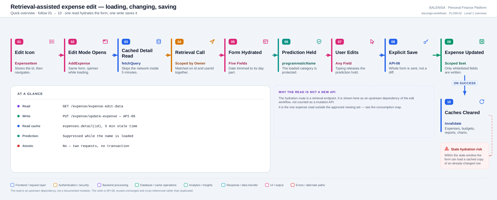
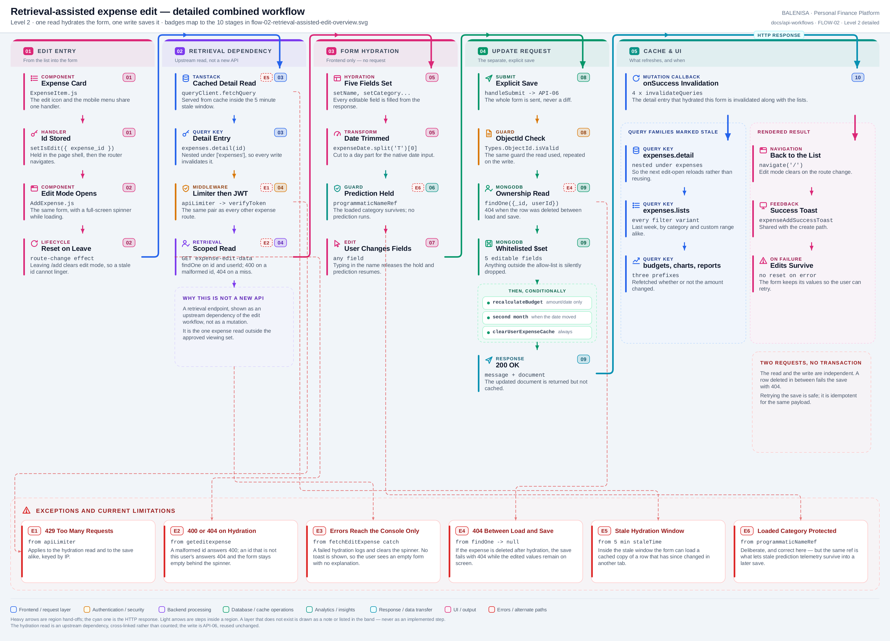

# FLOW-02 — Retrieval-assisted expense edit

A combined workflow, not an endpoint. One **retrieval** call hydrates the form, the user
changes what they want, and one **mutation** call saves it
([API-06](api-06-update-expense.md)). The two are independent requests with no transaction
between them.

## 1. Trigger

The edit icon on an expense card, or **Edit** in the mobile action menu:

```js
const handleEdit = () => {
  setIsEdit({ enableEdit: true, expense_id: expense._id });
  navigate("/add");
};
```

`isEdit` lives in `LandingPage`, so the id survives the route change. A second effect
clears it whenever the user navigates away from `/add`, which prevents a stale id from
re-opening edit mode later.

---

## 2. Level 1 — Quick workflow overview

<picture>
  <source srcset="flow-02-retrieval-assisted-edit-overview.svg" type="image/svg+xml">
  
</picture>

Vector source: [`flow-02-retrieval-assisted-edit-overview.svg`](flow-02-retrieval-assisted-edit-overview.svg) ·
raster preview / fallback: [`flow-02-retrieval-assisted-edit-overview.png`](flow-02-retrieval-assisted-edit-overview.png)

---

## 3. Level 2 — Detailed implementation workflow

<picture>
  <source srcset="flow-02-retrieval-assisted-edit-detailed.svg" type="image/svg+xml">
  
</picture>

Vector source: [`flow-02-retrieval-assisted-edit-detailed.svg`](flow-02-retrieval-assisted-edit-detailed.svg) ·
raster preview / fallback: [`flow-02-retrieval-assisted-edit-detailed.png`](flow-02-retrieval-assisted-edit-detailed.png)

---

## 4. Input and form state

`AddExpense` is one component in two modes. In edit mode it fills the same five pieces of
state it would otherwise collect by typing:

```js
const data = await queryClient.fetchQuery({
    queryKey: queryKeys.expenses.detail(isEdit.expense_id),
    queryFn: ({ signal }) => getExpenseEditData(isEdit.expense_id, signal),
});
if (data.data) {
    const exp = data.data;
    programmaticNameRef.current = exp.expenseName || '';
    setName(exp.expenseName || '');
    setCategory(exp.expenseCategory || '');
    setAmount(exp.expenseAmount || '');
    setDate(exp.expenseDate?.split('T')[0] || '');
    setDescription(exp.expenseDescription || '');
}
```

The submit button's label switches to **Update Expense**, and `handleSubmit` branches to
the update mutation instead of the create one. Everything else — the fields, the
sanitisers, the spinner, the toasts — is shared.

## 5. API dependencies

| Request | Role | Counted here? |
|---|---|---|
| `GET /expense/expense-edit-data?expenseId=<ObjectId>` | Hydration | **No — it is a retrieval endpoint.** Shown as an upstream dependency |
| `PUT /expense/update-expense?editID=<ObjectId>` | Persistence | No. Documented as [API-06](api-06-update-expense.md) |

Worth stating plainly: the hydration route is **not** one of the four approved expense
viewing APIs. Those cover the list, the two category periods and the custom range
([API-01](api-01-last-week.md) – [API-04](api-04-custom-range.md)); the original index
explicitly placed `expense-edit-data` out of that scope because it backs the edit form
rather than the viewing experience. It is a **fifth expense read endpoint that has no
document of its own**, and it is recorded as such in the
[consumption map](expense-consumption-map.md#e-known-gap-the-fifth-read-endpoint).

Its behaviour, traced for this flow:

| | |
|---|---|
| Route | `router.get('/expense-edit-data', verifyToken, geteditexpense)` |
| Guard | `Types.ObjectId.isValid(req.query.expenseId)` → 400 |
| Query | `findOne({ userId: user._id, _id: expenseId })` → 404 when it misses |
| Redis | **None.** This read is not cached server-side |
| Response | `{ message, data: <full document>, success: true }` |

## 6. Prediction suppression

The hydration deliberately protects the category it just loaded:

```js
programmaticNameRef.current = exp.expenseName || '';
setName(exp.expenseName || '');
```

On the next run of the prediction effect, `programmaticNameRef.current === expenseName`, so
it returns before doing anything. The stored category survives. As soon as the user edits
the name, the values differ, the ref is nulled, and prediction resumes normally.

This is the correct behaviour here — but it is the same mechanism that lets stale
prediction telemetry survive into a later save, described in
[FLOW-01 §12.2](flow-01-ml-assisted-entry.md#12-current-implementation-observations).

## 7. Transformation

One transform on the way in:

```js
setDate(exp.expenseDate?.split('T')[0] || '');
```

The stored `Date` serialises as `2026-07-30T00:00:00.000Z`, and `<input type="date">`
needs `2026-07-30`. Because the value was stored as UTC midnight in the first place, the
day part round-trips unchanged.

Nothing else is transformed. `expenseAmount` goes straight into a number input;
`setAmount(exp.expenseAmount || '')` turns a stored `0` into an empty string, though
[API-05](api-05-create-expense.md) makes a zero-amount expense impossible to create in the
first place.

## 8. User review and the persistence boundary

Every field stays editable, and nothing is written until submit. The whole form is sent,
never a diff — but [API-06](api-06-update-expense.md#5-request-structure) applies its
five-name allow-list regardless, so `id`, `userId`, `isRecurring` and the ML telemetry
fields cannot be reached even though some of them were loaded into the component.

**The two requests are not atomic.** Between the read and the write, the expense may have
been changed or deleted in another tab or on another device. The write then answers 404
while the user's typed edits are still on screen.

## 9. Cache effects

| Stage | Effect |
|---|---|
| Hydration read | Served through `queryClient.fetchQuery` on `expenses.detail(id)`. Inside the 5-minute `staleTime` it **skips the network entirely** |
| Hydration read (server) | No Redis on this route |
| Save | Full [API-06 propagation](api-06-update-expense.md#12-redis-and-frontend-cache-invalidation): `clearUserExpenseCache`, `refreshReport`, four query prefixes |
| After the save | `expenses.detail(id)` is nested under `["expenses"]`, so the next edit-open refetches instead of replaying the pre-edit copy |

That last point is what keeps the flow self-consistent: the write invalidates the very
cache entry the read relies on.

## 10. Failure and recovery behaviour

| Failure | What the user sees | Recovery |
|---|---|---|
| Malformed id (400) | Spinner clears, **empty form**, message in the console only | Navigate back and retry |
| Expense not found (404) on hydration | Same — empty form, no toast | Navigate back |
| Hydration network error | Same silent path; 401/429/409 are skipped because the interceptor already handled them | — |
| 401 anywhere | `forceReauth()` clears storage and the query cache | Sign in again |
| Save 404 (deleted in between) | Generic error toast; **edits are preserved on screen** | Re-create the expense |
| Save 500 (cast failure) | Generic error toast; edits preserved | Correct the value |

Retrying the save is safe — [API-06 is idempotent](api-06-update-expense.md#14-retry-and-duplicate-submission-behaviour)
for the same payload.

## 11. Files involved

| Layer | File | Function/Export | Purpose |
|---|---|---|---|
| UI | `frontend/src/components/expensesHandling/ExpenseItem.js` | `handleEdit` | Records the id, navigates |
| Shell | `frontend/src/components/landingPage/LandingPage.js` | `isEdit`, route-change effect | Holds and clears the target id |
| UI | `frontend/src/components/expensesHandling/AddExpense.js` | `fetchEditExpense` effect | Hydration, spinner, prediction hold |
| API | `frontend/src/api/expenseApi.js` | `getExpenseEditData(expenseId, signal)` | The hydration read |
| API | `frontend/src/api/expenseApi.js` | `updateExpense(editID, payload)` | The save |
| Query | `frontend/src/query/queryClient.js` | `queryClient` | `staleTime` 5 min, `gcTime` 30 min |
| Query | `frontend/src/query/queryKeys.js` | `queryKeys.expenses.detail` | The hydration cache key |
| Route | `backend/Routes/expense.routes.js` | `/expense-edit-data`, `/update-expense` | Both halves of the flow |
| Controller | `backend/Controllers/ExpenseControllers/geteditexpense.js` | `geteditexpense` | Scoped read |
| Controller | `backend/Controllers/ExpenseControllers/editExpense.js` | `editexpense` | Scoped, whitelisted write |

## 12. Current implementation observations

**Correctness**

1. **A stale hydration is possible.** Inside the 5-minute `staleTime`, `fetchQuery` returns
   the cached document without asking the server. If the expense changed in another tab —
   and that tab's invalidation does not reach this one — the form loads and then saves
   values that were already superseded.
2. **A stored zero becomes an empty field.** `setAmount(exp.expenseAmount || '')` treats
   `0` as falsy. Unreachable through the UI today, because create rejects a zero — but
   [update accepts one](api-06-update-expense.md#6-validation-behaviour), so a
   zero-amount expense produced by a direct API call would hydrate with a blank amount.
3. **The date transform assumes UTC storage.** It holds today because
   `<input type="date">` stores UTC midnight, but any change to how dates are written would
   shift the day silently.

**Security / operational**

4. **Both halves are ownership-scoped in the filter**, and both validate the ObjectId
   before querying. Recorded as a positive.
5. **The hydration response returns the full document**, including `mlPredictedCategory`,
   `mlConfidence` and `wasMlCorrected`. It is the caller's own row, so this is disclosure
   only to its owner, but the component uses none of those fields.

**Reliability**

6. **Every hydration failure is silent.** The catch deliberately skips 401/429/409 to avoid
   a duplicate toast, but the remaining cases — including 400 and 404 — reach only
   `console.error`. The user is left with a blank form and no explanation.
7. **The hydration request's `AbortSignal` is honoured** — `getExpenseEditData` accepts and
   forwards it, so navigating away mid-load cancels the request. Recorded as a positive,
   and worth contrasting with the bill upload, where the signal is
   [accepted but never passed](../bills/bills-api-01-upload-and-extract.md).
8. **No conflict detection.** Nothing carries a version or an `updatedAt`, so a
   last-write-wins overwrite between two tabs is undetectable.

**Maintainability**

9. **A read endpoint with no document.** `GET /expense/expense-edit-data` is traced here as
   a dependency but has no page of its own, so its guards and response shape have to be
   read out of this flow rather than from a read-side document.

---

**Related:** [API-06 — update](api-06-update-expense.md) ·
[FLOW-01 — ML-assisted entry](flow-01-ml-assisted-entry.md) ·
[API-01 … API-04 — the approved read set](README.md) ·
[consumption map](expense-consumption-map.md)
