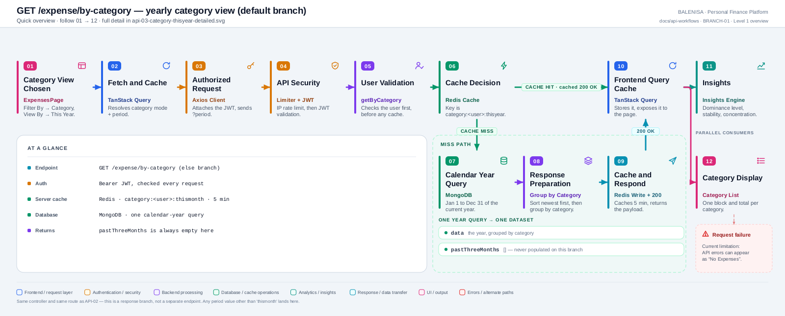
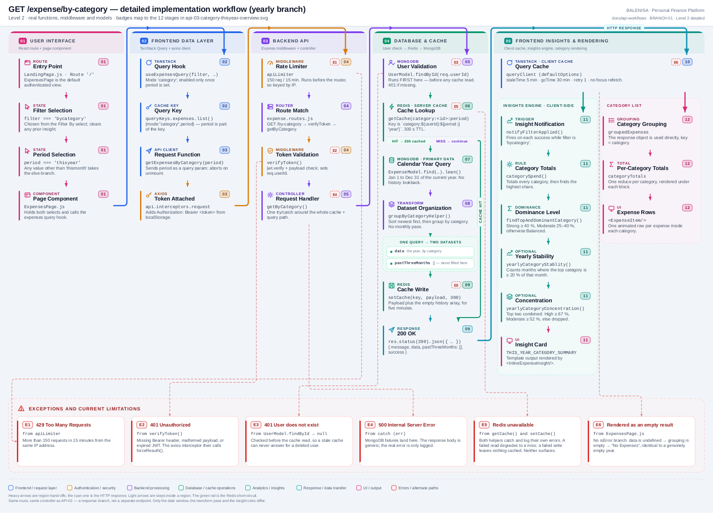

# BRANCH-01 — Yearly category view (response branch of API-02)

`GET /expense/by-category` — the else branch of `getByCategory`

> **Reclassified during the repository-wide API coverage gate.** This document was
> previously numbered API-03. Under the binding coverage rule that every source
> endpoint maps to **exactly one** API document, `GET /expense/by-category` cannot have
> two — [API-02](../category-thismonth/api-02-category-thismonth.md#endpoint-and-http-method) is that route's
> one API workflow document. This file is **not** an API workflow: it documents a second
> response branch of the same endpoint, cross-linked from API-02, and is excluded from
> the corpus's API-workflow and source-endpoint counts. It is retained as a standalone
> document (rather than merged into API-02) because the two branches differ enough —
> date window, transform pass, insight rules — to be worth reading independently.

Two levels of the same workflow. Every statement below is traced to the current
repository implementation.

> **Shared endpoint, not a separate one.** Same route, same controller and same
> middleware as [API-02](../category-thismonth/api-02-category-thismonth.md). The backend special-cases only
> `period === 'thismonth'`; **every other value falls through here**, including the UI's
> `'thisyear'` and a request with no `period` at all. This document covers that else
> branch.

---

## Level 1 — Quick workflow overview

<picture>
  <source srcset="api-03-category-thisyear-overview.svg" type="image/svg+xml">
  
</picture>

Vector source: [`api-03-category-thisyear-overview.svg`](api-03-category-thisyear-overview.svg) ·
raster preview / fallback: [`api-03-category-thisyear-overview.png`](api-03-category-thisyear-overview.png)

| | |
|---|---|
| **Endpoint** | `GET /expense/by-category` (any period ≠ `thismonth`) |
| **Auth** | Bearer JWT, validated on every request |
| **Server cache** | Redis · `category:<userId>:thisyear` · 5 min TTL |
| **Database** | MongoDB · one calendar-year query (Jan 1 → Dec 31) |
| **Client cache** | TanStack Query · 5 min stale time |
| **Returns** | `data` (the year by category), `pastThreeMonths: []` |

---

## Level 2 — Detailed implementation workflow

<picture>
  <source srcset="api-03-category-thisyear-detailed.svg" type="image/svg+xml">
  
</picture>

Vector source: [`api-03-category-thisyear-detailed.svg`](api-03-category-thisyear-detailed.svg) ·
raster preview / fallback: [`api-03-category-thisyear-detailed.png`](api-03-category-thisyear-detailed.png)

> Zoomable engineering reference. Use the Level 1 overview for the shape of the flow.

## What actually changes versus API-02

Stages 01–06 and 09–10 are byte-for-byte the same code path. The `period` value changes
four things and nothing else:

| Stage | This-month branch (API-02) | Yearly branch (API-03) |
|---|---|---|
| **Cache key** | `category:<userId>:thismonth` | `category:<userId>:thisyear` (or `…:year` when `period` is absent) |
| **07 Date window** | 1st of 3 months ago → end of this month (~4 months) | `new Date(y, 0, 1)` → `new Date(y+1, 0, 0, 23:59:59.999)`, i.e. Jan 1 → Dec 31 |
| **08 Transform** | `groupByMonth` builds the history, then the current month is filtered out, sorted and grouped | No monthly pass at all — the whole range is sorted newest-first and grouped by category |
| **09 Response** | `pastThreeMonths` holds 3 entries | `pastThreeMonths` is `[]` — `history` is initialised empty and never written on this branch |
| **11 Insights** | Dominance ≥ 35 % → `habitOrSpike` + `detectMicroTransactions` | Dominance *level* (Strong / Moderate / Balanced) → `yearlyCategoryStablity` + `yearlyCategoryConcentration` |

Everything else — middleware order, user-validation-before-cache, the hit/miss branch,
the client cache, and the list rendering — is unchanged.

### Insight rules on this branch

`findTopAndDominantCategory` returns a `dominanceLevel` rather than a nullable dominant
category: **Strong** at ≥ 40 %, **Moderate** at 25–40 %, otherwise **Balanced**. Two
optional signals may be added:

- `yearlyCategoryStablity` flattens the response, regroups it by month **and** category,
  and counts the months in which the top category was ≥ 20 % of that month's spend. Four
  or more such months is `MEDIUM`; eight or more is `HIGH`.
- `yearlyCategoryConcentration` sums the top two categories' share. **High** at ≥ 67 %,
  **Moderate** at ≥ 52 %, otherwise dropped. The template suppresses this line entirely
  when dominance is already Strong.

### Request and response

```http
GET /expense/by-category?period=thisyear HTTP/1.1
Authorization: Bearer <jwt>
```

```jsonc
{
  "message": "Success",              // "Success (cached)" on a Redis hit
  "data": {
    "Food":      [ /* Expense[] across the whole year */ ],
    "Transport": [ /* Expense[] */ ]
  },
  "pastThreeMonths": [],             // always empty on this branch
  "success": true
}
```

### Exceptions, empty and loading states

Identical to API-02 — E1 `429`, E2 `401` token, E3 `401` user (checked before the cache),
E4 `500`, E5 Redis swallowed on read and write, E6 error rendered as an empty result. See
the exceptions band on the detailed diagram.

---

## Files involved

Same as [API-02](../category-thismonth/api-02-category-thismonth.md#files-involved), with these insight rules
used instead of the monthly ones:

| Layer | File | Function / export | Purpose |
|---|---|---|---|
| Insights rule | `frontend/src/insights-engine/rules/categoryPatterns.js` | `yearlyCategoryStablity` | Months where the top category held ≥ 20 % share |
| Insights rule | `frontend/src/insights-engine/rules/categoryPatterns.js` | `yearlyCategoryConcentration` | Combined share of the top two categories |
| Statistics | `frontend/src/insights-engine/statistics/statsCalculation.js` | `calculateMedian` | Used by the sibling micro-transaction rule |
| Template | `frontend/src/insights-engine/templates/expenseTemplates.js` | `expenseInsightTemplates.THIS_YEAR_CATEGORY_SUMMARY` | Dominance, stability, concentration lines |

---

## Current implementation observations

**Summary:** Correctness 3 · Security / operational 2 · Reliability 1 · Maintainability 2

The rate-limiter, `trust proxy`, Redis and frontend-error-state findings are shared with
API-01 and API-02 and are not repeated in full — see
[api-01-last-week.md](../last-week/api-01-last-week.md#current-implementation-observations).

| # | Observation | Classification |
|---|---|---|
| 1 | **`stability` reports `isStable: true` even when it is not.** `yearlyCategoryStablity` returns `{ isStable: false }` when fewer than four qualifying months are found, but the caller tests `stablity ? … : null` — a truthy object — and then hardcodes `isStable: true`, leaving `level` and `stableMonths` `undefined`. The template's `stability.level` check matches neither `HIGH` nor `MEDIUM`, so no line is rendered and the bug is invisible in the UI. The payload is nonetheless wrong for anything that reads it. | Correctness |
| 2 | **The branch is a fall-through, not an explicit case.** The backend tests only `period === 'thismonth'`; the frontend's `categorySpend` tests `filterMeta === 'thisyear'` explicitly and returns `undefined` for anything else. A request with no `period` therefore gets yearly *data* from the backend but **no insight at all** from the frontend, because `categorySpend` falls off the end of its `if / else if`. | Correctness |
| 3 | **Cache key and behaviour can disagree.** `` `category:${userId}:${period \|\| 'year'}` `` produces a distinct key for every period string, but the controller treats every non-`thismonth` value identically. `?period=foo` and `?period=thisyear` return the same bytes under two different keys. | Correctness |
| 4 | **Rate limiter runs before `verifyToken`**, so it always falls back to IP keys. | Security / operational |
| 5 | **`trust proxy` is unset**, so behind a proxy every user shares one bucket. | Security / operational |
| 6 | **Redis failures are swallowed on both read and write**, degrading silently to a permanent cache miss. | Reliability |
| 7 | **The frontend has no distinct API error state** — a failed query renders as "No Expenses". | Maintainability |
| 8 | **`yearlyCategoryStablity` re-derives month keys from `expenseDate` strings** after the data has already been grouped by category, flattening and regrouping the entire year in the browser on every insight run. Correct, but it repeats work the backend could have supplied. | Maintainability |
