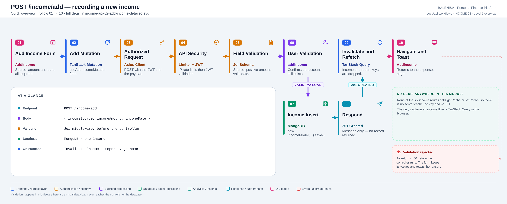
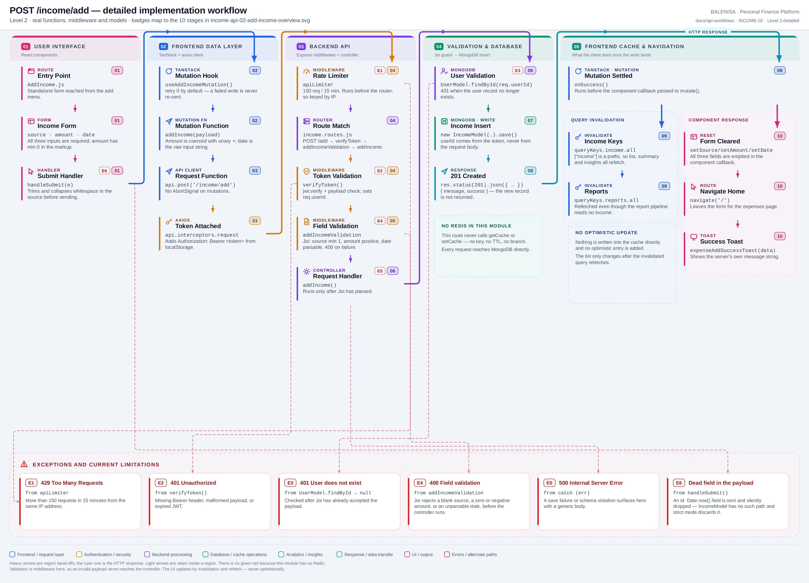

# INCOME-02 — Add an income record

`POST /income/add`

Every statement below is traced to the current repository implementation.

## 1. Purpose

Creates one income record for the authenticated user. This is the only way income enters the system — there is no import, no recurring income job and no bulk endpoint.

## 2. Endpoint and method

| | |
|---|---|
| **Method** | `POST` |
| **Path** | `/income/add` |
| **Mount** | `app.use("/income", apiLimiter, incomeRouter)` — `backend/server.js` |
| **Middleware** | `apiLimiter` → `verifyToken` → `addIncomeValidation` → `addIncome` |
| **Auth** | Required — Bearer JWT |
| **Server cache** | None — no route in this module touches Redis |

## 3. Level 1 quick workflow

<picture>
  <source srcset="income-api-02-add-income-overview.svg" type="image/svg+xml">
  
</picture>

Vector: [`income-api-02-add-income-overview.svg`](income-api-02-add-income-overview.svg) ·
raster fallback: [`income-api-02-add-income-overview.png`](income-api-02-add-income-overview.png)

## 4. Level 2 detailed implementation workflow

<picture>
  <source srcset="income-api-02-add-income-detailed.svg" type="image/svg+xml">
  
</picture>

Vector: [`income-api-02-add-income-detailed.svg`](income-api-02-add-income-detailed.svg) ·
raster fallback: [`income-api-02-add-income-detailed.png`](income-api-02-add-income-detailed.png)

## 5. Request structure

```http
POST /income/add HTTP/1.1
Authorization: Bearer <jwt>
Content-Type: application/json

{ "incomeSource": "Salary", "incomeAmount": 65000, "incomeDate": "2026-07-01",
  "id": "1753..." }
```

`incomeSource` is trimmed and whitespace-collapsed client-side. `incomeAmount` is coerced
with unary `+`. The `id` field is sent by the form but has no path on `IncomeModel`, so
Mongoose's strict mode discards it.

## 6. Response structure

```jsonc
{ "message": "Income Created Successfully", "success": true }
```

Status `201`. The new record is **not** returned, so the client has nothing to seed its
cache with.

## 7. Frontend consumption

`AddIncome.js` is a standalone form with three required inputs. `handleSubmit` builds the payload and calls `useAddIncomeMutation`. On success it clears all three fields, calls `navigate('/')` and shows the server's own message in a toast.

## 8. Cache and state behaviour

| Layer | Behaviour |
|---|---|
| Redis | Absent |
| TanStack Query | `onSuccess` invalidates `queryKeys.income.all` (`["income"]`) and `queryKeys.reports.all` |
| Update strategy | **Invalidation and refetch only** — no direct cache write, no optimistic entry |
| Local state | Form fields are cleared in the component callback, after the mutation resolves |

Because `["income"]` is a prefix, one invalidation reaches the list, the summary and the
insights queries for every period.

## 9. Success, loading, empty and error paths

| State | Behaviour |
|---|---|
| Loading | `addIncomeMutation.isPending` renders a full-screen `<Spinner/>` |
| Success | Fields cleared, navigate to `/`, success toast |
| Validation error | Joi returns `400` before the controller; the form keeps its values and toasts the reason |
| Other error | Toasts `error.response.data`, or a generic "Server error" fallback |
| 401 / 429 / 409 | Skipped in `onError` — the axios interceptor already surfaces them |

## 10. Files involved

| Layer | File | Function/Export | Purpose |
|---|---|---|---|
| Initiator | `frontend/src/components/expensesHandling/AddIncome.js` | `AddIncome`, `handleSubmit` | Form, sanitising, success/error handling |
| Mutation | `frontend/src/hooks/mutations/useAddIncomeMutation.js` | `useAddIncomeMutation` | Invalidates income and report keys |
| API client | `frontend/src/api/incomeApi.js` | `addIncome` | `POST /income/add` |
| Route | `backend/Routes/income.routes.js` | `router.post('/add', …)` | `verifyToken` → `addIncomeValidation` → `addIncome` |
| Validation | `backend/Middlewares/AuthValidation.js` | `addIncomeValidation` | Joi: source, positive amount, date |
| Controller | `backend/Controllers/IncomeControllers/addincome.js` | `addIncome` | User check, construct, save |
| Interceptors | `frontend/src/api/axios.js` | `api` | Bearer token; 401/429/409 handling |
| Server mount | `backend/server.js` | `app.use("/income", apiLimiter, incomeRouter)` | Rate limiter ahead of the router |
| Auth | `backend/Middlewares/Auth.js` | `verifyToken` | Verifies JWT, sets `req.userId` |
| Model | `backend/config/Schemas.js` | `IncomeModel` | `{userId, incomeSource, incomeAmount, incomeDate}` |

## 11. Current implementation observations

**Summary:** Correctness 1 · Security / operational 2 · Reliability 1 · Maintainability 2

### Correctness

1. **`incomeDate` is parsed as UTC midnight.** The form sends a bare `YYYY-MM-DD` string
   from a native date input; Joi's `date()` and Mongoose both parse that as UTC. For a
   user east of UTC the stored instant is the previous local evening, which shifts a
   record into the previous period at a month or financial-year boundary — exactly the
   boundaries INCOME-05 and INCOME-06 aggregate over.

### Security / operational

- **`apiLimiter` runs before `verifyToken`**, so the limit is keyed by IP rather than by
  account. *(shared by all six income routes)*
- **`trust proxy` is not set**, so behind a reverse proxy every user shares one bucket.
  *(shared by all six income routes)*

### Reliability

2. **No duplicate protection.** Nothing prevents the same source, amount and date being
   submitted twice; there is no unique index and no idempotency key. A double-click while
   the spinner is up is prevented only by the mutation's pending state.

### Maintainability

3. **A dead field is sent on every request.** `handleSubmit` includes
   `id: Date.now().toString()`. `addIncomeValidation` allows it via `.unknown(true)` and
   Mongoose discards it, so it has no effect — but it implies a client-generated id that
   does not exist.

4. **The response carries no data.** Every other write in this module also returns only a
   message, so the client can never seed its cache and must always refetch.
