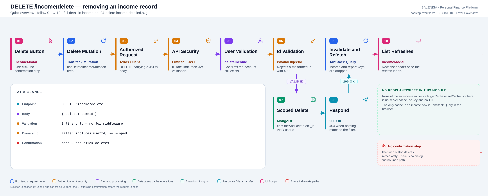
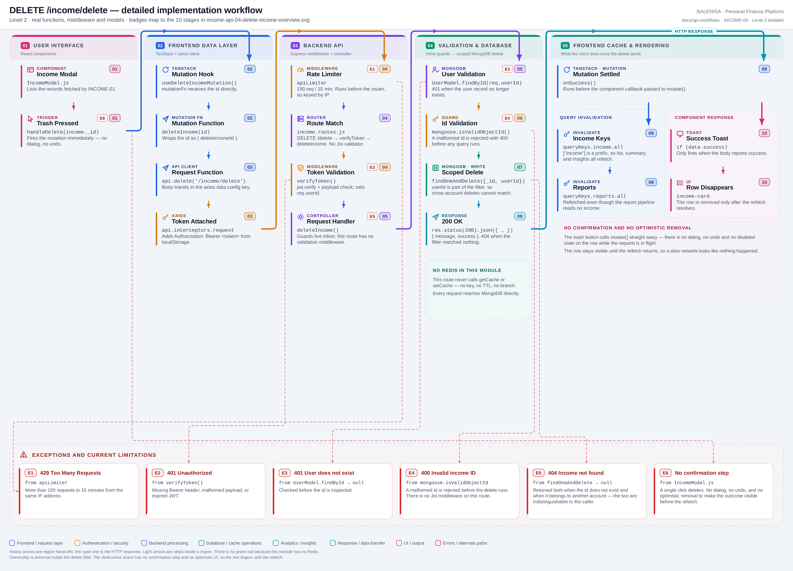

# INCOME-04 — Delete an income record

`DELETE /income/delete`

Every statement below is traced to the current repository implementation.

## 1. Purpose

Permanently removes one income record belonging to the authenticated user.

## 2. Endpoint and method

| | |
|---|---|
| **Method** | `DELETE` |
| **Path** | `/income/delete` |
| **Mount** | `app.use("/income", apiLimiter, incomeRouter)` — `backend/server.js` |
| **Middleware** | `apiLimiter` → `verifyToken` → `deleteIncome` (no Joi middleware) |
| **Auth** | Required — Bearer JWT |
| **Server cache** | None — no route in this module touches Redis |

## 3. Level 1 quick workflow

<picture>
  <source srcset="income-api-04-delete-income-overview.svg" type="image/svg+xml">
  
</picture>

Vector: [`income-api-04-delete-income-overview.svg`](income-api-04-delete-income-overview.svg) ·
raster fallback: [`income-api-04-delete-income-overview.png`](income-api-04-delete-income-overview.png)

## 4. Level 2 detailed implementation workflow

<picture>
  <source srcset="income-api-04-delete-income-detailed.svg" type="image/svg+xml">
  
</picture>

Vector: [`income-api-04-delete-income-detailed.svg`](income-api-04-delete-income-detailed.svg) ·
raster fallback: [`income-api-04-delete-income-detailed.png`](income-api-04-delete-income-detailed.png)

## 5. Request structure

```http
DELETE /income/delete HTTP/1.1
Authorization: Bearer <jwt>
Content-Type: application/json

{ "deleteIncomeId": "66b1…" }
```

The body travels in axios's `data` config key, which is required for a `DELETE` body.

## 6. Response structure

```jsonc
{ "message": "Income deleted successfully", "success": true }
```

## 7. Frontend consumption

`IncomeModal` renders a trash button per row. `handleDelete` calls `useDeleteIncomeMutation` **immediately** — there is no confirmation dialog, no undo and no disabled state on the row while the request is in flight.

## 8. Cache and state behaviour

| Layer | Behaviour |
|---|---|
| Redis | Absent |
| TanStack Query | `onSuccess` invalidates `queryKeys.income.all` and `queryKeys.reports.all` |
| Update strategy | **Invalidation and refetch only** — the row is not removed optimistically |
| Local state | None touched |

## 9. Success, loading, empty and error paths

| State | Behaviour |
|---|---|
| Loading | `deleteMutation.isPending` feeds the modal's shared `loading` flag, blanking the whole list |
| Success | Toast fires only when `data.success` is true; the row disappears after the refetch |
| Invalid id | `400 "Invalid income ID"` |
| Not found | `404` — also returned when the record belongs to another account |
| Other error | Toasts "Failed to delete income." |

## 10. Files involved

| Layer | File | Function/Export | Purpose |
|---|---|---|---|
| Consumer | `frontend/src/components/IncomeHandling/IncomeModal.js` | `handleDelete` | Trash button, no confirmation |
| Mutation | `frontend/src/hooks/mutations/useDeleteIncomeMutation.js` | `useDeleteIncomeMutation` | Invalidates income and report keys |
| API client | `frontend/src/api/incomeApi.js` | `deleteIncome` | `DELETE /income/delete` with a body |
| Route | `backend/Routes/income.routes.js` | `router.delete('/delete', …)` | `verifyToken` → `deleteIncome` |
| Controller | `backend/Controllers/IncomeControllers/deleteIncome.js` | `deleteIncome` | User check, ObjectId check, scoped delete |
| Interceptors | `frontend/src/api/axios.js` | `api` | Bearer token; 401/429/409 handling |
| Server mount | `backend/server.js` | `app.use("/income", apiLimiter, incomeRouter)` | Rate limiter ahead of the router |
| Auth | `backend/Middlewares/Auth.js` | `verifyToken` | Verifies JWT, sets `req.userId` |
| Model | `backend/config/Schemas.js` | `IncomeModel` | `{userId, incomeSource, incomeAmount, incomeDate}` |

## 11. Current implementation observations

**Summary:** Correctness 1 · Security / operational 2 · Reliability 2 · Maintainability 1

**Ownership is enforced correctly.** `findOneAndDelete({ _id, userId })` cannot reach
another account's record.

### Correctness

1. **`404` conflates "does not exist" with "not yours"**, as in INCOME-03.

### Security / operational

- **`apiLimiter` runs before `verifyToken`**, so the limit is keyed by IP rather than by
  account. *(shared by all six income routes)*
- **`trust proxy` is not set**, so behind a reverse proxy every user shares one bucket.
  *(shared by all six income routes)*

### Reliability

2. **No confirmation step on a destructive, irreversible action.** One click on the trash
   icon issues the delete. There is no dialog, no undo, and no soft-delete flag on the
   schema — the document is gone. This is the only destructive action in the income module
   and the only one reachable in a single click.

3. **No optimistic removal.** The row stays on screen until the invalidated list query
   refetches, so on a slow connection the click appears to do nothing and invites a second
   click on an already-deleted record (which then returns `404`).

### Maintainability

4. **This route has no validation middleware** while its siblings do. `addIncome` and
   `editIncome` both use Joi; `deleteIncome` validates inline. A reviewer must read the
   controller to know what is enforced.
