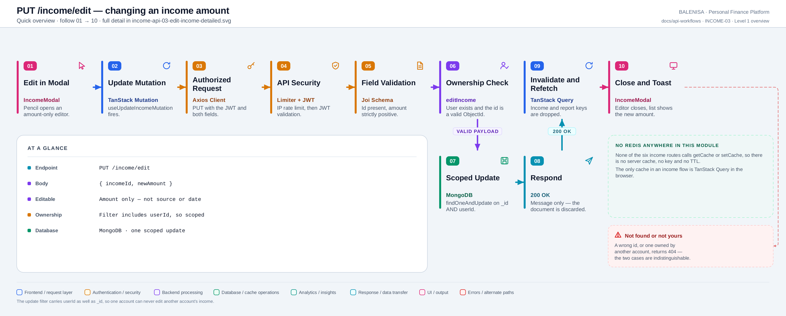
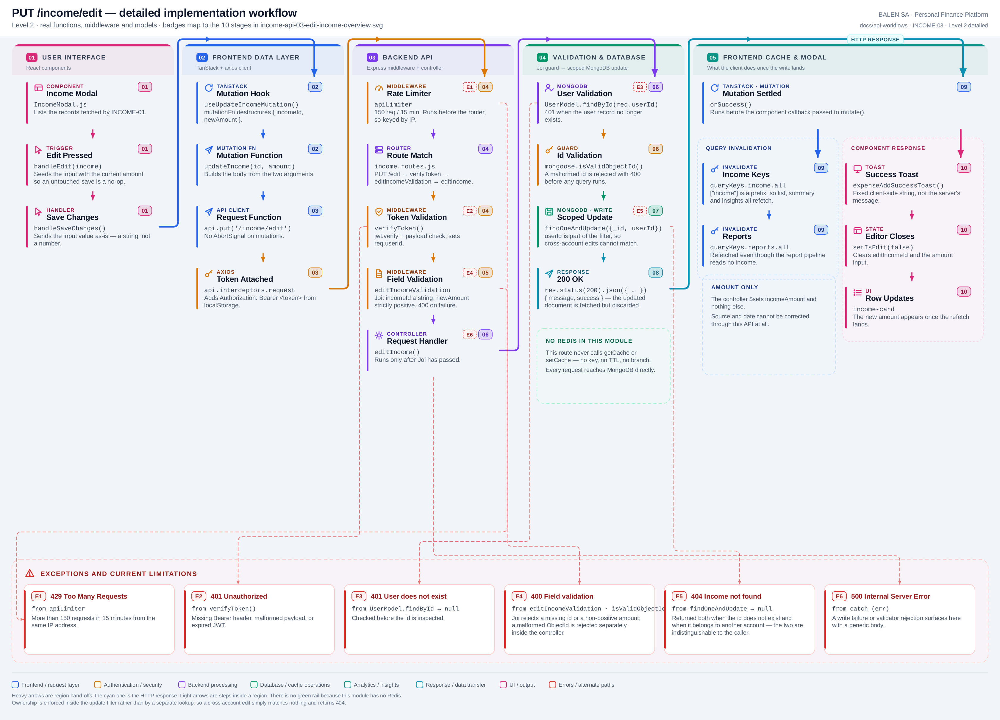

# INCOME-03 — Edit an income amount

`PUT /income/edit`

Every statement below is traced to the current repository implementation.

## 1. Purpose

Changes the **amount** of one existing income record. Source and date cannot be edited through this API.

## 2. Endpoint and method

| | |
|---|---|
| **Method** | `PUT` |
| **Path** | `/income/edit` |
| **Mount** | `app.use("/income", apiLimiter, incomeRouter)` — `backend/server.js` |
| **Middleware** | `apiLimiter` → `verifyToken` → `editIncomeValidation` → `editIncome` |
| **Auth** | Required — Bearer JWT |
| **Server cache** | None — no route in this module touches Redis |

## 3. Level 1 quick workflow

<picture>
  <source srcset="income-api-03-edit-income-overview.svg" type="image/svg+xml">
  
</picture>

Vector: [`income-api-03-edit-income-overview.svg`](income-api-03-edit-income-overview.svg) ·
raster fallback: [`income-api-03-edit-income-overview.png`](income-api-03-edit-income-overview.png)

## 4. Level 2 detailed implementation workflow

<picture>
  <source srcset="income-api-03-edit-income-detailed.svg" type="image/svg+xml">
  
</picture>

Vector: [`income-api-03-edit-income-detailed.svg`](income-api-03-edit-income-detailed.svg) ·
raster fallback: [`income-api-03-edit-income-detailed.png`](income-api-03-edit-income-detailed.png)

## 5. Request structure

```http
PUT /income/edit HTTP/1.1
Authorization: Bearer <jwt>
Content-Type: application/json

{ "incomeId": "66b1…", "newAmount": 70000 }
```

`newAmount` arrives from a controlled `type="number"` input as a **string**; Joi coerces
it.

## 6. Response structure

```jsonc
{ "message": "Income updated successfully", "success": true }
```

The controller fetches the updated document with `new: true` and then discards it.

## 7. Frontend consumption

`IncomeModal` renders an edit view. `handleEdit` seeds `updatedAmount` with the record's current amount, so saving without typing submits the unchanged value rather than an empty string. `handleSaveChanges` calls `useUpdateIncomeMutation` with `{ incomeId, newAmount }`.

## 8. Cache and state behaviour

| Layer | Behaviour |
|---|---|
| Redis | Absent |
| TanStack Query | `onSuccess` invalidates `queryKeys.income.all` and `queryKeys.reports.all` |
| Update strategy | **Invalidation and refetch only** — no direct cache write, no optimistic entry |
| Local state | `isEdit`, `editIncomeId` and `updatedAmount` are reset in the component callback |

## 9. Success, loading, empty and error paths

| State | Behaviour |
|---|---|
| Loading | `updateMutation.isPending` swaps the Save button for `<FetchingLoader/>`, and also blanks the list behind it |
| Success | Fixed client-side toast, editor closes, row updates after the refetch |
| Validation error | Joi `400` for a missing id or a non-positive amount; `isValidObjectId` `400` for a malformed id |
| Not found | `404` — also returned when the record belongs to another account |
| Other error | Toasts "Failed to update income." |

## 10. Files involved

| Layer | File | Function/Export | Purpose |
|---|---|---|---|
| Consumer | `frontend/src/components/IncomeHandling/IncomeModal.js` | `handleEdit`, `handleSaveChanges` | Edit view and submit |
| Mutation | `frontend/src/hooks/mutations/useUpdateIncomeMutation.js` | `useUpdateIncomeMutation` | Invalidates income and report keys |
| API client | `frontend/src/api/incomeApi.js` | `updateIncome` | `PUT /income/edit` |
| Route | `backend/Routes/income.routes.js` | `router.put('/edit', …)` | `verifyToken` → `editIncomeValidation` → `editIncome` |
| Validation | `backend/Middlewares/AuthValidation.js` | `editIncomeValidation` | Joi: id string, positive amount |
| Controller | `backend/Controllers/IncomeControllers/editIncome.js` | `editIncome` | User check, id check, scoped update |
| Interceptors | `frontend/src/api/axios.js` | `api` | Bearer token; 401/429/409 handling |
| Server mount | `backend/server.js` | `app.use("/income", apiLimiter, incomeRouter)` | Rate limiter ahead of the router |
| Auth | `backend/Middlewares/Auth.js` | `verifyToken` | Verifies JWT, sets `req.userId` |
| Model | `backend/config/Schemas.js` | `IncomeModel` | `{userId, incomeSource, incomeAmount, incomeDate}` |

## 11. Current implementation observations

**Summary:** Correctness 1 · Security / operational 2 · Reliability 1 · Maintainability 2

**Ownership is enforced correctly.** The filter is `{ _id: incomeId, userId: user._id }`,
so a record belonging to another account simply does not match. There is no IDOR here.

### Correctness

1. **`404` conflates "does not exist" with "not yours".** Both produce
   `Income not found`. That is the safer choice for information disclosure, but it means a
   genuine data-integrity problem and an authorisation miss look identical in logs.

### Security / operational

- **`apiLimiter` runs before `verifyToken`**, so the limit is keyed by IP rather than by
  account. *(shared by all six income routes)*
- **`trust proxy` is not set**, so behind a reverse proxy every user shares one bucket.
  *(shared by all six income routes)*

### Reliability

2. **Only the amount is mutable.** The controller `$set`s `incomeAmount` alone. A typo in
   `incomeSource` or a wrong `incomeDate` can only be fixed by deleting and re-adding —
   which, given INCOME-04 has no confirmation step, is a riskier operation than editing.

### Maintainability

3. **`new: true` is requested but unused.** The updated document is fetched and then
   discarded; only a message is returned.

4. **Validation is split across two places.** Joi checks the id is a string; the
   controller separately checks it is a valid ObjectId. Both return `400`, with different
   messages, from different layers.
