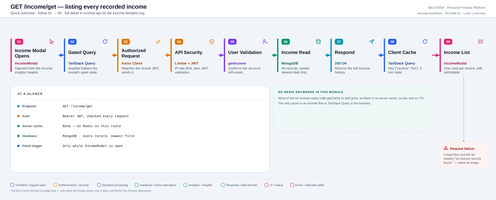
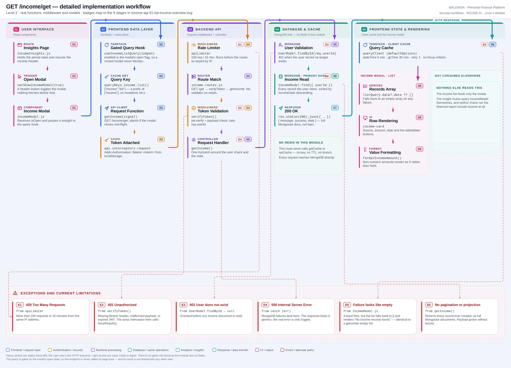

# INCOME-01 — List income records

`GET /income/get`

Every statement below is traced to the current repository implementation.

## 1. Purpose

Returns every income record the authenticated user owns, newest first. It backs the
income modal, which is the only place a user can see, edit or delete individual records.

## 2. Endpoint and method

| | |
|---|---|
| **Method** | `GET` |
| **Path** | `/income/get` |
| **Mount** | `app.use("/income", apiLimiter, incomeRouter)` — `backend/server.js` |
| **Middleware** | `apiLimiter` → `verifyToken` → `getIncome` |
| **Auth** | Required — Bearer JWT |
| **Request** | No params, no query, no body |
| **Server cache** | None — no route in this module touches Redis |

## 3. Level 1 quick workflow

<picture>
  <source srcset="income-api-01-list-income-overview.svg" type="image/svg+xml">
  
</picture>

Vector: [`income-api-01-list-income-overview.svg`](income-api-01-list-income-overview.svg) ·
raster fallback: [`income-api-01-list-income-overview.png`](income-api-01-list-income-overview.png)

## 4. Level 2 detailed implementation workflow

<picture>
  <source srcset="income-api-01-list-income-detailed.svg" type="image/svg+xml">
  
</picture>

Vector: [`income-api-01-list-income-detailed.svg`](income-api-01-list-income-detailed.svg) ·
raster fallback: [`income-api-01-list-income-detailed.png`](income-api-01-list-income-detailed.png)

## 5. Request structure

```http
GET /income/get HTTP/1.1
Authorization: Bearer <jwt>
```

## 6. Response structure

```jsonc
{
  "message": "Income records retrieved successfully",
  "success": true,
  "data": [
    { "_id": "...", "userId": "...", "incomeSource": "Salary",
      "incomeAmount": 65000, "incomeDate": "2026-07-01T00:00:00.000Z", "__v": 0 }
  ]
}
```

`.lean()` is **not** used, so these are hydrated Mongoose documents serialised by
`res.json`, including `_id`, `userId` and `__v`.

## 7. Frontend consumption

`useIncomeListQuery(enabled)` is called from `IncomeModal` with `isOpen` as the enabled
flag, so the request is only made while the modal is open — never on page load. The
component reads `listQuery.data?.data ?? []` and renders one card per record with edit
and delete buttons.

Nothing else consumes this endpoint. The two insight routes query `IncomeModel`
server-side themselves, and neither the chart service nor the financial report pipeline
reads income at all.

## 8. Cache and state behaviour

| Layer | Behaviour |
|---|---|
| Redis | Absent |
| TanStack Query | Key `["income","list"]`, global defaults (staleTime 5 min, gcTime 30 min, retry 1) |
| Invalidation | All three income mutations invalidate `["income"]`, which is a prefix of this key |
| Local state | `isEdit`, `editIncomeId` and `updatedAmount` live in `IncomeModal` only |

## 9. Success, loading, empty and error paths

| State | Behaviour |
|---|---|
| Loading | `listQuery.isLoading` (also true during a pending mutation) renders "Loading..." |
| Success | One `income-card` per record |
| Empty | "No income records found." |
| Error | A `useEffect` fires an error toast, then the list falls back to `[]` — which renders the *same* empty message |
| 401 | Intercepted globally by `handleApiError` → `forceReauth()` |

## 10. Files involved

| Layer | File | Function/Export | Purpose |
|---|---|---|---|
| Page | `frontend/src/components/monthlyInsights/Income/IncomeInsights.js` | `IncomeInsights` | Hosts the header that opens the modal |
| Trigger | `frontend/src/components/monthlyInsights/Income/Header.js` | `Header` | `setShowIncomeModal(true)` |
| Consumer | `frontend/src/components/IncomeHandling/IncomeModal.js` | `IncomeModal` | List, edit and delete UI |
| Query hook | `frontend/src/hooks/queries/useIncomeListQuery.js` | `useIncomeListQuery` | Gated on the modal's open state |
| Cache key | `frontend/src/query/queryKeys.js` | `queryKeys.income.list` | `["income","list"]` |
| API client | `frontend/src/api/incomeApi.js` | `getIncome` | `GET /income/get` |
| Interceptors | `frontend/src/api/axios.js` | `api` | Bearer token; 401/429/409 handling |
| Server mount | `backend/server.js` | `app.use("/income", apiLimiter, incomeRouter)` | Rate limiter ahead of the router |
| Route | `backend/Routes/income.routes.js` | `router.get('/get', …)` | `verifyToken` → `getIncome` |
| Auth | `backend/Middlewares/Auth.js` | `verifyToken` | Verifies JWT, sets `req.userId` |
| Controller | `backend/Controllers/IncomeControllers/getIncome.js` | `getIncome` | User check, read, sort |
| Model | `backend/config/Schemas.js` | `IncomeModel` | `{userId, incomeSource, incomeAmount, incomeDate}` + `{userId, incomeDate}` index |

## 11. Current implementation observations

**Summary:** Correctness 1 · Security / operational 2 · Reliability 2 · Maintainability 1

### Correctness

1. **A failed fetch renders as an empty list.** `incomeList` falls back to `[]`, so the
   modal shows "No income records found." after an error. A toast does fire, so the user
   is not left with no signal at all — but the list body itself is indistinguishable from
   a genuinely empty account.

### Security / operational

2. **`apiLimiter` runs before `verifyToken`.** Mounted as
   `app.use("/income", apiLimiter, incomeRouter)`, so `req.userId` is `undefined` when
   `keyGenerator` runs and it always falls back to `ipKeyGenerator(req.ip)`. The limit is
   per IP, not per account.

3. **`trust proxy` is not set in `backend/server.js`.** Behind a reverse proxy every
   request appears to come from the proxy, so all users share one 150-request bucket.

### Reliability

4. **No pagination and no date filter.** The endpoint returns every record the user has
   ever created. The payload grows without bound, and unlike the expense list there is no
   period-scoped alternative.

5. **No `.lean()`.** Full Mongoose documents are hydrated for a read-only response,
   adding avoidable overhead and shipping `__v` and `userId` to the client.

### Maintainability

6. **`loading` conflates three states.**
   `listQuery.isLoading || updateMutation.isPending || deleteMutation.isPending` drives
   one "Loading..." message, so a pending edit or delete blanks the whole list rather
   than indicating progress on the affected row.
