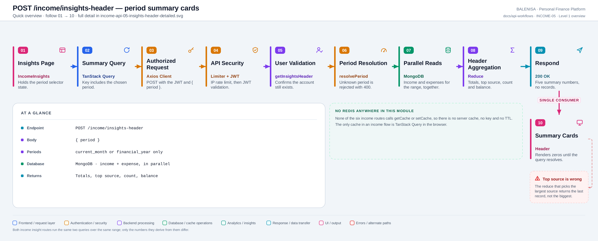
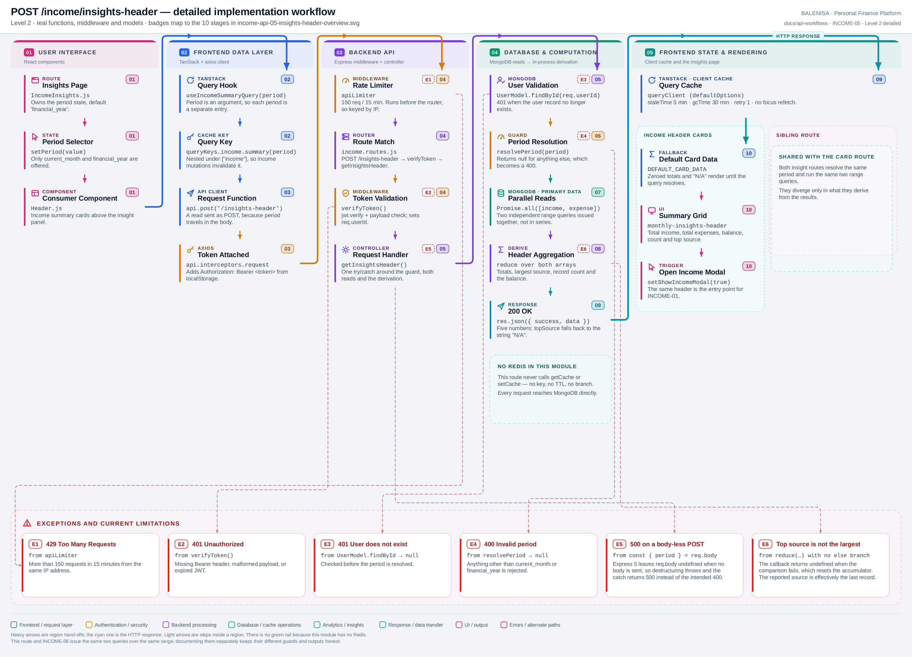

# INCOME-05 — Income period summary

`POST /income/insights-header`

Every statement below is traced to the current repository implementation.

## 1. Purpose

Returns five summary numbers for a chosen period — total income, total expenses, the largest income source, the record count and the balance — to populate the cards at the top of the income insights page.

## 2. Endpoint and method

| | |
|---|---|
| **Method** | `POST` |
| **Path** | `/income/insights-header` |
| **Mount** | `app.use("/income", apiLimiter, incomeRouter)` — `backend/server.js` |
| **Middleware** | `apiLimiter` → `verifyToken` → `getInsightsHeader` |
| **Auth** | Required — Bearer JWT |
| **Server cache** | None — no route in this module touches Redis |

## 3. Level 1 quick workflow

<picture>
  <source srcset="income-api-05-insights-header-overview.svg" type="image/svg+xml">
  
</picture>

Vector: [`income-api-05-insights-header-overview.svg`](income-api-05-insights-header-overview.svg) ·
raster fallback: [`income-api-05-insights-header-overview.png`](income-api-05-insights-header-overview.png)

## 4. Level 2 detailed implementation workflow

<picture>
  <source srcset="income-api-05-insights-header-detailed.svg" type="image/svg+xml">
  
</picture>

Vector: [`income-api-05-insights-header-detailed.svg`](income-api-05-insights-header-detailed.svg) ·
raster fallback: [`income-api-05-insights-header-detailed.png`](income-api-05-insights-header-detailed.png)

## 5. Request structure

```http
POST /income/insights-header HTTP/1.1
Authorization: Bearer <jwt>
Content-Type: application/json

{ "period": "financial_year" }
```

Only `current_month` and `financial_year` are accepted. `financial_year` is the Indian
April-to-March year, resolved in `periodResolver.js`.

## 6. Response structure

```jsonc
{
  "success": true,
  "message": "Insights header data fetched successfully",
  "data": { "totalIncome": 780000, "totalExpenses": 412000, "topSource": "Salary",
            "totalIncomes": 12, "balance": 368000 }
}
```

## 7. Frontend consumption

`IncomeInsights` owns the `period` state and passes it to `Header`, which calls `useIncomeSummaryQuery(period)`. Until the query resolves the component renders `DEFAULT_CARD_DATA` — zeroed totals and `"N/A"`.

## 8. Cache and state behaviour

| Layer | Behaviour |
|---|---|
| Redis | Absent — the period range is recomputed and both collections re-queried on every request |
| TanStack Query | Key `queryKeys.income.summary(period)`, i.e. `["income","summary",<period>]` — one entry per period |
| Invalidation | All three income mutations invalidate the `["income"]` prefix, which reaches this key |
| Local state | `period` lives in `IncomeInsights`; switching it changes the query key rather than refetching the same one |

## 9. Success, loading, empty and error paths

| State | Behaviour |
|---|---|
| Loading | `DEFAULT_CARD_DATA` renders — zeros and "N/A", indistinguishable from a genuinely empty period |
| Success | Five summary cards |
| Invalid period | `400` |
| Error | A `useEffect` toasts "Failed to load insights."; the cards keep showing zeros |

## 10. Files involved

| Layer | File | Function/Export | Purpose |
|---|---|---|---|
| Page | `frontend/src/components/monthlyInsights/Income/IncomeInsights.js` | `IncomeInsights` | Owns the period state |
| Consumer | `frontend/src/components/monthlyInsights/Income/Header.js` | `Header` | Summary cards + income modal trigger |
| Query hook | `frontend/src/hooks/queries/useIncomeSummaryQuery.js` | `useIncomeSummaryQuery` | Period-keyed query |
| Cache key | `frontend/src/query/queryKeys.js` | `queryKeys.income.summary` | `["income","summary",period]` |
| API client | `frontend/src/api/incomeApi.js` | `getIncomeSummary` | `POST /income/insights-header` |
| Route | `backend/Routes/income.routes.js` | `router.post('/insights-header', …)` | `verifyToken` → `getInsightsHeader` |
| Controller | `backend/Controllers/IncomeControllers/insightsHeader.js` | `getInsightsHeader` | Period guard, parallel reads, aggregation |
| Period helper | `backend/Services/InsightServices/periodResolver.js` | `resolvePeriod` | `current_month` / `financial_year` ranges |
| Interceptors | `frontend/src/api/axios.js` | `api` | Bearer token; 401/429/409 handling |
| Server mount | `backend/server.js` | `app.use("/income", apiLimiter, incomeRouter)` | Rate limiter ahead of the router |
| Auth | `backend/Middlewares/Auth.js` | `verifyToken` | Verifies JWT, sets `req.userId` |
| Model | `backend/config/Schemas.js` | `IncomeModel` | `{userId, incomeSource, incomeAmount, incomeDate}` |

## 11. Current implementation observations

**Summary:** Correctness 2 · Security / operational 2 · Reliability 2 · Maintainability 2

### Correctness

1. **`topSource` does not return the largest source — verified by execution.** The reduce
   callback has no `else` branch:

   ```js
   incomeRecords.reduce((top, record) => {
     if (!top || record.incomeAmount > top.incomeAmount) { return record; }
   }, null);
   ```

   When the comparison fails the callback returns `undefined`, which becomes the next
   accumulator; `!top` is then true, so the following record is accepted unconditionally.
   Running this over amounts `[100, 50, 30]` (the array is sorted by date, not amount)
   returns the **30** record. The card labelled "Top Source" therefore shows an arbitrary
   record — in practice usually the last one — rather than the largest.

2. **A body-less `POST` returns `500` instead of `400` — verified by execution.** This
   handler does `const { period } = req.body;`. Under Express 5, `req.body` is `undefined`
   when no body is sent, so destructuring throws a `TypeError` that the catch converts to
   `500`. The sibling `insights-card` handler guards with `req.body || {}` and correctly
   returns `400`. The frontend always sends a body, so only direct callers hit this.

### Security / operational

- **`apiLimiter` runs before `verifyToken`**, so the limit is keyed by IP rather than by
  account. *(shared by all six income routes)*
- **`trust proxy` is not set**, so behind a reverse proxy every user shares one bucket.
  *(shared by all six income routes)*

### Reliability

3. **A read is exposed as `POST`.** The only reason is that `period` travels in the body.
   The consequence is no HTTP caching, no safe-method semantics and no ability to link or
   bookmark a period view.

4. **No server-side caching of an expensive read.** Every request re-queries both the
   income and expense collections for the whole period. For `financial_year` that is up to
   twelve months of both collections, recomputed on every mount and every period switch.

### Maintainability

5. **Duplicated work with INCOME-06.** Both routes resolve the same period and run the
   identical `Promise.all([IncomeModel.find(...), ExpenseModel.find(...)])`, then compute
   `totalIncome` and `totalExpenses` the same way. Rendering the insights page issues both
   requests, so that work happens twice per view.

6. **`trackedDays` is computed only in the sibling.** The two handlers have drifted: this
   one has no such notion, the other does, despite sharing everything up to the
   aggregation step.
