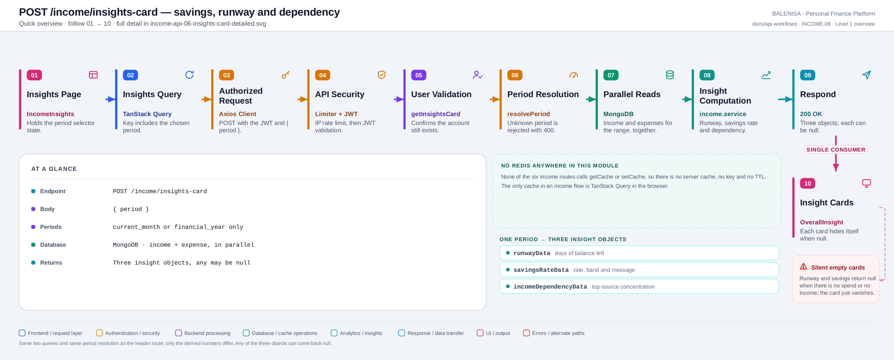
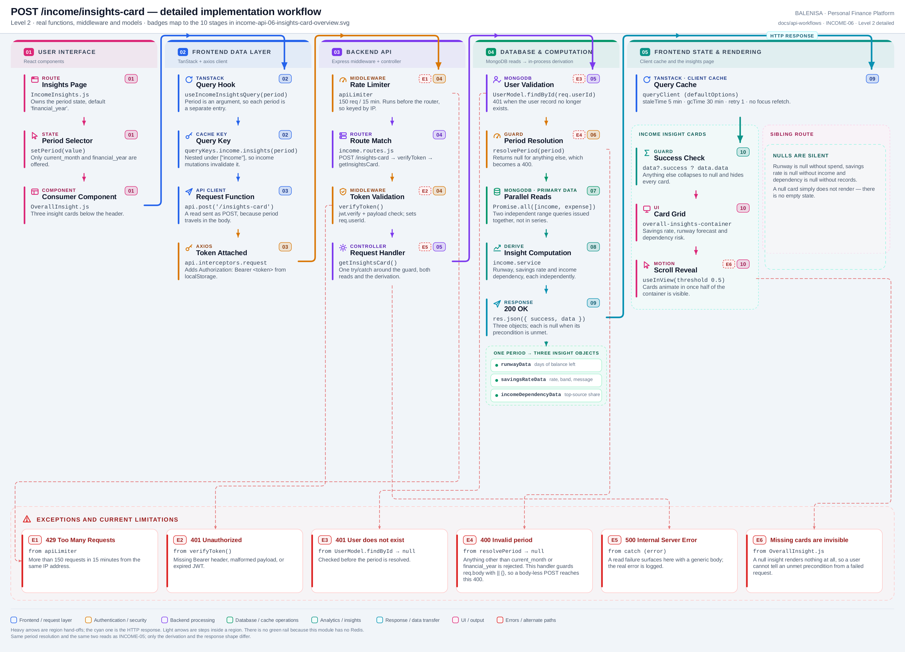

# INCOME-06 — Income insight cards

`POST /income/insights-card`

Every statement below is traced to the current repository implementation.

## 1. Purpose

Derives three qualitative insight objects for a chosen period — financial runway, savings rate and income-source dependency — for the cards below the income summary header.

## 2. Endpoint and method

| | |
|---|---|
| **Method** | `POST` |
| **Path** | `/income/insights-card` |
| **Mount** | `app.use("/income", apiLimiter, incomeRouter)` — `backend/server.js` |
| **Middleware** | `apiLimiter` → `verifyToken` → `getInsightsCard` |
| **Auth** | Required — Bearer JWT |
| **Server cache** | None — no route in this module touches Redis |

## 3. Level 1 quick workflow

<picture>
  <source srcset="income-api-06-insights-card-overview.svg" type="image/svg+xml">
  
</picture>

Vector: [`income-api-06-insights-card-overview.svg`](income-api-06-insights-card-overview.svg) ·
raster fallback: [`income-api-06-insights-card-overview.png`](income-api-06-insights-card-overview.png)

## 4. Level 2 detailed implementation workflow

<picture>
  <source srcset="income-api-06-insights-card-detailed.svg" type="image/svg+xml">
  
</picture>

Vector: [`income-api-06-insights-card-detailed.svg`](income-api-06-insights-card-detailed.svg) ·
raster fallback: [`income-api-06-insights-card-detailed.png`](income-api-06-insights-card-detailed.png)

## 5. Request structure

```http
POST /income/insights-card HTTP/1.1
Authorization: Bearer <jwt>
Content-Type: application/json

{ "period": "financial_year" }
```

## 6. Response structure

```jsonc
{
  "success": true,
  "message": "Insights card data fetched successfully",
  "data": {
    "runwayData":  { "runwayDays": 96, "currentBalance": 368000,
                     "averageDailyExpense": 3800, "estimatedExhaustionDate": "3 Nov 2026",
                     "subMessage": "…" },
    "savingsRateData": { "savingsRate": 47.2, "netBalance": 368000,
                         "status": "Good", "subMessage": "…" },
    "incomeDependencyData": { "topSource": "Salary", "topAmount": 700000,
                              "dependencyPercent": 89.7, "sourceCount": 3,
                              "riskLevel": "High Dependency", "subMessage": "…" }
  }
}
```

**Any of the three can be `null`:** runway when there is no spend, savings rate when there
is no income, dependency when there are no records.

## 7. Frontend consumption

`OverallInsight` calls `useIncomeInsightsQuery(period)` and reads `data?.success ? data.data : null`. Each of the three cards is guarded by its own optional-chained check, so a `null` object renders nothing at all. A `useInView` observer animates the cards in once half the container is visible.

## 8. Cache and state behaviour

| Layer | Behaviour |
|---|---|
| Redis | Absent |
| TanStack Query | Key `queryKeys.income.insights(period)`, i.e. `["income","insights",<period>]` |
| Invalidation | All three income mutations invalidate the `["income"]` prefix |
| Local state | Only the `useInView` ref; the period comes from the parent page |

## 9. Success, loading, empty and error paths

| State | Behaviour |
|---|---|
| Loading | `insight` is `null`, so every card body is hidden — the headings remain |
| Success | Up to three cards, each rendered only if its object is non-null |
| Invalid period | `400` — this handler guards `req.body` with `\|\| {}`, so even a body-less POST reaches this branch |
| Error | Logged to the console only. No toast, no visible message |

## 10. Files involved

| Layer | File | Function/Export | Purpose |
|---|---|---|---|
| Page | `frontend/src/components/monthlyInsights/Income/IncomeInsights.js` | `IncomeInsights` | Owns the period state |
| Consumer | `frontend/src/components/monthlyInsights/Income/OverallInsight.js` | `OverallInsight` | Three insight cards |
| Query hook | `frontend/src/hooks/queries/useIncomeInsightsQuery.js` | `useIncomeInsightsQuery` | Period-keyed query |
| Cache key | `frontend/src/query/queryKeys.js` | `queryKeys.income.insights` | `["income","insights",period]` |
| API client | `frontend/src/api/incomeApi.js` | `getIncomeInsights` | `POST /income/insights-card` |
| Route | `backend/Routes/income.routes.js` | `router.post('/insights-card', …)` | `verifyToken` → `getInsightsCard` |
| Controller | `backend/Controllers/IncomeControllers/insightsCard.js` | `getInsightsCard` | Period guard, parallel reads, derivation |
| Insight rules | `backend/Services/InsightServices/income.service.js` | `getFinancialRunwayData`, `getSavingsRateData`, `getIncomeDependencyData` | The three derivations |
| Period helper | `backend/Services/InsightServices/periodResolver.js` | `resolvePeriod` | `current_month` / `financial_year` ranges |
| Interceptors | `frontend/src/api/axios.js` | `api` | Bearer token; 401/429/409 handling |
| Server mount | `backend/server.js` | `app.use("/income", apiLimiter, incomeRouter)` | Rate limiter ahead of the router |
| Auth | `backend/Middlewares/Auth.js` | `verifyToken` | Verifies JWT, sets `req.userId` |
| Model | `backend/config/Schemas.js` | `IncomeModel` | `{userId, incomeSource, incomeAmount, incomeDate}` |

## 11. Current implementation observations

**Summary:** Correctness 2 · Security / operational 2 · Reliability 2 · Maintainability 1

### Correctness

1. **`trackedDays` is measured from the period start to *today*, not to the period end.**
   `Math.ceil((new Date() - startDate) / 86_400_000) + 1`. For `financial_year` in month
   one this is ~30 days, so the average daily burn is computed over the elapsed window —
   which is the intended behaviour for a runway forecast. But the same `totalExpenses` also
   covers only the elapsed window, so early in a period the projection is built on a very
   small sample and swings sharply. There is no minimum-sample guard.

2. **A failed request is completely silent.** `OverallInsight`'s error effect only calls
   `console.error`. Unlike its sibling `Header`, it shows no toast — and because a `null`
   insight renders nothing, a failed load looks identical to a period with no data.

### Security / operational

- **`apiLimiter` runs before `verifyToken`**, so the limit is keyed by IP rather than by
  account. *(shared by all six income routes)*
- **`trust proxy` is not set**, so behind a reverse proxy every user shares one bucket.
  *(shared by all six income routes)*

### Reliability

3. **A read exposed as `POST`**, with the same consequences as INCOME-05.

4. **No server-side caching**, and the derivations run in-process on the full period's
   records rather than in an aggregation pipeline. For `financial_year` both collections
   are fully materialised into Node memory on every request.

### Maintainability

5. **Duplicated work with INCOME-05.** Both routes resolve the same period and run the
   identical pair of queries. Loading the income insights page issues both, so the same two
   collection scans happen twice.
