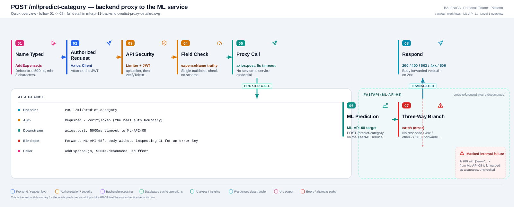
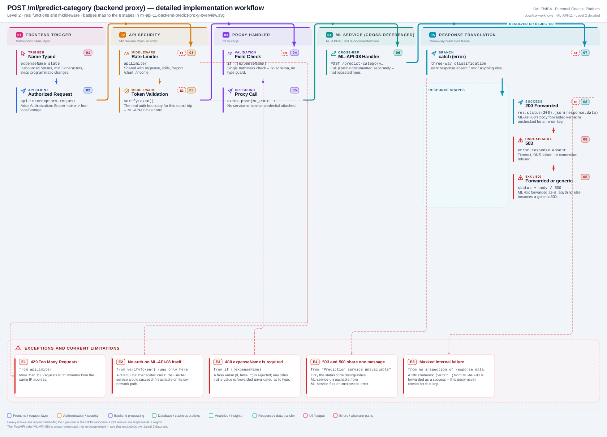

# ML-API-11 — POST /ml/predict-category (backend proxy)

The Express endpoint itself — a distinct, separately-mounted route from ML-API-08's `POST /predict-category` on the FastAPI service. Created during the repository-wide API coverage gate: previously this route's behaviour was described only inside ML-FLOW-09, which documents the wider backend-to-FastAPI integration and is not a substitute for this route's own API document.

---

## 1. Purpose

Authenticates and time-bounds the frontend's category-prediction request before forwarding it to the ML service, translating the ML service's response (or its absence) into one of four well-defined backend response shapes.

## 2. Endpoint and method

`POST /ml/predict-category` — `backend/Routes/ml.router.js`, mounted via `app.use("/ml", apiLimiter, mlRouter)` (`server.js:91`).

| | |
|---|---|
| **Method** | `POST` |
| **Path** | `/ml/predict-category` |
| **Middleware order** | `apiLimiter` → `verifyToken` → route handler |
| **Auth** | Required — Bearer JWT |
| **Rate limiting** | `apiLimiter`, shared with `/expense`, `/bills`, `/report`, `/chart`, `/income` |
| **Downstream timeout** | `PREDICT_TIMEOUT_MS = 5000` on the call to ML-API-08 |

## 3. Level 1 quick workflow

<picture>
  <source srcset="ml-api-11-backend-predict-proxy-overview.svg" type="image/svg+xml">
  
</picture>

Vector: [`ml-api-11-backend-predict-proxy-overview.svg`](ml-api-11-backend-predict-proxy-overview.svg) ·
raster fallback: [`ml-api-11-backend-predict-proxy-overview.png`](ml-api-11-backend-predict-proxy-overview.png)

## 4. Level 2 detailed workflow

<picture>
  <source srcset="ml-api-11-backend-predict-proxy-detailed.svg" type="image/svg+xml">
  
</picture>

Vector: [`ml-api-11-backend-predict-proxy-detailed.svg`](ml-api-11-backend-predict-proxy-detailed.svg) ·
raster fallback: [`ml-api-11-backend-predict-proxy-detailed.png`](ml-api-11-backend-predict-proxy-detailed.png)

## 5. Request schema and validation

```jsonc
{ "expenseName": "coffee at" }
```

`expenseName` is read from `req.body` with no schema library — a single `if (!expenseName)` truthiness check. No length limit, no type check beyond the truthiness test (a non-string truthy value, e.g. a number, would pass this check and be forwarded to the ML service as-is).

## 6. Route/dependency order

| Layer | File | Function | Purpose |
|---|---|---|---|
| Middleware | `backend/server.js` | `apiLimiter` | Rate limiting, applied at the mount |
| Middleware | `backend/Middlewares/Auth.js` | `verifyToken` | JWT check, sets `req.userId` |
| Route | `backend/Routes/ml.router.js` | `router.post("/predict-category", verifyToken, async (req,res) => {...})` | Validation, downstream call, response translation |
| Downstream | `ml-service/app.py` | `POST /predict-category` (ML-API-08) | The actual prediction |

## 7. Handler behaviour

```js
router.post("/predict-category", verifyToken, async (req, res) => {
    const { expenseName } = req.body;
    if (!expenseName) return res.status(400).json({ success: false, message: "expenseName is required" });

    const response = await axios.post(`${process.env.ML_ROUTE}/predict-category`,
        { expenseName }, { timeout: PREDICT_TIMEOUT_MS });

    return res.status(200).json(response.data);
    // catch block: three-way branch, see §12
});
```

The success path forwards ML-API-08's response body **verbatim** — including the case where ML-API-08 itself returns `{"error": ...}` with its own `200` (see ML-API-08 §7/§16). This proxy does not inspect the body for an `error` key, so a "no model loaded" condition is forwarded to the frontend as if it were a successful prediction containing an `error` field, not as a `503`.

## 8. Model/data dependencies

None directly — this route holds no model state itself. It is a pure pass-through to whichever `RuntimeSnapshot` ML-API-08 currently has loaded.

## 9. Response schema

| Case | Status | Body |
|---|---|---|
| `expenseName` missing | `400` | `{ success: false, message: "expenseName is required" }` |
| ML service responds 2xx | `200` | ML-API-08's response body, forwarded verbatim (may itself contain `{"error": ...}` per ML-API-08's own behaviour) |
| ML service unreachable / timed out (`error.response` absent) | `503` | `{ success: false, message: "Prediction service unavailable" }` |
| ML service responds 4xx | same status as ML-API-08 | ML-API-08's error body, forwarded, or a generic fallback if the body is absent |
| Anything else (ML service 5xx, unexpected exception) | `500` | `{ success: false, message: "Prediction service unavailable" }` |

## 10. Confirmed caller

**Yes** — `frontend/src/components/expensesHandling/AddExpense.js`, via a 500ms-debounced `useEffect` on `expenseName` changes (skipping inputs under 3 characters and programmatic name changes, the latter shared with API-09's edit-hydration ref write). This is the only confirmed caller; no other backend or frontend code path calls this route.

## 11. Success path

`expenseName` present → JWT valid → `axios.post` to ML-API-08 with a 5000ms timeout → ML service responds 2xx → body forwarded verbatim as `200`.

## 12. Failure paths and status codes

The `catch` block distinguishes three cases, confirmed by direct inspection of `ml.router.js`:

1. **`error.response` is absent** (timeout, DNS failure, connection refused — the ML service never answered) → `503`, `"Prediction service unavailable"`. This is the only case that reflects the ML service actually being down.
2. **`error.response.status` is 4xx** → the ML service's own status and body are forwarded as-is, not masked as a backend failure.
3. **Anything else** (ML service 5xx, or an unexpected error) → generic `500` with the same `"Prediction service unavailable"` message as case 1 — a caller cannot distinguish "the ML service was unreachable" from "the ML service returned a 5xx" from the response body alone; only the status code differs (503 vs 500).

## 13. Concurrency behaviour

Stateless per request — no shared mutable state in this handler. Each call opens its own `axios.post`; concurrent requests are independent.

## 14. Security/privacy behaviour

**This is the auth boundary for the whole prediction round trip.** `verifyToken` runs here — ML-API-08 itself has no authentication. A direct, unauthenticated call to the FastAPI service would succeed if reachable on its own network path (documented in ML-API-08 §14 and ML-FLOW-09's confirmed limitations); this proxy is the only place a real user's request is actually gated. The proxy call to the ML service itself carries **no service-to-service credential** — consistent with ML-FLOW-09's finding across all backend→ML call sites.

## 15. Files involved

| Layer | File | Function/Export | Purpose |
|---|---|---|---|
| Frontend | `frontend/src/components/expensesHandling/AddExpense.js` | debounced `useEffect` | Trigger |
| Server mount | `backend/server.js` | `app.use("/ml", apiLimiter, mlRouter)` | Rate limiter ahead of the router |
| Auth | `backend/Middlewares/Auth.js` | `verifyToken` | JWT check |
| Route | `backend/Routes/ml.router.js` | `router.post("/predict-category", ...)` | Validation, proxy, response translation |
| Downstream | `ml-service/app.py` | `predict()` (ML-API-08) | The actual prediction |

## 16. Current implementation observations

1. **A successful-looking `200` can contain an internal ML failure.** Because this proxy forwards ML-API-08's body verbatim without inspecting it for an `error` key, "no model is currently loaded" and a genuine successful prediction are indistinguishable from the HTTP status alone — confirmed by comparing this handler's success branch (`return res.status(200).json(response.data)`, no body inspection) against ML-API-08's own confirmed behaviour of returning `{"error": ...}` with `200`.
2. **Validation is a single truthiness check**, not a schema. `expenseName: 0` or `expenseName: false` would fail the check (falsy), but any other non-empty-string truthy value is forwarded to the ML service unvalidated as to type.
3. **503 and 500 share an identical message body**, `"Prediction service unavailable"` — only the status code distinguishes "ML service unreachable" from "ML service returned a 5xx or something else broke," which limits what a caller can act on without also reading the status code.
4. Cross-referenced, not duplicated: the wider backend-to-ML round trip (including feedback persistence and retraining triggers, which this route does not touch) is documented once in **ML-FLOW-09**, not repeated here.
