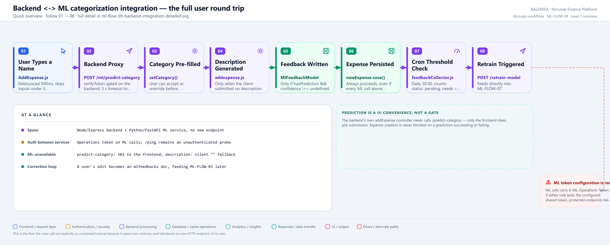
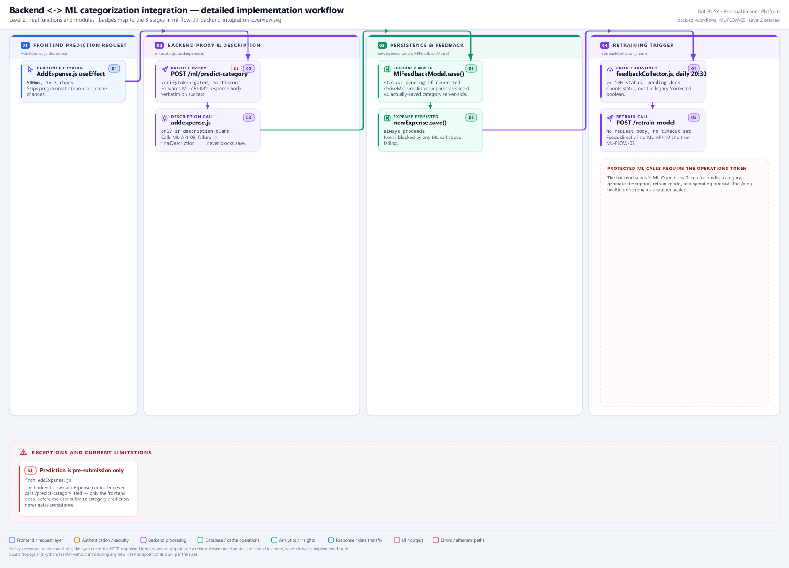

# ML-FLOW-09 — Backend-to-ML categorization integration

The full user-facing round trip: typing an expense name, through the Node backend, into the FastAPI ML service, and back — spanning two runtimes without introducing any new HTTP endpoint.

---

## 1. Purpose

Documents how category prediction, description generation, feedback capture, and the retraining trigger connect across `backend/` and `ml-service/` as one coherent user experience, without duplicating any already-documented backend API.

> **Not a substitute for endpoint-level documentation.** The backend's `POST /ml/predict-category` proxy route has its own dedicated API document, **[ML-API-11](../../backend-predict-proxy/ml-api-11-backend-predict-proxy.md)**, added during the repository-wide API coverage gate. This flow document describes the wider round trip these endpoints participate in; it does not itself count as coverage for any individual endpoint.

## 2. Level 1 quick workflow

<picture>
  <source srcset="ml-flow-09-backend-integration-overview.svg" type="image/svg+xml">
  
</picture>

Vector: [`ml-flow-09-backend-integration-overview.svg`](ml-flow-09-backend-integration-overview.svg) ·
raster fallback: [`ml-flow-09-backend-integration-overview.png`](ml-flow-09-backend-integration-overview.png)

## 3. Level 2 detailed workflow

<picture>
  <source srcset="ml-flow-09-backend-integration-detailed.svg" type="image/svg+xml">
  
</picture>

Vector: [`ml-flow-09-backend-integration-detailed.svg`](ml-flow-09-backend-integration-detailed.svg) ·
raster fallback: [`ml-flow-09-backend-integration-detailed.png`](ml-flow-09-backend-integration-detailed.png)

## 4. Trigger

A user typing an expense name in `AddExpense.js`, through to the daily cron threshold check — this flow spans the entire user session, not one request.

## 5. Initial state

An authenticated user (per the Authentication module's `verifyToken` middleware) on the expense-creation form.

## 6. Main components

| Layer | File | Function/class | Purpose |
|---|---|---|---|
| Frontend | `frontend/src/components/expensesHandling/AddExpense.js` | debounced `useEffect` | Prediction trigger + category prefill |
| Backend proxy | `backend/Routes/ml.router.js` | `POST /predict-category` (**ML-API-11**, its own document) | Auth + timeout + error translation, calls ML-API-08 |
| Backend controller | `backend/Controllers/ExpenseControllers/addexpense.js` | `addExpense` | Description generation (ML-API-09) + feedback write + persistence |
| Backend schema | `backend/config/Schemas.js` | `MlFeedbackSchema` | `mlfeedbacks` collection definition |
| Backend cron | `backend/cron/feedbackCollector.js` | node-cron job | Threshold check + retrain trigger (ML-API-10) |

## 7. Data/artifact movement

Typed text → backend proxy → ML-API-08 → predicted category displayed in the form (not yet
persisted). On submit: an `MlFeedbackModel` document (if predicted and a genuine correction
occurred) is written to MongoDB `mlfeedbacks` **first**, then the `Expense` document is written
— two separate, sequential `await`-ed `.save()` calls inside one Express request handler, with
**no MongoDB session or transaction** wrapping them (confirmed: no `mongoose.startSession()`,
`session.withTransaction()`, or any transaction-related call anywhere in `addexpense.js`).
Later: `mlfeedbacks` (status `pending`, ≥ 100) → ML-API-10 → the entire ML-FLOW-07 pipeline,
which eventually reads this same collection back in ML-FLOW-03.

## 8. State transitions

`MlFeedbackModel.status`: created as `pending` (if `mlCorrected` is true) or `null` (if the user accepted the prediction as-is — no correction, so no feedback value) — its onward `pending → reserved → trained`/`needs_review` transitions belong to ML-FLOW-03, not this flow.

## 9. Success path

Debounced prediction request → category pre-filled → user submits (accepting or overriding) → description generated server-side if blank → feedback document written if a correction occurred → expense persisted → (later, independently) cron threshold met → retrain triggered.

**Only new-expense creation feeds the feedback loop.** `deriveMlCorrection()` and the
`MlFeedbackModel` write exist solely inside `addexpense.js`'s `addExpense` controller.
`editExpense.js` (`PUT`, backing expense edits) and `geteditexpense.js` (`GET`, backing the
edit form) were both read directly for this audit: neither imports `MlFeedbackModel`, neither
references `mlPredictedCategory`/`mlConfidence`/`wasMlCorrected`, and neither calls
`deriveMlCorrection`. **Confirmed: correcting a category at edit time never produces a
training-feedback document** — only a correction made at the moment of expense creation does.

## 10. Rejection/failure path

- Prediction unreachable/timeout: backend returns 503 to the frontend; the category field simply stays unfilled — the user can still type a category manually. Expense creation is entirely unaffected.
- Description generation fails: backend catches locally (its own dedicated `try/catch` around the `axios.post` call, lines 49-64), `finalDescription = ""`, expense creation proceeds unblocked (see the confirmed logging discrepancy noted in ML-API-09).
- **Feedback-write failure blocks expense creation.** `await mlFeedback.save()` (`addexpense.js:107`) is **not** wrapped in its own `try/catch` — it sits directly inside the controller's single outer `try` block, ahead of `await newExpense.save()` (line 111). If `mlFeedback.save()` throws (a Mongoose validation error — `status` is an enum, `expenseName`/`predictedCategory`/`actualCategory` are `required` — a duplicate-key error, or a transient MongoDB write failure), the exception propagates straight to the controller's outer `catch`, which returns `500 Internal Server Error` and **never reaches `newExpense.save()`**. Confirmed by direct inspection of `addexpense.js:85-111`: there is no dedicated `try/catch` isolating the feedback write the way the description-generation call has one.
- Retrain trigger fails (503 from ML-API-10): the cron logs it as an expected transient condition and simply waits for the next scheduled run — the pending-feedback count is still there.

## 11. Concurrency controls

None specific to this integration flow beyond what each underlying endpoint already provides (ML-API-08's snapshot read, ML-API-10's MongoDB lock).

## 12. Persistence effects

One `MlFeedbackModel` document per expense creation where a prediction was made and corrected; one `Expense` document per creation, always, regardless of any ML outcome above.

## 13. Runtime/in-memory effects

None beyond what ML-API-08/09/10 individually cause.

## 14. Recovery behaviour

Not applicable at the integration level — each underlying call is independently resilient (backend-side try/catch, cron-side 503 tolerance); there is no cross-call recovery mechanism specific to this flow.

## 15. Backend/frontend impact

This *is* the backend/frontend impact — the entire flow exists to connect the ML service's predictions to the user-visible expense form and the eventual retraining loop.

## 16. Files involved

| Layer | File | Function/class | Purpose |
|---|---|---|---|
| Frontend | `frontend/src/components/expensesHandling/AddExpense.js` | debounced prediction call | Trigger |
| Backend | `backend/Routes/ml.router.js` | `POST /predict-category` | Proxy to ML-API-08 |
| Backend | `backend/Controllers/ExpenseControllers/addexpense.js` | `addExpense`, `deriveMlCorrection` | Description call, feedback write, persistence |
| Backend | `backend/config/Schemas.js` | `MlFeedbackSchema` | Feedback collection schema |
| Backend | `backend/cron/feedbackCollector.js` | node-cron job | Retrain trigger |

## 17. Confirmed limitations

- **Protected backend→ML calls carry the shared operations token.** `predict-category`, `generate-description`, `retrain-model`, and spending-forecast requests use `mlOperationsHeaders()` to send `X-ML-Operations-Token`; `/ping` probes `GET /` without a token because it is a health check.
- **Prediction is a UI convenience, never a gate.** The backend's own `addExpense` controller never calls `/predict-category` itself; only the frontend does, before submission. Expense creation proceeds identically whether prediction succeeded, failed, or was never attempted.
- **A feedback-write failure blocks expense creation — an asymmetry with description generation.** `addexpense.js` gives the description-generation call (ML-API-09) its own `try/catch` specifically so a failure there cannot block the save; no equivalent isolation exists around `mlFeedback.save()`. A Mongoose validation error, duplicate key, or transient MongoDB failure on the feedback write returns `500` to the user and the expense is **never persisted**, even though the expense data itself was entirely valid.
- **Feedback and expense persistence are not atomic.** Both are plain sequential `.save()` calls with no MongoDB transaction — confirmed no `mongoose.startSession()`/`withTransaction()` anywhere in `addexpense.js`. A crash or connection loss between the two `await` calls would leave a `pending` feedback document with no corresponding expense ever created.
- **The correction loop only starts at creation time, never at edit time.** Confirmed by direct inspection of `editExpense.js` and `geteditexpense.js`: neither imports `MlFeedbackModel` nor calls `deriveMlCorrection`. Correcting a mispredicted category after the fact, via the edit form, has no effect on future training data — only a correction made in the same request that creates the expense does.
- **The correction loop is real but indirect.** A user's correction becomes future training data only after the daily cron's threshold (≥ 100 pending documents) is met and the resulting retrain run fully activates — there is no immediate, per-correction feedback into predictions.
- **SIA is confirmed absent from this integration.** No file under `backend/`, `frontend/`, or `ml-service/` involved in this flow references an SIA (Smart Insights / Spending Insights Assistant) component — consistent with the Report module's own confirmed finding that no ML/SIA dependency exists anywhere in its analyzers. SIA remains out of scope for this audit and undocumented, not merely unmentioned.
- **Cross-references, not duplicated documentation.** The backend's `verifyToken` middleware, `Expense` persistence semantics, and `MlFeedbackSchema`'s exact field list are already-documented backend concerns (Authentication and Expense modules) and are not re-documented here beyond what this integration needs.
