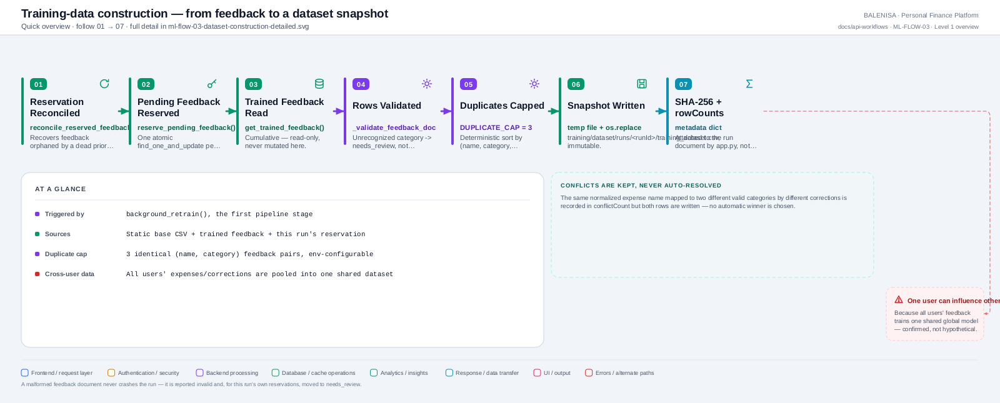
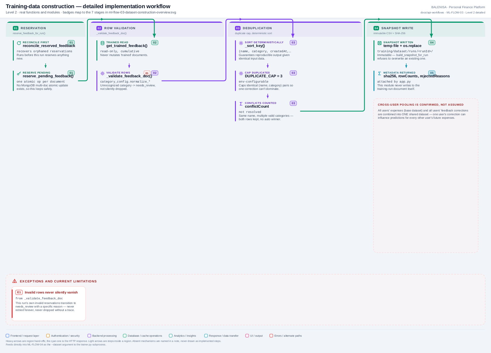

# ML-FLOW-03 — Training-data construction

From MongoDB feedback documents and a static base CSV to one immutable, hashed, per-run dataset snapshot.

---

## 1. Purpose

Assembles the exact dataset a training run will learn from: the static base dataset, plus every previously-trained feedback document, plus this run's own freshly-reserved feedback — validated, deduplicated, and written once.

## 2. Level 1 quick workflow

<picture>
  <source srcset="ml-flow-03-dataset-construction-overview.svg" type="image/svg+xml">
  
</picture>

Vector: [`ml-flow-03-dataset-construction-overview.svg`](ml-flow-03-dataset-construction-overview.svg) ·
raster fallback: [`ml-flow-03-dataset-construction-overview.png`](ml-flow-03-dataset-construction-overview.png)

## 3. Level 2 detailed workflow

<picture>
  <source srcset="ml-flow-03-dataset-construction-detailed.svg" type="image/svg+xml">
  
</picture>

Vector: [`ml-flow-03-dataset-construction-detailed.svg`](ml-flow-03-dataset-construction-detailed.svg) ·
raster fallback: [`ml-flow-03-dataset-construction-detailed.png`](ml-flow-03-dataset-construction-detailed.png)

## 4. Trigger

The first stage of `run_retraining()` (ML-FLOW-07), called from `background_retrain()` once a run owns the MongoDB lock.

## 5. Initial state

A `queued`-then-`running` training-run record; zero feedback documents reserved for this run yet.

## 6. Main components

| Layer | File | Function/class | Purpose |
|---|---|---|---|
| Orchestration | `training/dataset_builder.py` | `reserve_feedback_for_run()`, `build_snapshot_for_run()` | The two stages |
| Repository | `db/feedback_repository.py` | `reserve_pending_feedback()`, `get_trained_feedback()`, `reconcile_reserved_feedback()` | MongoDB access |
| Validation | `training/category_config.py` | `normalize_category()`, `normalize_expense_name()` | Shared taxonomy |

## 7. Data/artifact movement

`mlfeedbacks` (MongoDB, status `pending`/`trained`) + `training/dataset/merged_expenses.csv` (static base) → validated, deduplicated rows → `training/dataset/runs/<runId>/training_dataset.csv` (new, immutable file).

## 8. State transitions

Feedback documents: `pending → reserved` (this run's reservation); this run's own invalid reserved rows → `needs_review` (terminal, never retried). "Trained" documents are read but never mutated.

## 9. Success path

Reconciliation first recovers any orphaned reservations → pending feedback atomically reserved → base rows read → trained + reserved feedback validated and merged → duplicates capped → snapshot written via temp-file-then-`os.replace` → SHA-256 computed → metadata dict returned.

## 10. Rejection/failure path

An exception at the reservation stage or the snapshot-build stage fails the run at that named stage (`"reservation"` or `"snapshot"`); reserved feedback is rolled back to `pending` by the caller (`background_retrain`), not by this flow itself.

## 11. Concurrency controls

`reserve_pending_feedback()` reserves one document at a time via `find_one_and_update` — each call is a single atomic server-side operation, so no document can ever be reserved by two runs even if two reservation attempts somehow overlapped (in normal operation only one run holds the lock at a time anyway).

## 12. Persistence effects

Writes exactly one new file per run (`training_dataset.csv`), never overwritten — `build_snapshot_for_run` raises if the target path already exists. Mutates `mlfeedbacks` document statuses (`pending → reserved`, and invalid rows → `needs_review`).

## 13. Runtime/in-memory effects

None beyond the current subprocess/thread's own local variables.

## 14. Recovery behaviour

A feedback document left `reserved` by a run that crashed before reaching this stage's own rollback is recovered by `reconcile_reserved_feedback()` — called both at the start of this very flow (for the *next* run) and at service startup (ML-FLOW-08).

## 15. Backend/frontend impact

None directly during construction — but the base dataset and the pool of `trained` feedback are what every future prediction (ML-FLOW-01) is ultimately shaped by.

## 16. Files involved

| Layer | File | Function/class | Purpose |
|---|---|---|---|
| Orchestration | `ml-service/training/dataset_builder.py` | `reserve_feedback_for_run()`, `build_snapshot_for_run()` | Full flow |
| Repository | `ml-service/db/feedback_repository.py` | `reserve_pending_feedback()`, `get_trained_feedback()` | MongoDB access |
| Taxonomy | `ml-service/training/category_config.py` | `CATEGORY_ALIASES`, `normalize_category()` | Shared validation rules |

## 17. Confirmed limitations

- **All users' data is pooled into one shared dataset.** Every user's expenses (base dataset) and every user's feedback corrections train one single global model — one user's correction can measurably shift predictions for every other user.
- **Conflicts are recorded, never auto-resolved.** The same normalized expense name mapped to two different valid categories by different corrections is counted in `conflictCount`, but both rows are written into the snapshot — no automatic winner is chosen.
- **Personal/sensitive text can enter the training set** — expense descriptions are free text; nothing in this flow screens for sensitive content before it becomes a training example (and, eventually, part of a joblib-serialized vectorizer vocabulary).
- **Deleted/renamed categories can persist in old artifacts** — this flow only ever validates against the *current* `category_config.CATEGORY_ALIASES`; a bundle trained under an older taxonomy is unaffected retroactively.
