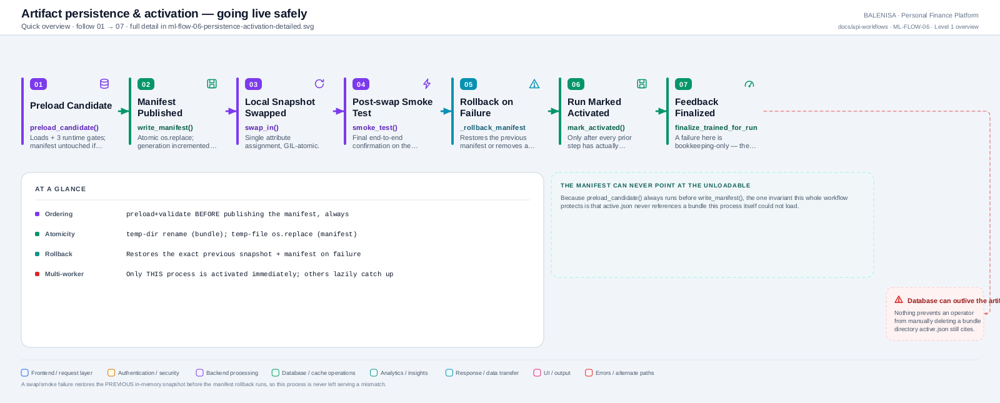
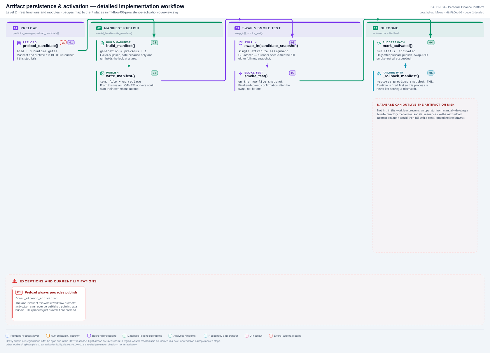

# ML-FLOW-06 — Artifact persistence & atomic activation

Publishing a validated candidate safely: preload-before-publish, atomic manifest writes, post-swap smoke test, and full rollback on any failure.

---

## 1. Purpose

Makes a validated candidate the live model — for this process immediately, for other workers/replicas lazily — without ever leaving the manifest pointing at something unloadable.

## 2. Level 1 quick workflow

<picture>
  <source srcset="ml-flow-06-persistence-activation-overview.svg" type="image/svg+xml">
  
</picture>

Vector: [`ml-flow-06-persistence-activation-overview.svg`](ml-flow-06-persistence-activation-overview.svg) ·
raster fallback: [`ml-flow-06-persistence-activation-overview.png`](ml-flow-06-persistence-activation-overview.png)

## 3. Level 2 detailed workflow

<picture>
  <source srcset="ml-flow-06-persistence-activation-detailed.svg" type="image/svg+xml">
  
</picture>

Vector: [`ml-flow-06-persistence-activation-detailed.svg`](ml-flow-06-persistence-activation-detailed.svg) ·
raster fallback: [`ml-flow-06-persistence-activation-detailed.png`](ml-flow-06-persistence-activation-detailed.png)

## 4. Trigger

`app.py`'s `_attempt_activation()`, called from `background_retrain()` only after ML-FLOW-05 (validation) reports success.

## 5. Initial state

A validated, publishable candidate bundle on disk; the run's status is about to move to `activating`.

## 6. Main components

| Layer | File | Function/class | Purpose |
|---|---|---|---|
| Orchestration | `app.py` | `_attempt_activation()`, `_rollback_manifest()` | The 6-step sequence + rollback |
| Runtime | `inference/predictor_manager.py` | `preload_candidate()`, `swap_in()`, `smoke_test()`, `current_snapshot()` | Load, swap, verify |
| Manifest | `training/model_bundle.py` | `build_manifest()`, `write_manifest()`, `remove_manifest()` | Atomic publish/rollback |
| Repository | `db/training_run_repository.py` | `mark_activating()`, `mark_activated()`, `mark_failed_activation()` | Status persistence |

## 7. Data/artifact movement

Candidate bundle (already on disk from ML-FLOW-04) → validated in-memory `RuntimeSnapshot` (preload) → `training/models/active.json` (published) → this process's live `predictor_manager._snapshot` (swapped).

## 8. State transitions

Run: `evaluating → activating → activated` (success) or `activating → failed_activation` (any step after `mark_activating` fails).

## 9. Success path

1. Preload + validate candidate — manifest and runtime both untouched if this fails.
2. Publish `active.json` atomically (`os.replace`).
3. Swap this process's local snapshot to the candidate.
4. Run a post-swap smoke prediction.
5. Persist `mark_activated()`.
6. Finalize this run's reserved feedback to `trained`.

## 10. Rejection/failure path

- Preload failure: manifest untouched, runtime untouched, run → `failed_activation` at stage `"preload"`.
- Publish failure: `write_manifest`'s temp-file+`os.replace` guarantees the OLD manifest is untouched — run → `failed_activation` at stage `"publish_manifest"`.
- Swap/smoke failure (after publish): the **previous in-memory snapshot is restored first**, then `_rollback_manifest()` restores the previous manifest (or removes a first-ever one) — run → `failed_activation` at stage `"swap_or_smoke"`, with the rollback outcome recorded in `activation.rollback`.

## 11. Concurrency controls

Only one run can reach this flow at a time (the MongoDB lock, held through the entire sequence). Within this process, `swap_in()`'s attribute assignment is GIL-atomic under `self._write_lock`.

## 12. Persistence effects

One new/updated `active.json` (on success or a since-rolled-back attempt, the file always ends up valid — either the new manifest or the restored previous one, never a torn write).

## 13. Runtime/in-memory effects

This process's `predictor_manager._snapshot` becomes the new candidate on success; on failure, restored to exactly what it was before this flow started.

## 14. Recovery behaviour

A crash between manifest publication and this flow's own rollback completing is the exact gap ML-FLOW-08's activation-state startup sweep exists to close — re-deriving the correct outcome from the manifest and bundle files at the next process start.

## 15. Backend/frontend impact

None immediately for other requests already in flight; future predictions in this process pick up the new model on their next call (ML-FLOW-01). Other workers/replicas converge lazily via their own throttled manifest-generation check.

## 16. Files involved

| Layer | File | Function/class | Purpose |
|---|---|---|---|
| Orchestration | `ml-service/app.py` | `_attempt_activation()`, `_rollback_manifest()` | Full sequence |
| Runtime | `ml-service/inference/predictor_manager.py` | `preload_candidate()`, `swap_in()`, `smoke_test()` | Load/swap/verify |
| Manifest | `ml-service/training/model_bundle.py` | `write_manifest()`, `read_manifest()`, `remove_manifest()` | Atomic file operations |

## 17. Confirmed limitations

- **The database can outlive the artifact.** Nothing in this flow (or elsewhere in the codebase) prevents an operator from manually deleting a bundle directory that `active.json` still references — the next reload attempt against it (ML-FLOW-01's lazy check, or a future restart's ML-FLOW-02) would then fail with a clear, logged `ActivationError`, but nothing proactively detects the deletion in the meantime.
- **Partial promotion cannot leave a torn manifest**, by construction (temp-file + `os.replace` is all-or-nothing), but **can** leave a run stuck between `activating` and a terminal status if the process is killed at exactly the wrong instant — recovered only at the next startup, by ML-FLOW-08.
- **Only this process is activated immediately.** "Activated" in the run record means the *publishing* process succeeded — it does not mean every other worker/replica has picked up the change yet.
