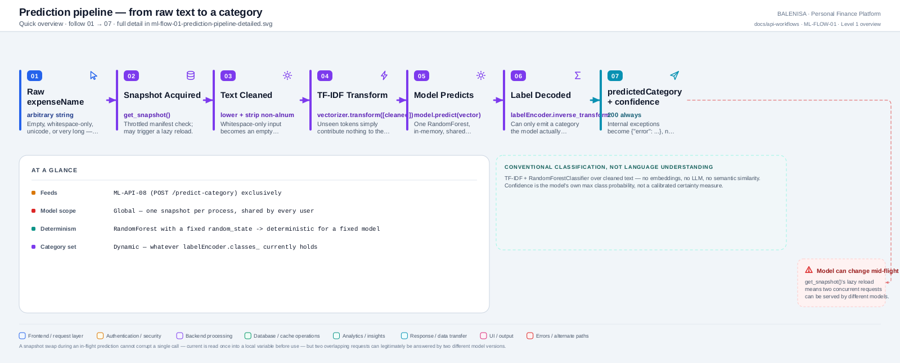
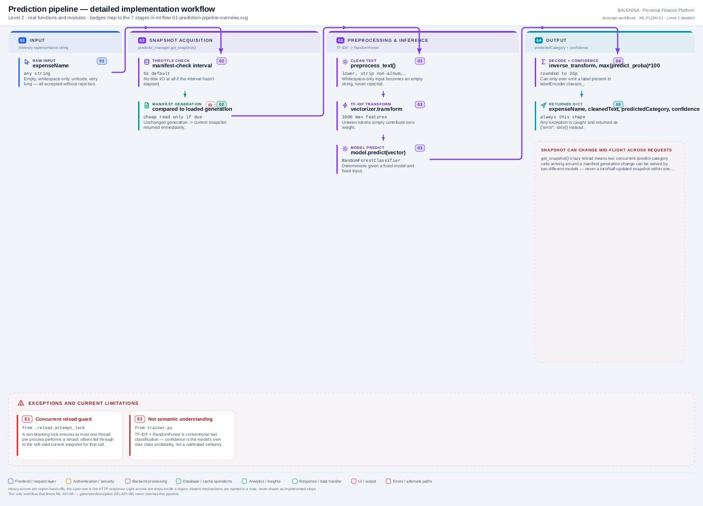

# ML-FLOW-01 — Prediction pipeline

The in-memory path from raw text to a predicted category — the internal engine ML-API-08 calls.

---

## 1. Purpose

Cleans input text, vectorizes it, runs it through the currently-loaded model, and decodes a category + confidence.

## 2. Level 1 quick workflow

<picture>
  <source srcset="ml-flow-01-prediction-pipeline-overview.svg" type="image/svg+xml">
  
</picture>

Vector: [`ml-flow-01-prediction-pipeline-overview.svg`](ml-flow-01-prediction-pipeline-overview.svg) ·
raster fallback: [`ml-flow-01-prediction-pipeline-overview.png`](ml-flow-01-prediction-pipeline-overview.png)

## 3. Level 2 detailed workflow

<picture>
  <source srcset="ml-flow-01-prediction-pipeline-detailed.svg" type="image/svg+xml">
  
</picture>

Vector: [`ml-flow-01-prediction-pipeline-detailed.svg`](ml-flow-01-prediction-pipeline-detailed.svg) ·
raster fallback: [`ml-flow-01-prediction-pipeline-detailed.png`](ml-flow-01-prediction-pipeline-detailed.png)

## 4. Trigger

Every call to **ML-API-08** (`POST /predict-category`). No other endpoint or internal caller reaches `predict_category()`.

## 5. Initial state

Whatever `RuntimeSnapshot` is currently assigned to `predictor_manager._snapshot` in this process — set at startup (ML-FLOW-02) and possibly refreshed since via this same flow's own lazy-reload check.

## 6. Main components

| Layer | File | Function/class | Purpose |
|---|---|---|---|
| Entry | `inference/predictor.py` | `predict_category()`, `preprocess_text()` | Orchestrates the whole pipeline |
| Runtime state | `inference/predictor_manager.py` | `PredictorManager.get_snapshot()` | Snapshot acquisition + lazy reload |
| Model | scikit-learn (in-memory) | `RandomForestClassifier.predict/predict_proba` | Classification |
| Vectorizer | scikit-learn (in-memory) | `TfidfVectorizer.transform` | Feature extraction |
| Encoder | scikit-learn (in-memory) | `LabelEncoder.inverse_transform` | Label decoding |

## 7. Data/artifact movement

Request text → cleaned string (in-memory) → TF-IDF sparse vector (in-memory) → predicted label index → decoded category string. Nothing is written to disk or MongoDB anywhere in this flow.

## 8. State transitions

None persisted — this is a pure read-and-compute flow against already-loaded in-memory objects. The one piece of mutable state touched is `predictor_manager`'s own throttled manifest-check timer, updated on every call regardless of whether a reload actually happens.

## 9. Success path

`get_snapshot()` returns a non-`None` snapshot → text cleaned → vectorized → predicted → decoded → confidence computed → structured dict returned.

## 10. Rejection/failure path

Every step is wrapped in one `try/except Exception` inside `predict_category()`; any failure (no snapshot, a transform error, an unexpected shape mismatch) is caught and returned as `{"error": str(e)}` — never raised to the FastAPI layer, so this flow itself never produces a non-200 response.

## 11. Concurrency controls

`get_snapshot()`'s reload path uses `self._reload_attempt_lock.acquire(blocking=False)` so at most one thread per process performs a reload at a time; every other concurrent caller in that moment simply uses the still-valid current snapshot. `swap_in()`'s single attribute assignment is GIL-atomic, so a concurrent reader can only ever see a complete old or complete new snapshot, never a half-built mix.

## 12. Persistence effects

None. This flow never writes to MongoDB, the filesystem, or any artifact.

## 13. Runtime/in-memory effects

May trigger a lazy reload of `predictor_manager._snapshot` if the manifest's generation has advanced since the last check (throttled by `ML_MANIFEST_CHECK_INTERVAL_SECONDS`, default 5s) — see ML-FLOW-06 for how that generation advances in the first place.

## 14. Recovery behaviour

A reload failure during this flow's snapshot check is caught, logged (`runtime_reload_failed`), and never touches the live snapshot — the old, still-valid model keeps serving predictions.

## 15. Backend/frontend impact

Feeds ML-API-08's response directly, which the backend forwards to the frontend's pre-submission category pre-fill (see ML-FLOW-09).

## 16. Files involved

| Layer | File | Function/class | Purpose |
|---|---|---|---|
| Pipeline | `ml-service/inference/predictor.py` | `predict_category()`, `preprocess_text()` | Full flow |
| Runtime state | `ml-service/inference/predictor_manager.py` | `get_snapshot()` | State acquisition |

## 17. Confirmed limitations

- **Global, not per-user.** One `RuntimeSnapshot` serves every caller in the process — a prediction for one user's expense is generated by a model trained on every user's pooled data (see ML-FLOW-03).
- **Model can change mid-session.** Two consecutive predictions from the same user, moments apart, can be answered by two different model versions if a reload happened in between.
- **Not semantic understanding.** TF-IDF + RandomForest is conventional text classification; confidence is the model's own maximum class probability, not a calibrated certainty measure, and is only as meaningful as the underlying estimator's own probability calibration (RandomForest's `predict_proba` is a vote fraction, not a true probability).
- **Category set is dynamic, never assumed fixed** — whatever `labelEncoder.classes_` currently contains, sourced from the most recently activated model's own training run.
