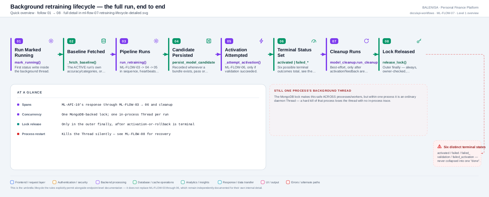
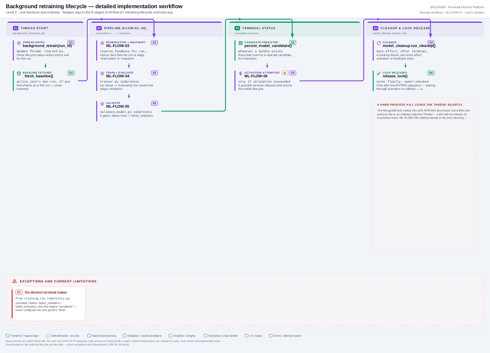

# ML-FLOW-07 — Background retraining lifecycle (umbrella)

The full `background_retrain()` sequence, end to end — connects ML-FLOW-03 through ML-FLOW-06 without replacing their own independent documentation, per the audit's binding rule.

---

## 1. Purpose

Owns every status write for one retraining attempt, from `queued` through whichever of six terminal states it reaches, and guarantees the MongoDB lock is released exactly once, only after the entire sequence is terminal.

## 2. Level 1 quick workflow

<picture>
  <source srcset="ml-flow-07-retraining-lifecycle-overview.svg" type="image/svg+xml">
  
</picture>

Vector: [`ml-flow-07-retraining-lifecycle-overview.svg`](ml-flow-07-retraining-lifecycle-overview.svg) ·
raster fallback: [`ml-flow-07-retraining-lifecycle-overview.png`](ml-flow-07-retraining-lifecycle-overview.png)

## 3. Level 2 detailed workflow

<picture>
  <source srcset="ml-flow-07-retraining-lifecycle-detailed.svg" type="image/svg+xml">
  
</picture>

Vector: [`ml-flow-07-retraining-lifecycle-detailed.svg`](ml-flow-07-retraining-lifecycle-detailed.svg) ·
raster fallback: [`ml-flow-07-retraining-lifecycle-detailed.png`](ml-flow-07-retraining-lifecycle-detailed.png)

## 4. Trigger

Started as a `daemon=True` `Thread` by **ML-API-10**, immediately after this run wins the MongoDB lock.

## 5. Initial state

A `queued` run record; the lock held by this `run_id`.

## 6. Main components

| Layer | File | Function/class | Purpose |
|---|---|---|---|
| Orchestration | `app.py` | `background_retrain()` | Owns every status transition |
| Pipeline | `training/retrain_pipeline.py` | `run_retraining()` | ML-FLOW-03 → 04 → 05 in sequence |
| Activation | `app.py` | `_attempt_activation()` | ML-FLOW-06 |
| Cleanup | `training/model_cleanup.py` | `run_cleanup()` | Best-effort artifact retention |

## 7. Data/artifact movement

See ML-FLOW-03 through ML-FLOW-06 individually — this flow only sequences them and persists status around each boundary.

## 8. State transitions

**State-transition table** (statuses confirmed in `db/training_run_repository.py`):

| State | Entered by | Required prior state | Work performed | Success transition | Failure transition |
|---|---|---|---|---|---|
| `queued` | `create_run()` | — | Run record created | `running` | `failed` (orphan sweep, ML-FLOW-08) |
| `running` | `mark_running()` | `queued` | Reservation, snapshot, training stages | `evaluating` | `failed` (training-stage exception) |
| `evaluating` | `mark_evaluating()` | `running` | Validation gates run | `activating` | `failed_validation` |
| `activating` | `mark_activating()` | `evaluating` | Preload, publish, swap, smoke test | `activated` | `failed_activation` |
| `activated` | `mark_activated()` | `activating` | Feedback finalized, cleanup runs | *(terminal)* | — |
| `failed` | `mark_failed()` | `queued`/`running` | Reserved feedback rolled back | — | *(terminal)* |
| `failed_validation` | `mark_failed_validation()` | `evaluating` | Reserved feedback rolled back | — | *(terminal)* |
| `failed_activation` | `mark_failed_activation()` | `activating` | Reserved feedback rolled back | — | *(terminal)* |
| `completed` *(legacy)* | `mark_completed()` | `evaluating` | Pre-Phase-E terminal success; superseded by `activated` | — | — |

## 9. Success path

`running` → `evaluating` → `activating` → `activated` → feedback finalized → cleanup runs → lock released.

## 10. Rejection/failure path

Any of the three named failure stages (`failed`, `failed_validation`, `failed_activation`) triggers `_rollback_reserved_feedback()`, returning this run's reservations to `pending` so a future run can retry them — the lock is still released in the outer `finally` regardless.

## 11. Concurrency controls

The MongoDB lock, held for the *entire* sequence — released only in the outer `finally`, deliberately after activation-or-rollback has reached a terminal outcome, not right after validation, specifically to prevent a second retrain from starting before this run's activation/rollback has finished.

## 12. Persistence effects

Every stage transition is a MongoDB write to the run's own document; see ML-FLOW-03 through 06 for what each stage writes elsewhere (dataset snapshot, bundle, manifest).

## 13. Runtime/in-memory effects

See ML-FLOW-06 — the only in-memory effect is the possible swap of `predictor_manager._snapshot` on a successful activation.

## 14. Recovery behaviour

A hard kill of this process loses the `Thread` with no in-process trace — the MongoDB lock and run record are the only surviving evidence, recovered at the next startup by **ML-FLOW-08**.

## 15. Backend/frontend impact

None until activation (ML-FLOW-06) actually swaps this process's snapshot — predictions (ML-FLOW-01) are unaffected by an in-progress or failed retrain.

## 16. Files involved

| Layer | File | Function/class | Purpose |
|---|---|---|---|
| Orchestration | `ml-service/app.py` | `background_retrain()`, `_fetch_baseline()`, `_rollback_reserved_feedback()` | Full lifecycle ownership |
| Pipeline | `ml-service/training/retrain_pipeline.py` | `run_retraining()` | Stage sequencing |
| Cleanup | `ml-service/training/model_cleanup.py` | `run_cleanup()` | Post-activation artifact retention |

## 17. Confirmed limitations

- **Six distinct terminal states**, never collapsed into one generic "done" — `activated`, `failed`, `failed_validation`, `failed_activation`, plus the legacy `completed` (pre-Phase-E only). A dashboard or caller relying on a single "success" boolean would lose the distinction between "training itself broke" and "training worked but the candidate was rejected."
- **A 202/200 response from ML-API-10 means acceptance only** — this entire multi-stage lifecycle happens after that response is already sent.
- **Documented as the explicitly-permitted umbrella lifecycle** — this document intentionally does not replace ML-FLOW-03 through ML-FLOW-06's own independent detail; consult those for stage-level implementation.
